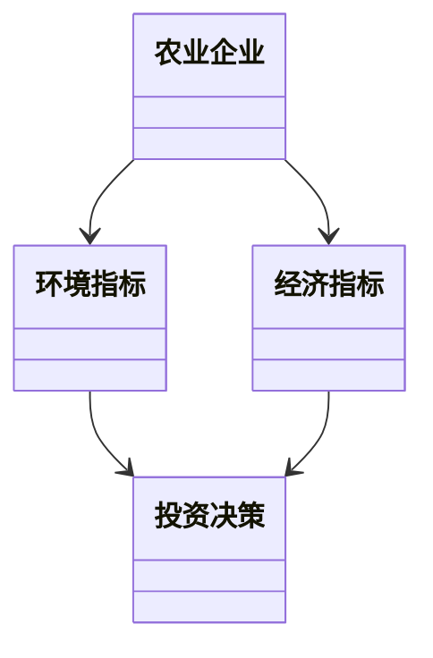
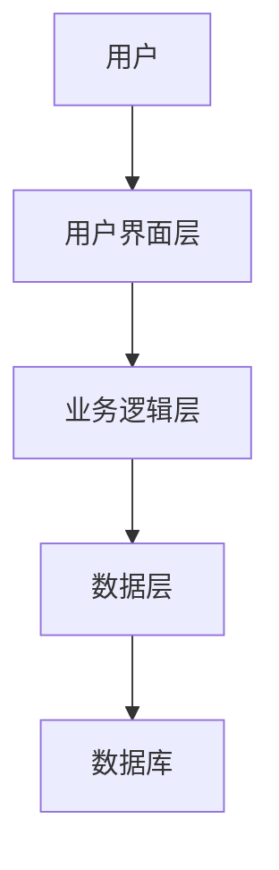
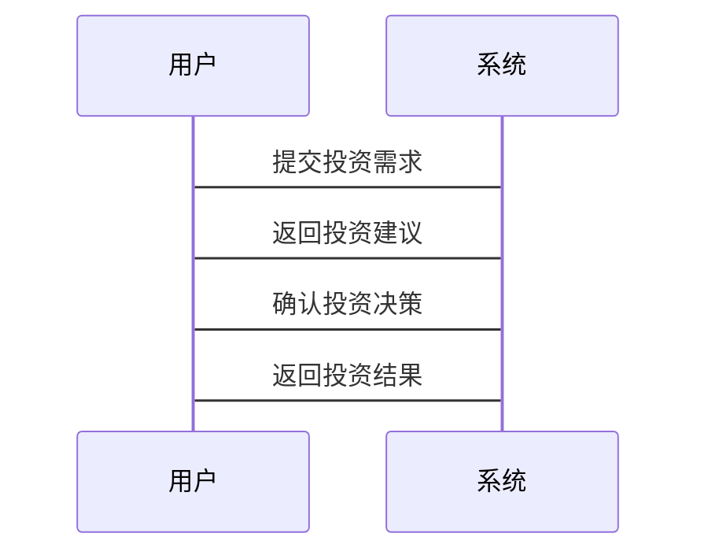

                 


```markdown
# 巴菲特-芒格的可持续农业投资：粮食安全与环境保护

> 关键词：巴菲特，芒格，可持续农业，粮食安全，环境保护，投资策略

> 摘要：本文深入探讨了巴菲特和芒格在可持续农业投资领域的理念和策略，分析了可持续农业的核心要素，提出了基于环境与经济双重影响的数学模型，并通过实际案例展示了如何在实践中应用这些理论。

---

# 第一部分：巴菲特与芒格的投资理念

# 第1章：巴菲特与芒格的投资哲学

## 1.1 巴菲特与芒格的投资理念概述

### 1.1.1 巴菲特的价值投资理论
巴菲特的价值投资理论强调以合理价格投资于具有持续竞争优势的企业。他的核心理念包括：
- **长期投资**：寻找具有长期竞争优势的企业，而非短期波动。
- **安全边际**：以低于内在价值的价格买入资产，确保投资的安全性。
- **企业基本面分析**：关注企业的盈利能力、财务健康状况和管理层能力。

### 1.1.2 芒格的多元思维模型
芒格的多元思维模型强调通过多个学科的视角来理解问题，从而做出更明智的决策。他的核心观点包括：
- **跨学科思维**：将物理学、心理学、经济学等知识应用于投资决策。
- **逆向思维**：考虑问题的反面，寻找被市场忽视的机会。
- **风险管理**：识别潜在风险，并在决策中加以考虑。

### 1.1.3 两人投资理念的共同点与差异
- **共同点**：两者都强调长期投资、基本面分析和风险管理。
- **差异**：巴菲特更注重企业内在价值和竞争优势，而芒格更注重跨学科分析和逆向思维。

## 1.2 可持续农业投资的背景与意义

### 1.2.1 全球粮食安全的挑战
- 随着人口增长和资源有限性，粮食安全成为全球性问题。
- 可持续农业通过提高生产效率和保护环境，为解决粮食安全问题提供了一种可行的解决方案。

### 1.2.2 可持续农业的重要性
- 可持续农业强调在不破坏环境的前提下，提高农业生产效率。
- 通过减少资源浪费和环境污染，实现长期的农业可持续发展。

### 1.2.3 环境保护与农业发展的平衡
- 农业是资源消耗的主要行业之一，如何在农业发展与环境保护之间找到平衡至关重要。
- 可持续农业通过优化资源利用和减少污染，为环境保护提供了重要保障。

## 1.3 巴菲特与芒格投资可持续农业的核心逻辑

### 1.3.1 长期价值投资的视角
- 巴菲特和芒格认为，可持续农业是一种长期投资，能够在未来几年内带来稳定的回报。
- 他们关注企业的长期盈利能力和社会影响力，而非短期市场波动。

### 1.3.2 可持续农业的经济与社会价值
- 可持续农业通过提高生产效率和减少资源浪费，降低了生产成本，提高了企业的盈利能力。
- 同时，可持续农业有助于改善农村经济，促进社会稳定。

### 1.3.3 投资中的风险管理与机会捕捉
- 巴菲特和芒格注重风险控制，通过多元化的投资组合分散风险。
- 他们善于捕捉市场中的机会，尤其是在可持续农业领域，通过深入的市场分析和企业评估，找到具有长期增长潜力的企业。

---

# 第二部分：可持续农业投资的分析框架

# 第2章：可持续农业的核心要素分析

## 2.1 可持续农业的定义与特征

### 2.1.1 可持续农业的定义
可持续农业是指在满足当前需求的同时，不损害后代人需求的能力的农业实践。它强调资源的高效利用、环境的保护和农业的长期可持续发展。

### 2.1.2 可持续农业的核心特征
- **环境友好**：减少对环境的负面影响，保护自然资源。
- **资源高效利用**：通过技术创新和管理优化，提高资源利用效率。
- **社会公平**：确保农业发展带来的利益公平分配，促进农村经济发展。
- **经济可行**：在经济上具有可行性，能够实现长期盈利。

### 2.1.3 可持续农业与传统农业的对比

| 特征                | 可持续农业                | 传统农业                |
|---------------------|--------------------------|-------------------------|
| 资源利用            | 高效，减少浪费            | 低效，资源浪费较多      |
| 环境影响            | 最小化，保护生态          | 可能导致环境污染        |
| 经济效益            | 长期盈利，成本降低        | 短期盈利，成本较高      |
| 社会影响            | 促进社会稳定，减少贫困    | 可能加剧贫困，资源分配不均|

## 2.2 可持续农业的关键指标

### 2.2.1 农业生产效率指标
- **单位面积产量**：衡量土地利用效率。
- **水资源利用效率**：衡量水资源的使用效率。
- **能源利用效率**：衡量能源的使用效率。

### 2.2.2 资源利用效率指标
- **化肥使用效率**：衡量化肥的使用效率。
- **农药使用效率**：衡量农药的使用效率。
- **土地利用率**：衡量土地的使用效率。

### 2.2.3 环境影响评估指标
- **温室气体排放**：衡量农业活动对气候变化的影响。
- **水土流失**：衡量农业活动对土地和水资源的破坏。
- **生物多样性**：衡量农业活动对生态系统的破坏。

## 2.3 可持续农业的经济模型

### 2.3.1 农业生产成本分析
- **固定成本**：土地、设备等固定投入。
- **可变成本**：种子、化肥、劳动力等可变投入。
- **总成本**：固定成本 + 可变成本。

### 2.3.2 收益与风险评估
- **收益**：销售收入 - 成本。
- **风险**：市场风险、自然风险、政策风险等。

### 2.3.3 投资回报周期模型
- **投资回报周期**：从投资到收回成本所需的时间。
- **净现值（NPV）**：衡量投资项目的价值。

---

# 第3章：可持续农业投资的分析框架

## 3.1 可持续农业投资的背景与意义

### 3.1.1 投资背景
- 全球粮食安全问题日益严峻，可持续农业成为解决粮食安全的重要途径。
- 环境保护的压力促使投资者关注可持续发展。

### 3.1.2 投资意义
- 通过投资可持续农业，投资者可以在获得经济回报的同时，促进环境保护和社会发展。
- 可持续农业的投资具有长期性，能够为投资者带来稳定的收益。

## 3.2 可持续农业投资的核心要素

### 3.2.1 投资目标
- **经济效益**：追求投资回报。
- **社会效益**：促进粮食安全和社会稳定。
- **环境效益**：保护环境，减少资源浪费。

### 3.2.2 投资策略
- **长期投资**：关注企业的长期发展潜力。
- **风险管理**：识别和管理投资风险。
- **多元化投资**：分散投资风险，提高投资回报。

## 3.3 可持续农业投资的分析模型

### 3.3.1 环境影响评估模型
- 通过数学模型评估农业活动对环境的影响，包括温室气体排放、水土流失等。
- 模型公式：
  $$ \text{环境影响} = \sum_{i=1}^{n} w_i \cdot x_i $$
  其中，\( w_i \) 是指标权重，\( x_i \) 是指标值。

### 3.3.2 经济效益评估模型
- 通过经济效益评估模型，评估可持续农业项目的经济可行性。
- 模型公式：
  $$ \text{净现值} = \sum_{t=0}^{n} \frac{C_t}{(1 + r)^t} $$
  其中，\( C_t \) 是第 \( t \) 年的现金流，\( r \) 是折现率。

---

# 第4章：可持续农业投资的环境与经济影响分析

## 4.1 环境影响分析

### 4.1.1 环境影响评估
- 通过环境影响评估模型，分析可持续农业项目对环境的影响。
- 关键指标包括温室气体排放、水土流失、生物多样性等。

### 4.1.2 环境保护措施
- **减少化肥使用**：通过有机农业和精准施肥减少化肥使用。
- **节约水资源**：采用滴灌和节水技术。
- **保护生物多样性**：保留生态区域，保护动植物多样性。

## 4.2 经济影响分析

### 4.2.1 经济效益评估
- 通过经济效益评估模型，分析可持续农业项目的经济可行性。
- 关键指标包括投资回报率、净现值、内部收益率等。

### 4.2.2 经济风险管理
- **市场风险**：通过多元化投资和长期合约降低市场风险。
- **政策风险**：关注政策变化，确保投资符合政策要求。
- **自然风险**：通过保险和风险管理技术降低自然风险。

## 4.3 综合影响分析

### 4.3.1 综合评估模型
- 通过综合评估模型，分析可持续农业项目的综合影响。
- 模型公式：
  $$ \text{综合影响} = \alpha \cdot \text{环境影响} + (1 - \alpha) \cdot \text{经济影响} $$
  其中，\( \alpha \) 是环境影响的权重，\( 0 < \alpha < 1 \)。

### 4.3.2 综合决策框架
- **决策步骤**：
  1. 确定投资目标。
  2. 收集相关数据。
  3. 评估环境影响和经济影响。
  4. 综合评估结果，做出投资决策。

---

# 第5章：可持续农业投资的案例分析

## 5.1 案例背景介绍

### 5.1.1 案例选择
选择一家典型的可持续农业企业作为案例，分析其投资策略和实际效果。

### 5.1.2 案例描述
- **公司名称**：XYZ农业公司。
- **主营业务**：有机农业、生态农业等。
- **投资规模**：$100 million。
- **投资目标**：提高农业生产效率，保护环境，实现长期盈利。

## 5.2 投资策略分析

### 5.2.1 企业基本面分析
- **盈利能力**：公司过去几年的财务数据。
- **竞争优势**：公司在有机农业领域的竞争优势。
- **管理层能力**：公司管理层的背景和能力。

### 5.2.2 投资回报分析
- **投资回报率**：通过净现值、内部收益率等指标评估投资回报。
- **风险分析**：识别潜在风险，并评估其对投资回报的影响。

## 5.3 实际效果评估

### 5.3.1 环境影响评估
- **温室气体排放**：公司温室气体排放量。
- **水土流失**：公司对水土流失的控制情况。
- **生物多样性**：公司对生物多样性的保护措施。

### 5.3.2 经济效益评估
- **销售收入**：公司过去几年的销售收入。
- **成本控制**：公司成本控制措施及其效果。
- **投资回报**：投资回报率、净现值等指标的具体数值。

## 5.4 案例总结与启示

### 5.4.1 案例总结
总结XYZ农业公司的投资策略和实际效果，分析其成功和失败的原因。

### 5.4.2 启示与借鉴
从案例中总结出可持续农业投资的要点和注意事项，为其他投资者提供借鉴。

---

# 第6章：可持续农业投资的系统分析与架构设计

## 6.1 系统分析

### 6.1.1 问题场景介绍
- **问题描述**：如何通过系统分析，优化可持续农业投资决策。
- **项目介绍**：设计一个可持续农业投资决策支持系统。

### 6.1.2 系统功能设计
- **需求分析**：收集投资者需求，明确系统功能。
- **功能模块**：数据采集、分析、决策支持等。
- **领域模型**：使用Mermaid绘制领域模型类图。



### 6.1.3 系统架构设计
- **架构选择**：采用分层架构，包括数据层、业务逻辑层和用户界面层。
- **系统架构图**：使用Mermaid绘制系统架构图。



### 6.1.4 系统接口设计
- **接口设计**：定义系统接口，确保各模块之间的通信。
- **交互设计**：设计用户与系统之间的交互流程。

### 6.1.5 系统交互设计
- **交互流程图**：使用Mermaid绘制系统交互流程图。



## 6.2 系统实现

### 6.2.1 环境安装
- **安装依赖**：安装Python、Mermaid、Jupyter Notebook等工具。
- **配置环境**：配置开发环境，确保各工具正常运行。

### 6.2.2 核心实现

#### 6.2.2.1 数据采集模块
- **功能描述**：采集农业企业的环境和经济数据。
- **实现代码**：
  ```python
  import requests
  def fetch_data(url):
      response = requests.get(url)
      return response.json()
  ```

#### 6.2.2.2 数据分析模块
- **功能描述**：分析采集的数据，生成投资建议。
- **实现代码**：
  ```python
  import pandas as pd
  def analyze_data(data):
      df = pd.DataFrame(data)
      return df.describe()
  ```

#### 6.2.2.3 决策支持模块
- **功能描述**：基于分析结果，生成投资决策建议。
- **实现代码**：
  ```python
  def generate_recommendation(data):
      if data['net_profit'] > 0:
          return "投资建议：可行"
      else:
          return "投资建议：不可行"
  ```

## 6.3 案例分析与解读

### 6.3.1 案例分析
- **案例背景**：选择一家农业企业，分析其环境和经济数据。
- **数据分析**：使用Python代码分析数据，生成投资建议。

### 6.3.2 代码解读与分析
- **代码解读**：解释代码的功能和实现细节。
- **分析结果**：展示数据分析结果，并进行解读。

## 6.4 项目小结

### 6.4.1 项目总结
- **项目成果**：总结项目的主要成果和意义。
- **经验教训**：总结项目中的经验教训，为未来项目提供参考。

### 6.4.2 注意事项
- **风险提示**：提醒投资者注意潜在风险。
- **未来展望**：展望未来可持续农业投资的发展趋势。

---

# 第7章：可持续农业投资的项目实战

## 7.1 项目背景

### 7.1.1 项目目标
- **目标**：设计一个可持续农业投资决策支持系统。
- **范围**：覆盖环境影响评估和经济效益分析。

### 7.1.2 项目需求
- **功能需求**：数据采集、分析、决策支持。
- **性能需求**：系统响应时间、数据处理能力。

## 7.2 系统实现

### 7.2.1 环境安装
- **安装Python**：安装Python 3.x，确保版本兼容性。
- **安装依赖**：安装Jupyter Notebook、Pandas、Matplotlib等库。

### 7.2.2 核心实现

#### 7.2.2.1 数据采集模块
- **功能描述**：从公开数据源获取农业企业的环境和经济数据。
- **实现代码**：
  ```python
  import pandas as pd
  import requests
  def fetch_data(url):
      response = requests.get(url)
      return pd.DataFrame(response.json())
  ```

#### 7.2.2.2 数据分析模块
- **功能描述**：分析数据，生成投资建议。
- **实现代码**：
  ```python
  def analyze_data(data):
      return data.describe()
  ```

#### 7.2.2.3 决策支持模块
- **功能描述**：基于分析结果，生成投资决策建议。
- **实现代码**：
  ```python
  def generate_recommendation(data):
      if data['net_profit'].mean() > 0:
          return "投资建议：可行"
      else:
          return "投资建议：不可行"
  ```

## 7.3 案例分析与解读

### 7.3.1 案例分析
- **案例背景**：选择一家农业企业，分析其环境和经济数据。
- **数据分析**：使用Python代码分析数据，生成投资建议。

### 7.3.2 代码解读与分析
- **代码解读**：解释代码的功能和实现细节。
- **分析结果**：展示数据分析结果，并进行解读。

## 7.4 项目小结

### 7.4.1 项目总结
- **项目成果**：总结项目的主要成果和意义。
- **经验教训**：总结项目中的经验教训，为未来项目提供参考。

### 7.4.2 注意事项
- **风险提示**：提醒投资者注意潜在风险。
- **未来展望**：展望未来可持续农业投资的发展趋势。

---

# 第8章：结论与展望

## 8.1 结论

### 8.1.1 核心观点总结
- 巴菲特和芒格的投资理念为可持续农业投资提供了重要的指导。
- 可持续农业投资需要综合考虑环境与经济的双重影响。
- 通过系统分析和决策支持，可以提高投资的科学性和成功率。

### 8.1.2 研究成果的意义
- 本文提出了一个可持续农业投资的分析框架，为投资者提供了理论依据。
- 通过实际案例分析，验证了分析框架的有效性和实用性。

## 8.2 未来展望

### 8.2.1 研究方向
- **模型优化**：进一步优化环境影响评估和经济效益分析模型。
- **技术创新**：研究新技术在可持续农业投资中的应用，如人工智能、大数据等。

### 8.2.2 投资趋势
- **技术驱动投资**：随着技术进步，可持续农业投资将更加依赖技术创新。
- **政策支持**：政府政策的支持将进一步推动可持续农业投资的发展。
- **全球化趋势**：可持续农业投资将更加全球化，跨越国界，寻找最佳投资机会。

---

# 作者：AI天才研究院/AI Genius Institute & 禅与计算机程序设计艺术/Zen And The Art of Computer Programming
```

