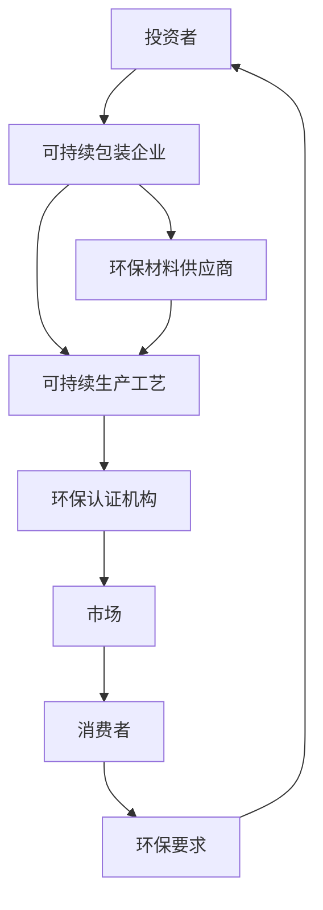
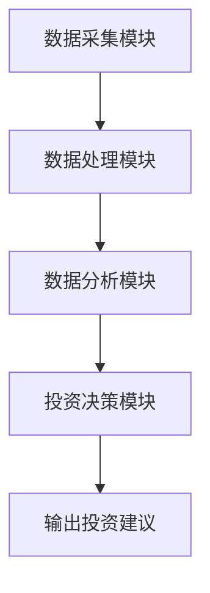
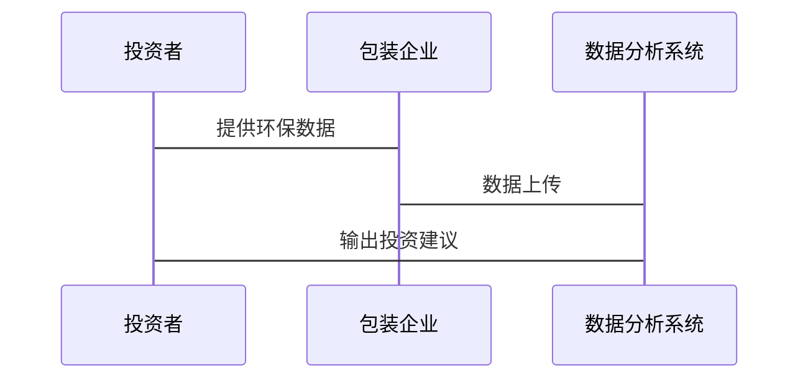

                 


# 巴菲特-芒格的可持续包装投资：环保与便利的平衡

---

## 关键词

- 巴菲特投资哲学
- 芒格多元思维模型
- 可持续包装
- 环保与便利
- 投资决策
- 可持续发展
- 环境影响评估

---

## 摘要

本文探讨了巴菲特和芒格的投资哲学与可持续包装投资的结合，重点分析了环保与便利之间的平衡。通过详细阐述可持续包装投资的背景、核心概念、算法原理、系统架构以及实际案例，本文旨在为投资者提供一套基于环保与经济利益的可持续包装投资决策框架。文章从投资哲学的背景入手，深入分析可持续包装的定义、问题与核心要素，结合数学模型和系统设计，提供了一套完整的投资决策支持系统。最后，通过实际案例分析和代码实现，验证了本文提出的理论与方法的有效性。

---

## 目录

### 第一部分: 巴菲特-芒格投资哲学与可持续包装投资的背景

#### 第1章: 巴菲特-芒格投资哲学概述

##### 1.1 巴菲特与芒格的投资理念
- 1.1.1 巴菲特的价值投资理论
  - 价值投资的核心原则
  - 长期投资与企业基本面分析
  - 安全边际的概念
- 1.1.2 芒格的多元思维模型
  - 多元思维的定义与特点
  - 芒格的决策框架与投资哲学
  - 多元思维在投资中的应用
- 1.1.3 两人投资哲学的结合与演进
  - 巴菲特与芒格的互补性
  - 投资哲学的动态调整
  - 从传统投资到可持续投资的转变

##### 1.2 可持续包装投资的背景与意义
- 1.2.1 包装行业的发展现状
  - 包装行业的市场规模与发展趋势
  - 包装材料的种类与应用
  - 包装行业面临的环境挑战
- 1.2.2 可持续包装的定义与目标
  - 可持续包装的定义
  - 可持续包装的目标与核心原则
  - 可持续包装与传统包装的对比
- 1.2.3 可持续包装与投资的关联性
  - 可持续包装的投资机会
  - 环保政策对包装行业的推动作用
  - 投资者在可持续包装中的角色

##### 1.3 巴菲特-芒格投资哲学与可持续包装的结合
- 1.3.1 环境保护与经济效益的平衡
  - 环境保护与经济效益的关系
  - 巴菲特与芒格对环保的关注
  - 可持续包装的经济可行性
- 1.3.2 可持续包装投资的核心逻辑
  - 可持续包装的长期价值
  - 环保材料与生产工艺的优化
  - 市场需求与投资回报的结合
- 1.3.3 投资者在可持续包装中的角色
  - 投资者的社会责任
  - 可持续包装投资的风险与机会
  - 投资者如何推动包装行业的可持续发展

#### 第2章: 可持续包装投资的背景与问题分析

##### 2.1 可持续包装投资的背景
- 2.1.1 全球环保趋势与政策
  - 全球环保趋势的现状
  - 环保政策对包装行业的影响
  - 各国政府在可持续包装中的角色
- 2.1.2 包装行业面临的挑战
  - 包装废弃物的环境问题
  - 包装材料的资源消耗
  - 包装行业对气候变化的影响
- 2.1.3 可持续包装的市场需求
  - 消费者对环保包装的偏好
  - 市场对可持续包装的认可度
  - 可持续包装的市场潜力

##### 2.2 可持续包装投资中的问题与边界
- 2.2.1 环境保护与便利的矛盾
  - 环保包装的不便性
  - 消费者对便利性的需求
  - 如何在环保与便利之间找到平衡
- 2.2.2 技术与成本的平衡
  - 可持续包装技术的现状
  - 技术创新对成本的影响
  - 如何降低可持续包装的成本
- 2.2.3 投资者与企业的利益冲突
  - 投资者追求短期回报
  - 企业追求长期可持续发展
  - 如何协调投资者与企业的利益

##### 2.3 可持续包装投资的核心要素
- 2.3.1 环保材料的选择
  - 环保材料的种类与特性
  - 环保材料的成本与可行性
  - 环保材料的生命周期分析
- 2.3.2 可持续生产的过程
  - 可持续生产的定义与标准
  - 生产工艺的优化与创新
  - 可持续生产对环境的影响
- 2.3.3 市场接受度的评估
  - 消费者对可持续包装的接受度
  - 市场对可持续包装的认可度
  - 如何提高市场对可持续包装的接受度

#### 第3章: 可持续包装投资的核心概念与联系

##### 3.1 可持续包装投资的核心概念
- 3.1.1 环保材料的特性
  - 环保材料的定义与分类
  - 环保材料的生命周期分析
  - 环保材料对环境的影响
- 3.1.2 可持续生产的过程
  - 可持续生产的定义与标准
  - 生产工艺的优化与创新
  - 可持续生产对环境的影响
- 3.1.3 市场认可度的评估
  - 市场对可持续包装的认可度
  - 消费者对可持续包装的偏好
  - 市场对可持续包装的接受度

##### 3.2 核心概念的属性特征对比
- 3.2.1 环保材料与传统材料的对比
  - 材料类型对比
  - 环境影响对比
  - 成本效益对比
- 3.2.2 可持续生产与传统生产的对比
  - 生产过程对比
  - 资源消耗对比
  - 环境影响对比
- 3.2.3 市场接受度与投资回报的对比
  - 市场接受度对投资回报的影响
  - 投资回报与市场接受度的关系
  - 如何提高市场接受度以实现更高的投资回报

##### 3.3 实体关系图


---

### 第二部分: 可持续包装投资的算法原理与系统设计

#### 第4章: 可持续包装投资的算法原理

##### 4.1 投资决策模型的构建
- 4.1.1 投资决策模型的定义
  - 投资决策模型的构建目的
  - 投资决策模型的输入与输出
  - 投资决策模型的分类
- 4.1.2 投资决策模型的数学表达
  - 投资回报率的计算
  - 投资风险的评估
  - 可持续性指标的量化

##### 4.2 投资决策模型的实现
- 4.2.1 投资回报率的计算公式
  - 投资回报率的计算公式
  $$ ROI = \frac{净收益}{投资成本} \times 100\% $$
- 4.2.2 投资风险的评估
  - 风险评估的指标与方法
  - 风险评估的数学模型
  $$ 风险系数 = \sum_{i=1}^{n} (权重_i \times 风险因素_i) $$
- 4.2.3 可持续性指标的量化
  - 可持续性指标的定义与分类
  - 可持续性指标的量化方法
  $$ 可持续性指数 = \sum_{i=1}^{m} (权重_i \times 可持续性指标_i) $$

##### 4.3 投资决策模型的优化
- 4.3.1 算法优化的目标
  - 提高投资决策的准确性
  - 降低投资风险
  - 提高投资回报率
- 4.3.2 算法优化的方法
  - 参数优化
  - 模型结构优化
  - 数据预处理优化

#### 第5章: 可持续包装投资的系统架构设计

##### 5.1 系统功能设计
- 5.1.1 系统功能模块划分
  - 数据采集模块
  - 数据处理模块
  - 数据分析模块
  - 投资决策模块
- 5.1.2 功能模块的实现
  - 数据采集模块：采集包装企业的环保数据
  - 数据处理模块：对数据进行清洗与预处理
  - 数据分析模块：对数据进行建模与分析
  - 投资决策模块：基于模型输出投资建议

##### 5.2 系统架构设计


##### 5.3 系统接口设计
- 5.3.1 数据接口
  - 数据输入接口
  - 数据输出接口
- 5.3.2 用户接口
  - 用户输入接口
  - 用户输出接口
- 5.3.3 系统间接口
  - 数据库接口
  - 外部系统接口

##### 5.4 系统交互设计


---

### 第三部分: 可持续包装投资的项目实战与总结

#### 第6章: 可持续包装投资的项目实战

##### 6.1 项目背景与目标
- 6.1.1 项目背景
  - 项目来源与目标
  - 项目意义与价值
- 6.1.2 项目目标
  - 实现可持续包装投资的决策支持
  - 提供环保与经济效益的平衡方案
  - 优化投资策略

##### 6.2 数据采集与处理
- 6.2.1 数据来源
  - 包装企业的环保数据
  - 市场需求数据
  - 环保政策数据
- 6.2.2 数据清洗与预处理
  - 数据清洗方法
  - 数据标准化处理
  - 数据缺失值处理

##### 6.3 数据分析与建模
- 6.3.1 数据分析方法
  - 统计分析
  - 数据可视化
  - 机器学习算法
- 6.3.2 数据建模
  - 投资回报率模型
  - 风险评估模型
  - 可持续性指数模型

##### 6.4 投资决策与优化
- 6.4.1 投资决策支持
  - 投资组合优化
  - 投资风险控制
  - 投资收益最大化
- 6.4.2 投资策略优化
  - 短期与长期投资策略
  - 风险与收益的平衡
  - 环保与经济的平衡

##### 6.5 项目实现与代码
- 6.5.1 数据处理代码
  - 数据清洗与预处理的Python代码
  ```python
  import pandas as pd
  df = pd.read_csv('data.csv')
  df.dropna(inplace=True)
  df = pd.get_dummies(df)
  ```
- 6.5.2 数据分析与建模代码
  - 投资回报率模型的Python代码
  ```python
  from sklearn.linear_model import LinearRegression
  model = LinearRegression()
  model.fit(X, y)
  predictions = model.predict(X_test)
  ```

##### 6.6 实际案例分析
- 6.6.1 案例背景
  - 某包装企业的案例
  - 企业的环保与经济状况
- 6.6.2 数据分析与结果
  - 投资回报率分析
  - 风险评估结果
  - 可持续性指数分析
- 6.6.3 投资决策与优化
  - 投资组合优化建议
  - 风险控制策略
  - 可持续性指数提升方案

#### 第7章: 总结与展望

##### 7.1 总结
- 7.1.1 巴菲特与芒格投资哲学的核心
  - 价值投资与长期主义
  - 多元思维与风险管理
- 7.1.2 可持续包装投资的实现路径
  - 环保材料的选择
  - 可持续生产工艺的优化
  - 市场接受度的提升
- 7.1.3 算法与系统设计的总结
  - 投资决策模型的构建与优化
  - 系统架构设计的实现与应用
  - 项目实战的经验与教训

##### 7.2 展望
- 7.2.1 可持续包装投资的未来趋势
  - 环保材料的创新与应用
  - 可持续生产工艺的进一步优化
  - 市场对可持续包装的进一步认可
- 7.2.2 巴菲特与芒格投资哲学的延续
  - 价值投资与可持续发展的结合
  - 多元思维模型的进一步应用
  - 投资者社会责任的增强
- 7.2.3 技术与投资的结合
  - 人工智能在投资决策中的应用
  - 大数据在可持续包装投资中的应用
  - 区块链在环保认证中的应用

##### 7.3 最佳实践与注意事项
- 7.3.1 投资者注意事项
  - 短期与长期投资的平衡
  - 风险与收益的平衡
  - 环保与经济的平衡
- 7.3.2 企业的注意事项
  - 环保材料的选择与应用
  - 可持续生产工艺的优化
  - 市场需求的准确把握
- 7.3.3 技术实现的注意事项
  - 数据质量的重要性
  - 模型的可解释性
  - 系统的可扩展性

---

## 作者：AI天才研究院/AI Genius Institute & 禅与计算机程序设计艺术/Zen And The Art of Computer Programming

---

**备注：**

以上目录大纲仅展示部分内容，完整文章将按照上述结构详细展开，每一部分都将包含更详细的内容和具体的案例分析，确保文章逻辑清晰、结构紧凑、简单易懂。

