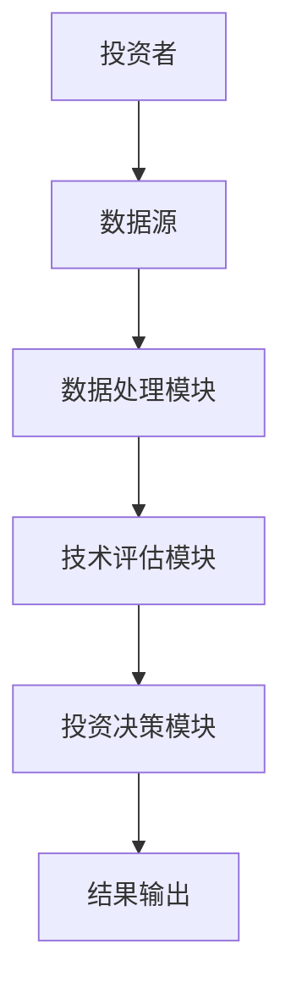

                 

# 巴菲特-芒格的可控核聚变商业化投资：能源革命的临界点

## 关键词：
- 巴菲特, 芒格, 可控核聚变, 商业化投资, 能源革命

## 摘要：
本文探讨了巴菲特和芒格在可控核聚变领域的投资策略，分析了这一技术的商业化潜力及其对能源革命的影响。通过详细的技术分析和投资模型，揭示了这一投资领域的未来前景和挑战。

## 第一部分：背景介绍

### 第1章：问题背景

#### 1.1 问题背景
- 1.1.1 当前能源危机与可持续发展需求
- 1.1.2 可再生能源技术的局限性

#### 1.2 问题描述
- 1.2.1 可控核聚变技术的基本原理
- 1.2.2 商业化面临的挑战

#### 1.3 问题解决
- 1.3.1 技术突破的可能性
- 1.3.2 投资者的角色

#### 1.4 边界与外延
- 1.4.1 技术与市场的边界
- 1.4.2 可持续发展的外延影响

#### 1.5 核心要素
- 1.5.1 技术可行性
- 1.5.2 市场需求
- 1.5.3 财务模型

## 第二部分：核心概念与联系

### 第2章：核心概念

#### 2.1 巴菲特与芒格的投资理念
- 2.1.1 价值投资的定义
- 2.1.2 多元思维模型的应用

#### 2.2 可控核聚变的技术挑战
- 2.2.1 核聚变的科学基础
- 2.2.2 商业化的主要障碍

#### 2.3 核心概念对比
- 2.3.1 投资与技术的对比分析
- 2.3.2 可控核聚变与其他能源技术的对比

### 第3章：核心概念之间的联系

#### 3.1 投资理念与技术可行性
- 3.1.1 价值投资在技术评估中的应用
- 3.1.2 多元思维模型在技术分析中的应用

#### 3.2 技术与市场的互动
- 3.2.1 技术进步对市场需求的影响
- 3.2.2 市场需求对技术投资的引导作用

## 第三部分：算法原理

### 第4章：算法原理

#### 4.1 价值投资模型
- 4.1.1 模型概述
- 4.1.2 模型的数学表达式

#### 4.2 技术评估算法
- 4.2.1 算法步骤
- 4.2.2 算法实现的代码示例

## 第四部分：数学模型

### 第5章：数学模型

#### 5.1 期望值模型
- 5.1.1 公式：$$ E = \sum p_i x_i $$
- 5.1.2 应用实例

#### 5.2 风险调整回报模型
- 5.2.1 公式：$$ R = E[r] - \beta \times (Market Risk Premium) $$
- 5.2.2 应用实例

## 第五部分：系统分析与架构设计

### 第6章：系统分析

#### 6.1 问题场景介绍
- 6.1.1 投资决策过程
- 6.1.2 可控核聚变技术评估

#### 6.2 系统功能设计
- 6.2.1 数据收集模块
- 6.2.2 技术评估模块
- 6.2.3 投资决策模块

#### 6.3 系统架构设计
- 6.3.1 系统架构图（使用mermaid）
- 6.3.2 数据流图

### 第7章：系统架构设计

#### 7.1 系统架构图

#### 7.2 系统交互设计
- 7.2.1 投资者与系统的交互流程
- 7.2.2 技术专家与系统的交互流程

## 第六部分：项目实战

### 第8章：项目实战

#### 8.1 环境配置
- 8.1.1 开发工具安装
- 8.1.2 数据源获取

#### 8.2 核心实现
- 8.2.1 价值投资模型的代码实现
- 8.2.2 技术评估算法的代码实现

#### 8.3 案例分析
- 8.3.1 特定公司的投资分析
- 8.3.2 技术突破的模拟分析

## 第七部分：最佳实践

### 第9章：最佳实践

#### 9.1 小结
- 9.1.1 投资策略的总结
- 9.1.2 技术发展的展望

#### 9.2 注意事项
- 9.2.1 投资风险提示
- 9.2.2 技术评估的误区

#### 9.3 拓展阅读
- 9.3.1 推荐书籍
- 9.3.2 建议的进一步研究领域

## 作者：AI天才研究院 & 禅与计算机程序设计艺术

---

这篇文章系统地分析了巴菲特和芒格在可控核聚变领域的投资策略，结合了技术分析和投资模型，旨在为读者提供深入的见解和实用的指导。通过详细的技术分析和案例研究，文章揭示了这一投资领域的潜力和挑战，为投资者和科技爱好者提供了有价值的参考。

