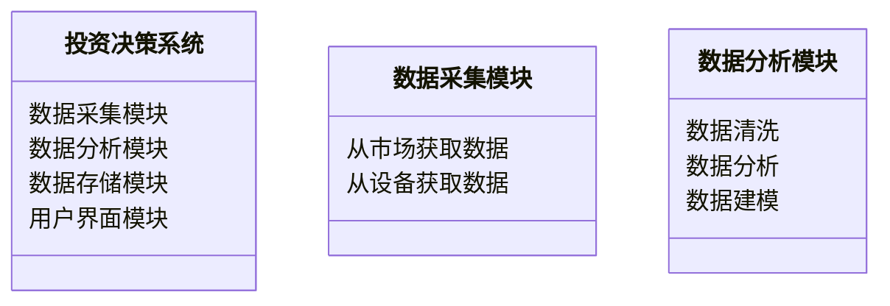

                 


# 巴菲特-芒格的可穿戴设备投资：健康监测的未来

---

## 关键词

- 巴菲特投资策略
- 芮格投资理念
- 可穿戴设备
- 健康监测技术
- 数据驱动投资

---

## 摘要

本文探讨巴菲特和芒格的投资理念在可穿戴设备领域的应用，特别是健康监测技术的创新与投资价值。文章分析了可穿戴设备的技术原理、市场现状，以及如何将价值投资理念与健康监测数据相结合，为投资者提供科学的决策支持。通过案例分析和系统设计，本文揭示了健康监测技术在未来投资中的潜力。

---

## 第一部分：巴菲特与芒格的投资理念

### 第1章：巴菲特与芒格的投资哲学

#### 1.1 巴菲特的价值投资理念

##### 1.1.1 价值投资的定义与核心原则

价值投资是一种长期投资策略，强调以低于内在价值的价格购买优质资产。其核心原则包括：

1. **安全边际**：购买价格低于内在价值，以降低风险。
2. **企业护城河**：选择具有竞争优势的企业。
3. **长期视角**：关注企业的长期盈利能力。

##### 1.1.2 芮格的多元思维模型

芒格强调跨学科思维，通过多角度分析问题，避免认知偏差。其多元思维模型包括：

1. **心理学**：理解人类行为。
2. **经济学**：分析市场机制。
3. **物理学**：理解因果关系。

##### 1.1.3 投资中的安全边际概念

安全边际通过购买价格与内在价值的差距，确保投资的安全性。公式为：

$$ \text{安全边际} = \text{内在价值} - \text{购买价格} $$

---

### 第2章：可穿戴设备的市场现状与发展

#### 2.1 可穿戴设备的定义与分类

可穿戴设备是指能够佩戴在身体部位，具备计算、通信或监测功能的设备，包括智能手表、健康手环等。其分类如下：

- **智能手表**：具备健康监测、智能助手功能。
- **健康手环**：专注于运动监测和健康数据采集。
- **医疗设备**：用于专业医疗监测。

#### 2.2 健康监测技术的创新与应用

健康监测技术包括生物传感器、数据采集与处理算法，以及人工智能的应用。其在医疗领域的应用包括：

- **慢性病管理**：通过实时监测数据，辅助医生制定治疗方案。
- **健康预警**：提前发现潜在健康问题。

---

## 第二部分：可穿戴设备的健康监测技术

### 第3章：健康监测技术的核心原理

#### 3.1 生物传感器技术

生物传感器用于采集生理数据，包括心率、血压、血氧等。其工作原理如下：

1. **数据采集**：传感器收集生理信号。
2. **信号处理**：通过滤波、放大等技术处理信号。
3. **数据传输**：将数据传输至处理器或云端。

#### 3.2 数据分析与人工智能

人工智能在健康监测中的应用包括：

- **模式识别**：识别健康数据中的异常模式。
- **预测模型**：基于历史数据预测健康状况。

---

## 第三部分：投资分析与系统设计

### 第4章：投资决策中的数据分析

#### 4.1 数据驱动的投资决策

数据驱动的投资决策通过分析可穿戴设备的市场数据、用户反馈和健康数据，优化投资策略。其流程包括：

1. **数据收集**：收集市场、财务和用户数据。
2. **数据分析**：使用统计方法分析数据。
3. **决策支持**：基于分析结果制定投资策略。

#### 4.2 投资数学模型

构建投资模型时，考虑企业的财务状况、市场地位和技术优势。模型包括：

- **财务指标评估**：ROE、毛利率等。
- **市场竞争力评估**：市场份额、竞争优势。

---

## 第五部分：系统架构与项目实战

### 第5章：系统架构设计

#### 5.1 系统功能设计

系统功能包括数据采集、分析、存储和用户界面。类图如下：



#### 5.2 项目实战

##### 5.2.1 环境安装

安装必要的工具和库，如Python、Pandas、NumPy等。

##### 5.2.2 核心代码实现

以下是数据分析代码示例：

```python
import pandas as pd
import numpy as np

# 数据清洗
data = pd.read_csv('health_data.csv')
data.dropna(inplace=True)

# 数据分析
correlation_matrix = data.corr()
print(correlation_matrix)
```

##### 5.2.3 代码解读与分析

上述代码读取数据，删除缺失值，计算相关性矩阵，帮助识别变量之间的关系。

---

## 第六部分：总结与展望

### 第6章：总结与展望

#### 6.1 总结

巴菲特和芒格的投资理念与可穿戴设备的健康监测技术相结合，为投资决策提供了新的视角。通过数据分析和系统设计，投资者可以更精准地评估企业的价值。

#### 6.2 展望

未来，健康监测技术将进一步创新，数据驱动的投资策略将更加成熟。投资者需关注技术创新和市场趋势，以抓住投资机会。

---

## 作者：AI天才研究院 & 禅与计算机程序设计艺术

---

**本文通过详细分析巴菲特和芒格的投资理念，结合可穿戴设备的健康监测技术，为投资者提供了新的视角。通过系统设计和项目实战，展示了如何利用技术手段优化投资决策。**

