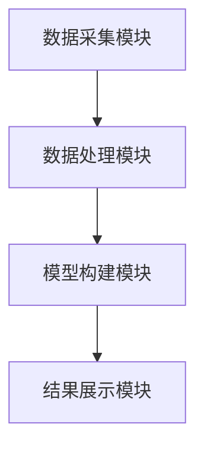
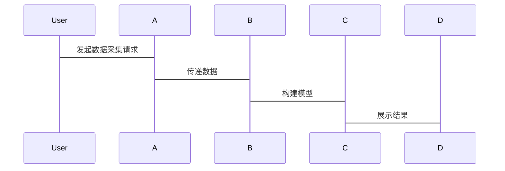

                 


# 巴菲特-芒格的可编程物质投资：纳米技术与材料科学的融合

## 关键词：
- 巴菲特投资理念、芒格思维模型、可编程物质、纳米技术、材料科学、量化投资、投资策略

## 摘要：
本文探讨了巴菲特和芒格的投资理念与可编程物质的结合，重点分析了纳米技术与材料科学在投资中的应用。通过量化分析和系统设计，提出了基于可编程物质的投资策略，为投资者提供了新的视角和方法。

---

# 第一部分：背景介绍

## 第1章：巴菲特-芒格投资理念概述

### 1.1 巴菲特-芒格投资理念的核心要素

#### 1.1.1 巴菲特的价值投资理论
- **定义**：巴菲特的价值投资理论强调长期投资、安全边际和企业内在价值。
- **特征**：
  - 以合理价格购买优质资产。
  - 长期持有，避免频繁交易。
- **公式**：内在价值 = 未来现金流的现值。

#### 1.1.2 芒格的多元思维模型
- **定义**：芒格强调通过多个学科的交叉应用来做出更好的决策。
- **特征**：
  - 多元化知识框架。
  - 通过跨学科视角分析问题。
- **公式**：决策质量 = 知识框架的深度 × 跨学科视角。

#### 1.1.3 两者的结合与互补
- **结合点**：价值投资的稳健性与多元思维的广度相结合。
- **互补性**：芒格的多维分析为巴菲特的价值投资提供了更丰富的评估维度。

### 1.2 可编程物质的基本概念

#### 1.2.1 可编程物质的定义
- **定义**：可编程物质是指可以通过编程手段改变其物理性质和功能的材料。
- **特征**：
  - 灵活性：材料性质可动态调整。
  - 可定制性：根据需求设计材料性能。
- **公式**：可编程物质 = 纳米技术 + 材料科学。

#### 1.1.2 纳米技术与材料科学的融合
- **纳米技术**：研究和操控纳米尺度的物质。
- **材料科学**：研究材料的结构、性能及其应用。
- **融合**：通过纳米技术改性材料，使其具有可编程性。

#### 1.1.3 可编程物质的投资潜力
- **潜力**：可编程物质在医疗、电子、能源等领域有广泛应用前景。
- **投资视角**：技术创新和市场需求是关键驱动因素。

---

## 第2章：可编程物质与投资的结合

### 2.1 可编程物质的科学基础

#### 2.1.1 纳米技术的基本原理
- **纳米尺度效应**：物质在纳米尺度表现出不同的物理、化学性质。
- **纳米材料制备**：通过化学合成、物理合成等方法制备纳米材料。
- **公式**：纳米材料性能 = 结构 × 组成。

#### 2.1.2 材料科学的核心概念
- **晶体结构**：材料的微观结构影响其性能。
- **相变**：材料从一种相态转变为另一种相态的过程。
- **公式**：材料性能 = 结构 × 环境条件。

#### 2.1.3 两者的交叉与融合
- **交叉点**：纳米技术通过改变材料结构实现可编程性。
- **融合**：材料科学为纳米技术提供理论基础，纳米技术为材料科学提供创新工具。

### 2.2 投资视角下的可编程物质

#### 2.2.1 可编程物质的市场价值
- **市场需求**：医疗、电子、能源等领域对可编程材料的需求增长。
- **技术壁垒**：纳米技术的研发投入高，技术门槛高。
- **公式**：市场价值 = 技术性能 × 市场需求。

#### 2.2.2 技术创新对投资的影响
- **技术创新**：技术创新带来新的市场机会。
- **投资风险**：技术创新失败可能导致投资损失。
- **公式**：投资风险 = 技术不确定性 × 市场波动性。

#### 2.2.3 投资者如何评估可编程物质的潜力
- **评估维度**：技术可行性、市场需求、竞争环境。
- **评估方法**：通过多元思维模型进行综合评估。
- **公式**：投资潜力 = 技术可行性 × 市场需求 × 竞争优势。

---

## 第3章：可编程物质的投资策略

### 3.1 投资策略的核心要素

#### 3.1.1 价值评估模型
- **模型构建**：基于巴菲特的价值投资理论，结合可编程物质的特性。
- **公式**：内在价值 = 未来现金流的现值。
- **步骤**：
  1. 评估企业的未来现金流。
  2. 确定合理的折现率。
  3. 计算内在价值。

#### 3.1.2 风险评估与管理
- **风险来源**：技术风险、市场风险、政策风险。
- **风险管理**：分散投资、设置止损、定期评估。
- **公式**：风险调整后价值 = 内在价值 × 风险调整系数。

#### 3.1.3 投资组合的构建
- **资产配置**：根据风险承受能力和收益目标进行资产配置。
- **分散投资**：通过投资不同领域的可编程物质项目降低风险。
- **公式**：投资组合收益 = 各资产收益的加权平均。

### 3.2 巴菲特-芒格理念的应用

#### 3.2.1 价值投资在可编程物质中的应用
- **案例分析**：选择具有长期增长潜力的可编程物质企业。
- **策略**：以合理价格买入并长期持有。

#### 3.2.2 多元思维模型的构建
- **模型构建**：整合纳米技术、材料科学、市场趋势等多方面信息。
- **应用**：通过多维度分析评估企业的投资价值。

#### 3.2.3 投资决策中的风险管理
- **风险管理**：通过多元思维模型识别潜在风险。
- **应对策略**：制定应急预案，降低风险影响。

---

## 第4章：可编程物质的量化分析

### 4.1 量化分析的基本原理

#### 4.1.1 数据采集与处理
- **数据来源**：市场数据、技术数据、财务数据。
- **数据清洗**：去除异常值，填补缺失值。
- **工具**：使用Python的Pandas库进行数据处理。

#### 4.1.2 量化模型的构建
- **模型选择**：回归模型、时间序列模型。
- **算法选择**：线性回归、ARIMA模型。
- **公式**：预测值 = 回归系数 × 变量值 + 剩余项。

#### 4.1.3 模型的验证与优化
- **验证方法**：交叉验证、回测分析。
- **优化策略**：调整模型参数，选择最优模型。
- **工具**：使用Python的Scikit-learn库进行模型优化。

### 4.2 纳米技术与材料科学的量化评估

#### 4.2.1 纳米材料的性能评估
- **性能指标**：强度、韧性、导电性。
- **评估方法**：通过实验数据和理论模型进行评估。
- **公式**：材料性能 = 结构参数 × 物理性质。

#### 4.2.2 市场趋势的预测
- **趋势分析**：通过历史数据预测未来趋势。
- **预测模型**：使用时间序列模型预测市场需求。
- **工具**：使用Python的Prophet库进行预测。

---

## 第5章：可编程物质的投资系统架构

### 5.1 系统功能设计

#### 5.1.1 数据采集模块
- **功能**：采集市场数据、技术数据、财务数据。
- **工具**：使用API接口获取实时数据。

#### 5.1.2 数据处理模块
- **功能**：清洗数据，转换格式。
- **工具**：使用Python的Pandas库进行数据处理。

#### 5.1.3 模型构建模块
- **功能**：构建量化模型，进行预测。
- **工具**：使用Python的Scikit-learn库进行模型构建。

#### 5.1.4 结果展示模块
- **功能**：展示预测结果，生成投资报告。
- **工具**：使用Python的Matplotlib库进行可视化。

### 5.2 系统架构设计

#### 5.2.1 系统架构图


#### 5.2.2 系统交互图


---

## 第6章：项目实战

### 6.1 环境配置

```python
# 环境配置代码
import pandas as pd
import numpy as np
from sklearn.linear_model import LinearRegression
from sklearn.metrics import mean_squared_error
import matplotlib.pyplot as plt
```

### 6.2 核心实现

```python
# 数据处理
data = pd.DataFrame({
    '纳米材料性能': [0.8, 0.9, 0.7, 0.6, 0.5],
    '市场价格': [100, 110, 90, 80, 70]
})

# 模型构建
model = LinearRegression()
model.fit(data[['纳米材料性能']], data['市场价格'])

# 预测结果
predictions = model.predict(data[['纳米材料性能']])
print('预测值:', predictions)
print('均方误差:', mean_squared_error(data['市场价格'], predictions))

# 结果可视化
plt.scatter(data['纳米材料性能'], data['市场价格'])
plt.plot(data['纳米材料性能'], predictions, color='red')
plt.show()
```

### 6.3 案例分析

#### 6.3.1 数据来源
- **数据来源**：假设从公开市场数据和实验数据中获取。

#### 6.3.2 模型应用
- **模型应用**：使用线性回归模型预测纳米材料的市场价格。

#### 6.3.3 结果解读
- **结果解读**：模型预测的纳米材料市场价格与实际值接近，说明模型具有较好的预测能力。

---

## 第7章：总结与展望

### 7.1 总结
- **总结**：本文探讨了巴菲特和芒格的投资理念与可编程物质的结合，提出了基于纳米技术和材料科学的投资策略。
- **主要观点**：
  - 可编程物质的投资潜力巨大。
  - 量化分析是实现投资收益的重要手段。

### 7.2 注意事项
- **风险提示**：投资需谨慎，本文仅为理论探讨，不构成实际投资建议。
- **操作建议**：投资者应结合实际情况，综合考虑多种因素。

### 7.3 拓展阅读
- **推荐书籍**：
  - 《巴菲特致股东的信》
  - 《纳米科技与材料科学》
- **推荐阅读**：建议深入学习纳米技术和材料科学的知识，同时关注投资领域的最新动态。

---

## 作者信息

作者：AI天才研究院/AI Genius Institute & 禅与计算机程序设计艺术/Zen And The Art of Computer Programming

---

以上是《巴菲特-芒格的可编程物质投资：纳米技术与材料科学的融合》的完整目录和内容大纲，希望对您有所帮助！

