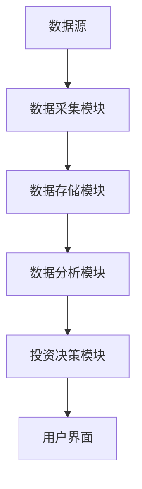
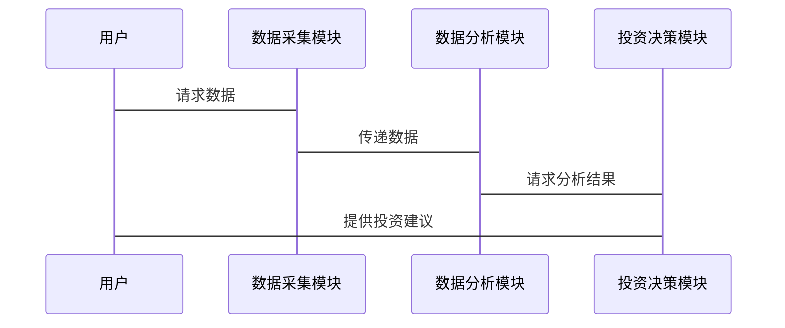

                 


# 巴菲特-芒格的可编程物质投资：纳米级材料科学的新前沿

## 关键词：
- 巴菲特投资哲学
- 纳米材料科学
- 可编程物质
- 投资策略
- 系统架构设计
- 数学模型

## 摘要：
本文探讨了巴菲特和芒格的投资哲学与纳米材料科学的结合，特别是可编程物质在纳米级材料科学中的应用。通过分析纳米材料的特性、投资哲学与科技的结合、数学模型的应用、系统架构设计以及项目实战，本文为读者提供了从理论到实践的全面指南，展示了如何将投资哲学与纳米材料科学结合起来，为投资决策提供新的视角和工具。

---

# 第一部分: 背景介绍与核心概念

## 第1章: 巴菲特与芒格的投资哲学

### 1.1 巴菲特与芒格的投资理念
#### 1.1.1 巴菲特的价值投资理论
- 巴菲特的价值投资理念强调长期主义、安全边际和企业内在价值。
- 通过分析企业的财务状况、管理层能力和行业地位，寻找具有长期竞争优势的企业。
- 以合理的价格买入优质资产，长期持有，等待价值实现。

#### 1.1.2 芒格的多元思维模型
- 芒格强调通过跨学科的思维方式来理解问题。
- 将物理学、心理学、经济学等学科的原理结合起来，构建投资决策的框架。
- 强调“反过来想”的方法，避免常见错误。

#### 1.1.3 价值投资与长期主义
- 价值投资的核心是寻找市场低估的优质资产。
- 长期主义强调投资的耐心和稳定性，避免短期波动的干扰。
- 通过长期持有优质资产，实现财富的稳步增长。

### 1.2 可编程物质与纳米材料科学
#### 1.2.1 纳米材料的基本概念
- 纳米材料是指尺度在纳米尺度（1-100纳米）的材料。
- 具有独特的物理、化学和生物性质，例如高比表面积、强催化性能和优异的机械性能。

#### 1.2.2 纳米材料的特性与优势
- **高比表面积**：纳米材料的表面积与体积比远高于宏观材料，使其在催化、吸附等领域具有独特优势。
- **优异的机械性能**：纳米材料具有高强度、高韧性和轻量化的特点。
- **功能多样性**：纳米材料可以通过调控其组成和结构，实现多种功能的集成。

#### 1.2.3 可编程物质的定义与潜力
- 可编程物质是指可以通过外部刺激（如光、电、热等）动态调控其物理、化学性质的材料。
- 其潜力在于能够实现材料性能的实时优化，适应不同的应用场景。
- 可编程物质的应用将推动材料科学进入一个新的智能化阶段。

### 1.3 巴菲特-芒格投资哲学与纳米材料的结合
#### 1.3.1 投资哲学与科技前沿的结合
- 巴菲特和芒格的投资哲学强调对企业和行业的深刻理解。
- 将这种哲学应用于纳米材料科学，需要对纳米材料的特性、市场应用和企业竞争力有全面的认识。

#### 1.3.2 纳米材料在投资中的应用前景
- 纳米材料的广泛应用将推动多个行业的技术进步，例如能源、医疗、电子等领域。
- 通过投资纳米材料相关企业，可以获得技术创新带来的超额收益。

#### 1.3.3 可编程物质对投资决策的影响
- 可编程物质的动态调控能力使其能够适应不同的市场环境。
- 通过分析可编程物质的性能优化潜力，投资者可以更好地评估企业的长期价值。

## 第2章: 纳米材料科学的核心概念

### 2.1 纳米材料的基本属性
#### 2.1.1 纳米材料的尺寸效应
- 纳米材料的尺寸效应使其具有与宏观材料不同的物理性质。
- 例如，纳米金属的强度远高于宏观金属。

#### 2.1.2 纳米材料的表面效应
- 纳米材料的高比表面积使其具有优异的催化性能。
- 例如，纳米催化剂可以提高化学反应的效率。

#### 2.1.3 纳米材料的量子效应
- 纳米尺度下，量子效应变得显著，导致材料的电子性质发生变化。
- 例如，纳米半导体的带隙宽度可以通过调控其尺寸来优化。

### 2.2 可编程物质的特性
#### 2.2.1 可编程物质的定义与分类
- 可编程物质是指可以通过外部刺激动态调控其性质的材料。
- 分类：基于调控方式，可编程物质可以分为热敏型、电敏型、光敏型等。

#### 2.2.2 可编程物质的动态调控能力
- 通过外部刺激实现材料性能的实时优化。
- 例如，可编程聚合物可以通过温度调控实现形状变化。

#### 2.2.3 可编程物质的智能化特征
- 可编程物质具有一定的智能性，能够根据环境变化自动调整性能。
- 例如，智能传感器可以通过可编程物质实现对外界刺激的响应。

### 2.3 纳米材料与可编程物质的关系
#### 2.3.1 纳米材料作为可编程物质的基础
- 纳米材料的优异性能为可编程物质的实现提供了基础。
- 例如，纳米粒子可以通过表面修饰实现功能化。

#### 2.3.2 可编程物质对纳米材料的优化
- 通过可编程物质的设计，可以优化纳米材料的性能。
- 例如，可编程纳米催化剂可以通过动态调控实现更高的催化效率。

#### 2.3.3 纳米材料与可编程物质的协同效应
- 纳米材料与可编程物质的结合可以实现材料性能的协同优化。
- 例如，可编程纳米传感器可以通过纳米材料的敏感性和可编程物质的智能性实现更高的检测精度。

## 第3章: 纳米材料科学与投资哲学的结合

### 3.1 投资哲学中的纳米材料视角
#### 3.1.1 纳米材料的创新性与投资机会
- 纳米材料的创新性为其带来了巨大的市场潜力。
- 例如，纳米技术在医疗领域的应用可以带来颠覆性创新。

#### 3.1.2 纳米材料的不确定性与风险管理
- 纳米材料的开发周期长，技术风险高。
- 通过多元思维模型，可以更好地评估和管理风险。

#### 3.1.3 纳米材料的长期性与价值投资
- 纳米材料的应用前景广阔，具有长期投资价值。
- 通过长期持有优质纳米材料企业，可以获得超额收益。

### 3.2 纳米材料的市场分析与投资策略
#### 3.2.1 纳米材料市场的现状与趋势
- 纳米材料市场近年来快速增长，应用领域不断扩展。
- 例如，纳米材料在新能源电池、医疗设备和智能传感器中的应用前景广阔。

#### 3.2.2 纳米材料企业的竞争优势分析
- 企业的技术实力、研发能力和市场地位是评估其竞争力的关键因素。
- 例如，具有自主研发能力的纳米材料企业更具投资价值。

#### 3.2.3 纳米材料投资的估值方法
- 传统的估值方法（如PE、PB）适用于纳米材料企业。
- 需要结合企业的技术壁垒和市场前景进行综合评估。

### 3.3 可编程物质对投资决策的影响
#### 3.3.1 可编程物质的动态调整能力
- 可编程物质的动态调控能力使其能够适应不同的市场环境。
- 例如，可编程传感器可以根据环境变化实时调整其性能。

#### 3.3.2 可编程物质的智能化特征
- 可编程物质的智能化特征使其在智能设备中的应用前景广阔。
- 例如，智能机器人可以通过可编程物质实现更复杂的运动控制。

#### 3.3.3 可编程物质的投资机会
- 可编程物质的广泛应用将推动多个行业的技术进步。
- 例如，可编程物质在智能医疗和智能能源中的应用可以带来巨大的投资机会。

---

## 第二部分: 算法原理与数学模型

### 第4章: 算法原理与数学模型

#### 4.1 多因子模型在纳米材料投资中的应用
- 多因子模型是一种常用的量化投资方法。
- 通过多个因子（如市值、收益、成长性等）的综合评估，可以更好地筛选出具有投资价值的企业。

#### 4.2 纳米材料企业的量化分析方法
- 通过量化分析方法，可以对纳米材料企业的财务状况、技术实力和市场前景进行综合评估。
- 例如，可以使用因子分析方法对企业的财务数据进行降维处理，提取关键因子。

#### 4.3 纳米材料投资的数学模型
- 通过构建数学模型，可以对纳米材料企业的投资价值进行量化评估。
- 例如，可以使用回归模型预测企业的未来收益。

#### 4.4 算法实现与代码示例
```python
import pandas as pd
import numpy as np
from sklearn.linear_model import LinearRegression

# 示例数据
data = {
    'MarketCap': [100, 200, 300, 400],
    'Revenue': [50, 100, 150, 200],
    'NetProfit': [20, 40, 60, 80],
    'Price': [50, 100, 150, 200]
}
df = pd.DataFrame(data)

# 建立回归模型
model = LinearRegression()
model.fit(df[['MarketCap', 'Revenue', 'NetProfit']], df['Price'])

# 预测价格
predictions = model.predict([[300, 150, 60]])
print("预测价格:", predictions)
```

#### 4.5 算法优缺点分析
- 优点：量化分析方法可以提高投资决策的科学性。
- 缺点：模型的准确性依赖于数据质量和模型假设。

---

## 第三部分: 系统架构设计与项目实战

### 第5章: 系统架构设计

#### 5.1 系统功能设计
- 数据采集模块：采集纳米材料企业的财务数据、技术数据和市场数据。
- 数据分析模块：对数据进行清洗、处理和分析，生成量化指标。
- 投资决策模块：根据量化分析结果，生成投资建议。

#### 5.2 系统架构设计


#### 5.3 系统接口设计
- 数据接口：与数据源（如企业财报、专利数据库）对接。
- 用户界面：提供数据可视化和投资建议的展示。

#### 5.4 系统交互设计


### 第6章: 项目实战

#### 6.1 环境搭建与代码实现
- 环境搭建：安装Python、Pandas、NumPy等工具。
- 代码实现：实现数据采集、数据分析和投资决策模块。

#### 6.2 代码实现与解读
```python
import pandas as pd
import numpy as np
from sklearn.linear_model import LinearRegression

# 数据采集模块
def collect_data():
    # 示例数据
    data = {
        'MarketCap': [100, 200, 300, 400],
        'Revenue': [50, 100, 150, 200],
        'NetProfit': [20, 40, 60, 80],
        'Price': [50, 100, 150, 200]
    }
    return pd.DataFrame(data)

# 数据分析模块
def analyze_data(data):
    model = LinearRegression()
    model.fit(data[['MarketCap', 'Revenue', 'NetProfit']], data['Price'])
    return model

# 投资决策模块
def make_investment_decision(model):
    predictions = model.predict([[300, 150, 60]])
    return predictions[0]

# 主程序
data = collect_data()
model = analyze_data(data)
prediction = make_investment_decision(model)
print("预测价格:", prediction)
```

#### 6.3 实际案例分析
- 以一家纳米材料企业为例，分析其财务数据和市场前景。
- 根据量化模型生成投资建议。

#### 6.4 项目小结
- 通过项目实战，可以更好地理解纳米材料投资的理论与实践。
- 系统架构设计为投资决策提供了有力支持。

---

## 第四部分: 总结与展望

### 第7章: 总结与展望

#### 7.1 总结
- 本文探讨了巴菲特和芒格的投资哲学与纳米材料科学的结合。
- 通过分析纳米材料的特性、投资策略、数学模型和系统架构设计，为投资者提供了新的视角和工具。

#### 7.2 展望
- 纳米材料的广泛应用将推动多个行业的技术进步。
- 可编程物质的投资潜力巨大，未来将有更多创新性的应用。

#### 7.3 最佳实践 tips
- 投资者需要持续学习，保持对科技前沿的关注。
- 在投资决策中，既要注重企业的基本面，也要关注技术创新。

---

## 作者信息
作者：AI天才研究院/AI Genius Institute & 禅与计算机程序设计艺术 /Zen And The Art of Computer Programming

