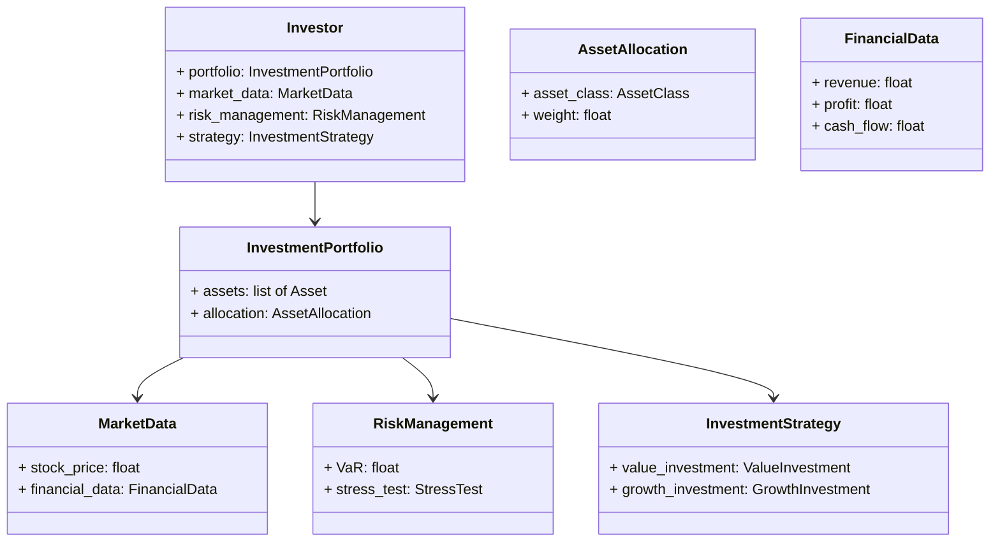
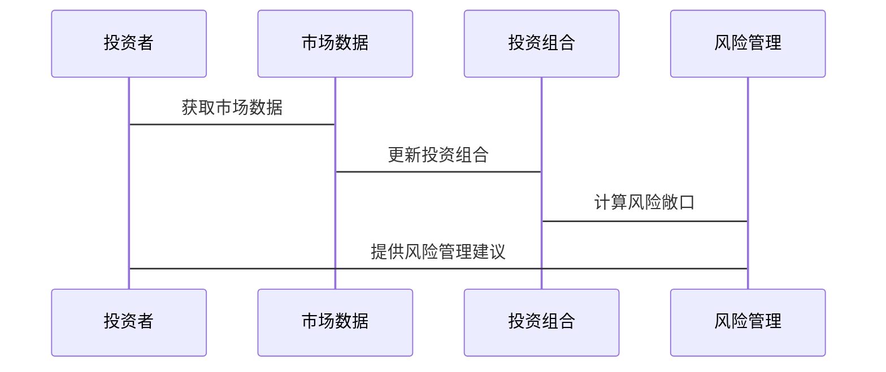

                 


# 巴菲特-芒格的后疫情时代投资策略：适应新常态

> 关键词：巴菲特, 芒格, 后疫情时代, 投资策略, 价值投资, 风险管理, 长期投资

> 摘要：本文详细探讨了巴菲特和芒格在后疫情时代的投资策略，分析了他们在新常态下的投资哲学、策略调整和具体实施方法。通过结合技术、数学和系统的视角，本文深入剖析了价值投资的内在逻辑，提供了实际案例和最佳实践，帮助投资者在复杂多变的市场环境中做出明智决策。

---

## 第一部分: 后疫情时代投资策略的背景与挑战

### 第1章: 疫情对全球经济与投资环境的影响

#### 1.1 疫情对全球经济的深远影响

##### 1.1.1 疫情对全球经济的冲击
疫情的爆发导致全球经济活动暂停，供应链中断，企业停工停产，失业率上升。许多行业受到重创，尤其是航空、旅游、零售和酒店业。然而，疫情也催生了新的经济模式，如远程办公、在线教育和电子商务的快速发展。

##### 1.1.2 投资环境的剧烈变化
疫情导致全球股市剧烈波动，投资者情绪从恐慌到逐步恢复。货币政策宽松、低利率环境和政府刺激政策推动了市场的反弹，但同时也带来了通货膨胀和资产泡沫的风险。

##### 1.1.3 投资者面临的机遇与挑战
疫情后，投资者需要面对新的经济结构和市场环境。数字经济发展加速，绿色能源、生物科技和科技行业成为新的投资热点。与此同时，传统行业面临转型压力，投资者需要重新评估企业的长期价值。

#### 1.2 巴菲特与芒格投资理念的演变

##### 1.2.1 巴菲特与芒格的投资哲学
巴菲特和芒格的价值投资理念强调长期持有优质资产，注重企业的基本面和管理层质量。他们的投资哲学以安全边际、内在价值和复利效应为核心。

##### 1.2.2 疫情前的投资策略
疫情前，巴菲特和芒格倾向于投资具有强大护城河、稳定现金流和高ROE（净资产收益率）的企业。他们偏好传统行业，如金融、能源和消费领域。

##### 1.2.3 疫情后策略的调整与优化
疫情后，巴菲特和芒格的投资策略进行了调整。他们开始关注数字经济和绿色能源行业，同时更加注重企业的适应能力和长期增长潜力。

#### 1.3 后疫情时代投资环境的新常态

##### 1.3.1 经济复苏的不确定性
疫情后全球经济复苏缓慢，通胀和利率上升对企业盈利和估值产生了双重压力。投资者需要关注企业的成本控制和现金流状况。

##### 1.3.2 通货膨胀与货币政策的影响
通货膨胀导致企业成本上升，货币政策的不确定性增加了市场的波动性。投资者需要在通胀环境下寻找具有抗通胀能力的资产。

##### 1.3.3 数字经济与绿色投资的崛起
数字经济和绿色能源行业的快速发展为投资者提供了新的机会。科技、人工智能和可再生能源等领域成为投资的重点。

---

### 第2章: 巴菲特与芒格投资策略的核心理念

#### 2.1 价值投资的定义与原则

##### 2.1.1 价值投资的核心要素
价值投资强调以低于内在价值的价格买入优质资产。巴菲特和芒格认为，内在价值是企业未来现金流的折现值，可以通过分析企业的财务指标和行业地位来估算。

##### 2.1.2 投资的长期性与耐心
价值投资是一种长期投资策略，需要耐心等待市场的波动和企业的成长。巴菲特和芒格强调，投资不是短期交易，而是买入并持有优质资产。

##### 2.1.3 安全边际的重要性
安全边际是指买入价格与内在价值之间的差距。通过预留安全边际，投资者可以降低投资风险，确保在市场波动中获得稳定的收益。

#### 2.2 巴菲特与芒格的决策框架

##### 2.2.1 股票分析的维度
巴菲特和芒格从多个维度分析股票，包括财务状况、管理层素质、行业地位和竞争优势。他们注重企业的盈利能力、现金流和资产负债表的健康状况。

##### 2.2.2 企业基本面的评估
基本面分析是价值投资的核心。巴菲特和芒格通过分析企业的收入、利润、现金流和资产负债表来评估其内在价值。

##### 2.2.3 市场情绪与估值的结合
市场情绪会影响股票的短期价格波动，但巴菲特和芒格更关注企业的长期价值。他们通过对比市场估值和内在价值来判断投资机会。

#### 2.3 投资组合的构建与优化

##### 2.3.1 投资组合的分散化策略
为了降低风险，巴菲特和芒格建议投资者分散投资，避免过度集中于单一行业或资产。分散化可以平滑市场波动对投资组合的影响。

##### 2.3.2 风险管理的框架
风险管理是投资的重要组成部分。巴菲特和芒格通过设置止损点、评估企业的风险敞口和关注宏观经济趋势来管理投资风险。

##### 2.3.3 长期投资目标的设定
长期投资目标是价值投资的核心。巴菲特和芒格建议投资者设定长期目标，避免频繁调整投资组合，以最大化复利效应。

---

## 第二部分: 后疫情时代投资策略的具体实施

### 第3章: 疫情后投资策略的调整与优化

#### 3.1 投资策略的动态调整

##### 3.1.1 疫情后经济环境的分析
疫情后，全球经济复苏缓慢，通胀压力上升，利率政策变化频繁。投资者需要关注宏观经济趋势和行业动态，调整投资策略。

##### 3.1.2 投资策略的优化方向
在新常态下，巴菲特和芒格的投资策略更加注重企业的适应能力和长期增长潜力。他们倾向于投资能够应对市场变化和经济周期的企业。

##### 3.1.3 投资组合的再平衡
为了适应新的经济环境，投资者需要定期调整投资组合，优化资产配置，降低风险敞口，提高投资收益。

#### 3.2 巴菲特与芒格策略的适应性

##### 3.2.1 长期价值投资的坚守
尽管疫情对全球经济造成了冲击，巴菲特和芒格仍然坚持长期价值投资的理念。他们相信优质资产的长期价值会逐渐显现。

##### 3.2.2 对周期性行业的重新评估
疫情后，周期性行业如房地产、汽车和航空业面临较大的不确定性。巴菲特和芒格重新评估了这些行业的风险和机会，调整了投资组合的配置。

##### 3.2.3 对新兴行业的关注
数字经济和绿色能源行业的快速发展为投资者提供了新的机会。巴菲特和芒格开始关注科技、人工智能和可再生能源等领域，寻找具有长期增长潜力的企业。

#### 3.3 投资者心态与决策的调整

##### 3.3.1 面对不确定性的心态管理
疫情后的市场环境充满不确定性，投资者需要保持冷静，避免情绪化决策。巴菲特和芒格强调，投资者需要在市场恐慌时保持耐心，在市场狂热时保持理性。

##### 3.3.2 决策过程中的理性与感性
投资决策需要理性分析和感性判断的结合。巴菲特和芒格通过分析企业的基本面和市场情绪，结合自身的投资哲学，做出明智的决策。

##### 3.3.3 投资纪律的严格执行
投资纪律是价值投资成功的关键。巴菲特和芒格强调，投资者需要严格遵守投资纪律，避免被市场情绪和短期波动所左右。

---

### 第4章: 后疫情时代投资策略的数学模型与算法

#### 4.1 投资策略的数学建模

##### 4.1.1 价值评估的数学模型
内在价值模型是价值投资的核心。巴菲特和芒格通过分析企业的未来现金流，使用贴现现金流模型（DCF）估算企业的内在价值。

##### 4.1.2 投资组合优化的算法
投资组合优化可以通过数学算法实现。投资者可以通过马科维茨的有效组合理论，结合风险偏好和收益目标，优化投资组合的配置。

##### 4.1.3 风险管理的量化方法
风险管理可以通过量化方法实现。投资者可以通过计算波动率、VaR（在险价值）和信用风险模型，评估投资组合的风险敞口。

#### 4.2 价值评估的内在价值模型

##### 4.2.1 内在价值的计算公式
$$
\text{内在价值} = \frac{\text{自由现金流}}{\text{贴现率}}
$$

##### 4.2.2 现金流贴现模型（DCF）的实现
以下是一个简单的DCF模型实现：

```python
def calculate_intrinsic_value(free_cash_flow, discount_rate, num_periods):
    intrinsic_value = 0
    for i in range(num_periods):
        cash_flow = free_cash_flow * (1 + growth_rate)^i
        present_value = cash_flow / (1 + discount_rate)^i
        intrinsic_value += present_value
    return intrinsic_value
```

##### 4.2.3 现金流贴现模型的案例分析
以可口可乐为例，假设其未来5年的自由现金流分别为100、110、120、130、140（单位：亿美元），贴现率为8%。计算其内在价值：

$$
\text{内在价值} = \frac{100}{1.08} + \frac{110}{1.08^2} + \frac{120}{1.08^3} + \frac{130}{1.08^4} + \frac{140}{1.08^5}
$$

---

### 第5章: 系统分析与架构设计

#### 5.1 系统分析

##### 5.1.1 问题场景介绍
在后疫情时代，投资者需要应对复杂的市场环境和经济不确定性。为了帮助投资者做出明智决策，我们可以构建一个基于价值投资策略的投资决策支持系统。

##### 5.1.2 项目介绍
本项目旨在构建一个基于巴菲特和芒格投资策略的投资决策支持系统，帮助投资者分析企业的内在价值和市场估值，制定投资组合优化策略。

#### 5.2 系统架构设计

##### 5.2.1 领域模型（mermaid 类图）


##### 5.2.2 系统架构设计（mermaid 架构图）


##### 5.2.3 系统接口设计
系统接口包括数据输入、模型计算和结果输出三个部分。投资者可以通过输入企业的财务数据和市场数据，使用内在价值模型和投资组合优化算法，得到企业的内在价值和投资组合配置建议。

##### 5.2.4 系统交互设计（mermaid 序列图）


---

### 第6章: 项目实战

#### 6.1 环境安装

##### 6.1.1 安装 Python 和必要的库
```bash
pip install numpy pandas matplotlib
```

#### 6.2 核心实现

##### 6.2.1 内在价值模型的实现
```python
import numpy as np

def calculate_intrinsic_value(fcf, discount_rate, periods):
    iv = 0
    for i in range(periods):
        iv += fcf * (1 + discount_rate) ** (-i-1)
    return iv

# 示例计算
fcf = [100, 110, 120, 130, 140]
discount_rate = 0.08
periods = 5

intrinsic_value = calculate_intrinsic_value(fcf, discount_rate, periods)
print(f"内在价值: {intrinsic_value}")
```

##### 6.2.2 投资组合优化的实现
```python
import numpy as np

def portfolio_optimization(returns, weights):
    # 计算投资组合的期望收益和风险
    expected_return = np.sum(returns * weights)
    portfolio_variance = np.dot(weights.T @ returns, weights)
    return expected_return, portfolio_variance

# 示例计算
returns = np.array([0.1, 0.15, 0.08, 0.12])
weights = np.array([0.25, 0.3, 0.25, 0.2])

expected_return, portfolio_variance = portfolio_optimization(returns, weights)
print(f"期望收益: {expected_return}")
print(f"投资组合方差: {portfolio_variance}")
```

#### 6.3 案例分析

##### 6.3.1 案例选择
以可口可乐为例，分析其内在价值和投资组合配置。

##### 6.3.2 实际案例分析
使用上述模型计算可口可乐的内在价值和投资组合配置，并与市场估值进行对比。

#### 6.4 项目小结
通过实际案例分析，验证了内在价值模型和投资组合优化算法的有效性。投资者可以根据市场环境和企业基本面，灵活调整投资策略，实现长期稳定收益。

---

## 第三部分: 最佳实践与小结

### 第7章: 后疫情时代投资策略的最佳实践

#### 7.1 小结

##### 7.1.1 投资策略的核心要点
巴菲特和芒格的投资策略以长期价值投资为核心，注重企业的内在价值和市场估值的对比，强调风险管理和社会责任投资。

##### 7.1.2 新常态下的投资机会
疫情后，数字经济和绿色能源行业成为新的投资热点。投资者需要关注企业的适应能力和长期增长潜力，寻找具有竞争优势的优质资产。

##### 7.1.3 投资者的心理与行为
投资者需要保持冷静和耐心，避免情绪化决策。在市场波动中，坚持长期投资理念，严格执行投资纪律。

#### 7.2 注意事项

##### 7.2.1 风险管理的重要性
投资者需要关注宏观经济趋势和行业动态，评估企业的风险敞口，合理配置资产，降低投资风险。

##### 7.2.2 投资组合的动态调整
根据市场环境的变化，投资者需要定期调整投资组合，优化资产配置，提高投资收益。

##### 7.2.3 道德投资与社会责任
巴菲特和芒格强调，投资者需要关注企业的社会责任和道德标准，选择具有良好声誉和管理的企业进行投资。

#### 7.3 拓展阅读

##### 7.3.1 推荐书籍
1. 《巴菲特致股东的信》
2. 《芒格主义：投资哲学的入门读本》
3. 《投资最重要的事情》

##### 7.3.2 推荐文章
1. "价值投资在后疫情时代的应用"
2. "数字经济与绿色能源的投资机会"
3. "风险管理与投资组合优化"

---

## 作者：AI天才研究院/AI Genius Institute & 禅与计算机程序设计艺术 /Zen And The Art of Computer Programming

---

以上是《巴菲特-芒格的后疫情时代投资策略：适应新常态》的文章大纲和详细内容。希望这篇文章能够为投资者在后疫情时代提供有价值的指导和启发。

