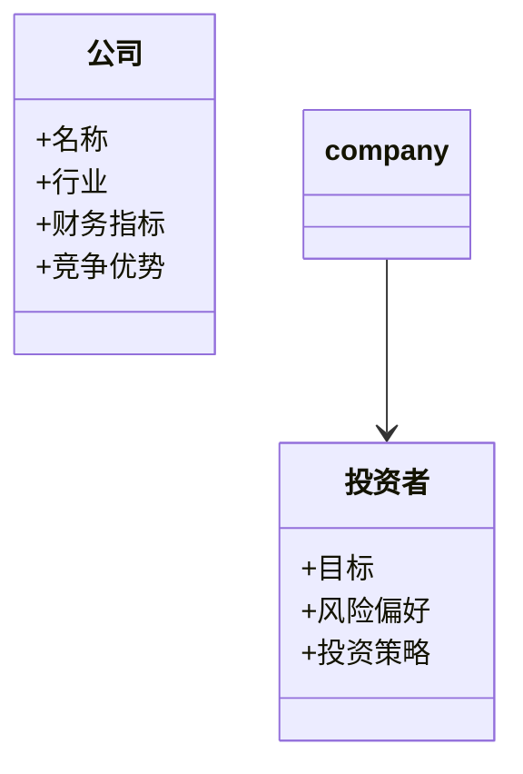
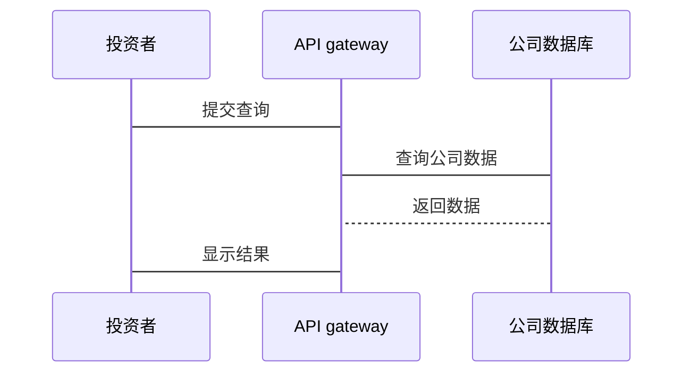

                 


# 巴菲特-芒格的商业模式分析：理解公司的赚钱逻辑

> 关键词：巴菲特，芒格，商业模式分析，价值投资，护城河，竞争优势，财务指标

> 摘要：本文通过分析巴菲特和芒格的投资理念，探讨如何通过商业模式分析来理解公司的赚钱逻辑。从背景介绍、核心概念、数学模型到实际案例分析，层层深入，帮助读者掌握价值投资的关键要素。

---

# 第一部分：背景介绍

## 第1章：巴菲特与芒格的投资哲学

### 1.1 巴菲特的生平与投资理念

#### 1.1.1 巴菲特的生平简介
沃伦·巴菲特是世界著名的投资者，其投资哲学以价值投资为核心。他强调寻找具有持续竞争优势的公司，并长期持有。

#### 1.1.2 巴菲特的投资哲学
- 价值投资：寻找市场价格低于内在价值的公司。
- 安全边际：确保投资的安全性，避免本金损失。

#### 1.1.3 成功案例分析
以可口可乐为例，巴菲特长期持有，因为其强大的品牌和定价能力构成护城河。

### 1.2 芮格的思维方式

#### 1.2.1 芮格的生平简介
查理·芒格是巴菲特的长期合作伙伴，其思维方式强调多元思维模型和逆向思维。

#### 1.2.2 芮格的思维方式
- 多元思维模型：将问题分解为多个维度进行分析。
- 逆向思维：从反方向思考问题，寻找投资机会。

#### 1.2.3 成功案例分析
芒格通过分析企业竞争优势，成功投资了喜马拉雅控股。

---

## 第2章：巴菲特与芒格的投资策略

### 2.1 价值投资的核心理念

#### 2.1.1 价值投资的定义
价值投资是一种投资策略，强调以低于内在价值的价格购买优质股票。

#### 2.1.2 核心要素
- 公司质量：寻找具有持续竞争优势的企业。
- 市场价格：确保购买价格低于内在价值。

#### 2.1.3 实施步骤
1. 分析公司基本面。
2. 评估公司的竞争优势。
3. 确保安全边际。

### 2.2 安全边际的概念与应用

#### 2.2.1 安全边际的定义
安全边际是投资价格与内在价值之间的差距，用于降低投资风险。

#### 2.2.2 计算方法
$$ \text{安全边际} = \text{内在价值} - \text{市场价格} $$

### 2.3 股票分析的三要素

#### 2.3.1 行业地位
- 市场领导者：具有定价权和竞争优势。
- 市场挑战者：有一定市场份额，但竞争力较弱。

#### 2.3.2 财务状况
- 盈利能力：ROE（净资产收益率）和ROA（资产回报率）。
- 偿债能力：负债率和流动比率。

#### 2.3.3 管理团队
- 管理层素质：是否具有长期愿景和执行力。

---

# 第二部分：商业模式分析的核心概念

## 第3章：商业模式的定义与分类

### 3.1 商业模式的定义

#### 3.1.1 核心要素
- 价值主张：公司提供的产品或服务。
- 盈利模式：公司如何通过产品或服务获得利润。
- 关键资源：公司运营所需的核心资源。

#### 3.1.2 商业模式的四种类型
| 类型       | 描述                       |
|------------|----------------------------|
| 产品型     | 以产品为主要收入来源       |
| 服务型     | 以服务为主要收入来源       |
| 平台型     | 以平台为核心，连接供需双方   |
| 订阅型     | 通过订阅模式持续获得收入     |

### 3.2 商业模式的核心要素

#### 3.2.1 价值主张
- 产品或服务能为客户解决什么问题。

#### 3.2.2 盈利模式
- 收入来源：销售收入、订阅费等。
- 成本结构：固定成本和可变成本。

#### 3.2.3 关键资源
- 人力资源：优秀团队。
- 财务资源：充足的资金。
- 技术资源：核心技术专利。

### 3.3 商业模式的分类与对比

#### 3.3.1 产品型商业模式
- 特点：高固定成本，边际成本低。
- 例子：汽车制造行业。

#### 3.3.2 服务型商业模式
- 特点：依赖服务人员，边际成本较高。
- 例子：律师事务所。

#### 3.3.3 平台型商业模式
- 特点：连接供需双方，双边市场。
- 例子：电商平台。

---

## 第4章：巴菲特与芒格的商业模式分析框架

### 4.1 护城河分析

#### 4.1.1 护城河的定义
护城河是指公司拥有的竞争优势，使其能够抵御竞争对手的侵蚀。

#### 4.1.2 护城河的五种类型
| 类型       | 描述                       |
|------------|----------------------------|
| 成本优势   | 低于竞争对手的成本结构     |
| 品牌优势   | 强大的品牌认知度             |
| 技术优势   | 拥有独特技术或专利           |
| 网络效应   | 用户越多，价值越高           |
| 政策优势   | 受益于特定政策或法规         |

#### 4.1.3 评估方法
- 分析公司的市场地位。
- 考察公司的竞争优势是否可持续。

### 4.2 竞争优势分析

#### 4.2.1 竞争优势的定义
竞争优势是指公司在市场上相对于竞争对手的独特优势。

#### 4.2.2 来源
- 资源优势：独特的资源或资产。
- 技术优势：领先的技术或创新能力。
- 市场优势：强大的品牌或客户基础。

#### 4.2.3 评估方法
- 通过SWOT分析识别竞争优势。
- 对比竞争对手，评估公司的独特性。

### 4.3 财务指标分析

#### 4.3.1 主要财务指标
| 指标       | 公式                           |
|------------|--------------------------------|
| 净利润     | 营业收入 - 营业成本 - 税费等   |
| ROE        | 净利润 / 净资产               |
| ROA        | 净利润 / 总资产               |

#### 4.3.2 评估方法
- 计算ROE和ROA，判断公司的盈利能力。
- 对比行业平均水平，评估公司的财务健康状况。

---

# 第三部分：系统分析与架构设计

## 第5章：商业模式分析的系统架构

### 5.1 系统功能设计

#### 5.1.1 领域模型


### 5.2 系统架构设计

```mermaid
docker
    backend
    frontend
    database
    API gateway
```

### 5.3 系统交互设计



---

# 第四部分：项目实战

## 第6章：实际案例分析

### 6.1 苹果公司的商业模式分析

#### 6.1.1 公司概况
苹果公司是全球领先的科技公司，以创新的产品和强大的品牌著称。

#### 6.1.2 护城河分析
- 技术优势：持续创新，推出新产品。
- 品牌优势：强大的品牌忠诚度。
- 网络效应：iOS生态系统形成强大的网络效应。

#### 6.1.3 财务指标分析
- ROE：高于行业平均水平。
- ROA：持续增长，显示高效资产利用。

---

# 第五部分：总结与最佳实践

## 第7章：总结与注意事项

### 7.1 总结
巴菲特和芒格的商业模式分析框架提供了深刻的投资洞见，帮助投资者识别优质公司。

### 7.2 注意事项
- 保持长期视角，避免短期波动干扰。
- 深入研究公司基本面，确保信息准确。
- 考虑宏观经济因素，评估行业风险。

### 7.3 拓展阅读
- 巴菲特的《投资之道》
- 芮格的《心智的阶梯》

---

# 作者信息

作者：AI天才研究院/AI Genius Institute & 禅与计算机程序设计艺术 /Zen And The Art of Computer Programming

---

通过以上目录结构，我们可以系统地分析巴菲特和芒格的商业模式，从理论到实践，帮助读者掌握价值投资的核心逻辑。

