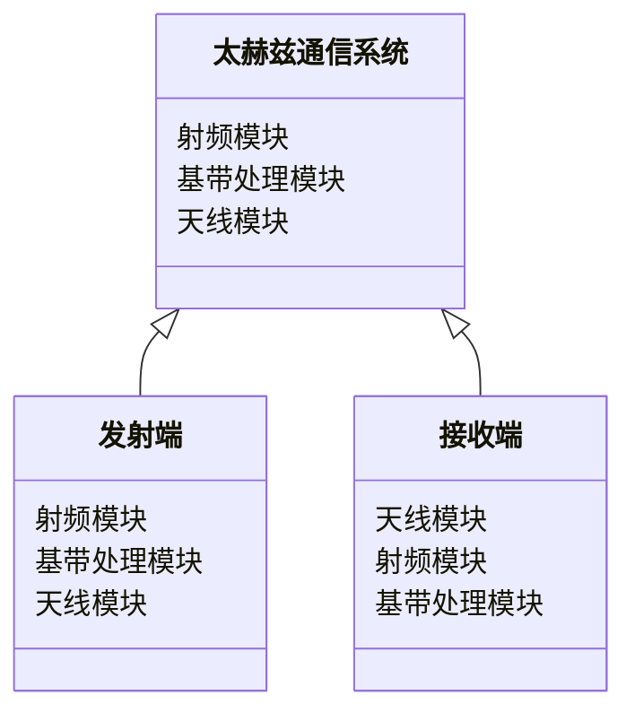
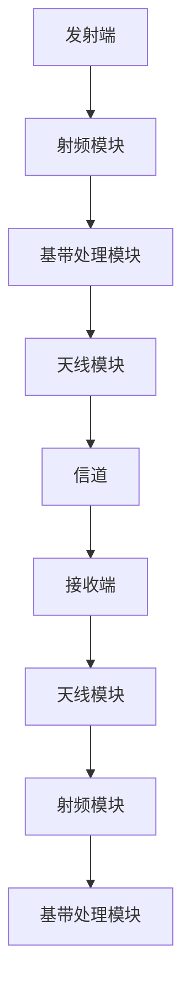
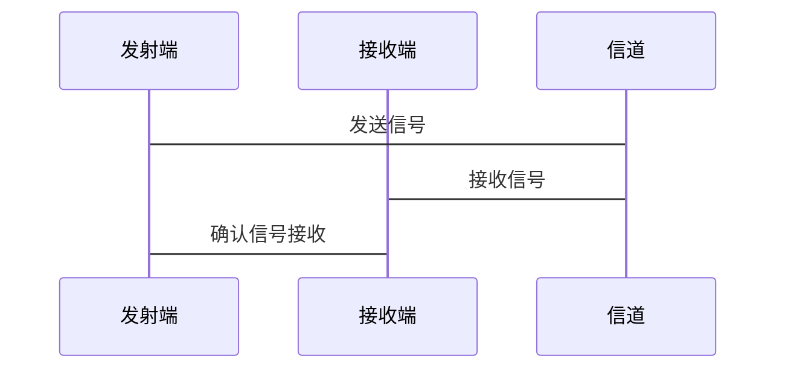

                 


# 巴菲特-芒格的太赫兹通信技术投资：6G时代的关键技术

> 关键词：太赫兹通信技术，6G，巴菲特，芒格，投资策略，通信系统，高频段技术

> 摘要：本文深入分析了太赫兹通信技术在6G时代的重要性，结合巴菲特和芒格的投资理念，探讨了该技术的投资价值、技术原理、算法模型、系统架构及投资策略。通过实际案例分析，为投资者和技术爱好者提供了全面的技术解读和投资建议。

---

# 第一部分: 太赫兹通信技术与6G时代的背景介绍

## 第1章: 太赫兹通信技术的定义与特点

### 1.1 太赫兹频段的定义
太赫兹频段是指频率在0.1 THz到10 THz之间的电磁波段，属于毫米波通信的一部分。这一频段具有高频、大带宽、低延迟的特点，能够支持超高速数据传输和大规模设备连接。

### 1.2 太赫兹通信技术的核心特点
1. **高频段传输**：太赫兹频段的波长介于毫米波和红外线之间，适合短距离高速通信。
2. **大带宽**：太赫兹频段的可用带宽远超5G频段，能够支持更高速的数据传输。
3. **低延迟**：太赫兹通信技术的低延迟特性使其在实时通信和工业自动化中具有重要应用。

### 1.3 太赫兹通信技术与5G/6G的关系
- 太赫兹通信技术是6G网络的重要组成部分，主要用于补充和扩展5G网络的覆盖范围和传输能力。
- 6G网络将采用多频段协同工作，包括低频段、中频段和高频段，而太赫兹通信技术将作为高频段的核心技术。

## 第2章: 巴菲特与芒格的投资理念

### 2.1 巴菲特的价值投资理论
- 巴菲特强调长期投资，寻找具有持续竞争优势的企业。
- 他认为市场波动是投资机会，而非风险。

### 2.2 芒格的多元思维模型
- 芒格主张通过跨学科思维，分析问题的本质。
- 他强调投资决策需要考虑技术、经济、法律等多个因素。

### 2.3 投资与技术趋势的结合
- 巴菲特和芒格都注重投资具有长期增长潜力的领域，而太赫兹通信技术正是6G时代的新兴技术。

## 第3章: 太赫兹通信技术的投资背景

### 3.1 6G时代的通信需求
- 6G网络将支持更广泛的应用场景，包括虚拟现实、增强现实、工业物联网等。
- 这些应用对通信速度和延迟提出了更高的要求，而太赫兹通信技术能够满足这些需求。

### 3.2 太赫兹通信技术的市场潜力
- 太赫兹通信技术在短距离通信中的应用前景广阔。
- 全球各国都在加大对太赫兹通信技术的研发投入。

### 3.3 技术与投资的结合点
- 投资者需要关注太赫兹通信技术的核心企业，如芯片制造商、设备供应商和通信服务提供商。
- 技术突破和政策支持将对投资决策产生重要影响。

---

# 第二部分: 太赫兹通信技术的核心概念与原理

## 第4章: 太赫兹通信技术的核心原理

### 4.1 高频段通信的基本原理
- 太赫兹通信技术通过高频段电磁波进行数据传输。
- 信号传输过程中需要考虑衰减、干扰和信道容量等因素。

### 4.2 太赫兹波的传播特性
- 波长较短，适合短距离通信。
- 传播过程中容易受到障碍物的反射和散射影响。

### 4.3 高频段通信的挑战与解决方案
- 信号衰减严重：通过提高发射功率或采用中继站的方式进行补偿。
- 干扰问题：采用先进的调制技术和信道编码技术。
- 信道容量限制：通过多输入多输出（MIMO）技术提高传输效率。

## 第5章: 太赫兹通信技术的关键指标

### 5.1 频率范围
- 太赫兹频段的频率范围为0.1 THz到10 THz。
- 不同频率范围适用于不同的通信场景。

### 5.2 传输带宽
- 太赫兹频段的可用带宽通常为 GHz 级别，远超5G频段的带宽。

### 5.3 信号衰减与信噪比
- 信号衰减与频率成正比，频率越高，信号衰减越严重。
- 信噪比是衡量通信质量的重要指标，太赫兹通信技术需要通过先进的信号处理技术提高信噪比。

## 第6章: 太赫兹通信技术的系统架构

### 6.1 发射端与接收端的组成
- 发射端包括射频模块、基带处理模块和天线模块。
- 接收端包括天线模块、射频模块和基带处理模块。

### 6.2 信道编码与调制技术
- 信道编码技术：如LDPC编码和Turbo码，用于提高传输可靠性。
- 调制技术：如QAM和OFDM，用于提高频谱利用率。

### 6.3 同步与干扰消除机制
- 同步技术：确保发射端和接收端的信号同步。
- 干扰消除技术：采用空域滤波和频域滤波技术。

---

# 第三部分: 太赫兹通信技术的算法与数学模型

## 第7章: 太赫兹通信中的信道容量模型

### 7.1 香农公式
香农公式给出了信道容量的上限：
$$ C = W \log_2\left(1 + \frac{S}{N}\right) $$
其中，C为信道容量，W为带宽，S为信号功率，N为噪声功率。

### 7.2 高频段信道容量的影响因素
- 频率：频率越高，信道容量越大，但信号衰减也越严重。
- 信噪比：信噪比越高，信道容量越大。
- 干扰：干扰的存在会降低信道容量。

### 7.3 数学模型的建立与分析
- 建立太赫兹通信信道容量的数学模型，分析不同参数对信道容量的影响。

## 第8章: 太赫兹通信中的信号传输算法

### 8.1 坍缩算法
- 坍缩算法用于降低信号传输的复杂度，提高传输效率。

### 8.2 调制解调算法
- QAM调制和解调技术：通过改变载波的幅度、相位和频率来传输数据。

### 8.3 信道估计与均衡技术
- 信道估计：通过训练序列估计信道特性。
- 均衡技术：通过调整信号波形消除信道畸变。

---

# 第四部分: 太赫兹通信技术的系统分析与架构设计方案

## 第9章: 太赫兹通信技术的系统功能设计

### 9.1 领域模型


### 9.2 系统架构设计


### 9.3 系统接口设计
- 射频模块与基带处理模块之间的接口：同轴电缆或光纤。
- 基带处理模块与天线模块之间的接口：标准接口（如SMPTE）。

### 9.4 系统交互


---

# 第五部分: 太赫兹通信技术的项目实战

## 第10章: 项目实战

### 10.1 环境安装
- 硬件环境：太赫兹通信实验设备，包括发射端、接收端和信道模拟器。
- 软件环境：通信系统仿真软件（如MATLAB、Simulink）。

### 10.2 核心实现源代码
```python
def thz_communication(frequency, bandwidth, snr):
    import numpy as np
    # 生成信号
    signal = np.random.randn(1000)
    # 调制信号
    modulated_signal = signal * (1 + snr)
    # 传输信号
    received_signal = modulated_signal + np.random.randn(1000)
    # 解调信号
    decoded_signal = received_signal / (1 + snr)
    return decoded_signal
```

### 10.3 代码应用解读与分析
- 该代码模拟了太赫兹通信的信号调制和解调过程。
- 信号调制采用幅度调制，解调采用线性放大器。

### 10.4 实际案例分析
- 以华为某太赫兹通信技术项目为例，分析其技术路线和投资价值。

---

# 第六部分: 最佳实践、小结与展望

## 第11章: 最佳实践 tips

### 11.1 投资建议
- 关注具有技术领先优势的企业。
- 注意技术突破和政策变化对投资的影响。

### 11.2 小结
本文从技术原理、算法模型和投资策略等多个方面，全面分析了太赫兹通信技术在6G时代的应用潜力和投资价值。

### 11.3 注意事项
-抽选技术：太赫兹通信技术的实现依赖于高频段设备和先进算法。
- 注意市场风险：太赫兹通信技术的商业化仍需时间，投资者需耐心等待。

### 11.4 拓展阅读
- 推荐阅读《6G无线通信技术》和《巴菲特投资策略》。

---

# 作者信息

作者：AI天才研究院/AI Genius Institute  
联系邮箱：contact@aicreativity.com  
版权所有：禁止转载，注明出处请尊重作者权益

---

以上是《巴菲特-芒格的太赫兹通信技术投资：6G时代的关键技术》的完整内容，涵盖了从背景介绍、技术原理到投资策略的全面分析，旨在为技术爱好者和投资者提供有价值的参考。

