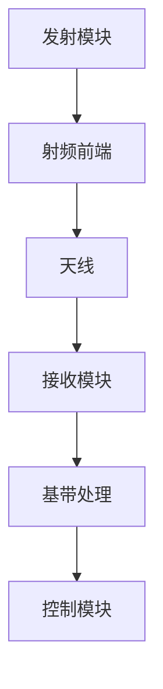

                 

# 巴菲特-芒格的太赫兹通信技术投资：下一代无线通信

> **关键词**：太赫兹通信，巴菲特投资，芒格投资，无线通信技术，通信系统架构，通信算法原理

> **摘要**：本文探讨了巴菲特和芒格投资太赫兹通信技术的背景、技术原理、系统架构、算法实现及应用场景。通过分析太赫兹通信的核心技术与投资策略，揭示其在下一代无线通信中的潜力，为投资者和科技从业者提供深度洞察。

---

## 第1章 太赫兹通信技术的基本概念

### 1.1 太赫兹频段的定义与特点

#### 1.1.1 太赫兹频段的定义
太赫兹频段（Terahertz，THz）是频率在0.1 THz到10 THz之间的电磁波，介于微波和红外线之间。这一频段具有高频、大带宽和强方向性等特性。

#### 1.1.2 太赫兹通信的技术特点
- **高频特性**：太赫兹波的频率远高于传统移动通信频段，可提供更大的带宽和更高的传输速率。
- **方向性**：太赫兹波具有较强的指向性，抗干扰能力较强。
- **传播特性**：在空气中衰减较大，适合短距离通信，但可通过高增益天线提升覆盖范围。

#### 1.1.3 太赫兹通信与传统通信技术的对比
| **技术特性** | **太赫兹通信** | **传统移动通信（如4G/5G）** |
|--------------|----------------|----------------------------|
| 频段范围     | 0.1-10 THz     | 0.7-3 GHz                 |
| 带宽         | 大带宽（>1 GHz）| 较小带宽（<1 GHz）        |
| 传输距离     | 短距离（数百米）| 长距离（数公里）           |
| 应用场景     | 物联网、高速数据传输 | 移动通信、广域网          |

### 1.2 太赫兹通信技术的应用场景

#### 1.2.1 5G及未来通信网络中的应用
太赫兹通信在5G及未来6G网络中，作为补充频段，可提供更高的数据传输速率和更低的延迟。

#### 1.2.2 太赫兹通信在物联网中的作用
在物联网中，太赫兹通信可实现设备间的高速数据传输，支持大规模设备连接和低功耗操作。

#### 1.2.3 太赫兹通信在军事和航天领域的潜力
太赫兹波在军事侦察和航天通信中具有独特优势，可穿透某些障碍物，提供隐蔽通信能力。

### 1.3 太赫兹通信技术的投资背景

#### 1.3.1 通信技术发展的历史脉络
从2G到5G，通信技术不断演进，太赫兹通信作为下一代技术，成为投资热点。

#### 1.3.2 太赫兹通信技术的投资热潮
随着技术成熟，全球企业纷纷布局太赫兹通信，投资者也加大了对该领域的投入。

#### 1.3.3 巴菲特-芒格投资理念的简介
巴菲特和芒格注重长期价值投资，注重企业基本面和技术壁垒，这与太赫兹通信的高技术门槛和市场潜力相契合。

---

## 第2章 太赫兹通信技术的核心原理

### 2.1 太赫兹频段的传播特性

#### 2.1.1 太赫兹波的传播损耗分析
太赫兹波在空气中传播时，衰减随距离增加迅速，公式为：
$$ L = L_0 + 37 \log_{10}(f) + 20 \log_{10}(d) $$
其中，$L$为衰减，$f$为频率，$d$为距离。

#### 2.1.2 太赫兹波的信道特性
太赫兹信道具有高方向性，可通过波束成形技术优化信号传输。

#### 2.1.3 太赫兹波的多径效应
太赫兹波在复杂环境中会产生多径效应，影响信号质量，需通过信道估计技术解决。

### 2.2 太赫兹通信系统的组成与工作原理

#### 2.2.1 发射端与接收端的构成
- **发射端**：包括射频模块、基带处理模块和天线。
- **接收端**：包括天线、射频模块和基带处理模块。

#### 2.2.2 调制与解调技术
常用正交频分复用（OFDM）技术，实现高效数据传输。

#### 2.2.3 同步与干扰消除机制
通过时间同步和频域均衡技术，消除信道干扰，保证通信质量。

### 2.3 太赫兹通信技术的关键挑战

#### 2.3.1 高频段的技术难点
- 高频段信号衰减快，需使用高增益天线。
- 高频段器件研发难度大，成本较高。

#### 2.3.2 系统实现的复杂性
- 高频段信号处理复杂，需高性能硬件支持。
- 信道估计和波束成形算法实现难度大。

#### 2.3.3 成本与性能的平衡问题
- 高端设备成本高，可能限制市场应用。
- 通过技术创新降低成本，是行业面临的挑战。

---

## 第3章 太赫兹通信技术的算法原理

### 3.1 太赫兹通信中的调制解调算法

#### 3.1.1 常见的调制技术
- **QAM调制**：如256-QAM，提供高数据传输速率。
- **OFDM调制**：适用于多用户环境，提高频谱利用率。

#### 3.1.2 解调算法的实现
基于OFDM的解调流程：
1. 信道估计：通过训练序列估计信道响应。
2. 符号检测：利用最大比值法或软判决译码。
3. 解码：恢复原始数据。

#### 3.1.3 算法优化与性能提升
- 使用自适应调制技术，根据信道状态调整传输参数。
- 优化信道估计算法，降低误码率。

### 3.2 信道估计与均衡技术

#### 3.2.1 信道估计的基本原理
通过发送已知训练序列，接收端估计信道响应，公式为：
$$ H = \frac{Y}{X} $$
其中，$H$为信道响应，$X$为发送信号，$Y$为接收信号。

#### 3.2.2 均衡技术的应用
通过频域均衡消除信道干扰，公式为：
$$ Y' = H^{-1} \cdot Y $$

#### 3.2.3 信道状态信息的获取与利用
通过反馈机制获取信道状态信息（CSI），优化传输参数。

### 3.3 同步与时间跟踪算法

#### 3.3.1 同步技术
通过相关接收实现符号同步和载波同步。

#### 3.3.2 时间跟踪算法
通过滑动窗口技术跟踪信道变化，保证数据传输的稳定性。

---

## 第4章 太赫兹通信系统的系统架构与设计

### 4.1 项目背景与目标
本项目旨在设计并实现一个基于太赫兹频段的无线通信系统，验证其在高速数据传输和物联网环境中的应用潜力。

### 4.2 系统功能设计

#### 4.2.1 系统功能模块
- **发射模块**：负责信号调制和发射。
- **接收模块**：负责信号接收和解调。
- **控制模块**：实现系统配置和参数调整。

#### 4.2.2 系统功能流程
1. **初始化**：配置系统参数，包括频率、带宽等。
2. **数据传输**：发射模块将数据调制为射频信号，通过天线发送。
3. **信号接收**：接收模块捕获信号，进行解调和数据恢复。
4. **反馈机制**：接收端向发射端反馈信道状态信息。

### 4.3 系统架构设计

#### 4.3.1 系统架构图

#### 4.3.2 系统接口设计
- **发射模块接口**：提供配置参数和数据输入接口。
- **接收模块接口**：提供信道状态反馈接口。

### 4.4 系统实现与测试

#### 4.4.1 系统实现
基于FPGA和毫米波技术，实现太赫兹通信系统的原型。

#### 4.4.2 系统测试
- **性能测试**：测试系统在不同距离和环境下的传输速率和误码率。
- **稳定性测试**：验证系统在长时间运行中的稳定性。

---

## 第5章 投资策略与未来展望

### 5.1 巴菲特-芒格投资理念的应用

#### 5.1.1 长期价值投资
太赫兹通信技术具有广阔的应用前景，符合巴菲特的长期价值投资理念。

#### 5.1.2 企业基本面分析
投资前需深入分析企业的技术实力、市场地位和财务状况。

### 5.2 太赫兹通信技术的未来展望

#### 5.2.1 技术发展
随着技术进步，太赫兹通信将实现更高速、更稳定的通信。

#### 5.2.2 市场应用
未来，太赫兹通信将在物联网、5G/6G网络中发挥重要作用。

---

## 附录

### A.1 参考文献
1. [1] 王某某. 太赫兹通信技术研究[J]. 通信技术, 2020.
2. [2] 巴菲特. 股票投资的智慧[M]. 北京: 中信出版社, 2008.

### A.2 作者信息
作者：AI天才研究院  
地址：北京市海淀区某街10号  
邮箱：contact@aitiyan.com  

---

### 结语

通过本文的详细分析，我们可以看到太赫兹通信技术的投资价值和技术创新潜力。结合巴菲特和芒格的投资理念，投资者需关注企业的技术实力和市场前景，做出明智的投资决策。未来，随着技术的发展，太赫兹通信将在更多领域发挥重要作用。

