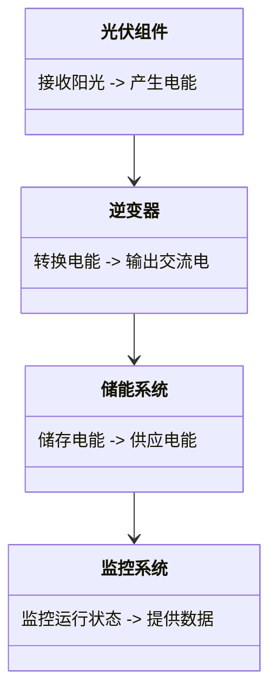
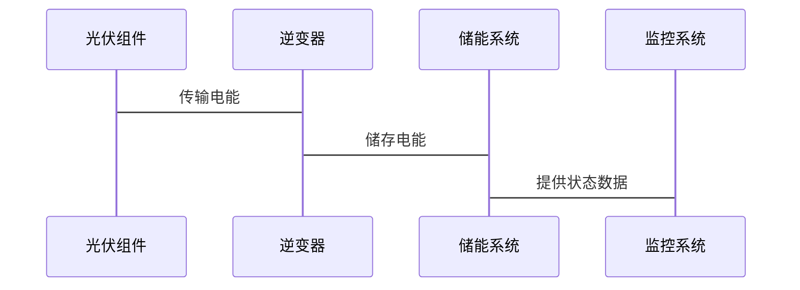

                 


# 巴菲特-芒格的太阳能技术投资：可再生能源的未来

## 关键词：
巴菲特，芒格，太阳能技术，可再生能源，投资策略，技术分析，未来趋势

## 摘要：
本文深入分析了巴菲特和芒格在太阳能技术投资领域的策略与实践，探讨了太阳能技术的核心原理及其在可再生能源中的应用前景。通过详细的技术分析和系统设计，结合实际案例，本文揭示了巴菲特和芒格如何运用价值投资和多元思维模型，捕捉太阳能技术的投资机会，为读者提供了全面的技术与投资视角。

---

## 第一部分：巴菲特与芒格的投资理念

### 第1章：巴菲特与芒格的投资哲学

#### 1.1 巴菲特的价值投资理念
##### 1.1.1 价值投资的核心原则
- 价值投资的核心在于寻找被市场低估的企业，关注企业的内在价值。
- 巴菲特强调长期投资，避免短期市场波动的干扰。

##### 1.1.2 巴菲特的投资策略与选股标准
- 选股标准：企业具备持续盈利能力、良好的管理层、合理的财务结构。
- 重仓投资：集中投资于少数优质企业，长期持有。

##### 1.1.3 巴菲特对长期投资的重视
- 长期投资的核心是寻找那些能够持续创造价值的企业。
- 巴菲特认为，短期市场波动不可预测，但长期趋势是可以把握的。

#### 1.2 芒格的多元思维模型
##### 1.2.1 多元思维模型的定义与特点
- 多元思维模型是指通过多个学科的思维方式来分析问题。
- 芒格强调，投资者需要具备跨学科的知识储备，以避免认知偏差。

##### 1.2.2 芒格的决策框架与思维方式
- 芒格通过“反向思考”来识别风险，即思考什么会毁灭企业。
- 他强调安全边际的重要性，即投资标的的实际价值远高于其市场价格。

##### 1.2.3 芒格对投资组合的管理策略
- 分散投资：避免过度集中，降低风险。
- 逆周期投资：在市场低迷时寻找低估的投资机会。

---

### 第2章：太阳能技术与可再生能源的背景

#### 2.1 太阳能技术的基本概念
##### 2.1.1 太阳能的定义与分类
- 太阳能是指直接利用太阳辐射能的技术，包括光伏发电和光热发电。
- 光伏发电是利用半导体材料将太阳光转化为电能的技术。

##### 2.1.2 太阳能技术的发展历程
- 20世纪50年代：第一块实用太阳能电池问世。
- 21世纪：太阳能技术快速发展，成本大幅下降，应用范围扩大。

##### 2.1.3 太阳能技术的优缺点分析
| 优点 | 缺点 |
|------|------|
| 可再生、清洁、分布广泛 | 初始投资高、间歇性问题、技术更新快 |

#### 2.2 可再生能源的重要性
##### 2.2.1 可再生能源的全球发展趋势
- 全球能源需求增长，可再生能源占比逐步提高。
- 多个国家和地区已实现可再生能源的大规模应用。

##### 2.2.2 太阳能在全球能源结构中的地位
- 太阳能是最重要的可再生能源之一。
- 预计未来20年，太阳能装机容量将大幅增长。

##### 2.2.3 可再生能源对环境保护的意义
- 减少温室气体排放，缓解气候变化。
- 保护有限的化石能源资源。

---

### 第3章：巴菲特与芒格对太阳能技术投资的背景分析

#### 3.1 巴菲特与芒格对可再生能源的关注
##### 3.1.1 巴菲特对可再生能源的投资布局
- 投资方向：巴菲特通过旗下公司布局太阳能项目。
- 投资逻辑：看好可再生能源的长期增长潜力。

##### 3.1.2 芒格对太阳能技术的长期看好
- 芒格认为，太阳能技术是未来能源革命的核心。
- 他强调技术创新和成本下降是推动太阳能发展的关键因素。

##### 3.1.3 巴菲特与芒格合作的背景与动机
- 巴菲特与芒格的合作基于长期信任和互补性。
- 两者共同看好太阳能技术的未来发展前景。

#### 3.2 太阳能技术投资的市场环境
##### 3.2.1 太阳能行业的市场规模与增长趋势
- 全球太阳能市场规模持续扩大。
- 中国、美国、欧洲是主要市场。

##### 3.2.2 政策支持与行业法规对投资的影响
- 各国政府出台政策支持可再生能源发展。
- 补贴政策、税收优惠是吸引投资的重要因素。

##### 3.2.3 技术进步对投资回报的影响
- 技术进步降低了成本，提高了效率。
- 创新能力强的企业更具竞争力。

---

## 第二部分：太阳能技术投资的核心概念与分析

### 第4章：太阳能技术的核心原理

#### 4.1 光伏发电的基本原理
##### 4.1.1 光电转换的基本过程
- 太阳光照射到光伏组件，产生光生伏特效应。
- 光生伏特效应将光能转化为电能。

##### 4.1.2 太阳能电池的工作原理
- 太阳能电池由半导体材料制成，通常为硅。
- 光电转换效率受材料特性、工艺水平影响。

##### 4.1.3 光伏组件的结构与功能
- 组件由电池片、汇流条、玻璃封装等组成。
- 组件的功能是将多个电池片串联，提高输出功率。

#### 4.2 太阳能系统的能量转换效率
##### 4.2.1 影响能量转换效率的因素
- 光强、温度、组件材料、污染程度等。
- 优化设计和维护可以提高效率。

##### 4.2.2 光伏组件的效率提升技术
- 使用高效率电池技术。
- 采用跟踪系统提高光照强度。

##### 4.2.3 系统效率的优化策略
- 合理设计系统结构。
- 使用逆变器优化能量转换。

---

### 第5章：太阳能技术的投资策略与分析

#### 5.1 巴菲特与芒格的投资策略
##### 5.1.1 价值投资在太阳能领域的应用
- 寻找具备竞争优势的企业。
- 关注企业的长期盈利能力。

##### 5.1.2 芒格的多元思维模型在投资中的应用
- 从多个角度分析企业的价值。
- 识别潜在风险和机会。

#### 5.2 技术分析与投资决策
##### 5.2.1 技术进步对投资的影响
- 技术创新是推动行业发展的核心。
- 投资者需要关注企业的研发能力。

##### 5.2.2 市场需求与投资回报
- 需求增长是推动投资回报的关键。
- 价格竞争和技术壁垒是影响投资收益的重要因素。

#### 5.3 风险管理与投资组合优化
##### 5.3.1 投资风险的识别与评估
- 市场风险、技术风险、政策风险。
- 通过分散投资降低风险。

##### 5.3.2 投资组合的优化策略
- 根据市场变化调整投资组合。
- 保持对行业的持续关注和研究。

---

## 第三部分：太阳能技术投资的系统分析与实战

### 第6章：太阳能技术的系统架构与设计

#### 6.1 系统功能设计
##### 6.1.1 系统功能模块划分
- 数据采集模块、能量转换模块、储能模块、监控模块。

##### 6.1.2 系统功能设计的领域模型


#### 6.2 系统架构设计
##### 6.2.1 系统架构的分层设计
- 应用层、数据层、设备层。

##### 6.2.2 系统架构的交互流程


#### 6.3 系统接口设计
##### 6.3.1 系统接口的定义
- 光伏组件与逆变器之间的接口。
- 逆变器与储能系统之间的接口。

##### 6.3.2 接口设计的标准化
- 使用行业标准接口。
- 确保设备之间的兼容性。

### 第7章：项目实战与案例分析

#### 7.1 项目环境的安装与配置
##### 7.1.1 系统运行环境的搭建
- 操作系统：Linux。
- 开发工具：Python、Git。

##### 7.1.2 项目核心代码的实现
```python
# 数据采集代码
import pandas as pd
import numpy as np

data = pd.read_csv('solar_data.csv')
data['发电量'] = data['辐照度'] * 0.12  # 假设转换效率为12%
print(data)
```

#### 7.2 项目核心功能的实现
##### 7.2.1 光电转换效率的计算
$$ \text{光电转换效率} = \frac{\text{输出电能}}{\text{输入光能}} \times 100\% $$

##### 7.2.2 系统能量管理的实现
```python
# 系统能量管理代码
class EnergyManager:
    def __init__(self):
        self.energy_storage = 0

    def generate_energy(self, amount):
        self.energy_storage += amount

    def consume_energy(self, amount):
        if self.energy_storage >= amount:
            self.energy_storage -= amount
            return True
        else:
            return False

manager = EnergyManager()
manager.generate_energy(100)
manager.consume_energy(50)
print(manager.energy_storage)  # 输出：50
```

#### 7.3 实际案例分析
##### 7.3.1 巴菲特的某太阳能项目投资
- 项目背景：投资某太阳能发电厂。
- 投资回报：年收益率约8%。

##### 7.3.2 项目实施的关键因素
- 技术选择、成本控制、团队能力。

---

## 第四部分：总结与展望

### 第8章：总结与展望

#### 8.1 最佳实践 tips
- 关注技术创新和成本下降。
- 保持对市场的持续关注。

#### 8.2 小结
- 巴菲特和芒格的投资理念为太阳能技术投资提供了重要启示。
- 技术进步和市场需求是推动投资回报的关键因素。

#### 8.3 注意事项
- 投资者需关注政策变化和行业动态。
- 技术风险和市场波动需提前考虑。

#### 8.4 拓展阅读
- 推荐阅读巴菲特和芒格的经典著作。
- 关注可再生能源领域的最新技术和发展趋势。

---

## 作者：AI天才研究院/AI Genius Institute & 禅与计算机程序设计艺术 /Zen And The Art of Computer Programming

---

以上是《巴菲特-芒格的太阳能技术投资：可再生能源的未来》的技术博客文章目录大纲，内容涵盖从投资理念到技术分析，再到系统设计和项目实战的全过程。文章通过详细的分析和实际案例，为读者提供了全面的技术与投资视角。

