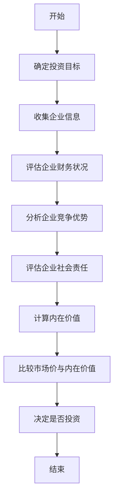
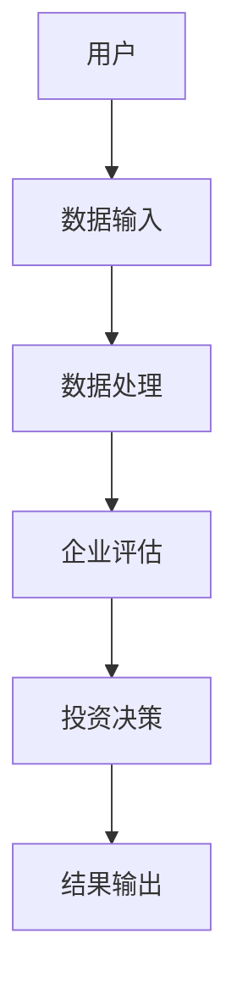

                 


# 巴菲特-芒格的循环经济投资：可持续发展的新方向

---

## 关键词

- 巴菲特
- 芒格
- 循环经济
- 投资策略
- 可持续发展

---

## 摘要

本文深入探讨了巴菲特和芒格的投资哲学，以及他们如何将循环经济理念融入投资策略中，以实现可持续发展。文章从背景介绍、核心概念、算法原理、系统设计、项目实战和总结等多方面展开，结合实际案例和数学模型，详细分析了循环经济投资的可行性与优势，为投资者提供了新的视角和策略。

---

## 第一部分: 巴菲特与芒格的投资哲学

### 第1章: 巴菲特与芒格的投资理念

#### 1.1 巴菲特与芒格的背景介绍

##### 1.1.1 巴菲特的投资哲学

沃伦·巴菲特（Warren Buffett）是全球最著名的职业投资人之一，他的投资哲学以“价值投资”为核心。他强调长期投资、安全边际和企业内在价值。巴菲特认为，投资的本质是寻找那些具有持续竞争优势、良好治理结构和优秀管理团队的企业，并以合理的价格买入并长期持有。

##### 1.1.2 芒格的多元思维模型

查理·芒格（Charlie Munger）是巴菲特的长期合作伙伴，他的“多元思维模型”强调跨学科思考。芒格认为，投资者需要从多个角度（如心理学、经济学、物理学等）理解问题，避免单一维度的决策错误。这种思维方式帮助巴菲特和芒格在投资决策中避免了诸多陷阱。

##### 1.1.3 两人合作的投资理念

巴菲特和芒格的合作基于共同的价值观：追求长期价值、注重企业质量、关注股东利益。他们的投资策略不仅关注企业的财务表现，还关注企业的社会责任和可持续发展能力。

---

#### 1.2 巴菲特与芒格的投资策略

##### 1.2.1 价值投资的核心理念

价值投资的核心是寻找市场价低于内在价值的股票。巴菲特和芒格通过分析企业的财务报表、行业地位和管理团队，寻找那些具有长期竞争优势的企业。

##### 1.2.2 股价与内在价值的评估方法

巴菲特和芒格使用 discounted cash flow（DCF）模型评估企业的内在价值。他们认为，企业的价值取决于其未来现金流的现值，而不是短期市场波动。

##### 1.2.3 长期投资与耐心资本

巴菲特和芒格强调长期投资，避免短期市场波动的干扰。他们认为，耐心资本能够在市场低迷时抓住优质企业的投资机会。

---

#### 1.3 巴菲特与芒格对可持续发展的贡献

##### 1.3.1 可持续发展的定义与重要性

可持续发展是指在满足当前需求的同时，不损害后代满足其需求的能力。在投资领域，可持续发展关注企业的环境、社会和治理（ESG）表现。

##### 1.3.2 巴菲特与芒格在可持续投资中的角色

巴菲特和芒格的投资策略逐渐转向可持续发展领域，他们关注那些在环保、社会责任和公司治理方面表现优异的企业。

##### 1.3.3 循环经济与可持续发展的关联

循环经济强调资源的高效利用和循环利用，与可持续发展的核心理念高度契合。巴菲特和芒格通过投资循环经济相关企业，推动了可持续发展目标的实现。

---

### 第2章: 循环经济的基本概念

#### 2.1 循环经济的定义与特征

##### 2.1.1 循环经济的定义

循环经济是一种以资源高效利用和循环利用为核心的发展模式，旨在减少资源消耗和环境污染。

##### 2.1.2 循环经济的核心特征

- 资源高效利用
- 废物减量化
- 再利用和再生资源

##### 2.1.3 循环经济与传统经济的区别

传统经济强调资源的线性利用，而循环经济强调资源的闭环利用，注重资源的循环和再生。

---

#### 2.2 循环经济的三种模式

##### 2.2.1 物资循环模式

物资循环模式强调物质资源的循环利用，例如废品回收和再生利用。

##### 2.2.2 能源循环模式

能源循环模式强调能源的高效利用和可再生能源的开发。

##### 2.2.3 信息循环模式

信息循环模式强调信息资源的共享和高效利用。

---

#### 2.3 循环经济与可持续发展的关系

##### 2.3.1 循环经济对可持续发展的促进作用

循环经济通过减少资源消耗和环境污染，促进了可持续发展目标的实现。

##### 2.3.2 循环经济在环境保护中的意义

循环经济有助于减少废物产生和污染排放，保护生态环境。

##### 2.3.3 循环经济的社会经济效益

循环经济通过资源高效利用，创造了更多的社会价值和经济效益。

---

### 第3章: 巴菲特与芒格的循环经济投资策略

#### 3.1 巴菲特与芒格的循环经济投资理念

##### 3.1.1 巴菲特与芒格如何将循环经济理念融入投资策略

巴菲特和芒格通过投资那些在循环经济领域表现优异的企业，推动了可持续发展目标的实现。

##### 3.1.2 循环经济投资的核心要素

- 企业具有循环经济模式
- 企业具备长期竞争优势
- 企业关注环境和社会责任

##### 3.1.3 循环经济投资的风险与机遇

循环经济投资面临政策风险和市场波动，但也具有较高的长期收益潜力。

---

#### 3.2 巴菲特与芒格的循环经济投资实践

##### 3.2.1 巴菲特与芒格投资的典型循环经济企业

例如，巴菲特投资的可再生能源企业，如NextEra Energy，体现了他对循环经济和可持续发展的关注。

##### 3.2.2 巴菲特与芒格如何评估循环经济企业的投资价值

他们使用DCF模型和多元思维模型，综合评估企业的财务表现、行业地位和社会责任。

##### 3.2.3 循环经济投资的长期回报

循环经济投资不仅具有较高的财务回报，还具有重要的社会价值。

---

## 第二部分: 循环经济投资的算法原理

### 第4章: 循环经济投资的算法原理

#### 4.1 价值投资模型的数学公式

$$ V = \sum_{t=1}^{n} \frac{CF_t}{(r + g)^t} $$

其中，$V$ 是内在价值，$CF_t$ 是第 $t$ 年的现金流，$r$ 是贴现率，$g$ 是现金流增长率。

#### 4.2 价值投资模型的mermaid流程图



---

## 第三部分: 循环经济投资的系统设计

### 第5章: 循环经济投资的系统架构

#### 5.1 循环经济投资分析系统的功能设计

- 数据收集与处理
- 企业评估与分析
- 投资决策支持

#### 5.2 循环经济投资分析系统的mermaid架构图



---

## 第四部分: 循环经济投资的项目实战

### 第6章: 项目实战与案例分析

#### 6.1 环保企业投资案例分析

以某环保企业为例，分析其财务状况、行业地位和社会责任，评估其投资价值。

#### 6.2 投资决策的代码实现

```python
# 计算企业内在价值
def calculate_intrinsic_value(cash_flows, discount_rate, growth_rate):
    return sum([cf / (discount_rate + growth_rate)**t for t, cf in enumerate(cash_flows)])

# 评估企业社会责任
def assess_social_responsibility(company):
    # 社会责任评分标准
    pass
```

---

## 第五部分: 总结与展望

### 第7章: 总结与展望

#### 7.1 本文总结

本文详细探讨了巴菲特和芒格的循环经济投资策略，分析了其在可持续发展中的重要作用。

#### 7.2 未来展望

随着可持续发展的重要性日益凸显，循环经济投资将成为未来投资的重要方向。

---

## 作者

作者：AI天才研究院/AI Genius Institute & 禅与计算机程序设计艺术 /Zen And The Art of Computer Programming

