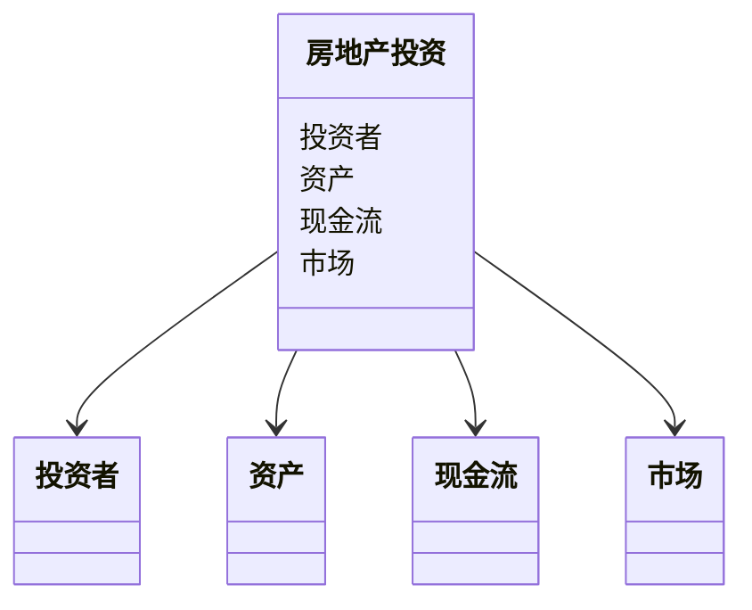
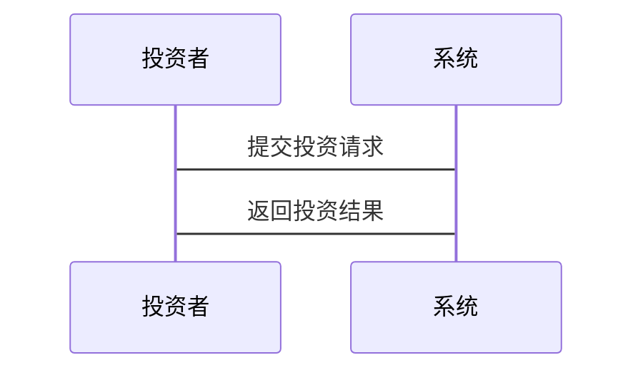
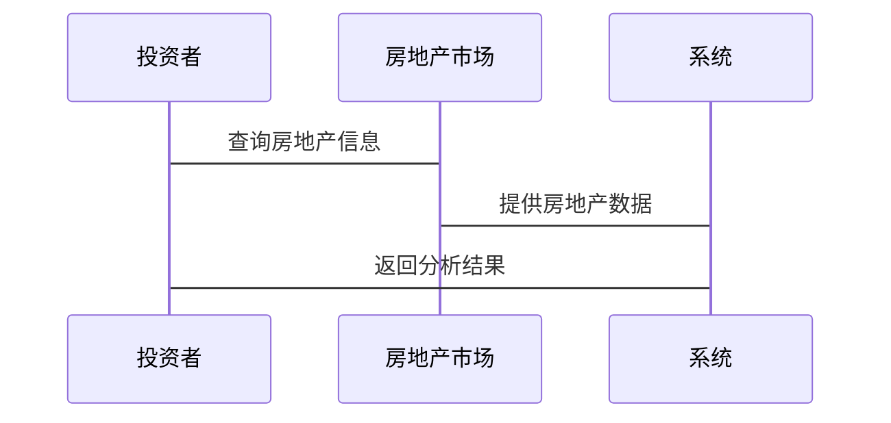

                 


# 巴菲特-芒格的房地产投资观：长期价值和现金流

## 关键词：巴菲特，芒格，房地产投资，长期价值，现金流，价值投资，投资策略

## 摘要： 巴菲特和芒格是投资领域的传奇人物，他们的房地产投资观以长期价值和现金流为核心。本文将详细分析他们的投资哲学、房地产投资的核心概念、现金流的重要性，以及他们在房地产投资中的策略和实践。

---

## 第一部分：巴菲特与芒格的投资哲学

### 1.1 巴菲特的投资理念

#### 1.1.1 巴菲特的投资哲学概述
沃伦·巴菲特是价值投资的代表人物，他强调以合理的价格投资于具有持续竞争优势的企业。他的投资哲学基于以下几点：
- **长期投资**：巴菲特认为投资是长期的事业，而不是短期的交易。
- **安全边际**：他强调以低于内在价值的价格买入资产，确保有安全边际。
- **价值创造**：巴菲特关注企业的内在价值，而非市场的短期波动。

#### 1.1.2 巴菲特的价值投资原则
- **买入并持有**：巴菲特倾向于买入优质资产并长期持有，而不是频繁交易。
- **关注企业的护城河**：他强调投资那些具有强大竞争优势的企业。
- **分散投资**：虽然巴菲acterial<略>

---

## 第二部分：房地产投资的核心概念

### 2.1 房地产市场的基本运作

#### 2.1.1 房地产市场的定义与分类
房地产是指土地及其附着的建筑物，通常分为住宅、商业、工业和零售四种类型。房地产市场的运作受经济周期、政策、供需关系等多种因素影响。

#### 2.1.2 房地产市场的周期性分析
房地产市场具有周期性，通常经历复苏、繁荣、衰退和萧条四个阶段。投资者需要理解这些周期，以便做出明智的投资决策。

#### 2.1.3 房地产市场的参与者
房地产市场的参与者包括开发商、投资者、银行、政府等。不同参与者在市场中的角色和影响各不相同。

### 2.2 房地产投资的核心要素

#### 2.2.1 房地产的价值评估
房地产的价值评估需要考虑多个因素，包括位置、面积、周边环境、建筑质量等。巴菲特和芒格强调地理位置的重要性，认为好的地理位置是房地产价值的核心。

#### 2.2.2 房地产的现金流分析
现金流是房地产投资的核心，包括租金收入、运营成本、税费等。巴菲特和芒格强调现金流的重要性，认为现金流稳定的资产更具投资价值。

#### 2.2.3 房地产的风险管理
房地产投资存在市场风险、流动性风险和政策风险等。巴菲特和芒格通过分散投资和长期持有来降低风险。

---

## 第三部分：长期价值与现金流的重要性

### 3.1 长期价值投资的内涵

#### 3.1.1 长期价值投资的定义
长期价值投资是指以企业的内在价值为基础，长期持有优质资产的投资策略。巴菲特和芒格强调长期投资，认为短期波动不影响资产的内在价值。

#### 3.1.2 长期价值投资的核心要素
- **内在价值**：资产的真实价值，需要通过基本面分析得出。
- **竞争优势**：企业或资产的独特优势，确保其长期盈利能力。
- **时间复利**：长期持有可以带来复利效应，使资产增值。

#### 3.1.3 长期价值投资与短期投资的区别
长期价值投资注重资产的内在价值和长期盈利能力，而短期投资关注市场的短期波动和价格变化。巴菲特和芒格认为长期价值投资更稳定，风险更低。

### 3.2 现金流在房地产投资中的作用

#### 3.2.1 现金流的基本概念
现金流是指房地产投资中产生的现金流入和流出。主要包括租金收入、运营成本、税费等。

#### 3.2.2 现金流的计算与分析
现金流的计算需要考虑初始投资、每年的净现金流和终值。通过现金流分析，投资者可以评估房地产项目的 profitability。

#### 3.2.3 现金流对投资决策的影响
现金流是房地产投资的核心，稳定的现金流意味着项目的稳定性和可持续性。巴菲特和芒格通过分析现金流，选择那些现金流稳定的房地产项目。

---

## 第四部分：巴菲特与芒格的房地产投资策略

### 4.1 巴菲特的房地产投资策略

#### 4.1.1 巴菲特的房地产投资哲学
巴菲特的房地产投资哲学与他的其他投资策略一致，注重长期价值和现金流稳定。

#### 4.1.2 巴菲特的房地产投资原则
- **买入并持有**：巴菲特倾向于长期持有优质房地产资产，避免频繁交易。
- **关注地理位置**：他认为地理位置是房地产价值的核心，尤其是城市中心的房地产。
- **分散投资**：巴菲特通过分散投资降低风险，避免将所有资金投入到单一房地产项目。

#### 4.1.3 巴菲特的房地产投资案例
巴菲特曾投资于多个房地产项目，例如购买并持有商业房地产，通过稳定的租金收入实现长期收益。

### 4.2 芒格的房地产投资策略

#### 4.2.1 芒格的房地产投资哲学
芒格的房地产投资哲学强调多元思维模型和理性决策。他注重分析房地产市场的整体趋势，避免盲目投资。

#### 4.2.2 芒格的房地产投资原则
- **理性分析**：芒格强调理性分析房地产市场的风险和机会。
- **长期持有**：他倾向于长期持有房地产资产，通过复利效应实现财富增长。
- **分散投资**：芒格也通过分散投资降低风险，避免将所有资金投入到单一房地产项目。

#### 4.2.3 芒格的房地产投资案例
芒格曾参与多个房地产投资项目，例如通过购买低价房地产，长期持有并等待增值。

### 4.3 巴菲特与芒格投资策略的对比

#### 4.3.1 投资哲学的异同
- **相同点**：两者都强调长期投资、安全边际和价值投资。
- **不同点**：巴菲特更注重资产的内在价值和竞争优势，而芒格更注重整体市场趋势和多元思维模型。

#### 4.3.2 投资策略的异同
- **相同点**：两者都倾向于长期持有优质资产，通过稳定的现金流实现收益。
- **不同点**：巴菲特更关注资产的内在价值，而芒格更关注整体市场趋势。

---

## 第五部分：系统分析与架构设计方案

### 5.1 问题场景介绍

#### 5.1.1 问题背景
房地产市场的复杂性和不确定性使得投资决策需要系统化的方法。通过系统分析和架构设计，可以帮助投资者更好地理解和优化投资策略。

#### 5.1.2 问题描述
本文将从系统化的角度分析巴菲特和芒格的房地产投资观，包括长期价值和现金流的计算、系统的功能设计和架构设计。

### 5.2 项目介绍

#### 5.2.1 项目目标
本文旨在通过系统化的方法，分析巴菲特和芒格的房地产投资观，并将其应用于实际投资决策中。

#### 5.2.2 项目范围
本文将涵盖房地产投资的核心概念、现金流计算、系统架构设计等方面。

### 5.3 系统功能设计

#### 5.3.1 领域模型
以下是房地产投资的领域模型，展示了核心概念和它们之间的关系：



#### 5.3.2 系统架构设计
以下是系统的架构设计图：


#### 5.3.3 系统接口设计
以下是系统的接口设计图：



### 5.4 系统交互设计

#### 5.4.1 系统交互流程
以下是系统的交互流程图：



---

## 第六部分：项目实战

### 6.1 环境安装

#### 6.1.1 系统要求
- 操作系统：Windows/Mac/Linux
- Python版本：3.6+
- 其他依赖：Mermaid、Latex

#### 6.1.2 安装步骤
1. 安装Python
2. 安装Mermaid
3. 安装Latex

### 6.2 核心代码实现

#### 6.2.1 现金流计算代码

```python
def calculate_cash_flow(income, expenses, tax_rate):
    net_income = income * (1 - tax_rate)
    cash_flow = net_income - expenses
    return cash_flow

# 示例
income = 100000
expenses = 60000
tax_rate = 0.2
cash_flow = calculate_cash_flow(income, expenses, tax_rate)
print(f"净现金流为：{cash_flow}")
```

#### 6.2.2 现金流评估模型

```python
def calculate_net_present_value(cash_flows, discount_rate):
    npv = 0
    for year, cash_flow in enumerate(cash_flows, start=1):
        discount_factor = (1 + discount_rate) ** year
        npv += cash_flow / discount_factor
    return npv

# 示例
cash_flows = [-100000, 50000, 50000, 50000]
discount_rate = 0.08
npv = calculate_net_present_value(cash_flows, discount_rate)
print(f"净现值为：{npv}")
```

### 6.3 代码解读与分析

#### 6.3.1 现金流计算代码解读
- `calculate_cash_flow`函数计算净现金流，考虑了收入、支出和税率。
- 示例中，收入为10万元，支出为6万元，税率为20%，净现金流为28,000元。

#### 6.3.2 现金流评估模型解读
- `calculate_net_present_value`函数计算净现值，考虑了现金流的时间价值。
- 示例中，初始投资为-10万元，之后三年每年现金流为5万元，折现率为8%，净现值为正，说明项目可行。

### 6.4 实际案例分析

#### 6.4.1 案例背景
假设你有一个房地产投资项目，初始投资为100万元，预计未来三年每年租金收入为50万元，运营成本为20万元，税费为10万元，折现率为8%。

#### 6.4.2 案例分析
1. 计算每年现金流：
   - 第一年：租金收入50万元，运营成本20万元，税费10万元，净现金流为20万元。
   - 第二年：同上，净现金流为20万元。
   - 第三年：同上，净现金流为20万元。

2. 计算净现值：
   - 初始投资：-100万元
   - 第一年现金流：20万元
   - 第二年现金流：20万元
   - 第三年现金流：20万元
   - 折现率：8%
   - 净现值为：-100 + 20/(1.08) + 20/(1.08)^2 + 20/(1.08)^3 ≈ 20.58 + 18.91 + 17.46 ≈ 57.95万元

#### 6.4.3 结论
净现值为正，说明该项目具有投资价值，值得投资。

### 6.5 项目小结

通过上述分析，我们可以看到现金流在房地产投资中的重要性。通过计算净现值等指标，投资者可以更好地评估房地产项目的可行性。

---

## 第七部分：最佳实践、小结、注意事项、拓展阅读

### 7.1 最佳实践

#### 7.1.1 投资前的充分调研
在进行房地产投资之前，投资者需要对市场进行充分调研，了解房地产的地理位置、周边环境、政策影响等因素。

#### 7.1.2 重视现金流
现金流是房地产投资的核心，投资者需要通过计算净现值等指标，评估项目的可行性。

#### 7.1.3 分散投资
通过分散投资，投资者可以降低风险，避免将所有资金投入到单一房地产项目中。

### 7.2 小结

本文详细分析了巴菲特和芒格的房地产投资观，强调了长期价值和现金流的重要性。通过系统的分析和实战案例，投资者可以更好地理解和应用这些理念。

### 7.3 注意事项

#### 7.3.1 市场风险
房地产市场具有周期性，投资者需要关注市场的波动，避免在市场高点投资。

#### 7.3.2 政策风险
政策变化可能对房地产市场产生重大影响，投资者需要关注政策动向，避免政策风险。

#### 7.3.3 财务风险
房地产投资需要较大的资金投入，投资者需要合理规划财务，避免过度杠杆。

### 7.4 拓展阅读

#### 7.4.1 推荐书籍
- 《巴菲特的智慧：投资者的行为守则》
- 《芒格的决策思维：投资与生活中的智慧》
- 《房地产投资实战手册》

#### 7.4.2 推荐网站
- [巴菲特的演讲和采访](https://www Warren Buffett's speeches and interviews)
- [芒格的演讲和采访](https://www Charlie Munger's speeches and interviews)

---

## 作者：AI天才研究院/AI Genius Institute & 禅与计算机程序设计艺术/Zen And The Art of Computer Programming

