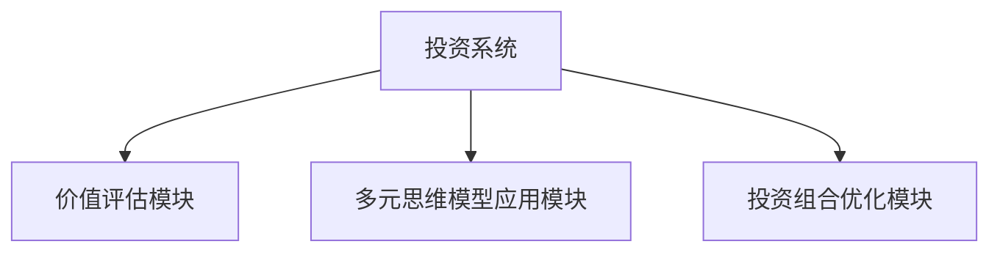
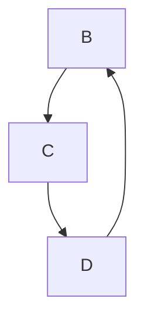
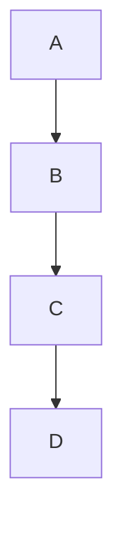

                 


# 巴菲特-芒格的数字经济投资策略：传统智慧在新经济中的应用

**关键词：** 巴菲特、芒格、价值投资、多元思维模型、数字经济、投资策略、贴现现金流模型

**摘要：**  
本文探讨了巴菲特和芒格的传统投资策略在数字经济中的应用。通过分析价值投资的核心原理、芒格的多元思维模型以及数字经济的特点，提出了一种结合传统投资智慧与数字时代特征的投资策略。文章详细讲解了如何通过数学模型和算法分析来评估数字公司的内在价值，并通过实际案例展示了这些策略的应用。

---

# 第一部分: 巴菲特-芒格投资策略的背景与基础

## 第1章: 巴菲特与芒格的投资理念概述

### 1.1 巴菲特与芒格的背景介绍

#### 1.1.1 巴菲特的投资哲学

沃伦·巴菲特（Warren Buffett）是价值投资的代表人物，他的投资哲学基于以下原则：
- **长期投资**：买入并持有优质资产。
- **安全边际**：以低于内在价值的价格买入资产。
- **企业基本面**：关注企业的盈利能力、财务状况和竞争优势。

#### 1.1.2 芒格的多元思维模型

查理·芒格（Charlie Munger）提出了“多元思维模型”，强调投资者需要跨学科思考，将各个领域的知识结合起来，以更全面地分析问题。

#### 1.1.3 两人合作的投资策略

巴菲特和芒格的合作基于价值投资和多元思维模型的结合，注重长期投资、安全边际和企业基本面分析。

---

### 1.2 数字经济的定义与现状

#### 1.2.1 数字经济的定义

数字经济是指以数字技术为核心驱动力的经济形态，涵盖大数据、人工智能、区块链、云计算等领域。

#### 1.2.2 数字经济的核心特征

- **数据驱动**：数据是核心资源。
- **技术驱动**：依赖于数字技术的创新。
- **高增长与高风险**：数字公司通常增长快，但也面临技术变革和市场竞争的风险。

#### 1.2.3 数字经济与传统经济的区别

- **增长模式**：数字经济注重技术创新和网络效应，传统经济注重规模经济。
- **资产轻量化**：数字经济公司通常轻资产，依赖知识资本。
- **风险与不确定性**：数字经济公司的未来更难预测。

---

### 1.3 巴菲特-芒格投资策略在数字经济中的应用前景

#### 1.3.1 数字经济中的投资机会

- **技术创新**：人工智能、区块链等领域具有巨大潜力。
- **网络效应**：社交网络和平台经济具有强大的网络效应。
- **数据价值**：数据是数字经济的核心资源。

#### 1.3.2 传统投资策略的数字化转型

将价值投资的理念应用于数字公司，需要考虑其独特的商业模式和财务特征。

#### 1.3.3 数字经济中的风险与挑战

- **技术风险**：技术变革可能导致公司快速过时。
- **市场竞争**：数字公司往往面临激烈竞争。
- **监管风险**：数字经济受政策影响较大。

---

## 第2章: 巴菲特-芒格投资策略的核心概念与联系

### 2.1 价值投资的核心原理

#### 2.1.1 价值投资的定义

价值投资是一种投资策略，旨在以低于企业内在价值的价格买入优质资产。

#### 2.1.2 价值投资的核心要素

- **内在价值**：企业未来现金流的现值。
- **安全边际**：买入价格低于内在价值。
- **企业基本面**：关注企业的盈利能力、财务状况和竞争优势。

#### 2.1.3 价值投资的数学模型

贴现现金流模型（DCF）是评估企业内在价值的核心工具。其公式为：

$$
\text{内在价值} = \sum_{t=1}^{n} \frac{\text{现金流}}{(1 + r)^t} + \frac{\text{终值}}{(1 + r)^n}
$$

其中，$r$ 是贴现率，$n$ 是估计的年数。

---

### 2.2 芒格多元思维模型的原理

#### 2.2.1 多元思维模型的定义

多元思维模型是一种跨学科的思维方式，强调将不同领域的知识结合起来，以更全面地分析问题。

#### 2.2.2 多元思维模型的核心特征

- **跨学科**：整合物理学、心理学、经济学等领域的知识。
- **系统性**：从整体角度分析问题。
- **动态性**：关注变化和趋势。

#### 2.2.3 多元思维模型与价值投资的联系

多元思维模型为价值投资提供了更全面的分析框架，帮助投资者更好地理解企业的内在价值和竞争优势。

---

### 2.3 数字经济中的投资策略

#### 2.3.1 数字经济中的价值评估

评估数字公司时，需要考虑其数据资源、技术优势、用户基础和网络效应。

#### 2.3.2 数字经济中的多元思维模型应用

通过多元思维模型分析数字公司的竞争优势、商业模式和市场前景。

#### 2.3.3 数字经济中的投资组合优化

结合价值投资和多元思维模型，优化投资组合，降低风险并提高收益。

---

## 第3章: 巴菲特-芒格投资策略的算法原理

### 3.1 价值投资的数学模型

#### 3.1.1 企业内在价值的计算公式

贴现现金流模型（DCF）是评估企业内在价值的核心工具。公式为：

$$
\text{内在价值} = \sum_{t=1}^{n} \frac{\text{现金流}}{(1 + r)^t} + \frac{\text{终值}}{(1 + r)^n}
$$

其中，$r$ 是贴现率，$n$ 是估计的年数。

#### 3.1.2 贴现现金流模型（DCF）的实现

通过DCF模型，投资者可以估算企业的内在价值，并与市场价格进行比较，以确定是否买入。

#### 3.1.3 市盈率与市净率的比较

市盈率（P/E）和市净率（P/B）是常用的估值指标。市盈率适用于高增长企业，市净率适用于稳定增长企业。

---

### 3.2 芒格多元思维模型的算法实现

#### 3.2.1 多元思维模型的数学表达

多元思维模型通过整合多个领域的知识，构建一个全面的分析框架。例如，结合物理学的杠杆原理和经济学的成本-收益分析，评估企业的竞争优势。

#### 3.2.2 多元思维模型的优化算法

通过不断更新和优化多元思维模型，投资者可以更准确地评估企业的内在价值和竞争优势。

#### 3.2.3 多元思维模型的案例分析

以亚马逊为例，分析其在数据资源、技术优势和用户基础方面的竞争优势。

---

### 3.3 数字经济中的投资策略优化

#### 3.3.1 数字经济中的投资组合优化算法

通过动态调整投资组合，投资者可以降低风险并提高收益。例如，根据市场变化动态调整资产配置。

#### 3.3.2 数字经济中的风险评估模型

通过分析技术风险、市场竞争和监管风险，构建风险评估模型，帮助投资者做出更明智的投资决策。

#### 3.3.3 数字经济中的投资策略对比分析

比较传统投资策略和数字时代投资策略的差异，分析其在数字经济中的适用性和效果。

---

## 第4章: 巴菲特-芒格投资策略的系统分析与架构设计

### 4.1 投资系统的需求分析

#### 4.1.1 系统目标

构建一个基于巴菲特和芒格投资策略的数字投资系统，帮助投资者在数字经济中做出明智的投资决策。

#### 4.1.2 系统范围

系统涵盖企业价值评估、多元思维模型应用和投资组合优化三大模块。

#### 4.1.3 系统约束

考虑到技术风险、市场竞争和监管风险等因素，系统需要具备灵活性和适应性。

---

### 4.2 投资系统的功能设计

#### 4.2.1 价值评估模块

功能：评估企业的内在价值，确定是否买入。

#### 4.2.2 多元思维模型应用模块

功能：分析企业的竞争优势、商业模式和市场前景。

#### 4.2.3 投资组合优化模块

功能：优化投资组合，降低风险并提高收益。

---

### 4.3 投资系统的架构设计

#### 4.3.1 系统架构图



#### 4.3.2 模块交互图



#### 4.3.3 数据流图



---

## 第5章: 巴菲特-芒格投资策略的项目

### 5.1 项目介绍

#### 5.1.1 系统名称

基于巴菲特-芒格投资策略的数字投资系统。

#### 5.1.2 系统目标

帮助投资者在数字经济中应用巴菲特和芒格的投资策略，做出明智的投资决策。

---

### 5.2 系统功能设计

#### 5.2.1 价值评估模块

功能：评估企业的内在价值，确定是否买入。

#### 5.2.2 多元思维模型应用模块

功能：分析企业的竞争优势、商业模式和市场前景。

#### 5.2.3 投资组合优化模块

功能：优化投资组合，降低风险并提高收益。

---

### 5.3 系统架构设计

#### 5.3.1 系统架构图


#### 5.3.2 模块交互图


#### 5.3.3 数据流图


---

## 第6章: 项目实战

### 6.1 环境安装

安装必要的软件和工具，例如Python、数据分析工具和投资分析软件。

### 6.2 系统核心实现源代码

以下是基于DCF模型的Python代码示例：

```python
def calculate_intrinsic_value(cash_flows, discount_rate, terminal_value):
    intrinsic_value = 0
    for t in range(len(cash_flows)):
        intrinsic_value += cash_flows[t] / (1 + discount_rate) ** t
    intrinsic_value += terminal_value / (1 + discount_rate) ** len(cash_flows)
    return intrinsic_value

# 示例数据
cash_flows = [100, 150, 200]
discount_rate = 0.1
terminal_value = 500

intrinsic_value = calculate_intrinsic_value(cash_flows, discount_rate, terminal_value)
print("内在价值为：", intrinsic_value)
```

### 6.3 代码应用解读与分析

解释代码的功能和实现逻辑，展示如何利用DCF模型评估企业的内在价值。

### 6.4 实际案例分析和详细讲解剖析

以亚马逊为例，分析其在数据资源、技术优势和用户基础方面的竞争优势，评估其内在价值。

### 6.5 项目小结

总结项目的实现过程和主要成果，提出改进建议。

---

## 第7章: 最佳实践、小结、注意事项和拓展阅读

### 7.1 最佳实践

- **持续学习**：保持对数字经济的了解和对投资策略的更新。
- **风险管理**：重视技术风险、市场竞争和监管风险。
- **分散投资**：避免过度集中，降低投资风险。

### 7.2 小结

本文探讨了巴菲特和芒格的投资策略在数字经济中的应用，提出了结合传统投资智慧与数字时代特征的投资策略。

### 7.3 注意事项

- **数据质量**：确保数据的准确性和完整性。
- **模型局限性**：DCF模型假设未来现金流可预测，实际中可能难以准确估算。
- **市场变化**：数字技术发展迅速，需及时调整投资策略。

### 7.4 拓展阅读

- 巴菲特和芒格的著作和演讲。
- 数字经济相关的书籍和报告。
- 投资策略的最新研究成果。

---

# 作者：AI天才研究院/AI Genius Institute & 禅与计算机程序设计艺术 /Zen And The Art of Computer Programming

---

这篇文章通过结合巴菲特和芒格的投资策略，探讨了其在数字经济中的应用。通过系统的分析和实际案例的展示，帮助投资者在数字时代做出更明智的投资决策。

