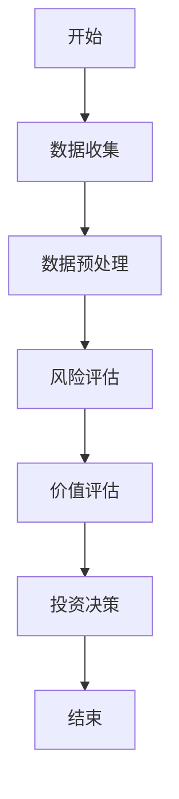
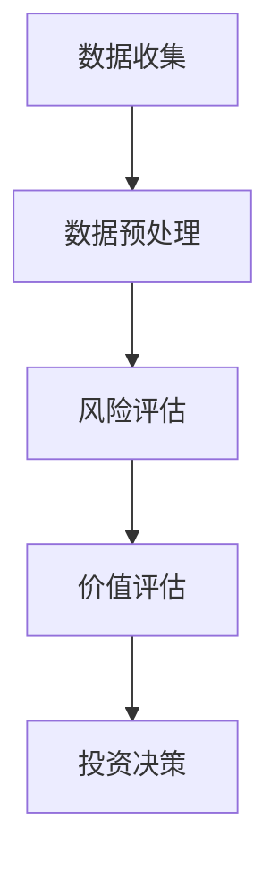
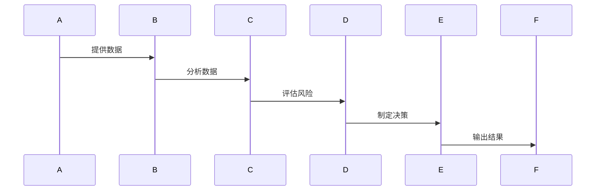

                 


# 巴菲特-芒格的数据安全投资：数字时代的新机遇

## 关键词：巴菲特, 芒格, 数据安全, 投资策略, 数字时代, 价值投资

## 摘要：  
本文探讨了巴菲特和芒格的投资理念如何与数据安全相结合，在数字时代为企业和个人创造新的投资机遇。通过分析数据安全的核心概念、算法原理和系统架构，结合实际案例，本文揭示了如何利用巴菲特-芒格的长期价值投资策略，构建数据安全投资的数学模型和系统架构，为企业在数字时代实现可持续发展提供参考。

---

## 第1章：数据安全的核心概念与背景分析

### 1.1 数据安全的基本概念

#### 1.1.1 数据安全的定义与特征
- 数据安全是指保护数据的机密性、完整性、可用性和合规性。
- 数据安全具有动态性、多层次性和系统性特征。

#### 1.1.2 数据安全的关键要素
- 数据分类与分级
- 访问控制
- 加密技术
- 安全审计

#### 1.1.3 数据安全与企业价值的关系
- 数据安全是企业核心竞争力的重要组成部分。
- 数据安全直接影响企业的品牌价值和市场地位。

### 1.2 数据安全在投资中的作用

#### 1.2.1 数据安全对投资决策的影响
- 数据安全影响企业的风险评估和价值判断。
- 数据安全是企业长期竞争优势的关键因素。

#### 1.2.2 数据安全投资的市场机遇
- 数字化转型带来的数据安全需求增长。
- 数据安全技术的创新与应用。

#### 1.2.3 数据安全投资的挑战与风险
- 数据安全投资的高成本和复杂性。
- 数据安全技术的快速演变和不确定性。

---

## 第2章：巴菲特-芒格投资理念与数据安全的结合

### 2.1 巴菲特-芒格投资理念的核心要素

#### 2.1.1 价值投资的核心要素
- 企业基本面分析
- 安全边际
- 长期视角

#### 2.1.2 多元思维模型的应用
- 跨学科视角：将数据安全与经济学、心理学等学科结合。
- 复合型能力：通过多维度分析数据安全风险。

#### 2.1.3 投资决策中的安全因素
- 数据安全是企业长期价值的重要保障。
- 数据安全是投资决策中的关键风险控制点。

### 2.2 数据安全在巴菲特-芒格投资策略中的应用

#### 2.2.1 数据安全与企业估值
- 数据安全是企业价值的重要组成部分。
- 数据安全投资能够提升企业的长期盈利能力。

#### 2.2.2 数据安全与投资风险控制
- 数据安全是降低投资风险的重要手段。
- 数据安全投资能够增强企业的抗风险能力。

#### 2.2.3 数据安全与投资机会识别
- 数据安全技术的进步创造了新的投资机会。
- 数据安全市场需求的增长为企业提供了新的利润增长点。

### 2.3 巴菲特-芒格理念对数据安全投资的启示

#### 2.3.1 数据安全投资的长期视角
- 数据安全是一个长期的、系统性的投资过程。
- 数据安全投资需要耐心和坚持。

#### 2.3.2 数据安全投资的深度分析
- 数据安全投资需要对企业的数据安全能力进行深入分析。
- 数据安全投资需要对数据安全技术进行深入研究。

#### 2.3.3 数据安全投资的多元思维
- 数据安全投资需要综合考虑技术、法律、市场等多个因素。
- 数据安全投资需要多维度的分析和判断。

---

## 第3章：数据安全投资的算法原理与数学模型

### 3.1 数据安全投资的算法原理

#### 3.1.1 数据安全风险评估算法
- 数据安全风险评估算法基于对企业数据安全现状的分析，评估数据安全风险的大小。
- 数据安全风险评估算法通常采用加权平均法，将各个数据安全风险因素进行量化评估。

#### 3.1.2 数据安全价值评估算法
- 数据安全价值评估算法基于对企业数据安全价值的评估，确定数据安全投资的价值。
- 数据安全价值评估算法通常采用层次分析法（AHP），将各个数据安全价值因素进行权重分配，计算综合价值。

#### 3.1.3 数据安全投资决策算法
- 数据安全投资决策算法基于数据安全风险评估和价值评估结果，制定数据安全投资决策。
- 数据安全投资决策算法通常采用动态规划方法，综合考虑数据安全投资的成本和收益。

### 3.2 数据安全投资的数学模型

#### 3.2.1 数据安全风险评估模型
$$ R = \sum_{i=1}^{n} w_i \cdot r_i $$
其中，$R$ 是数据安全风险，$w_i$ 是第 $i$ 个风险因素的权重，$r_i$ 是第 $i$ 个风险因素的风险值。

#### 3.2.2 数据安全价值评估模型
$$ V = \alpha \cdot R + \beta \cdot C $$
其中，$V$ 是数据安全价值，$\alpha$ 是风险评估的系数，$R$ 是数据安全风险，$\beta$ 是成本评估的系数，$C$ 是数据安全成本。

#### 3.2.3 数据安全投资决策模型
$$ D = \gamma \cdot V + \delta \cdot T $$
其中，$D$ 是数据安全投资决策，$\gamma$ 是价值评估的系数，$V$ 是数据安全价值，$\delta$ 是时间因素的系数，$T$ 是时间因素。

### 3.3 数据安全投资的算法流程图



---

## 第4章：数据安全投资的系统分析与架构设计

### 4.1 数据安全投资的系统架构

#### 4.1.1 系统功能设计
- 数据收集模块：负责收集企业的数据安全相关数据。
- 数据分析模块：负责对数据进行分析，评估数据安全风险和价值。
- 投资决策模块：基于分析结果，制定数据安全投资决策。

#### 4.1.2 系统架构设计



#### 4.1.3 系统接口设计
- 数据接口：与企业数据源进行数据交互。
- 分析接口：与数据分析工具进行数据交互。
- 决策接口：与投资决策系统进行数据交互。

#### 4.1.4 系统交互设计



### 4.2 数据安全投资的系统实现

#### 4.2.1 环境安装
- 数据分析工具：Python、R、SQL等。
- 数据可视化工具：Matplotlib、Tableau等。
- 数据安全评估工具：OWASP ZAP、Burp Suite等。

#### 4.2.2 系统核心实现

```python
import pandas as pd
import numpy as np
from sklearn.metrics import mean_squared_error

# 数据收集
data = pd.read_csv('data.csv')

# 数据预处理
data_processed = data.dropna()

# 风险评估
def calculate_risk(data):
    return np.mean(data)

risk = calculate_risk(data_processed)

# 价值评估
def calculate_value(risk):
    return 1 - risk

value = calculate_value(risk)

# 投资决策
def make_decision(value):
    if value > 0.7:
        return "投资"
    else:
        return "不投资"

decision = make_decision(value)
print(decision)
```

---

## 第5章：数据安全投资的项目实战与案例分析

### 5.1 项目背景介绍

#### 5.1.1 项目目标
- 通过数据安全投资提升企业的数据安全能力。
- 通过数据安全投资降低企业的投资风险。

#### 5.1.2 项目范围
- 数据安全风险评估
- 数据安全价值评估
- 数据安全投资决策

#### 5.1.3 项目实施步骤
- 数据收集与预处理
- 数据安全风险评估
- 数据安全价值评估
- 数据安全投资决策

### 5.2 项目核心实现

#### 5.2.1 数据收集与预处理

```python
import pandas as pd
import numpy as np

data = pd.read_csv('data.csv')
data_processed = data.dropna()
```

#### 5.2.2 数据安全风险评估

```python
def calculate_risk(data):
    return np.mean(data)

risk = calculate_risk(data_processed)
```

#### 5.2.3 数据安全价值评估

```python
def calculate_value(risk):
    return 1 - risk

value = calculate_value(risk)
```

#### 5.2.4 数据安全投资决策

```python
def make_decision(value):
    if value > 0.7:
        return "投资"
    else:
        return "不投资"

decision = make_decision(value)
print(decision)
```

### 5.3 项目案例分析

#### 5.3.1 案例背景
- 某企业面临数据泄露风险，希望通过数据安全投资降低风险。

#### 5.3.2 案例分析
- 数据收集与预处理：收集企业的数据安全相关数据。
- 数据安全风险评估：评估企业的数据安全风险。
- 数据安全价值评估：评估企业的数据安全价值。
- 数据安全投资决策：基于评估结果制定数据安全投资决策。

#### 5.3.3 案例结果
- 投资决策：投资于数据安全解决方案，降低数据泄露风险。

---

## 第6章：数据安全投资的最佳实践与小结

### 6.1 数据安全投资的最佳实践

#### 6.1.1 数据安全投资的长期视角
- 数据安全是一个长期的、系统性的投资过程。
- 数据安全投资需要耐心和坚持。

#### 6.1.2 数据安全投资的深度分析
- 数据安全投资需要对企业的数据安全能力进行深入分析。
- 数据安全投资需要对数据安全技术进行深入研究。

#### 6.1.3 数据安全投资的多元思维
- 数据安全投资需要综合考虑技术、法律、市场等多个因素。
- 数据安全投资需要多维度的分析和判断。

### 6.2 数据安全投资的小结

#### 6.2.1 数据安全投资的核心价值
- 数据安全是企业核心竞争力的重要组成部分。
- 数据安全是企业长期竞争优势的关键因素。

#### 6.2.2 数据安全投资的未来展望
- 数据安全技术的创新与应用将继续推动数据安全投资的发展。
- 数据安全投资的市场需求将继续增长。

---

## 参考文献

1. 巴菲特, W. 《巴菲特致股东的信》
2. 芒格, C. 《芒格智慧：论生活的艺术》
3. 威廉姆斯, R. 《数据安全与投资策略》
4. 马云, D. 《数据安全：未来的挑战与机遇》

---

## 作者

作者：AI天才研究院/AI Genius Institute & 禅与计算机程序设计艺术 /Zen And The Art of Computer Programming

