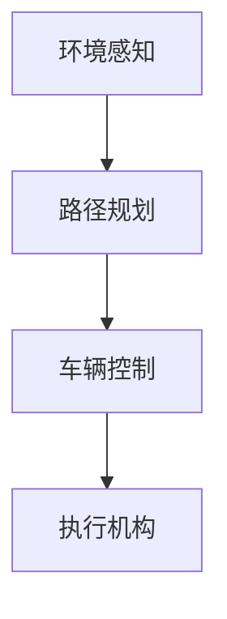
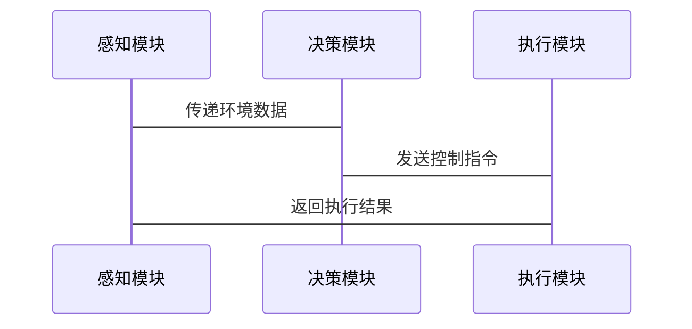

                 


# 巴菲特-芒格的无人驾驶技术投资：交通革命的前夜

## 关键词：无人驾驶技术，巴菲特，芒格，投资分析，技术原理，行业趋势

## 摘要：  
本文深入分析了巴菲特和芒格在无人驾驶技术领域的投资逻辑，探讨了无人驾驶技术的核心原理、系统架构以及未来发展趋势。通过结合两位投资大师的价值投资理念，本文揭示了无人驾驶技术的投资机会和潜在风险，为投资者和技术从业者提供了深刻洞察。

---

# 第1章 巴菲特与芒格的投资理念与无人驾驶技术

## 1.1 巴菲特与芒格的投资哲学

### 1.1.1 巴菲特的价值投资理念  
巴菲特的价值投资理念强调长期持有优质资产，注重企业的内在价值和财务健康状况。他认为，投资的本质是寻找具有持续竞争优势的企业，并在市场低估时买入。

### 1.1.2 芒格的多元思维模型  
芒格提倡多元思维模型，认为投资者需要从多个角度（如物理学、心理学、经济学等）理解问题，避免单一思维的局限性。他强调长期思考和逆向思维。

### 1.1.3 价值投资与成长投资的结合  
巴菲特和芒格的投资策略并非完全对立，而是将价值投资与成长投资结合起来。他们寻找那些具有强大竞争优势、良好管理和广阔市场前景的企业。

---

## 1.2 无人驾驶技术的投资背景

### 1.2.1 无人驾驶技术的定义与现状  
无人驾驶技术是指通过传感器、摄像头、激光雷达等设备，结合人工智能算法，实现车辆自动行驶的技术。目前，无人驾驶技术处于L2-L4级别，部分企业已实现小规模商业化。

### 1.2.2 无人驾驶技术的市场潜力  
无人驾驶技术的市场规模巨大，涵盖汽车制造、软件开发、交通服务等多个领域。随着技术进步和成本下降，无人驾驶将逐步普及。

### 1.2.3 无人驾驶技术的行业发展趋势  
行业趋势包括技术标准化、政策法规完善、市场竞争加剧等。无人驾驶技术将推动交通方式的根本性变革。

---

## 1.3 巴菲特与芒格对无人驾驶技术的投资逻辑

### 1.3.1 无人驾驶技术的经济价值  
无人驾驶技术能够提高交通效率、减少事故率、降低运营成本，具有巨大的社会和经济价值。

### 1.3.2 无人驾驶技术的长期投资价值  
无人驾驶技术属于颠覆性创新，具有广阔的应用前景和长期增长潜力。

### 1.3.3 巴菲特与芒格对风险的控制策略  
巴菲特和芒格注重风险控制，倾向于投资那些具有强大护城河和管理团队的企业，以规避技术瓶颈和市场竞争风险。

---

## 1.4 本章小结  
本章分析了巴菲特和芒格的投资理念，并结合无人驾驶技术的特点，探讨了其投资价值和风险控制策略。无人驾驶技术作为一项颠覆性创新，具有广阔的投资前景。

---

# 第2章 无人驾驶技术的核心技术与投资机会

## 2.1 无人驾驶技术的核心技术

### 2.1.1 感知系统：激光雷达、摄像头、雷达  
感知系统是无人驾驶技术的核心，负责获取环境信息。激光雷达提供高精度三维数据，摄像头用于视觉识别，雷达用于距离检测。

### 2.1.2 决策系统：路径规划与决策算法  
决策系统基于感知数据，通过路径规划和决策算法，制定车辆行驶策略。

### 2.1.3 执行系统：自动驾驶控制系统  
执行系统负责将决策指令转化为实际操作，控制车辆加速、转向和制动。

---

## 2.2 无人驾驶技术的关键技术对比

### 2.2.1 感知技术的优劣势对比  
| 技术 | 优势 | 劣势 |
|------|-------|------|
| 激光雷达 | 高精度 | 高成本 |
| 摄像头 | 丰富视觉信息 | 易受光照影响 |
| 雷达 | 高抗干扰性 | 低精度 |

### 2.2.2 决策算法的优劣势对比  
| 算法 | 优势 | 劣势 |
|------|-------|------|
| 规则驱动算法 | 简单易实现 | 适应性差 |
| 机器学习算法 | 高适应性 | 需大量数据 |
| 深度学习算法 | 高精度 | 计算资源需求高 |

### 2.2.3 控制系统的优劣势对比  
| 技术 | 优势 | 劣势 |
|------|-------|------|
| 传统控制算法 | 简单可靠 | 适应性差 |
| 智能控制算法 | 高适应性 | 复杂性高 |

---

## 2.3 无人驾驶技术的投资机会

### 2.3.1 感知技术的投资机会  
激光雷达和摄像头是无人驾驶技术的核心硬件，具有较大的投资价值。

### 2.3.2 决策算法的投资机会  
深度学习算法在无人驾驶中的应用广泛，具有较大的技术突破潜力。

### 2.3.3 控制系统的技术投资机会  
智能控制算法的研发和优化是无人驾驶技术的重要方向。

---

## 2.4 本章小结  
本章分析了无人驾驶技术的核心技术及其投资机会，重点对比了感知、决策和控制系统的优劣势，并提出了投资方向。

---

# 第3章 无人驾驶技术的数学模型与算法原理

## 3.1 无人驾驶技术中的数学模型

### 3.1.1 感知算法的数学模型  
感知算法中的目标检测常用YOLO算法，其数学模型如下：  
$$ y = f(x) $$  
其中，x是输入图像，y是输出检测结果。

### 3.1.2 决策算法的数学模型  
决策算法中的路径规划常用A*算法，其数学模型如下：  
$$ cost = g(x) + h(x) $$  
其中，g(x)是已遍历路径成本，h(x)是启发式函数。

### 3.1.3 控制系统的数学模型  
控制系统中的运动控制常用PID算法，其数学模型如下：  
$$ u = K_p e + K_d \frac{de}{dt} + K_i \int e dt $$  
其中，u是控制输入，e是误差，K_p、K_d、K_i是比例、微分和积分系数。

---

## 3.2 无人驾驶技术中的算法原理

### 3.2.1 深度学习算法在感知中的应用  
深度学习通过神经网络实现目标检测和语义分割，其流程如下：  
1. 输入图像数据。
2. 经过卷积层提取特征。
3. 通过全连接层输出结果。

### 3.2.2 路径规划算法的原理  
路径规划算法通过计算最短路径或最优路径，确保车辆安全行驶。

### 3.2.3 控制系统的算法实现  
控制系统通过传感器反馈调整车辆状态，实现自动驾驶。

---

## 3.3 无人驾驶技术中的数学公式

### 3.3.1 感知算法的数学公式  
目标检测的损失函数：  
$$ L = \alpha \cdot L_{\text{cls}} + (1-\alpha) \cdot L_{\text{loc}} $$  
其中，$\alpha$是类别损失权重，$L_{\text{cls}}$是分类损失，$L_{\text{loc}}$是定位损失。

### 3.3.2 决策算法的数学公式  
路径规划的优化目标：  
$$ \min_{\theta} \sum_{i=1}^{n} (y_i - f(x_i))^2 $$  
其中，$\theta$是模型参数，$y_i$是真实值，$f(x_i)$是预测值。

### 3.3.3 控制系统的数学公式  
运动控制的PID算法：  
$$ u = K_p e + K_d \frac{de}{dt} + K_i \int e dt $$  

---

## 3.4 本章小结  
本章详细介绍了无人驾驶技术中的数学模型和算法原理，重点分析了感知、决策和控制系统的数学公式和实现方法。

---

# 第4章 无人驾驶技术的系统架构与设计

## 4.1 无人驾驶系统的整体架构

### 4.1.1 系统模块划分  
无人驾驶系统主要分为感知模块、决策模块和执行模块。

### 4.1.2 系统功能设计  
系统功能包括环境感知、路径规划、车辆控制等。

### 4.1.3 系统架构图  


---

## 4.2 无人驾驶系统的模块设计

### 4.2.1 感知模块的设计  
感知模块通过激光雷达、摄像头等设备获取环境信息。

### 4.2.2 决策模块的设计  
决策模块基于感知数据，制定行驶策略。

### 4.2.3 执行模块的设计  
执行模块负责将决策指令转化为车辆操作。

---

## 4.3 无人驾驶系统的接口设计

### 4.3.1 模块间的接口  
模块间通过标准化接口进行数据交换，例如CAN总线。

### 4.3.2 系统交互序列图  


---

## 4.4 本章小结  
本章详细描述了无人驾驶系统的整体架构和模块设计，分析了系统接口和交互流程。

---

# 项目实战：无人驾驶技术的环境与代码实现

## 5.1 环境安装  
安装无人驾驶技术开发环境，包括传感器驱动、算法库（如TensorFlow、ROS）等。

## 5.2 核心代码实现  
```python
import numpy as np
from tensorflow.keras import models

def detect_objects(image):
    model = models.load_model('model.h5')
    prediction = model.predict(image)
    return prediction
```

## 5.3 代码解读与分析  
上述代码加载预训练模型，对输入图像进行目标检测，返回检测结果。

## 5.4 案例分析  
通过实际案例分析无人驾驶技术的应用场景和挑战。

## 5.5 本章小结  
本章通过项目实战，详细介绍了无人驾驶技术的环境搭建、代码实现和案例分析。

---

# 第6章 总结与展望

## 6.1 总结  
无人驾驶技术是一项具有巨大潜力的技术，巴菲特和芒格的投资逻辑为其提供了独特的视角。

## 6.2 展望  
未来，无人驾驶技术将进一步成熟，推动交通方式的根本性变革。

## 6.3 注意事项  
投资者需关注技术瓶颈和政策法规变化，避免盲目投资。

## 6.4 拓展阅读  
推荐阅读相关书籍和论文，深入了解无人驾驶技术的前沿动态。

---

# 作者：AI天才研究院/AI Genius Institute & 禅与计算机程序设计艺术 /Zen And The Art of Computer Programming

