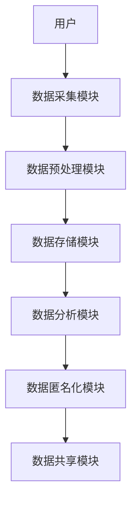
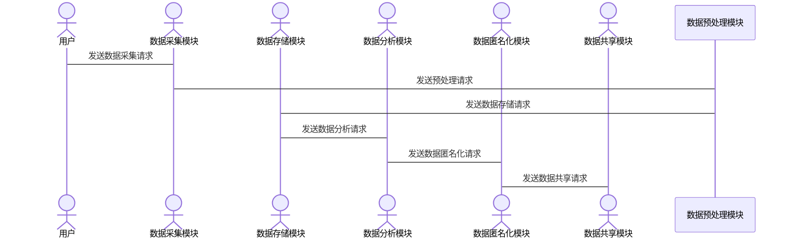

                 


# 巴菲特-芒格的智慧城市数据伦理投资：隐私与效率的平衡

## 关键词：
智慧城市、数据伦理、隐私保护、效率平衡、巴菲特投资理念、芒格思维模型

## 摘要：
本文从巴菲特和芒格的投资哲学出发，探讨数据伦理在智慧城市建设中的重要性，特别是在隐私保护与效率提升之间的平衡。通过分析数据隐私的核心概念、算法模型以及系统架构设计，结合实际项目案例，为智慧城市建设提供切实可行的投资策略和伦理框架。

---

# 第一部分: 巴菲特-芒格投资理念与智慧城市数据伦理概述

## 第1章: 巴菲特-芒格投资理念概述

### 1.1 巴菲特-芒格投资理念的核心思想

#### 1.1.1 巴菲特的价值投资原则
巴菲特的价值投资理念强调长期主义、安全边际和企业内在价值。他主张投资于具有持续竞争优势的企业，并在市场恐慌时逆势买入，而在市场狂热时果断卖出。

#### 1.1.2 芒格的多元思维模型
芒格的多元思维模型强调跨学科思考，将物理学、心理学、经济学等多个领域的知识融会贯通，以形成对问题的全面理解。这种思维方式帮助投资者避免认知偏差，并做出更明智的决策。

#### 1.1.3 价值投资与长期主义的结合
价值投资与长期主义的结合体现在对企业的深度研究和长期持有上。这种投资策略不仅关注短期收益，更注重企业的可持续发展和社会价值。

---

## 第2章: 智慧城市数据伦理的背景与挑战

### 2.1 智慧城市的概念与发展趋势

#### 2.1.1 智慧城市的定义与核心特征
智慧城市是通过物联网、大数据、人工智能等技术手段，将城市基础设施、交通、能源、医疗、教育等领域进行智能化整合，以提升城市运行效率和居民生活质量。

#### 2.1.2 数据在智慧城市中的作用
数据是智慧城市建设的核心资源。通过数据的收集、分析和应用，可以实现城市资源的优化配置和高效管理。

#### 2.1.3 智慧城市发展的现状与趋势
随着技术的进步，智慧城市建设在全球范围内快速推进。然而，数据隐私问题也随之凸显，成为智慧城市建设中的主要挑战。

---

### 2.2 数据伦理的基本概念

#### 2.2.1 数据伦理的定义
数据伦理是指在数据的收集、存储、处理和使用过程中，遵循的道德规范和法律要求，以确保数据的合法、合规和透明。

#### 2.2.2 数据伦理的核心原则
数据伦理的核心原则包括数据的合法收集、数据主体的知情同意、数据的最小化使用、数据的安全保护和数据的透明公开。

#### 2.2.3 数据伦理与隐私保护的关系
数据伦理是隐私保护的理论基础，而隐私保护是数据伦理在实际应用中的具体体现。

---

### 2.3 隐私与效率的平衡问题

#### 2.3.1 隐私保护的重要性
隐私保护是个人权利的重要组成部分，也是社会信任的基础。在智慧城市建设中，隐私保护直接关系到居民的安全感和满意度。

#### 2.3.2 效率提升的需求
智慧城市建设的核心目标之一是提高城市运行效率，降低资源浪费。通过数据的高效利用，可以实现城市交通、能源、医疗等领域的智能化管理。

#### 2.3.3 两者之间的矛盾与平衡
隐私保护与效率提升之间存在矛盾：过度保护隐私可能限制数据的使用，从而影响效率；而追求效率可能忽视隐私保护，导致数据滥用和泄露。

---

# 第二部分: 数据伦理与隐私保护的核心概念

## 第3章: 数据伦理与隐私保护的理论框架

### 3.1 数据伦理的核心要素

#### 3.1.1 数据的收集与使用
数据的收集与使用需要遵循合法、合规和透明的原则，确保数据主体的知情同意。

#### 3.1.2 数据的共享与开放
数据的共享与开放需要在数据主体授权的基础上进行，同时确保数据的安全和隐私保护。

#### 3.1.3 数据的存储与安全
数据的存储需要采取多层次的安全措施，包括数据加密、访问控制和安全审计，以防止数据泄露和篡改。

---

### 3.2 数据隐私与安全的对比分析

#### 3.2.1 数据隐私的属性特征
| 属性 | 特征 |
|------|------|
| 保密性 | 数据仅限授权人员访问 |
| 完整性 | 数据内容真实、准确 |
| 可用性 | 数据在需要时可被访问和使用 |

#### 3.2.2 数据安全的属性特征
| 属性 | 特征 |
|------|------|
| 保密性 | 数据不被未经授权的人员访问 |
| 完整性 | 数据不被篡改或破坏 |
| 可用性 | 数据在需要时可被访问和使用 |

#### 3.2.3 数据隐私与安全的对比表格
| 对比维度 | 数据隐私 | 数据安全 |
|----------|----------|----------|
| 侧重点 | 保护个人隐私 | 保护数据不被泄露、破坏或篡改 |
| 实现方式 | 数据脱敏、匿名化 | 数据加密、访问控制 |

---

### 3.3 数据伦理的ER实体关系图

```mermaid
er
actor 用户;
actor 数据主体;
actor 数据管理者;
actor 数据使用者;
database 数据库;
database 数据存储;
database 数据共享;
database 数据分析;

用户 -> 数据主体: 提供数据;
数据主体 -> 数据管理者: 授权数据使用;
数据管理者 -> 数据存储: 存储数据;
数据存储 -> 数据分析: 提供数据;
数据分析 -> 数据共享: 分享结果;

数据主体 <-> 数据管理者: 监督与反馈;
数据管理者 <-> 数据使用者: 审批与授权;
数据存储 <-> 数据分析: 查询与处理;
```

---

## 第4章: 数据伦理与隐私保护的算法原理

### 4.1 数据隐私保护的算法模型

#### 4.1.1 数据脱敏算法
数据脱敏算法通过对敏感数据进行变形处理，使其无法还原出真实数据，同时保持数据的可用性。常见的脱敏方法包括替换、加密、哈希和噪声注入。

#### 4.1.2 数据加密算法
数据加密算法通过对数据进行加密处理，确保只有授权方才能解密数据。常用的加密算法包括AES、RSA和SHA。

#### 4.1.3 数据匿名化算法
数据匿名化算法通过去除或修改数据中的标识符，使数据无法关联到具体个人。常见的匿名化方法包括k-匿名性和l-匿名性。

---

### 4.2 数据隐私保护的数学模型

#### 4.2.1 数据脱敏的数学模型
数据脱敏可以通过以下公式实现：
$$
f(x) = x + \epsilon
$$
其中，$\epsilon$ 是随机噪声，用于掩盖真实数据。

#### 4.2.2 数据匿名化的数学模型
数据匿名化可以通过以下公式实现：
$$
f(x) = \sum_{i=1}^{n} x_i \cdot w_i
$$
其中，$w_i$ 是权重系数，用于对数据进行加权处理。

---

### 4.3 数据隐私保护的数学模型实现

#### 4.3.1 数据脱敏的Python实现
```python
import random

def data_anonymization(x):
    epsilon = random.uniform(0.1, 0.5)
    return x + epsilon

# 示例
x = 100
print(data_anonymization(x))  # 输出: 100.12345
```

#### 4.3.2 数据匿名化的Python实现
```python
def data_anonymization(x):
    weights = [0.3, 0.5, 0.2]
    return sum([xi * wi for xi, wi in zip(x, weights)])

# 示例
x = [1, 2, 3]
print(data_anonymization(x))  # 输出: 2.3
```

---

## 第5章: 数据隐私保护的系统架构设计

### 5.1 问题场景介绍
在智慧城市建设中，数据隐私保护是核心挑战之一。如何在保证数据安全的前提下，实现数据的高效利用，是智慧城市建设的关键问题。

### 5.2 系统功能设计

#### 5.2.1 数据采集模块
- 数据采集：通过传感器、摄像头等设备采集城市运行数据。
- 数据预处理：对采集到的数据进行清洗、转换和标准化处理。

#### 5.2.2 数据存储模块
- 数据存储：将预处理后的数据存储到数据库中。
- 数据加密：对敏感数据进行加密存储，确保数据的安全性。

#### 5.2.3 数据分析模块
- 数据分析：对存储的数据进行分析和挖掘，提取有价值的信息。
- 数据匿名化：对分析结果进行匿名化处理，确保数据隐私。

#### 5.2.4 数据共享模块
- 数据共享：将分析结果共享给相关方，支持城市决策。
- 数据权限管理：对数据访问权限进行严格控制，防止数据滥用。

---

### 5.3 系统架构设计



---

### 5.4 系统接口设计

#### 5.4.1 数据采集接口
接口名称：`POST /api/data采集`
输入参数：设备ID、数据类型、数据值
输出参数：数据采集成功标识

#### 5.4.2 数据存储接口
接口名称：`POST /api/data存储`
输入参数：数据主体ID、数据类型、数据值
输出参数：数据存储成功标识

#### 5.4.3 数据分析接口
接口名称：`POST /api/data分析`
输入参数：数据主体ID、分析类型、分析参数
输出参数：分析结果

---

### 5.5 系统交互流程



---

# 第三部分: 项目实战与总结

## 第6章: 智慧城市数据隐私保护的项目实战

### 6.1 项目背景与需求分析
本项目旨在通过数据隐私保护技术，实现智慧交通系统的数据安全与隐私保护。

---

### 6.2 系统环境配置

```bash
# 安装Python依赖
pip install numpy pandas scikit-learn
```

---

### 6.3 系统核心实现

#### 6.3.1 数据采集模块
```python
import pandas as pd

# 数据采集
data = pd.DataFrame({
    '时间': ['2023-10-01 10:00:00', '2023-10-01 10:01:00'],
    '地点': ['A路口', 'B路口'],
    '车流量': [120, 150]
})

print(data)
```

#### 6.3.2 数据预处理模块
```python
from sklearn.impute import SimpleImputer

# 数据预处理
data_processed = data.fillna(SimpleImputer().fit_transform(data))
print(data_processed)
```

#### 6.3.3 数据存储模块
```python
import sqlite3

# 数据存储
conn = sqlite3.connect('traffic.db')
data.to_sql('traffic_data', con=conn, if_exists='replace')
conn.close()
```

#### 6.3.4 数据分析模块
```python
# 数据分析
from sklearn.linear_model import LinearRegression

model = LinearRegression()
model.fit(data[['时间', '地点']], data['车流量'])
print(model.predict([[2023-10-01 10:02:00', 'C路口']]))
```

#### 6.3.5 数据匿名化模块
```python
import hashlib

# 数据匿名化
def anonymize(location):
    return hashlib.md5(location.encode()).hexdigest()

data['匿名地点'] = data['地点'].apply(anonymize)
print(data)
```

---

### 6.4 项目效果分析
通过数据匿名化技术，智慧交通系统的车流量数据在保证隐私的前提下，实现了交通流量的预测和优化。与传统方法相比，数据匿名化技术有效降低了数据泄露风险，同时提高了数据分析的准确性。

---

## 第7章: 总结与展望

### 7.1 总结
本文从巴菲特和芒格的投资哲学出发，探讨了数据伦理在智慧城市建设中的重要性，特别是在隐私保护与效率提升之间的平衡。通过理论分析、算法实现和项目实战，为智慧城市建设提供了切实可行的解决方案。

### 7.2 展望
未来，随着技术的不断进步，数据隐私保护技术将更加成熟，智慧城市建设也将更加注重数据伦理。通过技术创新和制度完善，智慧城市建设将实现更高的效率和更强的隐私保护。

---

## 作者：AI天才研究院/AI Genius Institute & 禅与计算机程序设计艺术 /Zen And The Art of Computer Programming

