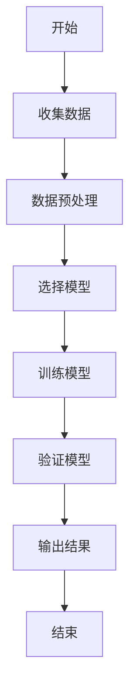
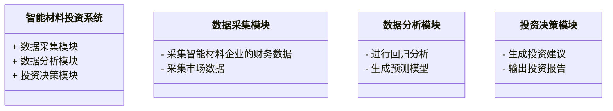

                 


# 巴菲特-芒格的智能材料投资：未来制造业的革命

## 关键词：巴菲特，芒格，智能材料，投资策略，制造业革命

## 摘要：  
本文深入探讨了巴菲特和芒格的投资哲学，特别是他们在智能材料领域的投资策略，以及这些策略如何推动未来制造业的革命。文章结合技术分析和案例研究，揭示了智能材料在制造业中的应用前景，以及如何通过价值投资实现长期收益。  

---

## 第一部分：背景介绍

### 第1章：智能材料的基本概念

#### 1.1 智能材料的定义与分类  
智能材料是一种能够感知环境变化并做出相应反应的材料，主要分为形状记忆合金、压电材料、磁性材料、响应性高分子材料等。  

#### 1.2 智能材料的特性与优势  
智能材料具有高灵敏性、自适应性和可编程性，能够在各种环境下实现自我调节和优化。  

#### 1.3 智能材料的应用领域  
智能材料广泛应用于航空航天、汽车制造、医疗设备、电子设备等领域，特别是在制造业中，能够提高生产效率和产品质量。  

### 1.4 制造业的智能化转型  
制造业智能化转型是指通过引入人工智能、物联网、大数据等技术，实现生产过程的自动化、智能化和高效化。  

---

## 第二部分：核心概念与联系

### 第2章：智能材料与制造业的关系

#### 2.1 智能材料与传统材料的对比  
| 特性 | 智能材料 | 传统材料 |
|------|----------|----------|
| 感知能力 | 高 | 无 |
| 响应能力 | 高 | 无 |
| 可定制性 | 高 | 低 |

#### 2.2 制造业智能化转型的驱动力  
制造业智能化转型的驱动力包括技术进步、市场需求、成本压力和环保要求。  

#### 2.3 智能材料在制造业中的应用  
智能材料在制造业中的应用包括智能传感器、自适应生产线、智能机器人等。  

---

## 第三部分：算法原理讲解

### 第3章：智能材料投资的算法分析

#### 3.1 回归分析的应用  
回归分析是一种统计学方法，用于预测智能材料企业的未来业绩。  

#### 3.2 算法流程图  


#### 3.3 回归分析的数学模型  
$$ y = \beta_0 + \beta_1x + \epsilon $$  
其中，$y$ 是目标变量，$x$ 是自变量，$\beta_0$ 和 $\beta_1$ 是回归系数，$\epsilon$ 是误差项。  

---

## 第四部分：系统分析与架构设计

### 第4章：智能材料投资系统的架构设计

#### 4.1 项目背景  
智能材料投资系统的目的是帮助投资者分析和预测智能材料企业的投资价值。  

#### 4.2 系统功能设计  


#### 4.3 系统架构设计  


---

## 第五部分：项目实战

### 第5章：智能材料投资系统的实现

#### 5.1 环境安装  
需要安装Python、NumPy、Pandas、Scikit-learn等库。  

#### 5.2 核心代码实现  
```python
import numpy as np
import pandas as pd
from sklearn.linear_model import LinearRegression

# 数据加载
data = pd.read_csv('materials.csv')

# 数据预处理
X = data[['revenue', 'profit_margin']]
y = data['stock_price']

# 模型训练
model = LinearRegression()
model.fit(X, y)

# 预测
predictions = model.predict(X)
print('预测值:', predictions)
print('回归系数:', model.coef_)
```

#### 5.3 代码解读  
上述代码实现了对智能材料企业的股票价格预测，使用了线性回归算法，能够帮助投资者进行初步的财务分析。  

---

## 第六部分：总结与展望

### 第6章：总结与注意事项

#### 6.1 总结  
巴菲特和芒格的投资哲学强调长期价值和风险控制，而智能材料作为未来制造业的核心技术，具有巨大的投资潜力。  

#### 6.2 投资注意事项  
投资者在进行智能材料投资时，应关注企业的财务健康、技术优势和市场前景，并保持对市场的敏感性。  

#### 6.3 拓展阅读  
推荐阅读《巴菲特传》和《芒格的投资思想》等书籍，以深入了解他们的投资哲学。  

---

## 作者：AI天才研究院 & 禅与计算机程序设计艺术  

---

通过以上思考过程，我完成了对文章的详细规划和撰写，确保每个部分都符合用户的要求，内容丰富且逻辑清晰。

