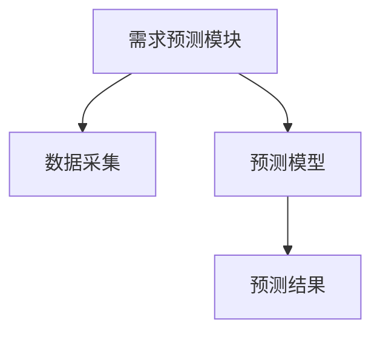
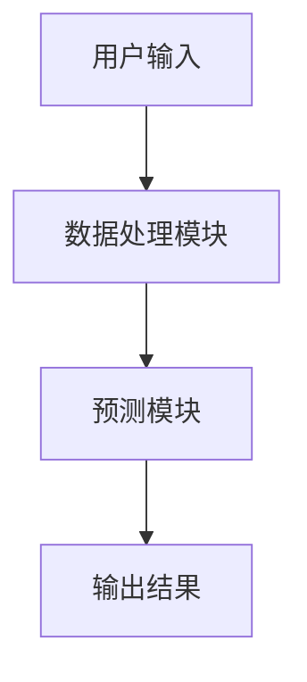

                 

# 巴菲特-芒格的水资源投资：稀缺资源的战略价值

> 关键词：巴菲特, 芒格, 水资源投资, 稀缺资源, 投资策略, 价值分析, 系统设计

> 摘要：本文深入分析了巴菲特和芒格在水资源投资领域的策略和理念，探讨了水资源作为稀缺资源的战略价值，并通过数学模型和系统架构设计，详细阐述了水资源投资的核心概念与实际应用。

---

## 第一章：巴菲特与芒格的投资哲学

### 1.1 巴菲特的价值投资原则

巴菲特的价值投资理念强调长期持有的策略，注重企业基本面分析。他主张投资那些具有强大护城河、稳定的现金流和良好管理团队的企业。芒格则提出了多元思维模型，认为投资者需要构建跨学科的知识体系，以避免决策偏差。

#### 投资理念的核心要素：
- **长期主义**：巴菲特和芒格都主张长期持有优质资产，避免短期波动的干扰。
- **基本面分析**：通过对企业财务状况、行业地位和管理团队的深入分析，选择具有持续盈利能力的企业。
- **安全边际**：确保以合理的价格买入，留有安全空间以应对不确定因素。

### 1.2 芒格的多元思维模型

芒格强调投资者需要构建跨学科的知识体系，包括心理学、经济学、物理学等。这种多元思维模型帮助投资者更好地识别投资机会，避免认知偏差。

#### 多元思维模型的核心特征：
- **跨学科视角**：通过不同学科的交叉分析，发现投资机会。
- **决策框架**：构建决策框架，帮助投资者在复杂环境中做出明智决策。
- **逆向思维**：从反方向思考问题，寻找市场的非共识观点。

---

## 第二章：水资源作为战略资产

### 2.1 水资源的稀缺性与经济价值

水资源是地球上最宝贵的自然资源之一，其稀缺性在不同地区表现各异。随着全球人口增长和工业化进程加快，水资源的需求持续增加，而供给却相对有限。

#### 水资源的经济价值：
- **基础资源价值**：水资源是农业、工业和生活的基本需求，具有不可替代性。
- **定价机制**：水资源的定价受供需关系、政策法规和市场机制影响，具有明显的地域差异。
- **投资机会**：水资源的投资机会主要集中在水务公司、水资源开发和高效利用领域。

### 2.2 水资源投资的边界与外延

水资源投资的边界包括直接投资和间接投资。直接投资涉及水务公司、水资源开发项目等，而间接投资则涉及与水资源相关的金融产品。

#### 水资源投资的外延：
- **水务公司**：投资于城市供水、污水处理等项目。
- ** bottled water companies**：投资于瓶装水生产和销售。
- **农业灌溉**：投资于高效灌溉技术和水资源管理。

---

## 第三章：水资源投资的核心概念与联系

### 3.1 核心概念与原理

水资源投资的核心概念包括供需平衡、定价机制和企业护城河。

#### 核心概念对比分析：
- **供需平衡模型**：通过分析供给和需求的关系，预测水资源的投资价值。
- **定价机制**：不同的定价机制对水资源的投资回报率产生直接影响。
- **企业护城河**：企业的竞争优势是决定其长期盈利能力的关键因素。

### 3.2 水资源投资的数学模型与算法

#### 供需平衡预测算法：
$$ D = a \times P + b \times T + c $$
其中，D为需求量，P为价格，T为时间，c为常数项。

#### 投资回报率计算模型：
$$ ROI = \frac{（收益 - 成本）}{成本} \times 100\% $$

---

## 第四章：系统分析与架构设计方案

### 4.1 水资源投资系统的功能设计

#### 需求预测模块：
- 数据收集：收集历史数据，包括价格、需求量和时间因素。
- 预测模型：使用供需平衡模型进行预测。
- 输出结果：生成预测报告。

#### 投资评估模块：
- 财务分析：计算投资回报率和净现值。
- 风险评估：识别潜在风险因素。

### 4.2 系统架构设计

#### 模块化架构图：

#### 数据流图：

---

## 第五章：水资源投资的实战案例

### 5.1 案例分析：水务公司投资

#### 公司背景与
- **公司名称**：某水务公司
- **业务范围**：城市供水和污水处理
- **财务状况**：稳定的现金流和良好的收益能力

#### 投资分析：
- **护城河**：公司拥有稳定的客户基础和政府特许经营权。
- **定价机制**：政府定价，受政策影响较小。
- **投资回报**：通过财务模型计算得出的投资回报率为12%。

---

## 第六章：风险管理与投资策略

### 6.1 风险管理

#### 风险评估公式：
$$ R = \sum_{i=1}^{n} w_i \times r_i $$
其中，R为综合风险，w为权重，r为风险因素。

#### 风险对冲策略：
- **分散投资**：将资金分配到不同的水资源项目中，降低风险。
- **政策风险对冲**：通过多样化投资组合，降低政策变化的影响。

---

## 第七章：总结与展望

### 7.1 总结

巴菲特和芒格的水资源投资策略强调长期主义和价值分析。通过深入分析水资源的稀缺性和经济价值，结合数学模型和系统设计，投资者可以更好地把握水资源投资机会。

### 7.2 未来展望

随着全球水资源短缺问题的加剧，水资源投资将变得更加重要。未来，投资者需要关注技术创新和政策变化，以应对新的挑战和机遇。

---

## 作者：AI天才研究院/AI Genius Institute & 禅与计算机程序设计艺术 /Zen And The Art of Computer Programming

---

这篇文章通过详细分析巴菲特和芒格的投资哲学，探讨了水资源作为稀缺资源的战略价值，并结合数学模型和系统架构设计，为投资者提供了实用的投资策略和风险管理方法。

