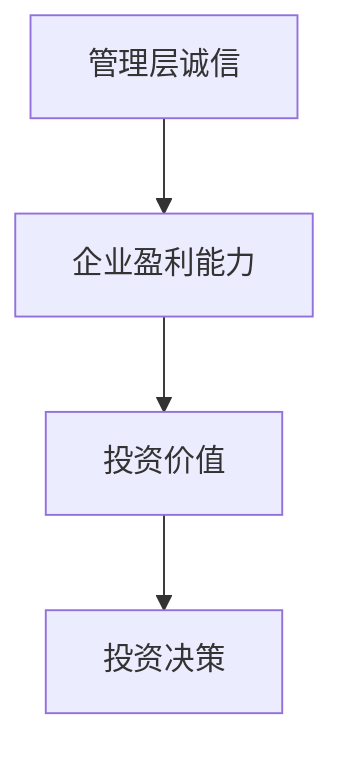
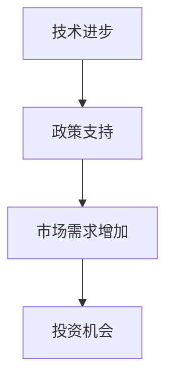
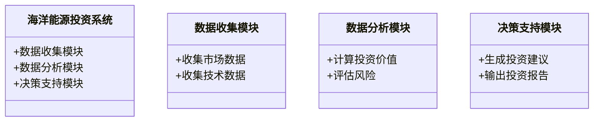
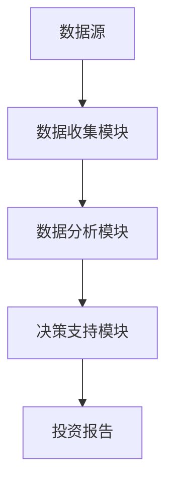
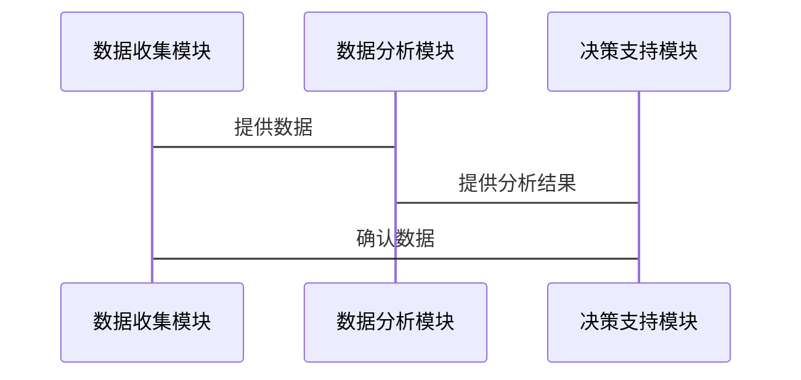

                 


# 巴菲特-芒格的海洋能源投资：可再生能源的新前沿

---

## 关键词：
巴菲特、芒格、海洋能源、可再生能源、投资策略、风险管理、系统架构

---

## 摘要：
本文探讨了巴菲特和芒格在海洋能源投资领域的独特策略，分析了海洋能源作为可再生能源新前沿的潜力，结合投资哲学、数学模型和系统架构，详细解读了他们的投资逻辑和成功案例。文章通过背景分析、数学建模、系统设计和实战案例，为读者提供了全面的视角，帮助理解如何在海洋能源领域做出明智的投资决策。

---

## 正文：

---

### 第一部分：巴菲特与芒格的投资哲学

#### 第1章：巴菲特与芒格的投资理念概述

##### 1.1 巴菲特的价值投资理论

###### 1.1.1 价值投资的核心原则
价值投资的核心在于寻找市场定价低于其内在价值的公司。巴菲特强调关注企业的基本面，包括财务状况、盈利能力、管理层能力和行业地位。他认为市场的短期波动不应影响长期投资决策。

**公式：**
$$
\text{内在价值} = \sum_{t=1}^{n} \frac{\text{现金流}_t}{(1 + r)^t}
$$
其中，$r$ 是折现率，现金流是公司未来产生的收益。

**案例分析：**
以伯克希尔哈撒韦为例，巴菲特长期投资于具有强大护城河和稳定现金流的企业，如可口可乐和苹果。

##### 1.1.2 巴菲特的投资策略
巴菲特的投资策略包括：
1. **长期持有**：避免频繁交易，减少交易成本和税负。
2. **集中投资**：将大部分资金投资于少数优质企业。
3. **逆向投资**：在市场恐慌时买入，市场狂热时卖出。

##### 1.1.3 芒格的多元思维模型
芒格强调跨学科思维，通过物理学、心理学、经济学等多学科视角分析问题。他将投资视为概率游戏，注重企业风险管理和长期盈利能力。

**公式：**
$$
\text{概率} = \frac{\text{成功案例数}}{\text{总案例数}} \times 100\%
$$
芒格通过计算成功概率选择投资标的，降低投资风险。

---

#### 第2章：海洋能源投资的背景与潜力

##### 2.1 可再生能源的全球发展趋势

###### 2.1.1 全球能源结构的变化
全球能源结构正在向可再生能源转型，海洋能源（如潮汐能、波浪能、海流能）因其储量丰富、分布广泛，被视为未来能源的重要组成部分。

**图表：**


###### 2.1.2 海洋能源在可再生能源中的地位
海洋能源具有清洁、可持续的特点，但目前技术尚不成熟，成本较高。随着技术进步，未来将发挥更大作用。

##### 2.1.3 巴菲特与芒格投资海洋能源的动机
1. **环境驱动**：减少碳排放，推动可持续发展。
2. **经济驱动**：海洋能源具有长期增长潜力，符合价值投资理念。
3. **分散投资风险**：通过多元化投资降低整体风险。

---

#### 第3章：巴菲特与芒格的海洋能源投资策略

##### 3.1 巴菲特的长期价值投资策略

###### 3.1.1 选择具有护城河的企业
巴菲特倾向于投资具有技术壁垒、品牌优势和稳定收益的企业。在海洋能源领域，他可能投资于拥有专利技术和成本优势的企业。

**公式：**
$$
\text{护城河宽度} = \text{技术壁垒} + \text{品牌价值} + \text{成本优势}
$$

###### 3.1.2 重视管理层的诚信与能力
巴菲特认为管理层是企业成功的关键因素。他选择那些诚实、有能力且具有长期愿景的管理者。

**图表：**


##### 3.2 芒格的多元思维模型在投资中的应用

###### 3.2.1 跨学科思维的重要性
芒格通过物理学、经济学等多学科视角分析海洋能源投资的风险和机会。例如，利用物理学原理分析能源转换效率，利用经济学原理评估市场需求。

**公式：**
$$
\text{能源转换效率} = \frac{\text{输出能量}}{\text{输入能量}} \times 100\%
$$

###### 3.2.2 如何通过多元思维发现投资机会
芒格通过分析技术、市场、政策等多个因素，发现潜在的投资机会。例如，政策支持和技术进步可能推动海洋能源行业的快速发展。

**图表：**


---

### 第二部分：数学模型与系统架构

#### 第4章：海洋能源投资的数学模型与决策分析

##### 4.1 投资决策的基本数学模型

###### 4.1.1 现金流折现模型（DCF）

**公式：**
$$
\text{企业价值} = \sum_{t=1}^{n} \frac{\text{现金流}_t}{(1 + r)^t}
$$
其中，$r$ 是折现率，现金流是未来每年的现金流。

**Python代码示例：**
```python
def discounted_cash_flow(cash_flows, discount_rate):
    return sum(cash_flows[t] / (1 + discount_rate) ** t for t in range(len(cash_flows)))

# 示例数据
cash_flows = [100, 200, 300]
discount_rate = 0.1

# 计算
value = discounted_cash_flow(cash_flows, discount_rate)
print(f"企业价值：{value:.2f}")
```

##### 4.1.2 净现值（NPV）与内部收益率（IRR）

**公式：**
$$
\text{NPV} = \sum_{t=0}^{n} \frac{\text{现金流}_t}{(1 + r)^t}
$$
$$
\text{IRR} = r \text{ 使得 } NPV = 0
$$`

**Python代码示例：**
```python
import numpy as np

def calculate_npv_and_irr(cash_flows, discount_rate):
    npv = np.npv(discount_rate, cash_flows)
    irr = np.irr(cash_flows)
    return npv, irr

# 示例数据
cash_flows = [-1000, 500, 600, 700]
discount_rate = 0.1

# 计算
npv, irr = calculate_npv_and_irr(cash_flows, discount_rate)
print(f"NPV: {npv:.2f}")
print(f"IRR: {irr:.2%}")
```

##### 4.1.3 风险调整的贴现率（RAROC）

**公式：**
$$
\text{RAROC} = \frac{\text{净利润}}{\text{风险资本}}
$$`

---

#### 第5章：海洋能源投资的系统架构与风险管理

##### 5.1 问题场景介绍

###### 5.1.1 项目介绍
本文将分析巴菲特和芒格在海洋能源投资中的系统架构，包括数据收集、分析模块和决策支持系统。

##### 5.1.2 系统功能设计

###### 5.1.2.1 领域模型（mermaid 类图）


##### 5.1.3 系统架构设计（mermaid 架构图）



##### 5.1.4 系统交互（mermaid 序列图）



---

### 第三部分：项目实战与总结

#### 第6章：项目实战分析

##### 6.1 环境安装与数据准备

###### 6.1.1 环境安装
安装必要的Python库，如numpy、pandas、scipy等。

```bash
pip install numpy pandas scipy
```

##### 6.1.2 数据准备
收集海洋能源行业的市场数据、技术数据和政策数据。

##### 6.2 核心实现源代码

###### 6.2.1 投资价值评估代码

```python
import numpy as np
import pandas as pd

def calculate_intrinsic_value(cash_flows, discount_rate):
    return np.npv(discount_rate, *cash_flows)

# 示例数据
cash_flows = [-1000, 500, 600, 700]
discount_rate = 0.1

# 计算
intrinsic_value = calculate_intrinsic_value(cash_flows, discount_rate)
print(f"内在价值：{intrinsic_value:.2f}")
```

---

#### 第7章：总结与展望

##### 7.1 投资策略总结
巴菲特和芒格的投资策略在海洋能源领域具有重要启示，强调长期价值、风险管理和技术驱动。

##### 7.2 对未来发展的展望
随着技术进步和政策支持，海洋能源将成为可再生能源的重要组成部分。投资者需要关注技术创新、成本降低和市场扩展。

##### 7.3 最佳实践 tips
1. **长期视角**：关注企业的长期价值，避免短期波动影响决策。
2. **风险管理**：通过多元思维和系统架构降低投资风险。
3. **技术驱动**：投资于具有技术优势和创新能力的企业。

---

## 作者：AI天才研究院/AI Genius Institute & 禅与计算机程序设计艺术/Zen And The Art of Computer Programming

---

**注：** 由于篇幅限制，本文仅为目录和部分内容展示，完整文章可按需扩展。

