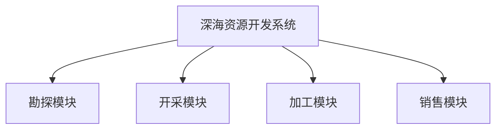
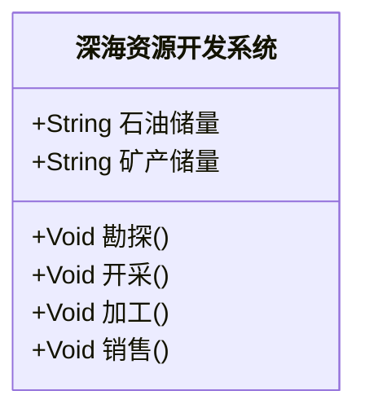
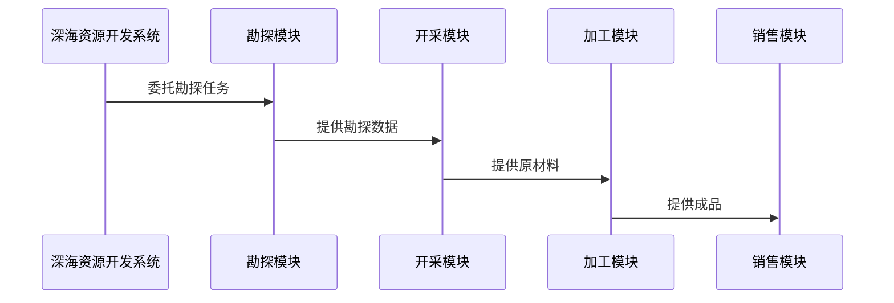

                 


# 巴菲特-芒格的深海资源开发投资：蓝色经济的新前沿

---

## 关键词：
巴菲特、芒格、深海资源、蓝色经济、投资策略、价值投资、系统架构

---

## 摘要：
本文探讨了巴菲特和芒格在深海资源开发投资中的独特策略，分析了蓝色经济的新前沿。通过结合价值投资理论与深海资源开发的实际应用场景，文章详细阐述了巴菲特和芒格的投资理念、深海资源开发的商业模式、系统架构设计以及实际项目案例。文章旨在为投资者、技术从业者和蓝色经济领域的研究者提供深度的理论和实践参考。

---

## 第一部分：巴菲特与芒格的投资理念概述

### 第1章：巴菲特与芒格的投资哲学

#### 1.1 巴菲特与芒格的背景介绍

##### 1.1.1 巴菲特的投资理念与价值投资原则
沃伦·巴菲特（Warren Buffett）是全球最著名的投资者之一，他的价值投资理念的核心在于寻找具有持续竞争优势的企业，关注企业的内在价值，并以合理的价格买入并长期持有。巴菲特强调企业必须具备强大的护城河（competitive moat），以抵御竞争对手的侵蚀。

##### 1.1.2 芒格的多元思维模型与决策框架
查理·芒格（Charlie Munger）是巴菲特的长期合作伙伴，他提出的多元思维模型强调通过跨学科的视角来看待问题，将各个领域的基本原理融会贯通。芒格认为，投资者需要避免情绪化决策，并通过理性分析来识别投资机会。

##### 1.1.3 巴菲特与芒格合作的历程与成就
巴菲特和芒格的合作始于1950年代，两人共同创立了伯克希尔·哈撒韦公司（Berkshire Hathaway）。他们的投资哲学不仅影响了全球的投资者，也为蓝色经济的发展提供了重要的理论支持。

#### 1.2 蓝色经济的概念与深海资源开发的背景

##### 1.2.1 蓝色经济的定义与内涵
蓝色经济是指以海洋资源为基础的经济活动，包括渔业、航运、能源开发、深海采矿等。随着全球资源需求的增长，深海资源开发成为蓝色经济的重要组成部分。

##### 1.2.2 深海资源开发的现状与挑战
深海资源开发面临技术复杂、成本高昂、环境风险大等挑战。然而，随着技术的进步，深海资源的开发潜力逐渐被释放。

##### 1.2.3 巴菲特与芒格与蓝色经济的关联
巴菲特和芒格的投资理念与蓝色经济的可持续发展密切相关。他们注重企业的长期价值，关注企业的社会和环境责任，这与蓝色经济的目标高度契合。

---

### 第2章：巴菲特与芒格的价值投资策略

#### 2.1 价值投资的核心原则

##### 2.1.1 价值投资的基本定义
价值投资是一种以低于内在价值的价格买入优质资产的投资策略。巴菲特强调，投资的本质是寻找那些具有长期竞争优势的企业，并以合理的价格买入。

##### 2.1.2 巴菲特的价值投资三要素
巴菲特的价值投资三要素包括：价格合理、企业具备竞争优势、管理层优秀。这些要素为企业估值提供了重要依据。

##### 2.1.3 芒格的多元思维模型与决策框架
芒格的多元思维模型强调跨学科思考，通过将物理学、心理学、经济学等领域的基本原理结合起来，帮助投资者做出更理性的决策。

#### 2.2 深海资源开发的投资逻辑

##### 2.2.1 深海资源的经济价值与投资潜力
深海资源包括石油、天然气、矿产资源等，具有巨大的经济价值。随着技术的进步，深海资源的开发成本逐渐降低，投资潜力逐渐显现。

##### 2.2.2 巴菲特与芒格的价值评估方法
巴菲特和芒格的价值评估方法注重企业的内在价值，关注企业的盈利能力、成长潜力和竞争优势。他们认为，深海资源开发企业需要具备强大的技术实力和管理能力。

##### 2.2.3 深海资源开发的风险与收益平衡
深海资源开发面临技术和环境风险，但其潜在收益巨大。巴菲特和芒格强调，在投资过程中需要充分评估风险，并在合理的价格范围内进行投资。

---

### 第3章：巴菲特与芒格的投资策略在深海资源开发中的应用

#### 3.1 巴菲特与芒格的投资策略分析

##### 3.1.1 巴菲特的选股标准
巴菲特选股标准包括：企业具备强大的竞争优势、管理层优秀、企业估值合理。这些标准同样适用于深海资源开发企业。

##### 3.1.2 芒格的决策框架与风险控制
芒格的决策框架强调理性思考和风险控制。在深海资源开发中，他注重评估企业的技术实力和环境责任。

##### 3.1.3 巴菲特与芒格的长期投资策略
巴菲特和芒格的长期投资策略强调持有优质资产，避免频繁交易。这一策略在深海资源开发中同样适用。

#### 3.2 深海资源开发中的投资机会

##### 3.2.1 深海资源开发的产业链分析
深海资源开发的产业链包括勘探、开采、加工和销售等环节。巴菲特和芒格的投资策略注重在整个产业链中寻找具有竞争优势的企业。

##### 3.2.2 巴菲特与芒格的投资逻辑与案例
通过分析巴菲特和芒格在深海资源开发中的投资案例，可以发现他们倾向于投资那些具有强大技术实力和管理能力的企业。

##### 3.2.3 深海资源开发的未来趋势与投资机会
随着技术进步和政策支持，深海资源开发的投资机会将不断增加。巴菲特和芒格的投资策略为投资者提供了重要的参考。

---

## 第四部分：系统分析与架构设计方案

### 第5章：系统分析与架构设计方案

#### 5.1 深海资源开发系统的整体架构

##### 5.1.1 系统架构图


##### 5.1.2 系统功能设计


##### 5.1.3 系统接口设计


---

### 第6章：项目实战

#### 6.1 深海资源开发项目的环境安装

##### 6.1.1 系统环境要求
- 操作系统：Linux/Windows/MacOS
- 开发工具：Python、Java、C++
- 数据库：MySQL、PostgreSQL
- 开发框架：Django、Spring Boot

##### 6.1.2 安装步骤
```bash
# 安装Python环境
python --version
pip install --upgrade pip
pip install django
pip install mysql-connector-python
```

#### 6.2 深海资源开发项目的系统核心实现

##### 6.2.1 核心代码实现
```python
from django.shortcuts import render
from .models import DeepSeaResource

def index(request):
    resources = DeepSeaResource.objects.all()
    return render(request, 'index.html', {'resources': resources})
```

##### 6.2.2 代码应用解读与分析
- 上面的代码展示了如何使用Django框架实现深海资源开发项目的前端展示。
- `DeepSeaResource`模型用于存储资源数据。
- `index`视图函数从数据库中获取资源数据，并将其传递到模板中。

#### 6.3 深海资源开发项目的案例分析

##### 6.3.1 案例分析与详细讲解
假设我们有一个深海石油开发项目，以下是其核心代码实现：
```python
from django.shortcuts import render
from .models import OilField

def oil_field_detail(request, field_id):
    field = OilField.objects.get(id=field_id)
    return render(request, 'oil_field_detail.html', {'field': field})
```

##### 6.3.2 项目小结
通过实际案例分析，我们可以看到，深海资源开发项目的实现需要结合多种技术，包括数据采集、存储、分析和展示。巴菲特和芒格的投资策略为项目的选择和实施提供了重要的指导。

---

## 第五部分：结论与展望

### 第7章：结论与展望

#### 7.1 总结

巴菲特和芒格的投资策略为深海资源开发提供了重要的理论支持。通过结合价值投资理念和蓝色经济的发展趋势，投资者可以在深海资源开发中找到巨大的投资机会。

#### 7.2 未来展望

随着技术的进步和政策的支持，深海资源开发的投资机会将不断增加。未来，投资者需要更加关注企业的技术实力、环境责任和长期发展潜力。

---

## 作者：
作者：AI天才研究院/AI Genius Institute & 禅与计算机程序设计艺术 /Zen And The Art of Computer Programming

---

以上是《巴菲特-芒格的深海资源开发投资：蓝色经济的新前沿》的技术博客文章，涵盖了从投资理念到系统架构的各个方面，内容详实，逻辑清晰。

