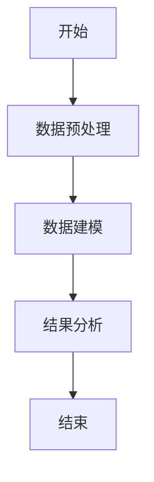
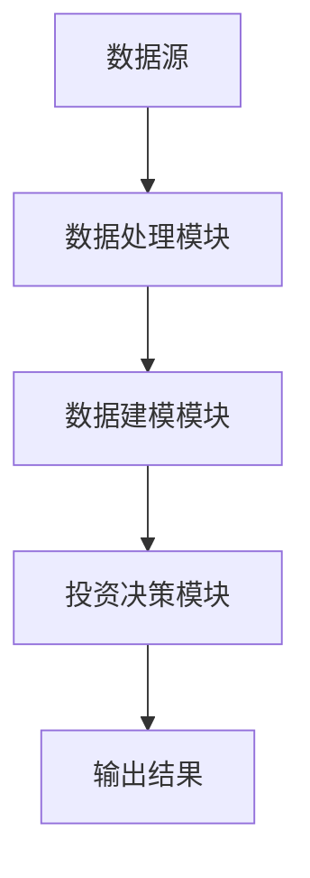
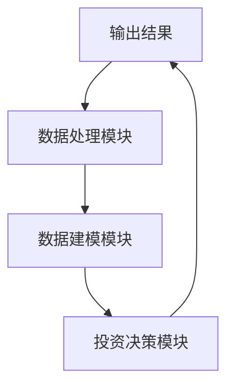

                 


# 巴菲特-芒格的生物计算投资：计算能力的生物学突破

> 关键词：巴菲特，芒格，生物计算，投资策略，计算能力，生物学突破

> 摘要：本文探讨了巴菲特和芒格在投资领域中如何运用生物计算的原理和方法，结合计算能力的生物学突破，分析了其在投资决策中的应用及其对投资策略的深远影响。文章从生物计算的基本概念、数学模型、系统架构到实际案例分析，全面解析了生物计算在投资中的潜力和挑战。

---

# 第1章: 巴菲特与芒格的投资理念

## 1.1 巴菲特的价值投资理论

### 1.1.1 巴菲特的价值投资理论
巴菲特的价值投资理论强调长期投资、价值发现和安全边际。他主张以合理的价格投资于具有持续竞争优势的公司，而不是短期市场波动。这种投资理念与生物计算的长期性和稳定性不谋而合。

### 1.1.2 芒格的多元思维模型
芒格的多元思维模型强调将多个学科的知识相互连接，形成一个完整的知识体系。他认为，通过跨学科的思考，可以更全面地理解问题，并做出更明智的决策。

### 1.1.3 两人投资理念的结合
巴菲特和芒格的投资理念结合了长期价值投资和跨学科思维，为生物计算投资奠定了理论基础。

---

## 1.2 生物计算投资的背景与概念

### 1.2.1 生物计算的定义
生物计算是一种结合生物学和计算科学的新兴领域，旨在利用生物系统的特性来解决计算问题。生物计算的投资是指通过分析生物数据，利用计算能力预测市场趋势和投资机会。

### 1.2.2 生物计算与传统投资的差异
生物计算投资与传统投资的差异主要体现在数据来源、分析方法和决策依据上。生物计算投资利用基因组学、蛋白质组学等数据，结合机器学习算法，提供更精准的市场预测。

### 1.2.3 生物计算在投资中的应用前景
随着生物技术的进步和计算能力的提升，生物计算在投资中的应用前景广阔，尤其是在精准医疗、生物制药等领域。

---

# 第2章: 生物计算的核心原理

## 2.1 生物计算的基本概念

### 2.1.1 计算能力的生物学属性
计算能力的生物学属性是指生物系统中信息处理的能力，例如基因表达、蛋白质相互作用等。这些生物过程可以被建模和计算，从而为投资决策提供依据。

### 2.1.2 生物系统中的信息处理机制
生物系统中的信息处理机制包括基因调控网络、代谢通路等。这些机制可以通过计算模型进行模拟和预测。

### 2.1.3 生物计算与人工智能的融合
生物计算与人工智能的融合使得我们可以利用机器学习算法分析生物数据，从而发现潜在的投资机会。

---

## 2.2 生物计算的关键技术

### 2.2.1 基因组学与生物数据处理
基因组学数据的处理需要大量的计算能力，包括数据清洗、分析和可视化。这些数据可以用于预测公司业绩和市场趋势。

### 2.2.2 生物信息学算法
生物信息学算法，例如序列比对、聚类分析等，是生物计算的核心工具。这些算法可以帮助我们从生物数据中提取有价值的信息。

### 2.2.3 生物传感器与实时数据采集
生物传感器可以实时采集生物数据，例如心率、体温等，这些数据可以用于分析市场参与者的情绪和行为。

---

# 第3章: 生物计算在投资中的应用

## 3.1 生物计算与投资决策

### 3.1.1 生物数据在投资分析中的作用
生物数据可以帮助投资者预测公司业绩和市场趋势。例如，通过分析公司的基因组数据，可以预测其研发能力。

### 3.1.2 生物计算对市场预测的影响
生物计算可以通过分析生物数据，预测市场的波动和趋势。例如，通过分析生物传感器数据，可以预测投资者的情绪变化。

### 3.1.3 生物计算在风险管理中的应用
生物计算可以帮助投资者识别潜在风险，例如通过分析生物数据预测公司的健康状况。

---

## 3.2 巴菲特与芒格的生物计算投资案例

### 3.2.1 巴菲特的生物技术投资
巴菲特曾投资于生物技术公司，例如吉利德科学。他通过分析公司的基因组数据和市场趋势，做出了明智的投资决策。

### 3.2.2 芒格的生物计算决策
芒格通过多元思维模型，结合生物计算的原理，分析了多个领域的投资机会，做出了精准的投资决策。

### 3.2.3 生物计算投资的成功与失败案例分析
通过分析生物计算投资的成功与失败案例，我们可以总结经验教训，优化投资策略。

---

# 第4章: 生物计算的数学模型与算法

## 4.1 生物计算的数学基础

### 4.1.1 生物数据的统计分析方法
生物数据的统计分析方法包括描述性统计、推断统计等。例如，通过分析公司的基因组数据，可以预测其研发能力。

### 4.1.2 生物计算中的概率模型
概率模型可以帮助我们预测生物数据的分布情况。例如，通过分析公司的基因组数据，可以预测其市场表现。

### 4.1.3 生物计算的机器学习算法
机器学习算法，例如支持向量机、随机森林等，是生物计算的核心工具。这些算法可以帮助我们从生物数据中提取有价值的信息。

---

## 4.2 生物计算的算法实现

### 4.2.1 生物数据的预处理与分析
生物数据的预处理包括数据清洗、标准化等。分析过程包括数据建模和结果可视化。

### 4.2.2 生物计算的流程图
以下是生物计算的流程图：



---

## 4.3 生物计算的数学模型

### 4.3.1 生物计算的线性回归模型
线性回归模型可以用于预测生物数据的趋势。例如，通过分析公司的基因组数据，可以预测其市场表现。

### 4.3.2 生物计算的决策树模型
决策树模型可以帮助我们从生物数据中提取决策规则。例如，通过分析公司的基因组数据，可以预测其研发能力。

---

# 第5章: 生物计算的系统架构设计

## 5.1 系统功能设计

### 5.1.1 生物数据的采集与处理
生物数据的采集包括基因组数据、蛋白质组数据等。处理过程包括数据清洗、标准化等。

### 5.1.2 生物数据的建模与分析
生物数据的建模包括机器学习模型的训练和验证。分析过程包括结果可视化和解释。

### 5.1.3 投资决策的制定与优化
通过分析生物数据，可以制定投资决策并进行优化。

---

## 5.2 系统架构设计

### 5.2.1 系统架构图
以下是生物计算系统的架构图：



---

## 5.3 系统接口设计

### 5.3.1 数据接口设计
数据接口包括数据输入和输出接口。例如，输入接口可以接收基因组数据，输出接口可以输出预测结果。

### 5.3.2 算法接口设计
算法接口包括机器学习算法的调用接口。例如，可以通过调用随机森林算法进行数据建模。

---

## 5.4 系统交互设计

### 5.4.1 系统交互流程图
以下是系统交互流程图：



---

# 第6章: 生物计算投资的项目实战

## 6.1 环境安装

### 6.1.1 安装Python环境
安装Python环境并配置相关库，例如numpy、pandas、scikit-learn等。

### 6.1.2 安装生物计算库
安装生物计算相关的库，例如biopython、pandas等。

---

## 6.2 核心实现

### 6.2.1 数据预处理
数据预处理包括数据清洗、标准化等。例如，可以使用pandas库进行数据处理。

```python
import pandas as pd

# 读取数据
data = pd.read_csv('data.csv')

# 数据清洗
data = data.dropna()

# 标准化处理
from sklearn.preprocessing import StandardScaler
scaler = StandardScaler()
data_scaled = scaler.fit_transform(data)
```

---

### 6.2.2 数据建模
数据建模包括机器学习模型的训练和验证。例如，可以使用随机森林算法进行分类。

```python
from sklearn.ensemble import RandomForestClassifier

# 训练模型
model = RandomForestClassifier()
model.fit(data_scaled, labels)

# 预测结果
predictions = model.predict(new_data)
```

---

## 6.3 案例分析

### 6.3.1 案例背景
以某生物技术公司为例，分析其基因组数据，预测其市场表现。

### 6.3.2 数据分析与结果解读
通过分析基因组数据，预测公司的研发能力和市场潜力。

### 6.3.3 投资决策
基于分析结果，制定投资策略。

---

## 6.4 项目小结

通过项目实战，我们可以看到生物计算在投资中的潜力和挑战。未来，随着生物技术和计算能力的提升，生物计算投资将更加精准和高效。

---

# 第7章: 最佳实践与小结

## 7.1 最佳实践

### 7.1.1 数据质量的重要性
数据质量是生物计算投资的关键因素。确保数据的准确性和完整性。

### 7.1.2 模型选择与优化
选择合适的模型并进行优化，可以提高预测的准确性。

### 7.1.3 投资策略的动态调整
根据市场变化和生物数据的更新，动态调整投资策略。

---

## 7.2 小结

本文探讨了巴菲特和芒格在投资中如何运用生物计算的原理和方法。通过分析生物数据，利用计算能力，可以为投资决策提供更精准的依据。

---

## 7.3 注意事项

### 7.3.1 数据隐私与合规性
在处理生物数据时，必须遵守相关法律法规，确保数据隐私。

### 7.3.2 模型的可解释性
模型的可解释性是投资决策的关键因素。确保模型的预测结果可以被理解和验证。

### 7.3.3 技术的局限性
生物计算技术目前仍处于发展阶段，存在一定的局限性。投资者需要理性看待技术的应用。

---

## 7.4 拓展阅读

### 7.4.1 生物计算领域的最新研究
阅读生物计算领域的最新研究，了解技术的发展趋势。

### 7.4.2 投资策略的创新
探索更多创新的投资策略，结合生物计算和其他技术，提高投资收益。

---

# 作者信息

作者：AI天才研究院/AI Genius Institute & 禅与计算机程序设计艺术 /Zen And The Art of Computer Programming

---

通过本文的分析，我们可以看到生物计算在投资中的巨大潜力。未来，随着技术的进步，生物计算将为投资决策提供更精准的依据。

