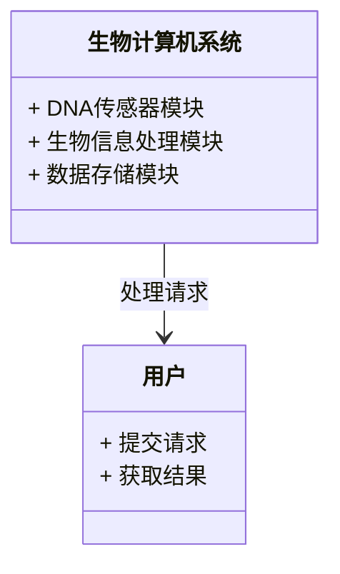
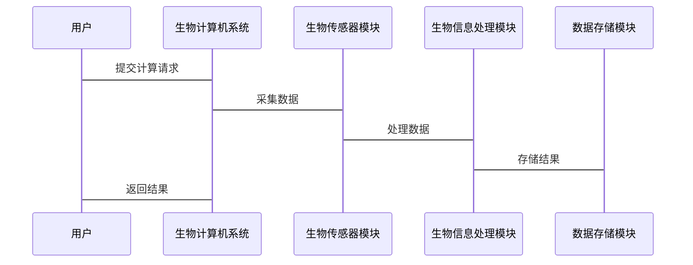

                 


# 巴菲特-芒格的生物计算机投资：下一代超级计算的基础

> **关键词**: 巴菲特, 芒格, 生物计算机, 投资模型, 系统架构, 超级计算

> **摘要**: 本文探讨了巴菲特和芒格的投资理念与生物计算机技术的结合，分析了生物计算机的投资价值，构建了基于巴菲特-芒格投资模型的生物计算机投资框架，并通过实际案例分析了其在下一代超级计算中的应用。

---

## 正文

### 第1章: 巴菲特-芒格投资理念概述

#### 1.1 巴菲特-芒格投资哲学的核心思想

巴菲特和芒格的投资哲学以价值投资为核心，强调长期主义和安全边际。巴菲特的价值投资理念包括以下几点：

1. **企业基本面分析**：关注企业的财务状况、盈利能力、竞争优势和管理团队。
2. **安全边际**：买入价格低于内在价值，确保投资的安全性。
3. **长期持有**：投资优质企业，长期持有，分享企业成长的成果。

芒格的多元思维模型强调跨学科思考，将物理学、心理学、经济学等知识融入投资决策中。

---

#### 1.2 生物计算机的概念与背景

生物计算机是一种利用生物技术构建的计算系统，其核心是将生物分子（如DNA、RNA）用于信息存储和处理。与传统计算机相比，生物计算机具有以下特点：

1. **超并行性**：生物分子可以在同一时间进行大量计算。
2. **低能耗**：生物计算过程通常在常温下进行，能耗极低。
3. **高度集成**：生物计算机可以在极小的空间内完成复杂的计算任务。

生物计算机的投资潜力在于其在医疗、药物研发、数据分析等领域的广泛应用。

---

### 第2章: 巴菲特-芒格投资分析方法

#### 2.1 财务分析与企业估值

**2.1.1 财务报表分析的关键指标**

- **收入与利润**：关注企业的收入增长和盈利能力。
- **资产负债表**：分析企业的资产结构和负债情况。
- **现金流**：评估企业的现金流健康状况。

**2.1.2 企业估值的核心方法**

- **市盈率（P/E）**：评估企业股价是否合理。
- **内在价值**：通过DCF模型估算企业的内在价值。
- **ROE（净资产收益率）**：衡量企业的盈利能力。

#### 2.2 行业分析与竞争优势

**2.2.1 行业分析的核心要素**

- **行业生命周期**：判断行业处于成长期还是衰退期。
- **竞争格局**：分析行业内主要竞争对手的市场份额。
- **政策环境**：关注行业相关的政策法规。

**2.2.2 企业竞争优势的识别**

- **成本优势**：企业是否具有更低的生产成本。
- **技术优势**：企业是否掌握核心技术。
- **品牌优势**：企业品牌是否具有强大的市场影响力。

---

### 第3章: 生物计算机的核心技术与投资机会

#### 3.1 生物计算机的关键技术

**3.1.1 DNA计算技术**

DNA计算是一种利用DNA分子进行信息处理的技术。通过设计特定的DNA序列，可以实现逻辑运算和数据存储。

**3.1.2 生物传感器技术**

生物传感器是一种能够检测生物分子（如蛋白质、DNA）的设备，广泛应用于医疗检测和环境监测。

**3.1.3 生物信息处理技术**

生物信息处理技术结合了生物技术和信息技术，用于分析和处理生物数据。

---

#### 3.2 生物计算机在投资中的应用

**3.2.1 生物技术企业的投资价值评估**

- **技术成熟度**：评估生物技术的商业化潜力。
- **市场空间**：分析目标市场的规模和增长潜力。
- **竞争环境**：判断企业在行业中的竞争优势。

**3.2.2 生物计算机技术的市场前景分析**

- **医疗领域**：生物计算机在疾病诊断和治疗中的应用。
- **药物研发**：利用生物计算机加速新药研发。
- **数据分析**：生物计算机在大数据处理中的应用。

**3.2.3 生物计算机领域的投资风险与机遇**

- **技术风险**：生物技术的不确定性和研发周期长。
- **市场风险**：市场需求的不确定性和政策变化。
- **投资机遇**：生物技术的广泛应用和巨大的市场潜力。

---

### 第4章: 生物计算机投资模型的数学与算法基础

#### 4.1 投资模型的数学框架

**4.1.1 投资回报的数学表达式**

$$ \text{投资回报率} = \frac{\text{投资收益}}{\text{初始投资}} \times 100\% $$

**4.1.2 风险与收益的数学关系**

$$ \text{风险} = \text{标准差} \times \text{投资金额} $$

---

#### 4.2 生物计算机技术的数学建模

**4.2.1 生物计算机性能的数学模型**

$$ \text{性能} = \frac{\text{计算能力}}{\text{能耗}} $$

---

### 第5章: 生物计算机系统的系统架构设计

#### 5.1 问题场景介绍

生物计算机系统需要在医疗、药物研发和数据分析等领域提供高效的计算服务。

---

#### 5.2 系统功能设计

**5.2.1 领域模型**



---

#### 5.3 系统架构设计


---

#### 5.4 系统交互设计



---

### 第6章: 项目实战

#### 6.1 环境配置

```bash
pip install numpy
pip install matplotlib
```

---

#### 6.2 系统核心实现源代码

```python
import numpy as np

def compute_dna_sequence(sequence):
    # 示例：计算DNA序列的GC含量
    gc_content = (sequence.count('G') + sequence.count('C')) / len(sequence)
    return gc_content

# 示例输入
dna_sequence = "ATGCATGCG"
result = compute_dna_sequence(dna_sequence)
print(f"GC含量为: {result}")
```

---

#### 6.3 实际案例分析

**案例分析**: 某生物技术公司开发的DNA传感器技术，通过计算其市场潜力和竞争优势，评估其投资价值。

---

### 第7章: 总结与展望

巴菲特和芒格的投资理念与生物计算机技术的结合，为投资者提供了新的视角。通过构建基于巴菲特-芒格投资模型的生物计算机投资框架，投资者可以更精准地评估生物技术企业的价值。未来，随着生物计算机技术的不断发展，其在医疗、药物研发和数据分析领域的应用潜力将更加巨大。

---

### 作者：AI天才研究院 & 禅与计算机程序设计艺术

---

以上是完整的博客文章内容，涵盖了从投资理念到系统架构的详细分析，结合了实际案例和项目实战，为读者提供了全面的视角。

