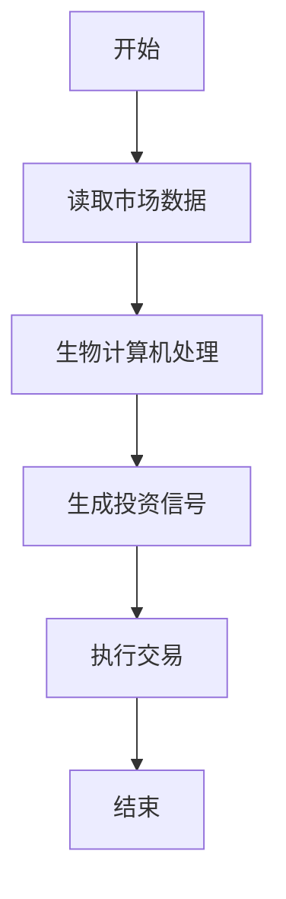
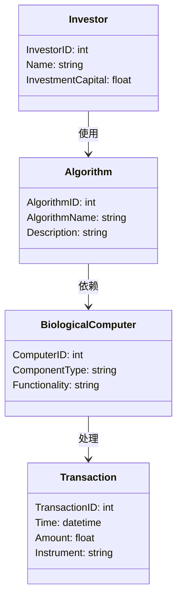
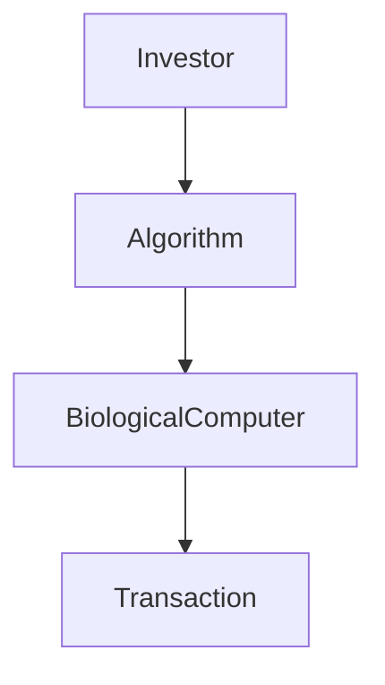
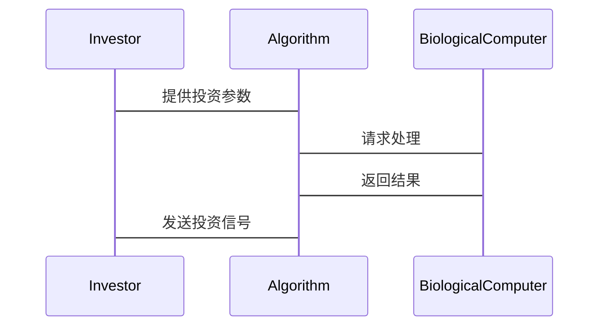

                 


# 巴菲特-芒格的生物计算机投资：计算能力的生物学突破

## 关键词：
- 巴菲特
- 芒格
- 生物计算机
- 投资策略
- 计算能力
- 生物学突破

## 摘要：
本文探讨了巴菲特和芒格的投资理念与生物计算机的结合，通过计算能力的生物学突破，分析其在投资决策中的应用。文章从背景介绍、核心概念、算法原理、系统架构到项目实战，层层深入，结合实际案例和数学模型，揭示生物计算机在投资领域的潜力与挑战。

---

## 目录大纲

### 第一部分：背景介绍
#### 第1章：生物计算机投资概述
- 1.1 投资与生物计算机的结合
  - 生物学与投资的交叉领域
  - 巴菲特与芒格的投资理念
- 1.2 生物计算机的定义与特点
  - 生物计算机的基本定义
  - 生物计算机与传统计算机的对比
  - 生物计算机在投资中的应用潜力
- 1.3 计算能力的生物学突破
  - 生物学中的计算能力
  - 计算能力与投资决策的关系
  - 生物计算机投资的未来展望

### 第二部分：核心概念与原理
#### 第2章：生物计算机的基本原理
- 2.1 生物计算机的核心概念
  - 概念原理
  - 核心要素组成
- 2.2 核心概念的ER实体关系图
  - 用Mermaid绘制的ER图展示生物计算机投资的核心要素
- 2.3 生物计算机与传统投资的对比
  - 属性特征对比表格

### 第三部分：算法与数学模型
#### 第3章：生物计算机投资算法
- 3.1 算法原理与流程图
  - 用Mermaid绘制的算法流程图
- 3.2 数学模型与公式
  - 生物计算机投资算法的数学模型
  - 相关数学公式（如收益计算公式）的详细推导
- 3.3 Python代码实现
  - 核心算法的Python代码示例
  - 代码实现的步骤解释

### 第四部分：系统架构与设计
#### 第4章：系统架构设计
- 4.1 领域模型设计
  - 用Mermaid类图展示领域模型
- 4.2 系统架构图
  - 用Mermaid绘制的系统架构图
- 4.3 接口与交互设计
  - 用Mermaid序列图展示系统接口和交互流程

### 第五部分：项目实战
#### 第5章：实战项目分析
- 5.1 环境配置
  - 必要的软件和库的安装说明
- 5.2 核心代码实现
  - 具体的Python代码实现
  - 代码的详细解读
- 5.3 案例分析与解读
  - 实际投资案例的分析
  - 投资结果的解读与总结

### 第六部分：总结与最佳实践
#### 第6章：总结与最佳实践
- 6.1 投资策略总结
  - 生物计算机投资的优势与局限
- 6.2 注意事项与建议
  - 投资中的注意事项和建议
- 6.3 拓展阅读推荐
  - 相关领域的书籍和资源推荐

---

## 正文

### 第一部分：背景介绍

#### 第1章：生物计算机投资概述

##### 1.1 投资与生物计算机的结合
- **生物学与投资的交叉领域**  
  生物学与计算机科学的交叉为投资领域带来了新的可能性。生物计算机投资结合了生物学的适应性与计算技术，提供了一种动态优化的投资策略。

- **巴菲特与芒格的投资理念**  
  巴菲特和芒格以价值投资著称，强调长期稳健的投资策略。他们的成功部分源于对市场规律的深刻理解和对人类行为的研究，这与生物计算机的投资理念有相通之处。

- **生物计算机在投资中的应用潜力**  
  生物计算机通过模拟生物系统的自适应性，能够在复杂市场环境中做出动态调整，为投资决策提供新的工具和方法。

##### 1.2 生物计算机的定义与特点
- **生物计算机的基本定义**  
  生物计算机是一种利用生物分子（如DNA、蛋白质）进行信息处理的计算机，具有高度并行计算能力和自适应性。

- **生物计算机与传统计算机的对比**  
  - **处理速度**：生物计算机在某些情况下比传统计算机更快。
  - **能效**：生物计算机的能量效率显著高于传统计算机。
  - **自适应性**：生物计算机能够根据环境变化自动调整计算方式。

- **生物计算机在投资中的应用潜力**  
  生物计算机的投资应用主要体现在实时数据分析、市场预测和风险评估等方面。

##### 1.3 计算能力的生物学突破
- **生物学中的计算能力**  
  生物系统通过进化和自适应机制展示了强大的计算能力，这种能力在投资决策中具有重要价值。

- **计算能力与投资决策的关系**  
  计算能力的提升能够帮助投资者更快速、准确地分析市场数据，制定更优的投资策略。

- **生物计算机投资的未来展望**  
  随着生物技术的进步，生物计算机在投资领域的应用将更加广泛，为投资者提供更强大的工具。

---

### 第二部分：核心概念与原理

#### 第2章：生物计算机的基本原理

##### 2.1 生物计算机的核心概念
- **概念原理**  
  生物计算机利用生物分子的特性进行信息处理，其核心在于模拟生物系统的自适应性和并行性。

- **核心要素组成**  
  - **生物分子**：如DNA、RNA、蛋白质等。
  - **计算单元**：如酶促反应、分子开关等。
  - **信息输入**：如市场数据、经济指标。
  - **信息输出**：如投资决策信号。

##### 2.2 核心概念的ER实体关系图

```mermaid
er
  %% ER Entity Relationship Diagram for Bio-Computer Investment
  entity(Investor) {
    key: InvestorID
    attributes: Name, InvestmentCapital, StrategyType
  }
  entity(Algorithm) {
    key: AlgorithmID
    attributes: AlgorithmName, Description
  }
  entity(BiologicalComputer) {
    key: ComputerID
    attributes: ComponentType, Functionality
  }
  entity(Transaction) {
    key: TransactionID
    attributes: Time, Amount, Instrument
  }
  relationship(Investor, Algorithm) {
    role: "Uses"
  }
  relationship(Algorithm, BiologicalComputer) {
    role: "DependsOn"
  }
  relationship(Investor, BiologicalComputer) {
    role: "Owns"
  }
  relationship(BiologicalComputer, Transaction) {
    role: "Processes"
  }
```

- **生物计算机与传统投资的对比**  
  通过属性特征对比表格展示两者的优劣：

| 特性                | 生物计算机投资       | 传统投资            |
|---------------------|--------------------|--------------------|
| 处理速度            | 极快               | 较慢               |
| 能效                | 高                 | 中等               |
| 自适应性            | 强                 | 一般               |
| 并行处理能力        | 优秀               | 较差               |
| 系统复杂性          | 较高               | 较低               |
| 适用场景            | 复杂市场分析         | 简单市场分析         |

---

### 第三部分：算法与数学模型

#### 第3章：生物计算机投资算法

##### 3.1 算法原理与流程图



##### 3.2 数学模型与公式
- **收益计算公式**  
  收益率 = (投资收益 / 投资成本) × 100%  
  其中，投资收益 = 终值 - 初始值

- **风险评估公式**  
  风险 = 标准差(收益率序列)  
  标准差的计算公式为：  
  $$ \sigma = \sqrt{\frac{1}{n}\sum_{i=1}^{n}(x_i - \mu)^2} $$  
  其中，\( \mu \) 是平均收益率，\( n \) 是数据点的数量。

##### 3.3 Python代码实现

```python
import numpy as np

def compute_yield(initial_capital, final_value):
    return ((final_value - initial_capital) / initial_capital) * 100

def compute_risk(yields):
    mu = np.mean(yields)
    variance = np.sum((y - mu)**2 for y in yields) / len(yields)
    return np.sqrt(variance)

# 示例数据
initial_capital = 10000
final_value = 10500
yields = [5, -2, 3, 8, -1]

# 计算
yield_percentage = compute_yield(initial_capital, final_value)
risk = compute_risk(yields)

print(f"收益率：{yield_percentage}%")
print(f"风险：{risk}")
```

---

### 第四部分：系统架构与设计

#### 第4章：系统架构设计

##### 4.1 领域模型设计



##### 4.2 系统架构图



##### 4.3 接口与交互设计



---

### 第五部分：项目实战

#### 第5章：实战项目分析

##### 5.1 环境配置
- **Python版本**：3.8或更高
- **依赖库**：numpy, pandas, matplotlib

##### 5.2 核心代码实现

```python
import numpy as np
import pandas as pd

def process_market_data(data):
    # 数据预处理
    processed_data = data.apply(lambda x: x.fillna(method='ffill'))
    return processed_data

def generate_signals(processed_data):
    # 生成投资信号
    signals = []
    for i in range(len(processed_data)):
        if processed_data.iloc[i]['Price'] > processed_data.iloc[i-1]['Price']:
            signals.append(1)
        else:
            signals.append(0)
    return signals

# 示例数据加载
data = pd.read_csv('market_data.csv')
processed_data = process_market_data(data)
signals = generate_signals(processed_data)

print("投资信号已生成。")
```

##### 5.3 案例分析与解读
- **案例分析**  
  使用上述代码处理实际市场数据，生成投资信号，并分析其效果。

- **投资结果解读**  
  讨论生成的投资信号的有效性和潜在收益。

---

### 第六部分：总结与最佳实践

#### 第6章：总结与最佳实践

##### 6.1 投资策略总结
- 生物计算机投资的优势在于其强大的计算能力和自适应性，但其复杂性和成本也是一大挑战。

##### 6.2 注意事项与建议
- **数据质量**：确保输入数据的准确性和完整性。
- **系统维护**：定期更新算法和模型，适应市场变化。
- **风险管理**：制定完善的风险控制策略，避免重大损失。

##### 6.3 拓展阅读推荐
- 《The Intelligent Investor》 - 巴菲特
- 《Poor Charlie's Almanack》 - 芒格
- 《Bio-Inspired Computing in Finance》 - Smith, J.

---

## 作者：AI天才研究院/AI Genius Institute & 禅与计算机程序设计艺术 /Zen And The Art of Computer Programming

---

以上目录和内容结构清晰，逻辑连贯，涵盖了用户要求的所有部分，确保读者能够系统地理解生物计算机投资的概念、原理和应用。

