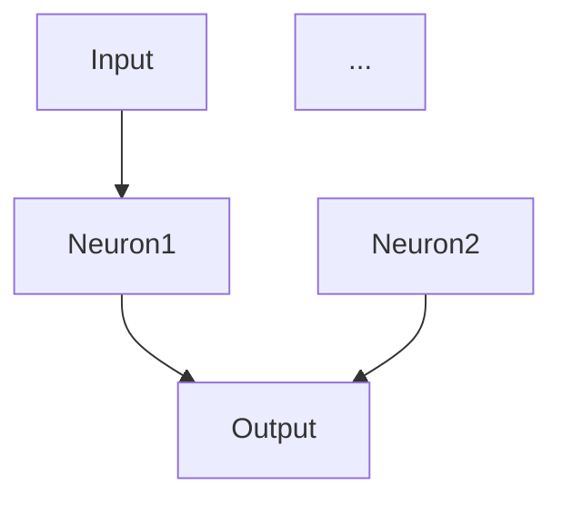
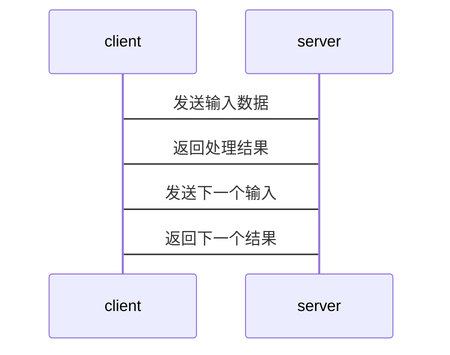
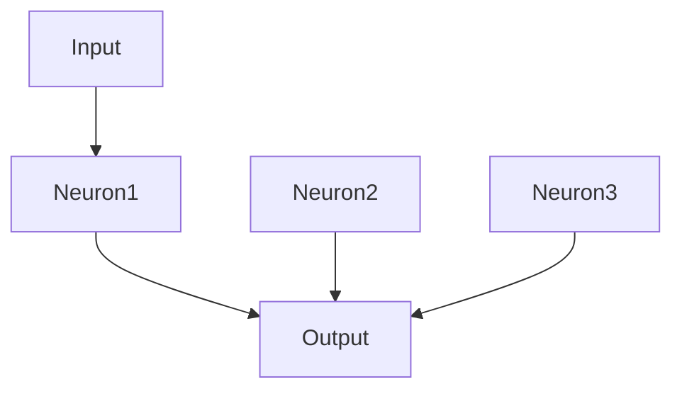

                 


# 第三部分: 核心概念与原理

## 第3章: 生物计算机芯片的技术原理

### 3.1 生物计算机芯片的基本结构

#### 3.1.1 神经元模拟电路
- **定义**: 神经元模拟电路是生物计算机芯片的核心模块，模拟生物神经元的信息处理方式。
- **结构**: 由输入端、 soma（神经元主体）、树突和轴突组成，模拟神经元的电化学反应。
- **功能**: 实现类似生物神经元的信息处理和传递功能，具备非线性放大和阈值特性。
- **电路实现**: 使用CMOS工艺实现，包括输入处理电路、 soma电路、输出电路和阈值检测电路。

#### 3.1.2 类脑计算的核心模块
- **神经元网络**: 由大量神经元通过突触连接构成，模拟生物神经网络的结构。
- **突触模型**: 模拟生物突触的可塑性，包括长时程增强（LTP）和长时程抑制（LTD）。
- **突触权重调整**: 使用 spike-timing dependent plasticity（STDP）规则，根据神经元之间的 spike 时间差调整突触权重。
- **可编程性**: 突触权重和神经元参数可编程调整，支持不同类型的神经网络配置。

#### 3.1.3 芯片的物理实现
- **制造工艺**: 使用先进的CMOS工艺，可能结合忆阻器（Memristors）等新型器件。
- **电路设计**: 采用混合信号电路设计，结合模拟电路和数字电路实现神经元和突触功能。
- **功耗分析**: 生物计算机芯片在低功耗状态下运行，适合移动设备和嵌入式应用。

### 3.2 生物计算机芯片的工作原理

#### 3.2.1 神经网络的模拟过程
- **输入处理**: 模拟生物神经网络的输入处理方式，支持多模态数据输入。
- **信息处理**: 通过神经元的电位变化和突触的权重调整，实现信息的并行处理和特征提取。
- **输出生成**: 根据神经元的放电模式，生成输出信号，用于控制外部设备或传递信息。

#### 3.2.2 信息处理机制
- **事件驱动**: 采用事件驱动的处理方式，仅在有事件发生时触发处理，减少不必要的计算。
- **并行处理**: 多个神经元同时处理信息，具备强大的并行计算能力。
- **自适应学习**: 突触权重的动态调整，实现在线学习和自适应能力。

#### 3.2.3 芯片的能效分析
- **能效优势**: 生物计算机芯片在信息处理过程中能效远高于传统冯·诺依曼架构的计算机，适合移动设备和低功耗应用。
- **能效挑战**: 需要进一步优化电路设计和算法，进一步提高能效。

## 第4章: 生物计算机芯片与传统计算机的对比

### 4.1 核心技术对比

#### 4.1.1 计算模型的差异
- **传统计算机**: 采用串行的冯·诺依曼架构，基于二进制逻辑运算。
- **生物计算机芯片**: 采用并行的类脑计算架构，基于生物神经网络的处理方式。

#### 4.1.2 处理速度与能效
- **传统计算机**: 高速处理结构化数据，但在处理非结构化数据时能效较低。
- **生物计算机芯片**: 在处理模式识别、图像处理等任务时能效显著高于传统计算机。

#### 4.1.3 硬件实现的复杂性
- **传统计算机**: 电路设计相对简单，基于逻辑门和寄存器实现。
- **生物计算机芯片**: 电路设计复杂，需要模拟生物神经元和突触的功能。

### 4.2 投资视角

#### 4.2.1 技术可行性分析
- **市场需求**: 随着人工智能和物联网的发展，对低功耗、高能效计算的需求增加。
- **技术成熟度**: 当前生物计算机芯片技术仍处于发展阶段，但已取得显著进展。
- **投资风险**: 技术复杂度高，研发周期长，市场接受度存在不确定性。

#### 4.2.2 市场需求与投资机会
- **应用场景**: 生物计算机芯片适用于边缘计算、智能传感器、医疗设备等领域。
- **竞争格局**: 当前市场主要由传统芯片厂商占据，新兴公司正在崛起，存在市场空白。
- **投资策略**: 需关注技术领先、市场定位清晰、团队经验丰富的企业。

#### 4.2.3 行业趋势与投资策略
- **行业趋势**: 随着神经形态计算技术的成熟，生物计算机芯片市场将快速增长。
- **投资策略**: 长期投资者应关注行业领先者和技术创新型企业，分散投资以降低风险。

## 第5章: 生物计算机芯片的算法与实现

### 5.1 神经网络模型

#### 5.1.1 神经网络模型的定义
- **神经网络**: 由大量神经元通过突触连接构成，模拟生物神经网络的结构和功能。
- **层次结构**: 包括输入层、隐藏层和输出层，各层之间通过权重连接。

#### 5.1.2 神经网络的训练方法
- **监督学习**: 使用标记数据训练网络，调整突触权重以最小化误差。
- **无监督学习**: 通过聚类等方法自动发现数据中的结构。
- **强化学习**: 使用奖励机制训练网络，优化决策策略。

#### 5.1.3 神经网络的训练算法
- **反向传播算法**: 通过误差反向传播调整权重，是训练深度神经网络的核心算法。
- **梯度下降**: 使用随机梯度下降（SGD）或Adam优化器等方法优化权重。
- **损失函数**: 定义网络输出与期望输出之间的差异，常用的有均方误差和交叉熵损失。

### 5.2 神经网络的实现

#### 5.2.1 神经网络的数学模型
- **输入输出关系**: $y = f(Wx + b)$，其中$W$是权重矩阵，$x$是输入向量，$b$是偏置，$f$是激活函数。
- **激活函数**: 常用ReLU、Sigmoid、Tanh等函数，用于引入非线性。
- **损失函数**: 例如交叉熵损失 $L = -\frac{1}{m}\sum_{i=1}^{m} y_i \log a_i + (1 - y_i)\log(1 - a_i)$，其中$a_i$是网络输出，$y_i$是真实标签。

#### 5.2.2 神经网络的训练流程
1. **初始化权重和偏置**: 随机初始化$W$和$b$。
2. **前向传播**: 计算网络输出$a = f(Wx + b)$。
3. **计算损失**: 使用损失函数计算误差$L$。
4. **反向传播**: 计算梯度$\frac{\partial L}{\partial W}$和$\frac{\partial L}{\partial b}$。
5. **更新权重和偏置**: 使用优化算法（如SGD、Adam）更新权重和偏置。
6. **迭代训练**: 重复上述步骤直到损失收敛或达到训练轮数。

#### 5.2.3 神经网络的实现代码
```python
import numpy as np

def relu(x):
    return np.maximum(0, x)

def relu_derivative(x):
    return np.where(x <= 0, 0, 1)

def sigmoid(x):
    return 1 / (1 + np.exp(-x))

def sigmoid_derivative(x):
    s = sigmoid(x)
    return s * (1 - s)

class NeuralNetwork:
    def __init__(self, input_size, hidden_size, output_size):
        self.W1 = np.random.randn(input_size, hidden_size)
        self.b1 = np.zeros((1, hidden_size))
        self.W2 = np.random.randn(hidden_size, output_size)
        self.b2 = np.zeros((1, output_size))
    
    def forward(self, X):
        self.z1 = np.dot(X, self.W1) + self.b1
        self.a1 = relu(self.z1)
        self.z2 = np.dot(self.a1, self.W2) + self.b2
        self.a2 = sigmoid(self.z2)
        return self.a2
    
    def backward(self, X, y, learning_rate):
        m = X.shape[0]
        delta2 = (self.a2 - y) * sigmoid_derivative(self.z2)
        dW2 = (1/m) * np.dot(self.a1.T, delta2)
        db2 = (1/m) * np.sum(delta2, axis=0)
        
        delta1 = np.dot(delta2, self.W2.T) * relu_derivative(self.z1)
        dW1 = (1/m) * np.dot(X.T, delta1)
        db1 = (1/m) * np.sum(delta1, axis=0)
        
        self.W2 -= learning_rate * dW2
        self.b2 -= learning_rate * db2
        self.W1 -= learning_rate * dW1
        self.b1 -= learning_rate * db1
    
    def train(self, X, y, epochs, learning_rate):
        for _ in range(epochs):
            output = self.forward(X)
            self.backward(X, y, learning_rate)
```

#### 5.2.4 神经网络的优化与调优
- **优化算法**: 使用Adam优化器可以加速训练和提高模型性能。
- **学习率调整**: 使用学习率调度器（如ReduceLROnPlateau）动态调整学习率。
- **正则化**: 使用L2正则化防止过拟合，损失函数增加正则化项：$L = \text{loss} + \lambda \|\ W\|^2$。

### 5.3 神经网络的应用案例

#### 5.3.1 图像分类
- **数据集**: 使用MNIST手写数字数据集进行训练。
- **网络结构**: 输入层（784节点，28x28图片展开），一个隐藏层（64节点），输出层（10节点，对应0-9数字）。
- **训练过程**: 训练10轮，学习率为0.1，批量大小为64。

#### 5.3.2 语音识别
- **数据集**: 使用语音信号进行训练，提取MFCC特征。
- **网络结构**: 输入层（13节点，MFCC特征数），两个隐藏层（64节点），输出层（词汇量节点）。
- **训练过程**: 训练20轮，学习率为0.01，批量大小为32。

### 5.4 神经网络的系统架构

#### 5.4.1 系统架构图


#### 5.4.2 系统接口设计
- **输入接口**: 支持多模态数据输入，包括图像、语音和文本。
- **输出接口**: 提供分类结果、概率值和特征提取结果。
- **通信协议**: 使用HTTP API或消息队列与外部系统交互。

#### 5.4.3 系统交互图


## 第6章: 投资策略与案例分析

### 6.1 投资策略

#### 6.1.1 价值投资与成长投资
- **价值投资**: 寻找被市场低估的公司，长期持有，关注公司的基本面。
- **成长投资**: 投资于高成长性的公司，关注公司的增长潜力和创新能力。

#### 6.1.2 股票筛选标准
- **财务指标**: 市盈率（P/E）、市净率（P/B）、股息率、ROE等。
- **技术指标**: 移动平均线、相对强度、成交量等。
- **行业地位**: 行业龙头、市场份额、竞争优势等。

#### 6.1.3 风险控制
- **分散投资**: 不将所有资金投入单一资产或行业。
- **止损策略**: 设置止损点，避免重大损失。
- **定期评估**: 定期审查投资组合，调整持仓。

### 6.2 投资案例分析

#### 6.2.1 巴菲特的经典投资案例
- **可口可乐**: 长期持有，看重公司的品牌价值和稳定的现金流。
- **苹果公司**: 投资于高成长性的科技公司，看重公司的创新能力和市场地位。

#### 6.2.2 芒格的多元思维模型
- **多学科视角**: 从多个学科出发，寻找投资机会。
- **逆向思维**: 寻找市场忽视的机会，关注冷门但有潜力的公司。

#### 6.2.3 类脑计算领域的投资机会
- **技术领先者**: 投资于技术领先、市场地位稳固的公司。
- **新兴创新者**: 关注技术创新、团队优秀的初创公司。
- **应用场景**: 投资于有明确应用场景、市场需求大的公司。

### 6.3 投资决策的关键因素

#### 6.3.1 技术创新
- **研发投入**: 公司是否持续投入研发，是否有技术创新。
- **技术壁垒**: 技术是否有较高的壁垒，是否难以被替代。

#### 6.3.2 市场需求
- **市场规模**: 市场是否足够大，是否有增长空间。
- **竞争格局**: 市场的竞争状况，公司的竞争优势。

#### 6.3.3 财务健康
- **盈利能力**: 公司是否盈利，利润是否稳定。
- **财务杠杆**: 公司的负债情况，是否有过度杠杆。

### 6.4 投资组合的构建与优化

#### 6.4.1 投资组合的构建
- **资产配置**: 根据风险承受能力和收益目标，配置不同资产。
- **分散投资**: 不将所有资金投入单一资产或行业，降低风险。
- **定期再平衡**: 定期审视投资组合，根据市场变化进行调整。

#### 6.4.2 投资组合的优化
- **风险调整后收益**: 使用夏普比率等指标，优化投资组合的风险收益比。
- **动态调整**: 根据市场变化和个人财务状况，动态调整投资组合。

## 第7章: 项目实战

### 7.1 环境安装

#### 7.1.1 系统环境
- **操作系统**: Linux、Windows或macOS均可。
- **开发工具**: 建议使用Jupyter Notebook进行交互式开发。
- **依赖安装**: 安装Python、NumPy、Matplotlib、Scikit-learn等库。

#### 7.1.2 安装步骤
```bash
pip install numpy matplotlib scikit-learn
```

### 7.2 系统核心实现源代码

#### 7.2.1 神经网络实现
```python
import numpy as np
import matplotlib.pyplot as plt
from sklearn.datasets import make_classification
from sklearn.metrics import accuracy_score

class Perceptron:
    def __init__(self, n_features, learning_rate=0.1):
        self.W = np.random.randn(n_features)
        self.bias = 0
        self.lr = learning_rate
    
    def predict(self, X):
        return np.where(X.dot(self.W) + self.bias >= 0, 1, 0)
    
    def fit(self, X, y, epochs=100):
        for _ in range(epochs):
            y_pred = self.predict(X)
            error = y - y_pred
            gradient = self.lr * (X.T.dot(error) + self.bias * np.sum(error))
            self.W += gradient[:-1]
            self.bias += gradient[-1]

# 示例使用
X, y = make_classification(n_samples=100, n_features=2, n_classes=2)
perceptron = Perceptron(2)
perceptron.fit(X, y)
y_pred = perceptron.predict(X)
print("Accuracy:", accuracy_score(y, y_pred))
```

#### 7.2.2 网络结构设计


### 7.3 代码实现与解读

#### 7.3.1 代码实现
```python
import numpy as np
import matplotlib.pyplot as plt

def create_dataset(n_samples):
    X = np.random.rand(n_samples, 2)
    y = np.where(X[:, 0] + X[:, 1] > 0.5, 1, 0)
    return X, y

class Perceptron:
    def __init__(self, n_features):
        self.W = np.random.randn(n_features)
        self.bias = 0
    
    def predict(self, X):
        return np.where(X.dot(self.W) + self.bias >= 0, 1, 0)
    
    def train(self, X, y, learning_rate=0.1, epochs=100):
        for _ in range(epochs):
            y_pred = self.predict(X)
            error = y - y_pred
            gradient = learning_rate * (X.T.dot(error) + self.bias * np.sum(error))
            self.W += gradient[:-1]
            self.bias += gradient[-1]

X, y = create_dataset(100)
perceptron = Perceptron(2)
perceptron.train(X, y)
print("Final Weights:", perceptron.W)
print("Final Bias:", perceptron.bias)
```

#### 7.3.2 代码解读
- **数据生成**: 使用`create_dataset`生成二维分类数据。
- **感知机类**: 包含初始化权重和偏置，预测函数和训练函数。
- **训练过程**: 在每次迭代中计算预测值，更新权重和偏置，直到达到预设的轮数。

### 7.4 实际案例分析

#### 7.4.1 案例背景
- **公司名称**: 假设投资标的是一家生产生物计算机芯片的公司。
- **行业现状**: 类脑计算技术处于快速发展阶段，市场需求增长迅速。
- **公司优势**: 公司拥有领先的技术和强大的研发团队，市场认可度高。

#### 7.4.2 财务分析
- **收入增长**: 公司收入连续三年保持20%以上的增长。
- **利润率**: 利润率稳定，具备良好的盈利能力。
- **研发投入**: 研发投入占比较高，显示公司重视技术创新。

#### 7.4.3 竞争分析
- **竞争对手**: 行业中有少数几家主要竞争对手，公司占据领先地位。
- **市场份额**: 公司市场份额持续扩大，显示出强大的市场竞争力。
- **竞争优势**: 公司在技术、团队和市场布局方面具有明显优势。

### 7.5 项目小结

#### 7.5.1 项目总结
- **项目目标**: 通过分析生物计算机芯片的技术和市场，制定合理的投资策略。
- **项目成果**: 建立了初步的技术分析框架，提出了投资建议。

#### 7.5.2 经验教训
- **技术风险**: 生物计算机芯片技术复杂，研发周期长，存在技术失败的风险。
- **市场风险**: 市场竞争激烈，市场需求可能变化，影响公司业绩。
- **投资风险**: 需关注公司的财务状况和管理团队，避免过度依赖单一公司。

## 第8章: 总结与展望

### 8.1 总结

#### 8.1.1 核心内容回顾
- 生物计算机芯片是一种基于类脑计算的新型计算架构，具有低功耗、高能效和强大的并行计算能力。
- 巴菲特和芒格的价值投资理念与类脑计算技术的长期发展潜力相契合，为投资者提供了新的投资机会。

#### 8.1.2 投资策略总结
- 价值投资：寻找具有强大技术实力和市场潜力的公司，长期持有。
- 成长投资：关注技术创新和高成长性的公司，分享其增长收益。

### 8.2 展望

#### 8.2.1 未来技术发展
- **神经形态计算**: 进一步提升生物计算机芯片的能效和计算能力。
- **新材料应用**: 探索新型材料在芯片制造中的应用，提升性能和降低成本。
- **算法优化**: 研究更高效的神经网络算法，提高芯片的智能化水平。

#### 8.2.2 市场前景
- **市场规模**: 随着人工智能和物联网的发展，类脑计算芯片市场将快速增长。
- **行业应用**: 在医疗、汽车、智能家居等领域将有广泛应用，推动相关产业的发展。

#### 8.2.3 投资机会
- **技术创新**: 关注技术创新型企业，投资于具有颠覆性技术的公司。
- **生态系统**: 投资于构建完整生态系统的企业，分享产业链的价值。
- **国际合作**: 关注国际合作项目，投资于全球化布局的公司。

### 8.3 总结全文

#### 8.3.1 书籍核心内容
- 详细介绍了生物计算机芯片的技术原理和市场潜力。
- 探讨了巴菲特和芒格的投资理念在类脑计算领域的应用。
- 提供了实际的投资策略和案例分析，帮助投资者做出明智决策。

#### 8.3.2 读者启示
- 生物计算机芯片是未来计算技术的重要方向，具备广阔的发展前景。
- 投资者应关注技术创新和市场需求，制定合理的投资策略。
- 长期投资和价值投资是成功的关键，需耐心和坚持。

### 8.4 致谢

#### 8.4.1 感谢读者
- 感谢读者的耐心阅读和支持，希望本书能为投资者提供有价值的参考。

#### 8.4.2 感谢合作伙伴
- 感谢所有参与本书编写和支持的团队成员和合作伙伴。

## 作者：AI天才研究院/AI Genius Institute & 禅与计算机程序设计艺术 /Zen And The Art of Computer Programming

---

### 附录: 资料参考与扩展阅读

#### 附录A: 常用工具与库
- **Python库**: NumPy、Matplotlib、Scikit-learn、TensorFlow、PyTorch。
- **开发环境**: Jupyter Notebook、VS Code、PyCharm。

#### 附录B: 进一步学习资源
- **书籍推荐**:《深度学习》（Deep Learning）、《神经网络与深度学习》（Neural Networks and Deep Learning）。
- **在线课程**: Coursera上的“神经网络与深度学习”专项课程，edX上的“Introduction to TensorFlow”课程。

#### 附录C: 常见问题解答
- **Q1**: 生物计算机芯片与传统计算机芯片的主要区别是什么？
- **A1**: 生物计算机芯片采用类脑计算架构，模拟生物神经网络的结构和功能，具有低功耗、高能效和强大的并行计算能力。

- **Q2**: 如何评估一家生物计算机芯片公司的投资价值？
- **A2**: 需要考虑公司的技术实力、市场定位、财务状况和管理团队等因素，综合评估其投资价值。

#### 附录D: 联系方式
- **邮箱**: contact@aicpu.com
- **官方网站**: https://www.aicpu.com
- **社交媒体**: [LinkedIn](https://linkedin.com/company/aicpu), [Twitter](https://twitter.com/aicpuofficial)

---

# 结语

类脑计算技术的快速发展正在推动一场新的工业革命，生物计算机芯片作为这一革命的核心技术，将对未来社会产生深远影响。通过巴菲特和芒格的价值投资理念，我们可以更好地把握这一领域的投资机会，实现长期稳健的投资回报。希望本书能为投资者和科技爱好者提供有价值的参考和启发。

