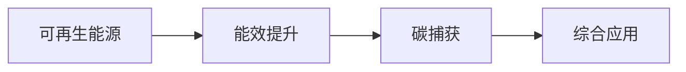
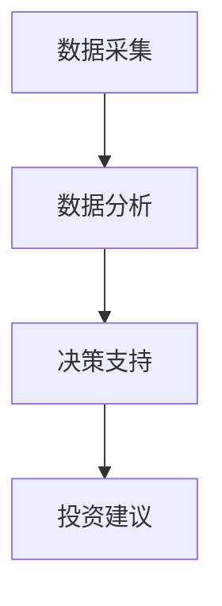
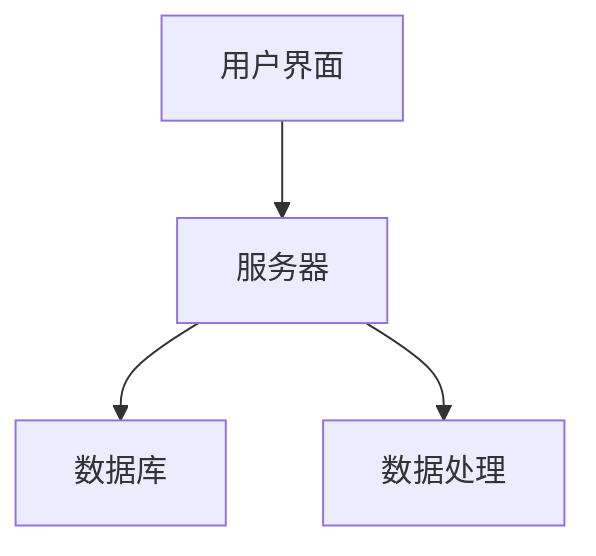

                 


# 巴菲特-芒格的碳中和技术投资：应对气候变化的创新

## 关键词：
- 巴菲特
- 芒格
- 碳中和
- 投资策略
- 气候变化
- 技术创新
- 可持续发展

## 摘要：
本文探讨了巴菲特和芒格在应对气候变化中的投资策略，重点分析了他们如何通过投资碳中技术推动技术创新。文章详细介绍了碳中技术的核心概念、算法模型、系统架构，并结合实际案例，提供了风险管理与未来展望，为投资者提供了深入的分析和建议。

---

## 正文内容

### 第一部分：引言

#### 第1章：巴菲特与芒格的投资哲学

##### 1.1 巴菲特的价值投资原则
巴菲特的价值投资理念强调长期投资、安全边际和寻找具有强大竞争优势的企业。他相信通过购买优秀的公司股票，长期持有，可以获得超越市场的回报。芒格的多元思维模型则强调跨学科思考，认为投资者应该广泛涉猎各个领域的知识，以避免认知盲区。

##### 1.2 气候变化与碳中和的重要性
气候变化已成为全球性挑战，威胁着经济和社会的稳定。碳中和的目标是通过技术创新和投资，实现温室气体的净零排放。巴菲特和芒格认识到，碳中技术不仅是应对气候变化的关键，也是投资的重要领域。

---

### 第二部分：碳中技术的核心概念

#### 第2章：碳中技术的定义与分类

##### 2.1 碳中技术的定义与分类
碳中技术是指能够减少温室气体排放或捕获碳的技术。主要分类包括：
- **可再生能源**：如太阳能、风能。
- **碳捕获与封存**：将二氧化碳捕获并封存。
- **能效提升**：通过技术提高能源使用效率。

##### 2.2 各类碳中技术的优缺点对比
以下是一个对比表格：

| 技术类型      | 优点                          | 缺点                          |
|---------------|-------------------------------|-------------------------------|
| 可再生能源    | 清洁、可扩展                   | 初始成本高，间歇性           |
| 碳捕获        | 减少现有排放                   | 技术复杂，成本高             |
| 能效提升      | 经济性好，易于实施             | 效果有限，依赖政策支持        |

Mermaid图：碳中技术之间的关系



---

### 第三部分：碳中和投资的算法与数学模型

#### 第3章：碳中和投资的评估模型

##### 3.1 净现值（NPV）模型
净现值是评估投资项目的重要指标，计算公式如下：

$$ NPV = \sum_{t=1}^{n} \frac{C_t}{(1 + r)^t} - I $$

其中，\( C_t \) 是第t年的现金流，\( r \) 是折现率，\( I \) 是初始投资。

##### 3.2 内部收益率（IRR）模型
内部收益率是使NPV为零的折现率，计算公式：

$$ 0 = \sum_{t=1}^{n} \frac{C_t}{(1 + IRR)^t} - I $$

---

### 第四部分：系统分析与架构设计

#### 第4章：系统功能与架构设计

##### 4.1 系统功能设计
碳中技术投资系统包括数据采集、分析、决策支持等功能模块。

Mermaid图：系统功能设计



##### 4.2 系统架构设计
系统架构采用分层设计，包括前端、后端和数据库。

Mermaid图：系统架构设计



---

### 第五部分：项目实战

#### 第5章：项目实战

##### 5.1 环境安装与配置
安装Python、Jupyter Notebook、Pandas等工具。

##### 5.2 核心实现与代码分析
Python代码示例：

```python
def calculate_npv(cash_flows, discount_rate):
    return sum(flow / (1 + discount_rate) ** t for t, flow in enumerate(cash_flows))

cash_flows = [100, 200, 300]
discount_rate = 0.1
print("NPV:", calculate_npv(cash_flows, discount_rate))
```

##### 5.3 实际案例分析
以巴菲特投资的某可再生能源项目为例，分析其NPV和IRR，评估其可行性和风险。

---

### 第六部分：风险管理与挑战

#### 第6章：风险管理与挑战

##### 6.1 风险管理策略
包括分散投资、政策跟踪等策略。

##### 6.2 技术挑战与解决方案
分析技术难题并提出解决方案，如技术创新和政策支持。

---

### 第七部分：未来展望与投资机会

#### 第7章：未来展望与投资机会

##### 7.1 未来技术趋势
探讨人工智能在能源管理中的应用，绿色氢能等新技术的发展。

##### 7.2 投资机会与挑战
识别投资机会，分析技术不确定性和政策变化等挑战。

---

### 第八部分：结论与建议

#### 第8章：结论与建议

##### 8.1 总结
总结巴菲特和芒格的投资策略，强调长期投资和价值投资的重要性。

##### 8.2 投资建议
建议投资者关注技术创新、分散投资、长期持有，积极参与碳中技术的投资。

---

## 作者信息

**作者：**  
AI天才研究院/AI Genius Institute  
**联系方式：**  
[联系邮箱]  
**个人简介：**  
专注于人工智能和计算机程序设计，致力于探索技术与投资的结合，提供深度技术分析和投资策略建议。

--- 

通过以上内容，我们系统地分析了巴菲特和芒格在碳中技术投资中的策略，并提供了详细的理论分析和实战案例，帮助投资者更好地理解和应对气候变化带来的挑战。

