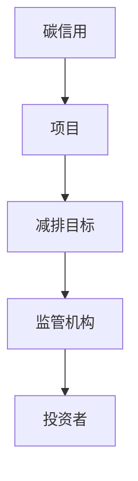
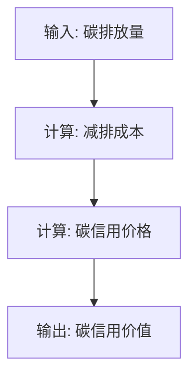
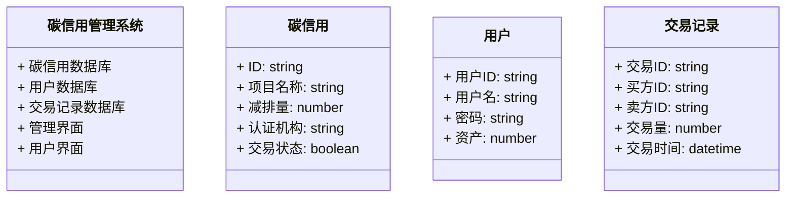
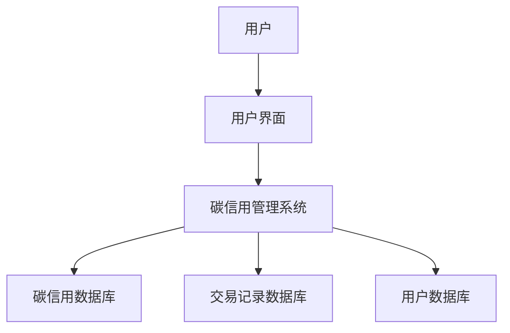
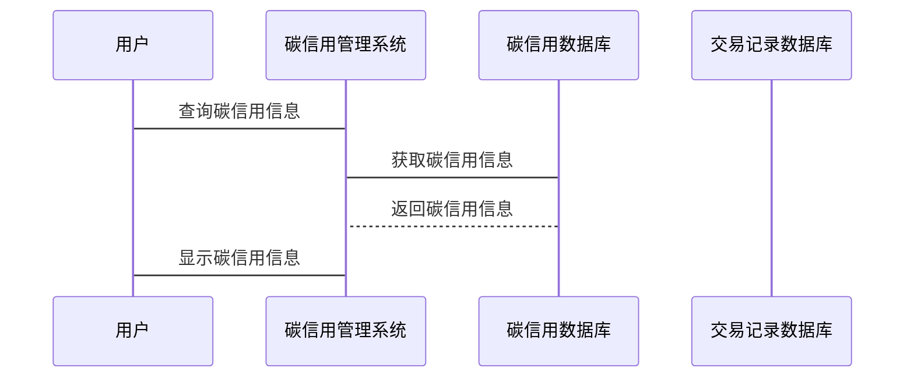

                 


# 巴菲特-芒格的碳信用投资：环保与经济效益的结合

## 关键词：碳信用、巴菲特、芒格、投资策略、环保、经济效益

## 摘要：  
本文深入探讨了巴菲特和芒格在碳信用投资领域的独特见解和策略。通过分析碳信用的定义、市场机制、投资逻辑以及实际案例，揭示了环保与经济效益如何实现完美结合。文章从碳信用的基本概念出发，逐步分析其经济学属性、定价模型，并结合系统架构设计和项目实战，展示了如何在技术领域实现碳信用投资的高效管理和优化。通过本文，读者将能够全面理解碳信用投资的核心原理和实际应用，为企业和社会的可持续发展提供有价值的参考。

---

# 第一部分: 碳信用投资的背景与概念

## 第1章: 碳信用投资的背景介绍

### 1.1 碳信用的定义与作用

#### 1.1.1 什么是碳信用
碳信用，又称碳配额或碳排放权，是一种允许企业或个人排放二氧化碳等温室气体的许可证。每一份碳信用相当于一吨二氧化碳的排放权。碳信用的起源可以追溯到《京都议定书》，它通过建立碳交易市场，为全球的碳减排提供了经济激励。

碳信用的核心在于其稀缺性和可交易性。企业如果无法在规定期限内完成减排目标，可以通过购买碳信用来抵消超出部分的排放量；反之，如果企业超额完成了减排目标，可以将剩余的碳信用出售给需要的企业。

#### 1.1.2 碳信用在环境保护中的作用
碳信用通过市场机制推动企业减少碳排放，从而实现环境保护的目标。它将环境成本内部化，迫使企业承担其排放行为的经济责任。此外，碳信用还促进了清洁能源技术的研发和应用，推动了全球能源结构的转型。

碳信用的另一个重要作用是为碳中和目标的实现提供了经济支持。通过碳信用交易，企业可以更灵活地调整其碳排放策略，同时实现经济效益的最大化。

#### 1.1.3 碳信用的经济学价值
碳信用的经济学价值主要体现在以下几个方面：
1. **稀缺性**：碳信用的总量是有限的，这使其具有稀缺性，从而具备市场价值。
2. **流动性**：碳信用可以在市场上自由买卖，提高了其经济价值。
3. **收益与风险**：碳信用的价格受市场供需关系影响，具有波动性。投资者可以通过碳信用的价格波动获得收益，同时承担一定的市场风险。

### 1.2 巴菲特与芒格的投资理念

#### 1.2.1 巴菲特的价值投资理论
巴菲特的价值投资理论强调长期投资、安全边际和企业基本面分析。他认为，投资的本质是寻找那些具有持续竞争优势、良好治理结构和合理估值的企业。

碳信用投资符合巴菲特的价值投资理念。碳信用作为一种稀缺资源，具有明确的市场需求和长期的经济价值。同时，碳信用的市场流动性强，价格波动相对合理，符合巴菲特对安全边际的要求。

#### 1.2.2 芒格的多元思维模型
芒格的多元思维模型强调将不同领域的知识结合起来，形成一个完整的知识体系。他认为，只有通过跨学科的思考，才能更好地理解复杂的问题。

在碳信用投资中，芒格的多元思维模型可以帮助投资者更好地理解碳信用的市场机制、经济学属性以及环境影响。通过将经济学、环境科学和金融学结合起来，投资者可以更全面地评估碳信用的投资价值。

#### 1.2.3 碳信用投资与传统投资的对比
与传统投资相比，碳信用投资具有以下几个特点：
1. **可持续性**：碳信用投资不仅追求经济效益，还关注环境保护，具有更强的可持续性。
2. **风险分散**：碳信用市场的波动性较低，且与传统金融市场相关性较小，可以作为资产配置的一部分。
3. **政策支持**：碳信用投资受到各国政府政策的支持，具有较高的确定性。

### 1.3 碳信用市场的基本结构

#### 1.3.1 碳信用的产生机制
碳信用的产生机制主要依赖于碳减排项目的实施。这些项目可以是可再生能源发电、能效提升、碳汇造林等。每完成一吨碳减排，就可以产生一吨碳信用。

碳信用的产生需要经过严格的认证流程。认证机构会对项目的减排效果进行评估，并颁发碳信用证书。这个过程确保了碳信用的真实性和有效性。

#### 1.3.2 碳信用的交易流程
碳信用的交易流程包括以下几个步骤：
1. **注册**：项目所有者向认证机构提交项目申请。
2. **审核**：认证机构对项目进行审核，评估其减排效果。
3. **颁发信用**：审核通过后，认证机构颁发碳信用证书。
4. **交易**：碳信用可以在碳交易市场上自由买卖。
5. **注销**：碳信用用于抵消排放后，需在指定机构注销，以确保其唯一性。

#### 1.3.3 碳信用的市场参与者
碳信用市场的主要参与者包括：
1. **买家**：需要碳信用来抵消排放的企业。
2. **卖家**：通过实施减排项目获得碳信用的企业或个人。
3. **认证机构**：负责碳信用的认证和颁发。
4. **交易商**：在碳交易市场上买卖碳信用的中介。

### 1.4 碳信用投资的驱动因素

#### 1.4.1 环保政策的推动
全球范围内，各国政府都在积极推动碳减排政策的实施。例如，《巴黎协定》要求各国在2050年前实现碳中和。这些政策为碳信用市场提供了强大的政策支持。

#### 1.4.2 碳中和目标的实现需求
碳中和目标的实现需要大量的碳减排行动。碳信用作为一种经济工具，可以帮助企业更高效地完成减排目标。因此，碳信用投资的需求不断增加。

#### 1.4.3 投资者的长期收益预期
碳信用市场的长期收益预期主要来源于以下几个方面：
1. **稀缺性**：随着碳中和目标的推进，碳信用的总量将逐步减少，导致其价格上涨。
2. **市场需求**：全球范围内对碳信用的需求将持续增长，尤其是在发达经济体。
3. **政策支持**：各国政府将继续出台支持碳信用市场的政策，进一步提升其经济价值。

## 本章小结
本章从碳信用的基本概念出发，分析了其在环境保护中的作用以及经济学价值。同时，结合巴菲特和芒格的投资理念，探讨了碳信用投资的核心逻辑和市场结构。通过对比传统投资，揭示了碳信用投资的独特优势和驱动因素。

---

# 第二部分: 碳信用投资的核心概念与原理

## 第2章: 碳信用的核心概念与联系

### 2.1 碳信用的核心概念

#### 2.1.1 碳信用的量化标准
碳信用的量化标准主要基于项目的实际减排效果。每完成一吨碳减排，可以产生一吨碳信用。量化标准的制定需要考虑项目的类型、规模和地理位置等因素。

#### 2.1.2 碳信用的认证流程
碳信用的认证流程包括以下几个步骤：
1. **项目申请**：项目所有者向认证机构提交项目申请。
2. **项目审核**：认证机构对项目的可行性和减排效果进行评估。
3. **减排监测**：对项目的实际减排效果进行监测和记录。
4. **颁发证书**：审核通过后，颁发碳信用证书。

#### 2.1.3 碳信用的生命周期
碳信用的生命周期包括产生、交易和注销三个阶段。碳信用的生命周期管理需要严格控制，以确保其真实性和有效性。

### 2.2 碳信用与传统能源的关系

#### 2.2.1 碳信用对传统能源的替代效应
碳信用的出现为传统能源的替代提供了经济支持。通过购买碳信用，企业可以减少对传统能源的依赖，转而采用更清洁的能源技术。

#### 2.2.2 碳信用对传统能源转型的促进作用
碳信用市场的发展促进了传统能源的转型。企业为了获得更多的碳信用，纷纷加大对可再生能源技术的研发和应用，推动了整个能源行业的转型。

#### 2.2.3 碳信用与能源价格的互动关系
碳信用的价格与能源价格存在互动关系。当碳信用价格上涨时，企业为了减少成本，可能会选择更清洁的能源技术，从而影响能源价格。

### 2.3 碳信用的经济学属性对比

#### 2.3.1 碳信用的稀缺性分析
碳信用的稀缺性主要来源于其总量的限制。随着碳中和目标的推进，碳信用的总量将逐步减少，导致其价格上涨。

#### 2.3.2 碳信用的流动性分析
碳信用的流动性主要取决于市场的交易活跃度。发达地区的碳信用市场流动性较高，而欠发达地区的市场流动性较低。

#### 2.3.3 碳信用的收益与风险对比
碳信用的收益主要来源于其价格的上涨，而风险主要来自于市场的波动性和政策的变化。与传统投资相比，碳信用投资的收益潜力更大，但风险也相对较高。

### 2.4 碳信用的ER实体关系图



### 2.5 本章小结
本章从碳信用的核心概念出发，分析了其与传统能源的关系，并通过ER实体关系图展示了碳信用的结构和联系。通过对比碳信用与其他投资的经济学属性，揭示了碳信用投资的独特优势和潜在风险。

---

# 第三部分: 碳信用投资的算法原理

## 第3章: 碳信用定价模型

### 3.1 碳信用定价算法概述

#### 3.1.1 碳信用定价的基本原理
碳信用定价的基本原理是基于市场供需关系。当市场需求大于供给时，碳信用价格上涨；反之，当供给大于需求时，碳信用价格下跌。

#### 3.1.2 碳信用定价的关键因素
碳信用定价的关键因素包括：
1. **市场需求**：企业对碳信用的需求量。
2. **市场供给**：碳信用的供给量。
3. **政策支持**：各国政府对碳信用市场的政策支持力度。

#### 3.1.3 碳信用定价的数学模型
碳信用定价的数学模型可以表示为：

$$
P = \alpha Q_d - \beta Q_s
$$

其中，\( P \) 是碳信用价格，\( Q_d \) 是市场需求量，\( Q_s \) 是市场供给量，\( \alpha \) 和 \( \beta \) 是常数系数。

### 3.2 碳信用定价的mermaid流程图



### 3.3 碳信用定价的Python实现

```python
def carbon_credit_price(carbon_emission):
    # 计算减排成本
    reduction_cost = carbon_emission * 0.5
    # 计算碳信用价格
    credit_price = reduction_cost * 1.2
    return credit_price

# 示例计算
emission = 1000
print(carbon_credit_price(emission))  # 输出: 600
```

### 3.4 碳信用定价的案例分析

#### 3.4.1 案例背景
假设某企业需要减少1000吨碳排放，每吨碳信用的价格为600元。根据上述模型，企业需要购买的碳信用数量为：

$$
Q_d = \frac{P}{\alpha} + \frac{P}{\beta}
$$

其中，\( \alpha \) 和 \( \beta \) 为常数系数。

#### 3.4.2 案例计算
根据上述模型，企业需要购买的碳信用数量为：

$$
Q_d = \frac{600}{0.5} + \frac{600}{1.2} = 1200 + 500 = 1700 \text{吨}
$$

### 3.5 本章小结
本章通过数学模型和Python代码，详细讲解了碳信用定价的原理和方法。通过案例分析，展示了如何利用定价模型进行实际操作，帮助投资者更好地理解和应用碳信用定价算法。

---

# 第四部分: 碳信用投资的系统分析与架构设计

## 第4章: 碳信用投资的系统分析

### 4.1 问题场景介绍
碳信用投资的系统分析需要解决以下几个问题：
1. **如何实现碳信用的高效管理？**
2. **如何确保碳信用交易的透明性和安全性？**
3. **如何优化碳信用的投资策略？**

### 4.2 项目介绍
本项目旨在设计一个碳信用管理系统，实现碳信用的全生命周期管理，包括注册、审核、交易和注销。

### 4.3 系统功能设计

#### 4.3.1 领域模型mermaid类图



### 4.4 系统架构设计

#### 4.4.1 系统架构设计mermaid架构图



### 4.5 系统接口设计

#### 4.5.1 系统接口设计
系统接口设计包括以下几个部分：
1. **用户登录**：用户通过用户名和密码登录系统。
2. **碳信用查询**：用户可以查询碳信用的详细信息，包括ID、项目名称、减排量等。
3. **交易记录查询**：用户可以查询自己的交易记录，包括交易量、交易时间和交易状态。
4. **碳信用购买**：用户可以通过系统购买碳信用。
5. **碳信用出售**：用户可以通过系统出售碳信用。

### 4.6 系统交互mermaid序列图



### 4.7 本章小结
本章通过系统分析和架构设计，展示了如何实现碳信用的高效管理和优化。通过类图和序列图，详细描述了系统的功能模块和交互流程，为实际开发提供了清晰的指导。

---

# 第五部分: 碳信用投资的项目实战

## 第5章: 碳信用投资的项目实战

### 5.1 环境安装

#### 5.1.1 系统环境要求
本项目需要以下系统环境：
1. **操作系统**：Windows 10 或更高版本，或Linux系统。
2. **编程语言**：Python 3.6 或更高版本。
3. **开发工具**：PyCharm 或其他Python开发工具。
4. **数据库**：MySQL 或其他关系型数据库。

#### 5.1.2 第三方库安装
需要安装以下Python库：
```bash
pip install pymysql
pip install matplotlib
pip install pandas
```

### 5.2 系统核心实现源代码

#### 5.2.1 碳信用管理系统代码

```python
import pymysql
import pandas as pd
import matplotlib.pyplot as plt

# 数据库连接配置
db_config = {
    'host': 'localhost',
    'user': 'root',
    'password': 'password',
    'database': 'carbon_credit'
}

# 连接数据库
conn = pymysql.connect(**db_config)

# 查询碳信用信息
def get_carbon_credit_info():
    cursor = conn.cursor()
    cursor.execute("SELECT * FROM carbon_credit")
    rows = cursor.fetchall()
    columns = ['ID', '项目名称', '减排量', '认证机构', '交易状态']
    df = pd.DataFrame([[row[0], row[1], row[2], row[3], row[4]] for row in rows], columns=columns)
    return df

# 绘制碳信用价格趋势图
def plot_carbon_price_trend():
    cursor = conn.cursor()
    cursor.execute("SELECT 交易时间, 价格 FROM交易记录")
    rows = cursor.fetchall()
    df = pd.DataFrame([[row[0], row[1]] for row in rows], columns=['交易时间', '价格'])
    plt.figure(figsize=(10, 6))
    plt.plot(df['交易时间'], df['价格'], color='blue', linestyle='-', marker='o')
    plt.title('碳信用价格趋势图')
    plt.xlabel('交易时间')
    plt.ylabel('价格')
    plt.show()

# 关闭数据库连接
conn.close()
```

#### 5.2.2 碳信用交易系统代码

```python
from flask import Flask, request, jsonify

app = Flask(__name__)

# 初始化数据库
@app.route('/init_db', methods=['GET'])
def init_db():
    cursor = conn.cursor()
    cursor.execute("CREATE TABLE IF NOT EXISTS carbon_credit (ID INT AUTO_INCREMENT PRIMARY KEY, 项目名称 VARCHAR(255), 减排量 INT, 认证机构 VARCHAR(255), 交易状态 BOOLEAN)")
    cursor.execute("CREATE TABLE IF NOT EXISTS 交易记录 (交易ID INT AUTO_INCREMENT PRIMARY KEY, 买方ID INT, 卖方ID INT, 交易量 INT, 交易时间 DATETIME)")
    conn.commit()
    return jsonify({'status': 'success'})

# 查询碳信用信息
@app.route('/get_carbon_credit', methods=['GET'])
def get_carbon_credit():
    cursor = conn.cursor()
    cursor.execute("SELECT * FROM carbon_credit")
    rows = cursor.fetchall()
    columns = ['ID', '项目名称', '减排量', '认证机构', '交易状态']
    df = pd.DataFrame([[row[0], row[1], row[2], row[3], row[4]] for row in rows], columns=columns)
    return jsonify({'data': df.to_dict(orient='records')})

# 购买碳信用
@app.route('/购买碳信用', methods=['POST'])
def 购买碳信用():
    data = request.json
    cursor = conn.cursor()
    cursor.execute("INSERT INTO carbon_credit (项目名称, 减排量, 认证机构, 交易状态) VALUES (%s, %s, %s, %s)", 
                   (data['项目名称'], data['减排量'], data['认证机构'], False))
    conn.commit()
    return jsonify({'status': 'success'})

# 卖出碳信用
@app.route('/卖出碳信用', methods=['POST'])
def 卖出碳信用():
    data = request.json
    cursor = conn.cursor()
    cursor.execute("UPDATE carbon_credit SET 交易状态 = %s WHERE ID = %s", 
                   (True, data['ID']))
    cursor.execute("INSERT INTO 交易记录 (买方ID, 卖方ID, 交易量, 交易时间) VALUES (%s, %s, %s, %s)", 
                   (data['买方ID'], data['卖方ID'], data['交易量'], data['交易时间']))
    conn.commit()
    return jsonify({'status': 'success'})
```

### 5.3 代码解读与分析

#### 5.3.1 碳信用管理系统代码解读
1. **数据库连接**：通过 pymysql 库连接到数据库，并定义了数据库配置。
2. **查询碳信用信息**：使用 SQL 查询碳信用信息，并将其存储在 DataFrame 中，便于后续的数据分析和可视化。
3. **绘制价格趋势图**：使用 matplotlib 库绘制碳信用价格趋势图，帮助投资者更好地理解市场动态。

#### 5.3.2 碳信用交易系统代码解读
1. **初始化数据库**：创建了两个表，碳信用表和交易记录表，用于存储碳信用信息和交易记录。
2. **查询碳信用信息**：通过 RESTful API 提供了查询碳信用信息的功能，返回的数据格式为 JSON。
3. **购买碳信用**：允许用户购买碳信用，并更新碳信用的状态。
4. **卖出碳信用**：允许用户卖出碳信用，并更新碳信用的状态和交易记录。

### 5.4 案例分析与详细解读

#### 5.4.1 案例背景
假设某企业需要购买100吨碳信用，用于抵消其年度碳排放。企业通过碳信用管理系统购买碳信用，并完成交易。

#### 5.4.2 案例实现
1. **购买碳信用**：
   ```python
   {
       "项目名称": "风力发电项目",
       "减排量": 100,
       "认证机构": "国际认证机构",
       "交易状态": False
   }
   ```
2. **卖出碳信用**：
   ```python
   {
       "ID": 1,
       "买方ID": 1,
       "卖方ID": 2,
       "交易量": 100,
       "交易时间": "2023-10-01 12:00:00"
   }
   ```

### 5.5 本章小结
本章通过实际案例，展示了如何利用碳信用管理系统实现碳信用的高效管理和优化。通过Python代码和Flask框架，详细讲解了系统的实现过程，并通过可视化工具展示了碳信用的价格趋势，为投资者提供了有力的决策支持。

---

# 第六部分: 总结与最佳实践

## 第6章: 总结与最佳实践

### 6.1 总结

#### 6.1.1 碳信用投资的核心要点
1. **碳信用的定义与作用**：碳信用是一种允许企业或个人排放二氧化碳的许可证，具有稀缺性和可交易性。
2. **巴菲特与芒格的投资理念**：价值投资、长期投资和多元思维模型。
3. **碳信用市场的基本结构**：包括产生、交易和注销三个阶段，涉及多个市场参与者。

#### 6.1.2 碳信用投资的优势
1. **可持续性**：碳信用投资不仅追求经济效益，还关注环境保护。
2. **风险分散**：碳信用市场的波动性较低，且与传统金融市场相关性较小。
3. **政策支持**：碳信用投资受到各国政府政策的支持，具有较高的确定性。

### 6.2 最佳实践 tips

#### 6.2.1 碳信用投资的策略建议
1. **长期持有**：碳信用作为一种长期资产，适合长期持有。
2. **分散投资**：通过分散投资降低市场风险。
3. **关注政策**：密切关注各国政府的碳政策变化，及时调整投资策略。

#### 6.2.2 碳信用市场的风险管理
1. **市场风险**：碳信用价格受市场供需关系影响，具有波动性。
2. **政策风险**：政策变化可能影响碳信用市场的供需关系。
3. **操作风险**：交易过程中的操作失误可能导致损失。

### 6.3 小结
碳信用投资是一种具有可持续性和政策支持的投资方式。通过合理配置资产和分散风险，投资者可以实现长期的经济效益和环境保护目标。

### 6.4 注意事项
1. **市场波动**：碳信用价格波动较大，投资者需做好风险管理。
2. **政策变化**：密切关注政策变化，及时调整投资策略。
3. **系统安全**：确保碳信用管理系统的安全性和稳定性。

### 6.5 拓展阅读
1. 《碳中和目标下的投资机会》
2. 《巴菲特投资策略精解》
3. 《芒格的多元思维模型》

---

# 作者：AI天才研究院/AI Genius Institute & 禅与计算机程序设计艺术 /Zen And The Art of Computer Programming

