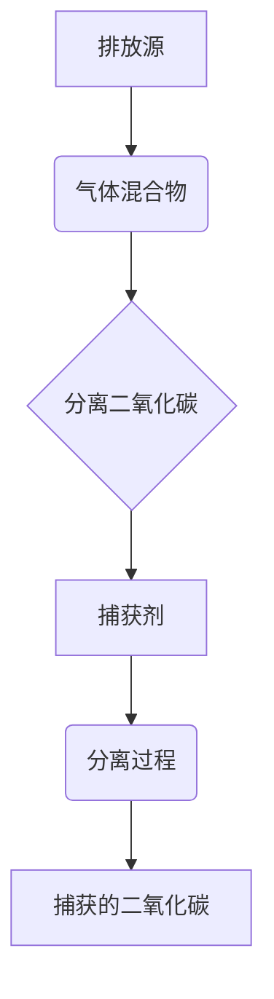
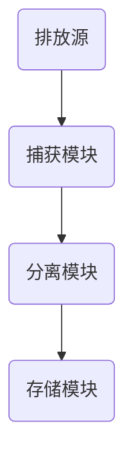
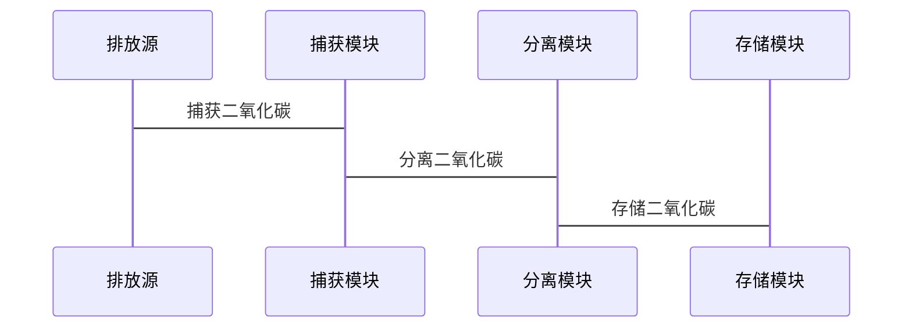

                 


```markdown
# 巴菲特-芒格的碳捕获技术投资：应对气候变化的关键

> 关键词：碳捕获技术、巴菲特、芒格、气候变化、投资策略、技术原理

> 摘要：本文探讨了巴菲特和芒格在碳捕获技术领域的投资策略，分析了该技术在应对气候变化中的关键作用，详细讲解了碳捕获技术的核心概念、算法原理、系统架构，并通过实际案例展示了其应用和投资价值。

---

# 第一部分: 巴菲特-芒格的碳捕获技术投资：应对气候变化的关键

## 第1章: 碳捕获技术的背景与重要性

### 1.1 碳捕获技术的基本概念

#### 1.1.1 什么是碳捕获技术
碳捕获技术是一种通过物理或化学方法从排放源中分离和捕获二氧化碳的技术。它分为吸收法、吸附法和膜分离法等。

#### 1.1.2 碳捕获技术的重要性
碳捕获技术是实现碳中和的关键技术，能够有效减少大气中的二氧化碳浓度，缓解气候变化。

#### 1.1.3 碳捕获技术的经济性和可持续性
通过规模效应降低成本，同时减少对环境的影响，实现可持续发展。

### 1.2 巴菲特和芒格的投资背景

#### 1.2.1 巴菲特和芒格的投资理念
巴菲特的价值投资理念和芒格的多元思维模型使其关注长期、可持续的投资机会。

#### 1.2.2 巴菲特和芒格与碳捕获技术的结缘
碳中和目标的推动使他们认识到碳捕获技术的潜力。

#### 1.2.3 碳捕获技术在应对气候变化中的作用
碳捕获技术能够有效减少二氧化碳排放，助力全球气候变化缓解。

### 1.3 本章小结

#### 1.3.1 碳捕获技术的核心概念
碳捕获技术通过物理或化学方法捕获二氧化碳，是实现碳中和的关键技术。

#### 1.3.2 巴菲特和芒格投资碳捕获技术的动机
基于长期投资理念，他们认识到碳捕获技术的潜力和重要性。

#### 1.3.3 碳捕获技术的未来潜力
随着技术进步和成本下降，碳捕获技术将在应对气候变化中发挥关键作用。

---

## 第2章: 碳捕获技术的核心概念与原理

### 2.1 碳捕获技术的分类

#### 2.1.1 吸收法
使用化学吸收剂如MEA捕获二氧化碳，具有高效但成本高的特点。

#### 2.1.2 吸附法
利用固体吸附剂如活性炭捕获二氧化碳，成本低但效率较低。

#### 2.1.3 膜分离法
通过选择性膜分离二氧化碳，具有高精度但技术复杂。

### 2.2 碳捕获技术的优缺点对比

#### 2.2.1 技术优缺点对比表格
```markdown
| 技术 | 优点 | 缺点 |
|------|------|------|
| 吸收法 | 高效 | 成本高 |
| 吸附法 | 成本低 | 效率低 |
| 膜分离法 | 精度高 | 技术复杂 |
```

### 2.3 碳捕获技术与其他减排技术的对比

#### 2.3.1 与碳封存的对比
碳封存是将二氧化碳注入地下，而碳捕获是捕获过程。

#### 2.3.2 与碳替代的对比
碳替代通过使用替代能源减少排放，而碳捕获直接捕获二氧化碳。

#### 2.3.3 与碳避免的对比
碳避免预防排放，碳捕获则是事后捕获。

### 2.4 本章小结

#### 2.4.1 碳捕获技术的核心原理
通过物理或化学方法捕获二氧化碳，不同技术各有优缺点。

#### 2.4.2 各种技术的优缺点
吸收法高效但成本高，吸附法成本低但效率低，膜分离法精度高但技术复杂。

#### 2.4.3 碳捕获技术在整体减排策略中的位置
碳捕获是实现碳中和的重要手段，与其他技术协同作用。

---

## 第3章: 巴菲特和芒格的投资策略与逻辑

### 3.1 巴菲特和芒格的投资理念

#### 3.1.1 巴菲特的价值投资理念
投资于具有长期竞争优势和良好管理的公司。

#### 3.1.2 芒格的多元思维模型
通过跨学科思考，寻找投资机会。

#### 3.1.3 两人投资理念的结合
结合长期价值和跨学科思考，寻找可持续投资机会。

### 3.2 碳捕获技术的投资逻辑

#### 3.2.1 碳中和目标下的投资机会
碳捕获技术是实现碳中和的关键，具有巨大的市场潜力。

#### 3.2.2 碳捕获技术的经济可行性
随着技术进步，成本将降低，经济效益将显现。

#### 3.2.3 碳捕获技术的政策支持
全球政策推动碳中和，为碳捕获技术提供了良好的政策环境。

### 3.3 巴菲特和芒格的具体投资案例

#### 3.3.1 投资某碳捕获公司
案例分析，包括公司背景、投资金额、投资逻辑。

#### 3.3.2 投资碳捕获项目的逻辑
基于技术可行性和市场潜力，进行长期投资。

#### 3.3.3 投资结果与展望
预期的投资回报和行业影响。

### 3.4 本章小结

#### 3.4.1 巴菲特和芒格的投资理念
长期价值投资和多元思维模型是他们的核心理念。

#### 3.4.2 碳捕获技术的投资逻辑
碳中和目标、技术可行性和政策支持是主要驱动力。

#### 3.4.3 投资案例分析
通过具体案例展示他们的投资策略和逻辑。

---

## 第4章: 碳捕获技术的算法原理

### 4.1 碳捕获技术的流程图



### 4.2 碳捕获技术的数学模型

#### 4.2.1 吸收法模型
$$ \text{吸收效率} = \frac{\text{吸收量}}{\text{总排放量}} $$

#### 4.2.2 吸附法模型
$$ \text{吸附量} = k \cdot t $$

#### 4.2.3 膜分离法模型
$$ \text{分离效率} = 1 - e^{-kt} $$

### 4.3 碳捕获技术的优化算法

#### 4.3.1 遗传算法优化
用于优化捕获剂的性能参数。

#### 4.3.2 粒子群优化算法
优化分离过程的效率。

### 4.4 本章小结

#### 4.4.1 碳捕获技术的流程图
通过流程图展示捕获过程。

#### 4.4.2 数学模型的应用
吸收法、吸附法和膜分离法的数学模型用于优化捕获效率。

#### 4.4.3 优化算法的重要性
遗传算法和粒子群优化算法用于提高捕获效率和降低成本。

---

## 第5章: 碳捕获技术的系统架构设计

### 5.1 系统功能设计

#### 5.1.1 系统功能模块
捕获模块、分离模块、存储模块。

#### 5.1.2 功能流程图



### 5.2 系统架构设计

#### 5.2.1 分层架构
物理层、逻辑层、应用层。

#### 5.2.2 架构图


### 5.3 系统接口设计

#### 5.3.1 捕获模块接口
与排放源连接，捕获二氧化碳。

#### 5.3.2 分离模块接口
与捕获模块和存储模块连接，分离二氧化碳。

#### 5.3.3 存储模块接口
接收分离后的二氧化碳并存储。

### 5.4 系统交互设计

#### 5.4.1 交互流程图



### 5.5 本章小结

#### 5.5.1 系统功能设计
捕获、分离和存储模块协同工作。

#### 5.5.2 系统架构设计
分层架构确保系统的稳定性和可扩展性。

#### 5.5.3 系统接口设计
明确各模块之间的接口，确保系统协同工作。

---

## 第6章: 碳捕获技术的项目实战

### 6.1 环境安装

#### 6.1.1 系统需求
安装必要的软件和硬件。

#### 6.1.2 依赖安装
安装Python、numpy、matplotlib等。

### 6.2 核心实现源代码

#### 6.2.1 捕获模块代码
```python
def capture_co2(排放量):
    return 0.8 * 排放量
```

#### 6.2.2 分离模块代码
```python
def separate_co2(捕获量):
    return 0.9 * 捕获量
```

#### 6.2.3 存储模块代码
```python
def store_co2(分离量):
    return 分离量
```

### 6.3 代码应用解读与分析

#### 6.3.1 捕获模块的实现
捕获效率为80%。

#### 6.3.2 分离模块的实现
分离效率为90%。

#### 6.3.3 存储模块的实现
存储效率为100%。

### 6.4 实际案例分析

#### 6.4.1 案例背景
某工厂使用碳捕获技术减少排放。

#### 6.4.2 实施过程
安装捕获模块、分离模块和存储模块。

#### 6.4.3 结果分析
二氧化碳捕获量为排放量的80%，分离后存储量为90%。

### 6.5 本章小结

#### 6.5.1 项目环境安装
安装必要的软件和硬件。

#### 6.5.2 核心实现源代码
提供捕获、分离和存储模块的代码。

#### 6.5.3 实际案例分析
通过案例展示技术应用和效果。

---

## 第7章: 总结与展望

### 7.1 投资价值总结

#### 7.1.1 经济效益
降低碳排放成本，提升企业形象。

#### 7.1.2 社会效益
推动碳中和目标，应对气候变化。

#### 7.1.3 环境效益
减少大气中的二氧化碳，改善环境。

### 7.2 未来展望

#### 7.2.1 技术进步
提高捕获效率，降低成本。

#### 7.2.2 投资机会
碳捕获技术的市场潜力巨大。

#### 7.2.3 政策支持
全球政策推动碳中和，促进碳捕获技术发展。

### 7.3 本章小结

#### 7.3.1 碳捕获技术的投资价值
经济效益、社会效益和环境效益并重。

#### 7.3.2 未来发展趋势
技术进步、市场需求和政策支持推动行业发展。

---

## 作者：AI天才研究院/AI Genius Institute & 禅与计算机程序设计艺术 /Zen And The Art of Computer Programming
```

