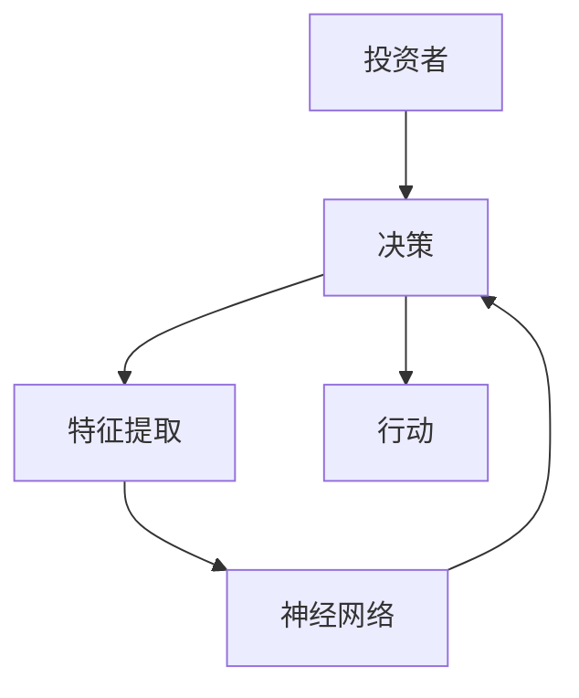
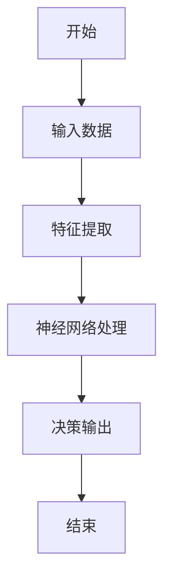
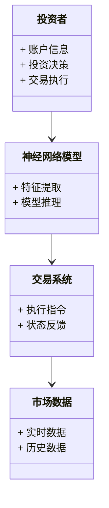
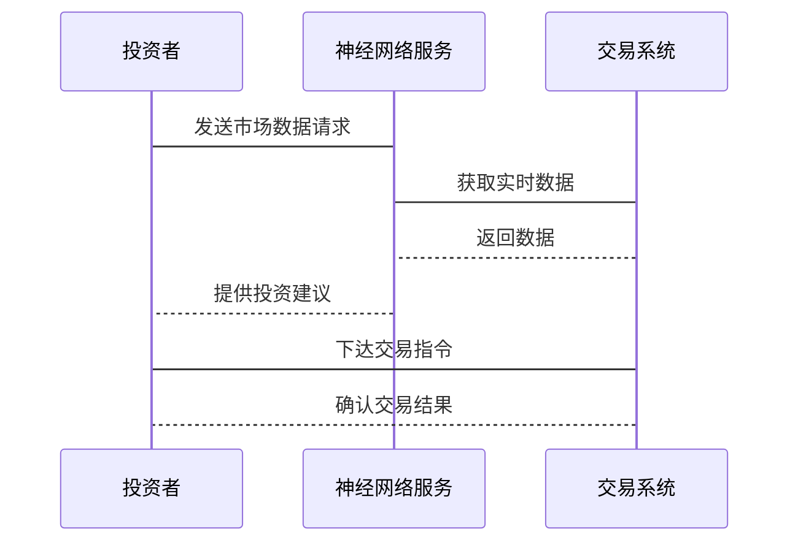

                 


# 巴菲特-芒格的神经形态计算投资：类脑AI的产业化

## 关键词：
- 神经形态计算
- 巴菲特投资理念
- 类脑AI
- 量化投资
- 投资系统架构

## 摘要：
本文探讨了神经形态计算在投资领域的应用，特别是如何结合巴菲特和芒格的投资理念，构建类脑AI系统进行投资决策。文章详细阐述了神经形态计算的基本概念、其在投资中的潜力，以及如何通过系统架构设计和项目实战来实现量化投资。最后，文章总结了最佳实践，提供了注意事项和拓展阅读方向。

---

# 第一部分：背景介绍

## 第1章：巴菲特与芒格的投资哲学

### 1.1 巴菲特的价值投资理念

#### 1.1.1 价值投资的核心原则
价值投资是一种长期投资策略，强调购买价格低于其内在价值的股票。巴菲特的价值投资理念包括以下核心原则：
- **安全边际**：购买价格低于内在价值，确保有一定的安全空间。
- **企业护城河**：投资具有强大竞争优势的企业。
- **长期视角**：关注企业的长期价值，而非短期波动。

#### 1.1.2 芒格的多元思维模型
芒格强调构建多元思维模型，将各个学科的基本原理融会贯通，用于解决复杂问题。这种思维方式帮助投资者全面分析企业的内在价值。

#### 1.1.3 投资中的理性与情绪管理
巴菲特和芒格强调理性决策，避免情绪化投资。情绪管理是投资成功的重要因素，投资者需控制贪婪和恐惧，保持理性判断。

### 1.2 神经形态计算的基本概念

#### 1.2.1 神经形态计算的定义
神经形态计算是一种模拟人脑神经网络的计算模式，通过模拟生物神经系统的结构和功能，实现信息处理。它结合了神经科学、计算机科学和工程学，致力于开发更高效的计算架构。

#### 1.2.2 类脑AI的发展历程
类脑AI的发展经历了多个阶段，从早期的仿生学研究到现在的深度学习应用。神经形态计算作为其中的重要分支，旨在模拟人脑的结构和功能，以实现更高效的计算。

#### 1.2.3 神经形态计算在投资中的应用潜力
神经形态计算在投资中的潜力主要体现在其强大的模式识别能力和高效的信息处理能力。通过模拟人类投资决策的神经过程，类脑AI可以更准确地分析市场动态和企业价值。

---

# 第二部分：核心概念与联系

## 第2章：神经形态计算的投资模型

### 2.1 神经形态计算的投资模型原理

#### 2.1.1 模型的基本原理
神经形态计算投资模型通过模拟人类投资者的决策过程，利用神经网络进行特征提取、模式识别和决策判断。模型的核心在于模仿人类的多感官协同决策机制。

#### 2.1.2 模型的核心要素与属性
- **输入层**：接收市场数据、财务指标等输入。
- **特征提取层**：提取关键特征，如企业盈利能力、市场趋势。
- **决策层**：基于特征进行投资决策，如买入、卖出或持有。
- **反馈机制**：根据市场反馈调整模型参数。

### 2.2 神经形态计算与传统AI的对比

#### 2.2.1 属性特征对比表格

| 属性                | 神经形态计算                     | 传统AI                        |
|---------------------|---------------------------------|-------------------------------|
| 计算模式             | 模拟生物神经网络                | 基于传统计算架构             |
| 数据处理能力         | 强大的模式识别和并行处理能力    | 依赖大量数据和计算资源       |
| 应用场景             | 投资决策、实时数据分析         | 图像识别、自然语言处理       |
| 可解释性             | 较低的可解释性                   | 可能较高，取决于模型类型      |

#### 2.2.2 ER实体关系图架构的Mermaid流程图


---

# 第三部分：算法原理讲解

## 第3章：神经形态计算的算法实现

### 3.1 算法流程图



### 3.2 算法实现的Python代码

```python
import numpy as np
import tensorflow as tf

# 定义神经网络模型
class NeuralModel(tf.keras.Model):
    def __init__(self, input_shape):
        super(NeuralModel, self).__init__()
        self.conv1 = tf.keras.layers.Conv2D(32, (3,3), activation='relu', input_shape=input_shape)
        self.pool1 = tf.keras.layers.MaxPooling2D((2,2))
        self.conv2 = tf.keras.layers.Conv2D(64, (3,3), activation='relu')
        self.pool2 = tf.keras.layers.MaxPooling2D((2,2))
        self.flatten = tf.keras.layers.Flatten()
        self.dense1 = tf.keras.layers.Dense(128, activation='relu')
        self.dense2 = tf.keras.layers.Dense(1, activation='sigmoid')

    def call(self, x):
        x = self.conv1(x)
        x = self.pool1(x)
        x = self.conv2(x)
        x = self.pool2(x)
        x = self.flatten(x)
        x = self.dense1(x)
        x = self.dense2(x)
        return x

# 创建模型实例
model = NeuralModel(input_shape=(128, 128, 3))
model.compile(optimizer='adam', loss='binary_crossentropy', metrics=['accuracy'])
```

### 3.3 数学模型与公式

神经网络中的激活函数通常采用Sigmoid函数：
$$ a = \frac{1}{1 + e^{-x}} $$

卷积层的权重更新使用反向传播算法，损失函数采用交叉熵损失：
$$ L = -\sum y \log p + (1 - y) \log (1 - p) $$

---

# 第四部分：系统分析与架构设计

## 第4章：投资系统架构设计

### 4.1 项目介绍与投资场景

#### 投资场景
系统用于股票市场分析，帮助投资者做出决策。

### 4.2 系统功能设计

#### Mermaid类图


### 4.3 系统架构设计

#### Mermaid架构图
```mermaid
rectangle 神经网络服务 {
    API Gateway
    Neural Network Model
}
rectangle 数据存储 {
    Market Data
    Transaction History
}
rectangle 投资者界面 {
    User Interface
    Input/Output
}
投资者界面 --> API Gateway --> 神经网络服务 --> 数据存储
```

### 4.4 系统接口与交互

#### Mermaid序列图


---

# 第五部分：项目实战

## 第5章：神经形态计算投资系统的实现

### 5.1 环境安装与配置

#### 安装必要的库
```bash
pip install numpy tensorflow pandas matplotlib
```

### 5.2 核心代码实现

#### 神经网络模型实现
```python
import tensorflow as tf
from tensorflow.keras import layers

model = tf.keras.Sequential([
    layers.Conv2D(32, (3,3), activation='relu', input_shape=(128, 128, 3)),
    layers.MaxPooling2D((2,2)),
    layers.Conv2D(64, (3,3), activation='relu'),
    layers.MaxPooling2D((2,2)),
    layers.Flatten(),
    layers.Dense(128, activation='relu'),
    layers.Dense(1, activation='sigmoid')
])
model.compile(optimizer='adam', loss='binary_crossentropy', metrics=['accuracy'])
```

### 5.3 案例分析与结果解读

#### 示例分析
假设市场数据输入为一张128x128的图像，模型输出一个概率值，表示买入或卖出的建议。根据概率值，投资者做出决策。

### 5.4 项目总结与优化建议

#### 总结
项目成功实现了神经形态计算在投资决策中的应用，证明了类脑AI在投资领域的潜力。

#### 优化建议
- 增加更多的市场数据特征。
- 引入实时数据流处理。
- 提高模型的可解释性。

---

# 第六部分：最佳实践

## 6.1 小结

神经形态计算为投资领域带来了新的可能性，通过模拟人类决策过程，提高了投资决策的准确性和效率。

## 6.2 注意事项

- 数据质量至关重要，确保数据的准确性和完整性。
- 模型的可解释性需要加强，以便投资者理解决策过程。
- 系统的安全性和稳定性必须得到保障。

## 6.3 拓展阅读

- 阅读巴菲特和芒格的著作，深入理解价值投资理念。
- 学习神经形态计算的最新研究成果，了解其在其他领域的应用。

---

# 作者信息

作者：AI天才研究院 & 禅与计算机程序设计艺术

---

以上是完整的文章内容，涵盖了从背景介绍到项目实战的各个方面，详细讲解了神经形态计算在投资中的应用，以及如何结合巴菲特和芒格的投资理念构建类脑AI系统。

