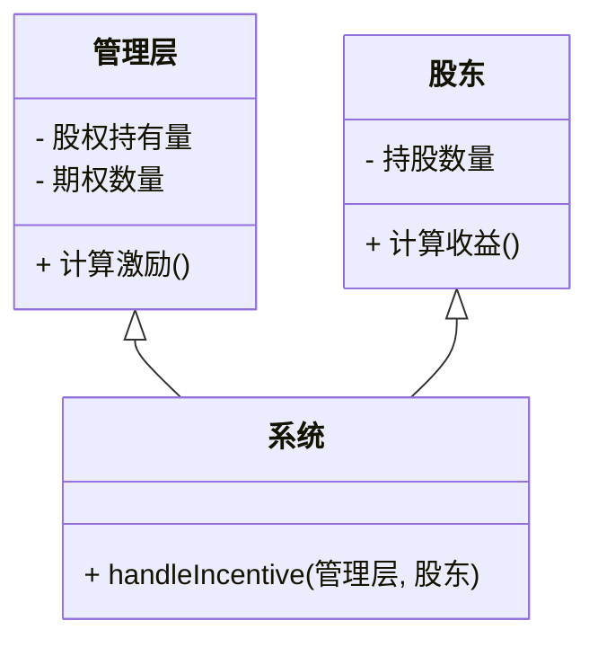
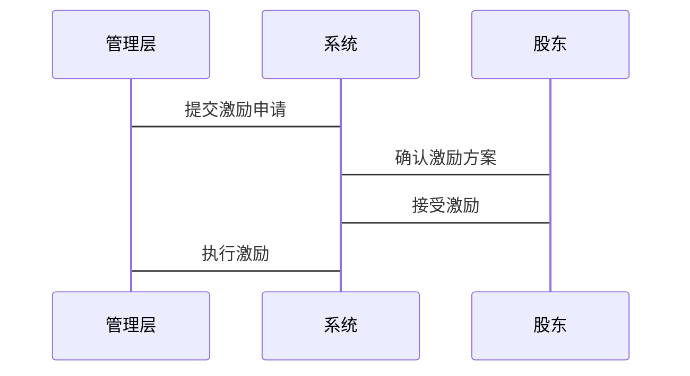

                 


# 巴菲特-芒格的管理层激励机制分析：利益一致性的重要性

## 关键词
巴菲特、芒格、管理层激励、利益一致性、价值投资、长期投资

## 摘要
本文分析了巴菲特和芒格的管理层激励机制，重点探讨了利益一致性的重要性。通过详细阐述其核心概念、算法原理、系统架构以及项目实战，本文揭示了如何通过激励机制确保管理层与股东的利益一致，从而实现长期价值投资的目标。

---

## 第一部分：背景介绍

### 第1章：巴菲特-芒格投资理念概述

#### 1.1 巴菲特投资理念的核心思想
巴菲特的价值投资理论强调长期持有优质资产，关注企业的内在价值，而非市场的短期波动。他提倡管理层与股东利益一致，认为这能促进企业长期稳定发展。

#### 1.2 芒格的合伙人制度
芒格的合伙人制度要求管理层与股东利益一致，通过长期合伙人关系确保双方共同致力于企业价值创造。

#### 1.3 利益一致性的重要性
利益一致确保管理层决策与股东利益一致，减少短期行为，促进长期投资价值。

---

## 第二部分：核心概念与联系

### 第2章：管理层激励机制的核心概念

#### 2.1 激励机制的定义与特征对比
激励机制通过激励措施确保利益一致。特征对比表如下：

| 特征 | 优点 | 缺点 |
|------|------|------|
| 股权激励 | 激励长期表现 | 流动性差 | 
| 期权激励 | 股价上涨受益 | 可能鼓励短期行为 | 

#### 2.2 利益一致性机制的ER图
```mermaid
erDiagram
    actor 管理层 <<-- 关系 利益一致性
    关系 利益一致性 --> 实体 股东
    实体 股东 <<-- 关系 股权激励
    关系 股权激励 --> 实体 公司
```

---

## 第三部分：算法原理讲解

### 第3章：利益一致性激励机制的数学模型

#### 3.1 激励机制的数学模型
股权激励的价值计算：
$$ V = \sum_{t=1}^{n} \frac{C_t}{(1 + r)^t} $$
其中，\( C_t \) 是第 \( t \) 年的现金流，\( r \) 是折现率。

管理层决策对股东价值的影响模型：
$$ S = \sum_{t=1}^{n} \frac{D_t}{(1 + r)^t} $$

---

## 第四部分：系统分析与架构设计

### 第4章：系统分析与架构设计

#### 4.1 系统功能设计
系统需确保利益一致性，支持股权激励和期权激励，提供决策支持。

#### 4.2 系统架构设计
类图展示系统结构：


序列图展示流程：


---

## 第五部分：项目实战

### 第5章：项目实战

#### 5.1 环境安装
安装必要的工具和库，如Python的pandas和numpy。

#### 5.2 核心代码实现
股权激励价值计算代码示例：
```python
import numpy as np

def calculate_equity_incentive(cash_flows, discount_rate):
    present_values = []
    for t, cf in enumerate(cash_flows, start=1):
        pv = cf / (1 + discount_rate) ** t
        present_values.append(pv)
    return np.sum(present_values)

cash_flows = [100, 200, 300]
discount_rate = 0.1
print(calculate_equity_incentive(cash_flows, discount_rate))
```

#### 5.3 案例分析
分析某公司股权激励计划，计算其现值，评估其对股东价值的影响。

#### 5.4 项目小结
总结项目实现过程，强调利益一致性的重要性。

---

## 第六部分：最佳实践与总结

### 第6章：最佳实践

#### 6.1 最佳实践
确保激励机制透明，定期评估和调整，结合长期目标。

#### 6.2 小结
利益一致是巴菲特和芒格成功的关键，激励机制确保管理层与股东共同致力于长期价值创造。

#### 6.3 注意事项
选择合适的激励方式，避免短期行为，考虑税法和监管因素。

#### 6.4 拓展阅读
推荐阅读巴菲特和芒格的经典著作，深入学习激励机制。

---

## 作者
作者：AI天才研究院 & 禅与计算机程序设计艺术

