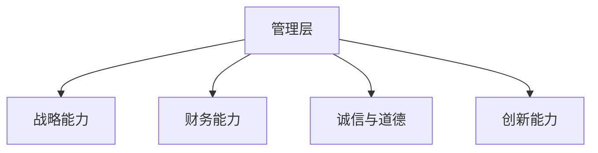
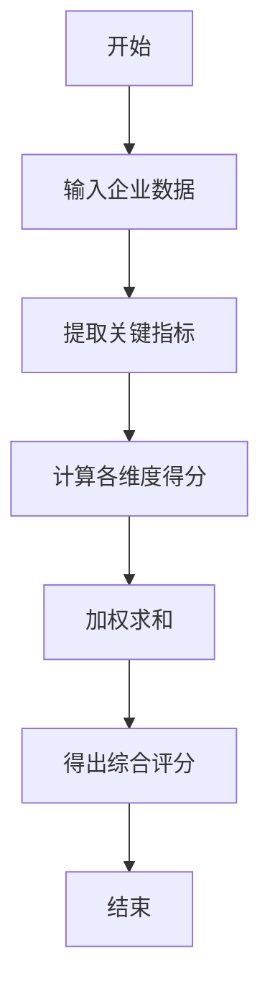
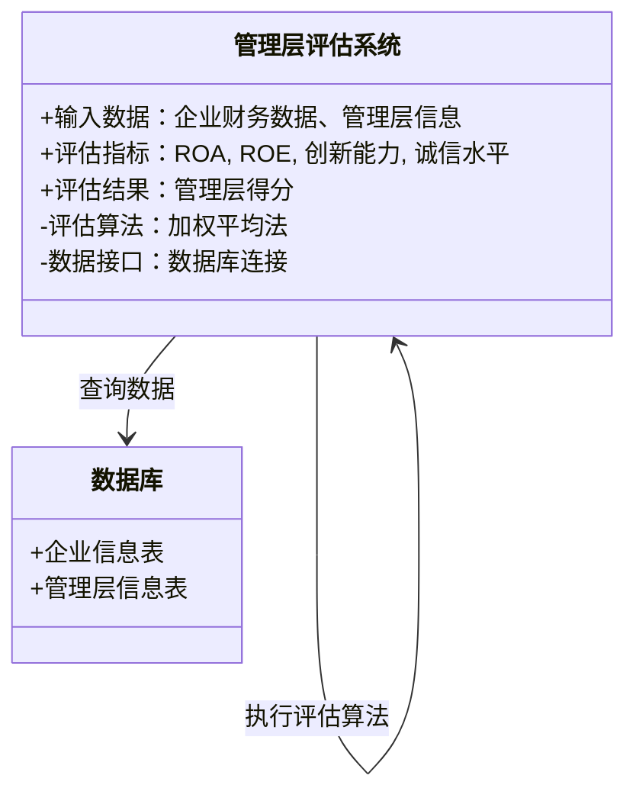
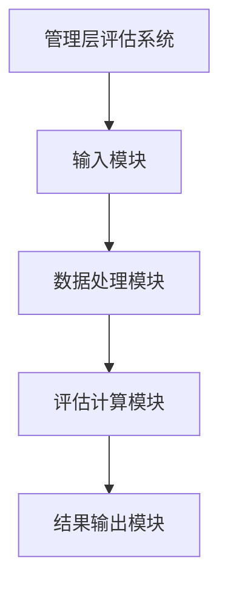
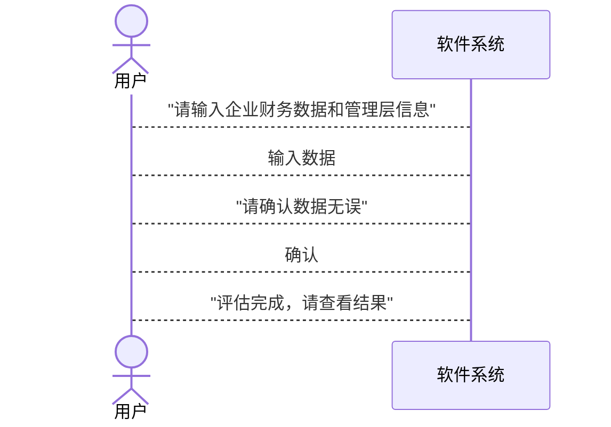

                 


# 巴菲特-芒格的管理层评估标准：寻找优秀的经营者

> 关键词：巴菲特，芒格，管理层评估，价值投资，经营者评估标准

> 摘要：本文详细阐述了巴菲特和芒格在评估企业管理层时的标准和方法，分析了他们如何通过战略能力、财务能力、诚信与道德、创新能力和团队协作能力来判断管理层的质量，并提供了具体的评估框架和数学模型。文章还结合实际案例，展示了如何在投资决策中应用这些标准，以帮助投资者识别和选择优秀的经营者。

---

# 第一部分: 巴菲特-芒格投资哲学与管理层评估背景

## 第1章: 巴菲特-芒格投资哲学概述

### 1.1 巴菲特与芒格的投资理念

#### 1.1.1 巴菲特的价值投资理论
巴菲特的价值投资理论强调以合理的价格买入具有持续竞争优势的优秀企业。他认为，企业的管理层是企业价值的核心驱动力，优秀的管理层能够最大化股东价值。他的投资理念可以概括为“买股票就是买企业”，而企业价值的实现离不开卓越的管理层。

#### 1.1.2 芒格的多元思维模型
芒格倡导多元思维模型，认为投资者应该通过多个学科的交叉研究来理解世界的运作方式。在管理层评估中，他主张从多个维度分析管理层的能力，包括战略思维、财务决策、创新能力和道德水平等。这种多元化的思维方式帮助他识别出那些在复杂环境中能够做出正确决策的优秀管理者。

#### 1.1.3 两人合作的黄金组合
巴菲特和芒格的合作堪称投资领域的典范。巴菲特负责具体的财务分析和企业估值，而芒格则负责从更广泛的视角审视企业的管理层和整体风险。两人的合作不仅提升了投资决策的准确性，还为投资者提供了一个系统化的评估框架。

---

### 1.2 管理层评估的重要性

#### 1.2.1 投资中的关键因素
在巴菲特和芒格看来，投资决策的核心在于对管理层质量的评估。他们认为，一家企业的长期价值取决于管理层是否能够持续创造价值，并在市场波动中保持企业的稳健发展。

#### 1.2.2 管理层质量对投资决策的影响
管理层的质量直接决定了企业的经营效率和抗风险能力。优秀的管理层能够在市场低迷时保持企业稳定，在市场繁荣时抓住机遇，从而为投资者带来超额收益。

#### 1.2.3 管理层评估的边界与外延
管理层评估并非孤立的行为，而是需要结合企业的财务状况、行业环境和市场趋势进行综合分析。评估的边界在于如何将管理层的能力与企业的实际表现相结合，而外延则体现在对管理层未来决策的预测上。

---

## 第2章: 管理层评估的核心概念与联系

### 2.1 核心概念与原理

#### 2.1.1 管理层评估的维度
在巴菲特和芒格的评估体系中，管理层的能力主要体现在以下几个方面：
- **战略能力**：包括企业长期战略的制定和执行能力。
- **财务能力**：包括资本分配、成本控制和风险管理能力。
- **诚信与道德**：包括管理层的诚信水平和职业道德。
- **创新能力**：包括产品的创新能力和对市场变化的适应能力。

#### 2.1.2 核心概念的属性特征对比表格
| 维度 | 描述 | 示例 |
|------|------|------|
| 战略能力 | 制定和执行战略的能力 | 长期目标设定 |
| 财务能力 | 管理财务和资本的能力 | 资本分配决策 |
| 诚信与道德 | 遵守道德规范 | 避免财务造假 |
| 创新能力 | 创新和改进的能力 | 产品创新 |

#### 2.1.3 管理层评估的ER实体关系图


---

### 2.2 评估框架的数学模型

#### 2.2.1 综合评估公式
$$ \text{管理层评估得分} = \frac{\text{战略能力} + \text{财务能力} + \text{诚信与道德} + \text{创新能力}}{4} $$

#### 2.2.2 各维度权重调整
$$ \text{调整后得分} = \sum (\text{维度得分} \times \text{权重}) $$

---

## 第3章: 管理层评估的算法原理

### 3.1 评估算法流程图


---

### 3.2 算法实现的Python代码示例

```python
# 定义评估函数
def evaluate_management(ROA, ROE, integrity_score, innovation_score):
    # 确定各维度权重
    weights = {'ROA': 0.3, 'ROE': 0.3, 'integrity': 0.2, 'innovation': 0.2}
    # 计算各维度加权得分
    roa_score = ROA * weights['ROA']
    roe_score = ROE * weights['ROE']
    integrity_score *= weights['integrity']
    innovation_score *= weights['innovation']
    # 计算总得分
    total_score = roa_score + roe_score + integrity_score + innovation_score
    return total_score

# 示例数据
ROA = 0.25
ROE = 0.18
integrity_score = 0.8
innovation_score = 0.7

# 调用评估函数
score = evaluate_management(ROA, ROE, integrity_score, innovation_score)
print(f"管理层评估得分: {score}")
```

---

### 3.3 数学模型的详细解释

#### 3.3.1 指标选择
在评估管理层时，通常选择以下关键指标：
- **ROA（资产回报率）**：衡量管理层的盈利能力。
- **ROE（股东权益回报率）**：衡量管理层的资本使用效率。
- **创新指标**：如新产品数量、研发投入占比等。
- **诚信指标**：通过管理层的过往记录和市场声誉评估。

#### 3.3.2 权重分配
根据巴菲特和芒格的经验，权重分配如下：
- ROA 和 ROE 各占30%。
- 诚信和创新各占20%。

---

## 第4章: 系统分析与架构设计方案

### 4.1 系统功能设计（领域模型）



---

### 4.2 系统架构设计



---

### 4.3 系统接口设计

- 输入接口：接收企业财务数据和管理层信息。
- 输出接口：返回管理层评估得分和详细报告。

---

### 4.4 系统交互设计



---

## 第5章: 项目实战

### 5.1 环境安装

- **Python版本**：3.8及以上
- **依赖库**：pandas, numpy, matplotlib

### 5.2 核心代码实现

```python
import pandas as pd
import numpy as np

# 数据加载
data = pd.read_csv('management_data.csv')

# 数据预处理
data = data.dropna()

# 计算各维度得分
data['ROA_score'] = data['ROA'] * 0.3
data['ROE_score'] = data['ROE'] * 0.3
data['integrity_score'] = data['integrity'] * 0.2
data['innovation_score'] = data['innovation'] * 0.2

# 计算总得分
data['total_score'] = data['ROA_score'] + data['ROE_score'] + data['integrity_score'] + data['innovation_score']

# 可视化
import matplotlib.pyplot as plt

plt.figure(figsize=(10,6))
plt.scatter(data['total_score'], data['公司名称'], c='blue')
plt.title('管理层评估得分分布')
plt.xlabel('得分')
plt.ylabel('公司名称')
plt.show()
```

---

### 5.3 案例分析

以某公司为例，假设其ROA=0.25，ROE=0.18，诚信评分=0.8，创新评分=0.7。代入评估模型：

$$ \text{总得分} = 0.25 \times 0.3 + 0.18 \times 0.3 + 0.8 \times 0.2 + 0.7 \times 0.2 = 0.075 + 0.054 + 0.16 + 0.14 = 0.429 $$

得分0.429表明该公司的管理层表现良好，具备较强的战略和财务能力，同时在创新和诚信方面也表现出色。

---

## 第6章: 总结与启示

### 6.1 最佳实践 tips
- 在评估管理层时，应结合定量分析和定性分析。
- 定期更新评估指标，以适应市场变化。
- 关注管理层的历史表现，而非仅仅依赖当前数据。

### 6.2 小结
本文通过巴菲特和芒格的管理层评估标准，详细探讨了如何通过战略能力、财务能力、诚信与道德、创新能力和团队协作能力来评估管理层的质量。结合数学模型和系统架构设计，为投资者提供了一个系统化的评估框架。

### 6.3 注意事项
- 数据的准确性和完整性是评估的基础。
- 评估结果应结合市场环境和行业特点进行调整。
- 避免过度依赖单一指标，确保评估的全面性。

### 6.4 拓展阅读
- 巴菲特《投资之道》
- 芒格《穷查理宝典》
- 投资分析相关书籍和文献

---

作者：AI天才研究院/AI Genius Institute & 禅与计算机程序设计艺术/Zen And The Art of Computer Programming

