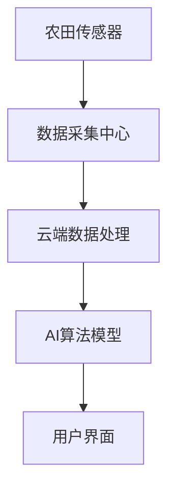
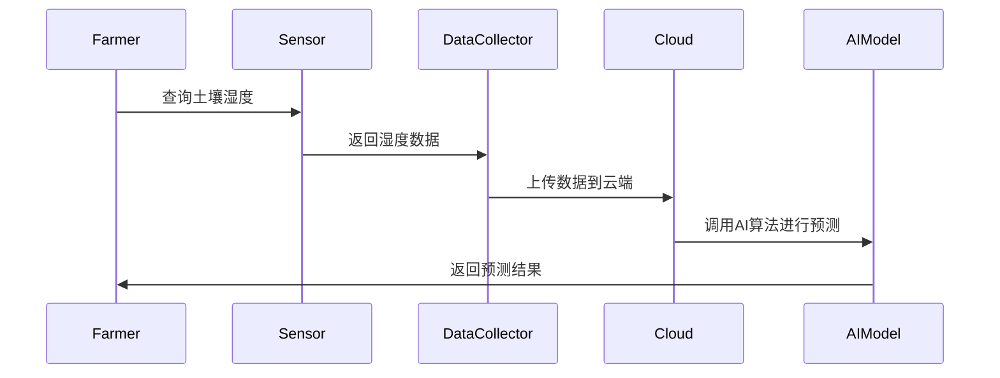

                 


# 巴菲特-芒格的精准农业投资：AI和物联网驱动的农业革命

---

## 关键词：
精准农业, AI, 物联网, 巴菲特, 芒格, 农业革命, 投资策略

---

## 摘要：
本文探讨了巴菲特和芒格在精准农业领域的投资策略，分析了AI和物联网技术如何推动农业革命。文章从精准农业的背景出发，详细阐述了AI和物联网在农业中的具体应用，结合实际案例分析了投资机会与风险，并提出了未来发展的展望。

---

## 第一部分：精准农业与投资背景

### 第1章：精准农业的背景与概念

#### 1.1 精准农业的定义与特点
精准农业是一种基于数据驱动的农业生产模式，通过整合AI、物联网、大数据等技术，实现对农田、作物和环境的精准监测与管理。其特点包括：
- **数据驱动**：依赖传感器、无人机和卫星等设备采集农田数据。
- **智能化**：利用AI算法进行预测和决策。
- **个性化**：针对不同地块、作物和环境条件进行差异化管理。

#### 1.2 AI与物联网在农业中的作用
- **AI**：用于作物监测、病虫害预测、产量预测等。
- **物联网**：用于实时数据采集、设备控制和环境监测。

#### 1.3 巴菲特与芒格的投资理念
- **巴菲特**：价值投资，注重企业基本面和长期价值。
- **芒格**：多元思维模型，关注复杂系统和长期趋势。

---

### 第2章：精准农业的投资价值

#### 2.1 市场现状
- 全球精准农业市场规模持续增长，主要驱动力包括技术进步和政策支持。
- 精准农业技术的应用范围不断扩大，从作物种植到畜牧业、渔业均有涉及。

#### 2.2 投资机会
- **农业物联网**：传感器、通信技术和数据平台的投资机会。
- **农业AI**：AI算法优化和农业大数据平台的投资。
- **精准农业设备**：智能灌溉系统、农业无人机等设备的市场需求增长。

#### 2.3 投资风险
- **技术风险**：AI和物联网技术的成熟度和稳定性影响投资回报。
- **市场风险**：农业市场的波动性和不确定性。
- **政策风险**：政策变化对精准农业技术的应用和推广有直接影响。

---

## 第二部分：AI与物联网驱动的农业技术

### 第3章：AI在精准农业中的应用

#### 3.1 作物管理中的AI应用
- **作物生长监测**：通过卫星图像和无人机数据，实时监测作物生长情况。
- **病虫害预测**：利用AI算法分析历史数据，预测病虫害的发生概率。
- **产量预测**：基于环境数据和作物特征，预测作物产量。

#### 3.2 农业供应链中的AI应用
- **供应链优化**：通过AI算法优化物流路径和库存管理。
- **产品溯源**：利用区块链技术实现农产品的全程溯源。

#### 3.3 农业金融中的AI应用
- **农业保险**：基于AI模型评估农业风险，制定保险方案。
- **农业贷款**：利用AI评估农民的信用风险，提供贷款支持。

---

### 第4章：物联网在精准农业中的应用

#### 4.1 数据采集与传输
- **传感器技术**：土壤湿度、温度、光照强度等环境参数的实时采集。
- **数据传输**：通过无线通信技术（如LoRa、5G）将数据传输到云端。

#### 4.2 环境监控与控制
- **土壤监测**：实时监测土壤湿度和养分含量，优化灌溉和施肥策略。
- **气候监测**：预测天气变化，调整温室环境参数。
- **植物健康监测**：通过传感器和图像识别技术，监测植物健康状况。

#### 4.3 设备控制
- **灌溉系统控制**：根据土壤湿度和天气预报自动控制灌溉设备。
- **温室环境控制**：通过物联网系统实现温室温度、湿度和光照的精准控制。

---

## 第三部分：精准农业投资策略与案例分析

### 第5章：精准农业投资策略

#### 5.1 投资策略概述
- **长期投资**：关注精准农业技术的长期发展和市场潜力。
- **技术驱动**：选择具有技术创新能力的企业和项目。
- **风险管理**：分散投资组合，降低技术风险和市场波动风险。

#### 5.2 投资案例分析
- **案例1：某农业物联网平台的投资**
  - 投资背景：通过物联网技术实现农田数据的实时监测和管理。
  - 投资回报：通过数据驱动的精准管理，提高产量和降低成本。
- **案例2：某农业AI算法公司的投资**
  - 投资背景：利用AI算法优化作物种植和病虫害防治。
  - 投资回报：通过技术输出和数据服务实现盈利。

---

## 第四部分：系统架构与技术实现

### 第6章：精准农业系统的架构设计

#### 6.1 系统功能设计
- **数据采集层**：传感器、无人机、卫星等设备采集农田数据。
- **数据处理层**：利用AI算法对数据进行分析和预测。
- **用户交互层**：提供可视化界面，供农民和投资者使用。

#### 6.2 系统架构图


#### 6.3 系统接口设计
- **传感器接口**：与土壤湿度传感器、气象站等设备对接。
- **用户接口**：提供API接口，方便第三方开发应用。

#### 6.4 系统交互流程


---

## 第五部分：项目实战与最佳实践

### 第7章：精准农业项目实战

#### 7.1 项目环境安装
- **硬件**：土壤湿度传感器、温度传感器、无线通信模块。
- **软件**：Python、TensorFlow、IoT平台（如Azure IoT Hub）。

#### 7.2 核心代码实现
```python
import numpy as np
from sklearn import linear_model

# 示例：基于线性回归的产量预测
def predict_yield(temperature, humidity, rainfall):
    # 数据预处理
    X = np.array([[temperature, humidity, rainfall]])
    y = np.array([100, 80, 60])  # 示例数据
    # 训练模型
    model = linear_model.LinearRegression()
    model.fit(X, y)
    # 预测产量
    predicted_yield = model.predict(X)
    return predicted_yield[0]

# 调用示例
temperature = 25
humidity = 70
rainfall = 100
print(predict_yield(temperature, humidity, rainfall))
```

#### 7.3 项目小结
- **技术实现**：通过AI算法和物联网技术实现精准农业的典型应用。
- **实际效果**：提高作物产量，降低成本，增强抗风险能力。

---

## 第六部分：未来展望与投资建议

### 第8章：精准农业的未来展望

#### 8.1 技术发展趋势
- **AI与物联网的深度融合**：进一步优化农业生产和管理。
- **区块链技术的应用**：实现农产品的全程溯源和信任机制。

#### 8.2 投资建议
- **关注技术创新**：投资具有核心技术优势的企业。
- **分散投资风险**：通过多元化投资降低市场波动风险。
- **长期持有**：精准农业技术的成熟和推广需要时间，投资者需具备耐心。

---

## 作者：AI天才研究院 / AI Genius Institute  
禅与计算机程序设计艺术 / Zen And The Art of Computer Programming

