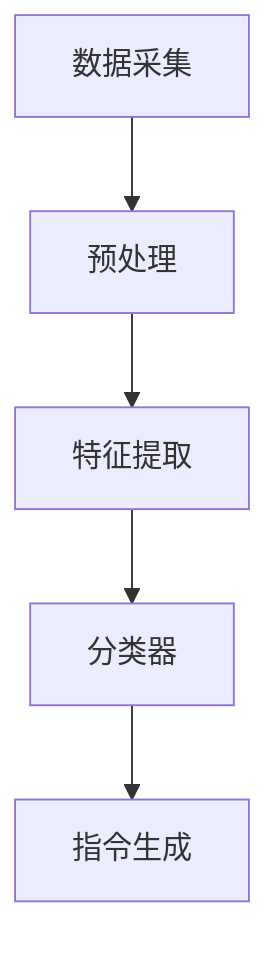
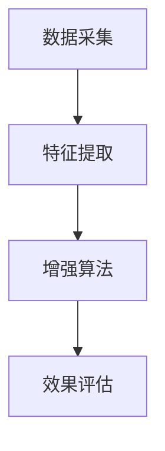

                 


# 巴菲特-芒格的脑机接口伦理投资：人类增强的未来

## 关键词：脑机接口，伦理投资，巴菲特，芒格，人类增强，技术伦理，投资策略

## 摘要：  
本文探讨了脑机接口技术在人类增强领域的应用及其与巴菲特和芒格价值投资理念的结合。通过分析脑机接口的核心算法、系统架构及伦理问题，结合实际案例，阐述了如何在技术进步与伦理投资之间找到平衡，为人类增强的未来提供有价值的参考。

---

# 第一部分：脑机接口与人类增强的背景介绍

## 第1章：脑机接口的核心概念与技术背景

### 1.1 脑机接口的定义与技术原理

脑机接口（Brain-Computer Interface, BCI）是一种通过采集和解析大脑神经信号，将其转化为可被计算机或其他设备理解的指令的技术。其核心原理包括数据采集（如EEG信号）、特征提取和分类，以及指令生成。

- 数据采集：通过电极采集大脑皮层的电信号。
- 特征提取：对信号进行降噪、滤波和特征提取。
- 分类器：使用机器学习算法（如SVM、神经网络）将特征映射到目标指令。

### 1.2 人类增强的背景与意义

人类增强技术旨在通过技术手段提升人类的生理或认知能力。脑机接口在这一领域具有重要作用，例如帮助残障人士恢复运动能力或提升注意力集中度。

### 1.3 巴菲特与芒格的价值投资理念

巴菲特和芒格的价值投资强调长期稳健回报，注重基本面分析和安全边际。其理念为脑机接口技术的投资提供了启示：寻找具有长期潜力且风险可控的项目。

---

# 第二部分：脑机接口与人类增强的核心概念对比

## 第2章：核心概念对比分析

### 2.1 脑机接口与人类增强的核心概念对比

| 属性       | 脑机接口                          | 人类增强                          |
|------------|-----------------------------------|-----------------------------------|
| 目标       | 解析大脑信号，生成指令          | 增强人类能力，改善生活质量          |
| 技术实现    | 神经信号采集与处理              | 结合生物技术与人工智能              |
| 应用场景    | 医疗康复、人机交互              | 智能增强、军事、教育                |

### 2.2 脑机接口与人类增强的ER实体关系图

```mermaid
er
    entity 脑机接口 {
        id
        采集设备
        处理算法
    }

    entity 人类增强 {
        id
        增强目标
        应用场景
    }

    脑机接口 -[1..n]-> 人类增强
```

---

# 第三部分：脑机接口的算法原理

## 第3章：脑机接口的核心算法流程

### 3.1 算法流程



### 3.2 数学模型

分类器常用的SVM模型：

$$
\text{目标函数} = \sum_{i=1}^{n} \lambda_i y_i (x_i \cdot w + b) + \frac{1}{2} w^T w
$$

其中，$w$为权重向量，$b$为偏置，$\lambda_i$为拉格朗日乘子。

---

# 第四部分：人类增强的算法原理

## 第4章：人类增强的核心算法流程

### 4.1 算法流程



### 4.2 数学模型

增强算法示例：

$$
y = f(x) + \epsilon
$$

其中，$f(x)$为增强函数，$\epsilon$为增强效果。

---

# 第五部分：系统架构设计

## 第5章：系统功能设计

### 5.1 领域模型


### 5.2 系统架构


---

# 第六部分：项目实战

## 第6章：系统实现与案例分析

### 6.1 环境安装

- Python 3.8+
- 库：numpy、scikit-learn、pymermaid

### 6.2 核心代码

```python
import numpy as np
from sklearn.svm import SVC

# 数据预处理
def preprocess(data):
    return data.dropna()

# 特征提取
def extract_features(data):
    features = data[['alpha', 'beta', 'theta']]
    return features.values

# 分类器训练
def train_classifier(X_train, y_train):
    clf = SVC()
    clf.fit(X_train, y_train)
    return clf

# 预测与评估
def evaluate(clf, X_test, y_test):
    accuracy = clf.score(X_test, y_test)
    return accuracy

# 应用场景：注意力增强
def注意力增强(data):
    processed = preprocess(data)
    features = extract_features(processed)
    clf = train_classifier(features, labels)
    return clf.predict(new_features)
```

### 6.3 案例分析

- **医疗康复**：帮助截瘫患者恢复部分运动功能。
- **教育领域**：提升学生注意力集中能力。

---

## 第七部分：伦理投资与小结

## 第7章：脑机接口的伦理投资与人类增强的未来

### 7.1 伦理挑战

- 隐私问题：大脑数据的安全性。
- 社会公平：技术带来的差距。

### 7.2 投资策略

- 关注具有长期潜力且注重伦理的企业。
- 选择具备安全边际和稳健回报的项目。

### 7.3 未来展望

脑机接口与人类增强技术将继续发展，但需在技术创新与伦理约束之间找到平衡点，确保技术为人类带来真正的福祉。

---

## 小结

本文系统地探讨了脑机接口与人类增强的关系，结合巴菲特和芒格的价值投资理念，为技术发展与伦理投资提供了新的视角。未来，脑机接口技术将在医疗、教育等领域发挥重要作用，但需谨慎应对伦理挑战，确保技术的健康发展。

---

## 作者

作者：AI天才研究院/AI Genius Institute & 禅与计算机程序设计艺术/Zen And The Art of Computer Programming

