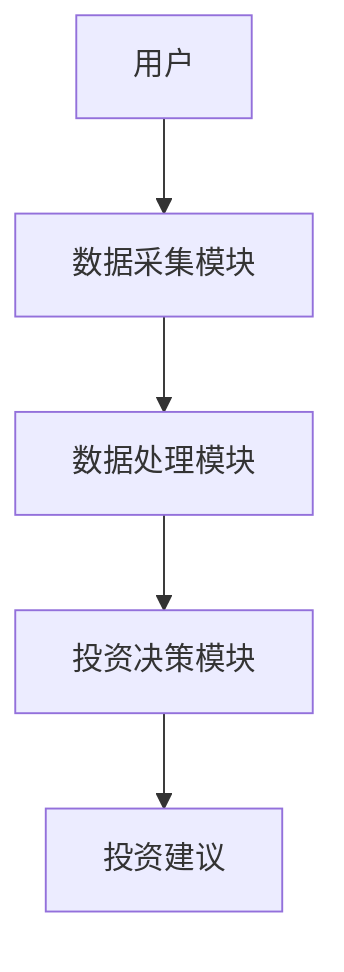
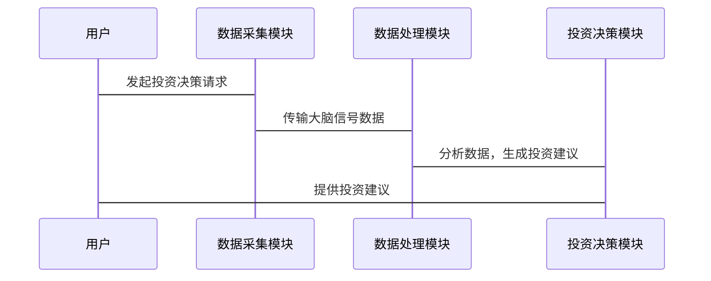

                 


# 巴菲特-芒格的脑机接口伦理投资：增强人类与AI共存

## 关键词：脑机接口，巴菲特，芒格，投资伦理，人工智能，AI共存

## 摘要：本文探讨了脑机接口技术在投资领域中的潜力，结合巴菲特和芒格的投资理念，分析了其与AI技术的结合。文章深入讨论了脑机接口在投资中的伦理问题，并提出了增强人类与AI和谐共存的最佳实践策略。

---

## 第一部分: 脑机接口技术概述

### 第1章: 脑机接口技术概述

#### 1.1 脑机接口的基本概念

##### 1.1.1 脑机接口的定义

脑机接口（Brain-Computer Interface，BCI）是一种能够直接连接人类大脑与计算机或其他电子设备的接口技术。它通过采集、处理和分析大脑活动信号，实现人与机器之间的信息交互。

##### 1.1.2 脑机接口的核心技术

- 采集技术：通过 EEG（脑电图）或其他神经信号采集设备获取大脑信号。
- 数据处理：利用算法（如 FFT、神经网络）处理和分析信号。
- 输出接口：将处理后的信号转化为控制指令，用于驱动外部设备。

##### 1.1.3 脑机接口的发展历程

从实验室研究到实际应用，脑机接口技术经历了多年的发展，逐渐应用于医疗、娱乐和投资等领域。

#### 1.2 脑机接口在投资中的应用

##### 1.2.1 脑机接口在投资决策中的潜力

通过分析投资者的情绪和认知变化，脑机接口技术能够提供实时的决策支持。

##### 1.2.2 脑机接口与AI的结合

AI技术增强了脑机接口的数据处理能力，使其在投资领域的应用更加广泛。

##### 1.2.3 脑机接口投资的现状与挑战

尽管潜力巨大，但脑机接口在投资中的应用仍面临技术瓶颈和伦理问题。

---

## 第二部分: 巴菲特与芒格的投资理念

### 第2章: 巴菲特与芒格的投资理念

#### 2.1 巴菲特的价值投资策略

##### 2.1.1 价值投资的核心原则

巴菲特的价值投资注重企业基本面分析，寻找被市场低估的投资标的。

##### 2.1.2 巴菲特的投资哲学

注重长期价值，避免短期波动，追求稳定的投资回报。

##### 2.1.3 巴菲特投资策略的优缺点

优点：长期收益稳定；缺点：对市场短期波动适应能力较弱。

#### 2.2 芒格的多元思维模型

##### 2.2.1 多元思维模型的定义

芒格提倡通过多学科知识的结合，形成全面的投资决策框架。

##### 2.2.2 多元思维模型在投资中的应用

通过跨学科分析，芒格能够更好地识别投资机会和风险。

##### 2.2.3 芒格思维模型的优缺点

优点：决策全面；缺点：需要广泛的知识储备。

#### 2.3 巴菲特与芒格投资理念的对比

##### 2.3.1 价值投资与多元思维模型的异同

两者均注重长期价值，但方法有所不同。

##### 2.3.2 投资理念的现代发展

随着科技的进步，投资理念也在不断演变。

##### 2.3.3 投资理念的未来趋势

智能化、数据化和个性化将是未来投资的趋势。

---

## 第三部分: 脑机接口与伦理投资的结合

### 第3章: 脑机接口在投资中的伦理问题

#### 3.1 脑机接口在投资中的伦理问题

##### 3.1.1 脑机接口技术的伦理挑战

隐私问题、技术依赖性以及决策透明度等。

##### 3.1.2 投资决策中的伦理困境

技术误用、道德风险和责任归属。

##### 3.1.3 脑机接口与伦理投资的平衡

通过技术规范和伦理框架的建立，实现伦理投资与技术的和谐发展。

#### 3.2 脑机接口对人类决策的影响

##### 3.2.1 脑机接口对决策透明度的影响

通过实时数据反馈，提升决策的透明度和准确性。

##### 3.2.2 脑机接口对决策责任的影响

技术辅助决策，但责任归属仍需明确。

##### 3.2.3 脑机接口对决策过程的优化

通过数据分析，优化决策过程，提高投资效率。

#### 3.3 脑机接口与投资伦理的未来展望

##### 3.3.1 伦理投资的未来趋势

智能化、数据化和个性化是未来伦理投资的发展方向。

##### 3.3.2 脑机接口技术在投资中的潜在风险

技术误用、隐私泄露和市场操纵等风险。

##### 3.3.3 技术与伦理的平衡

通过政策法规和技术规范，实现脑机接口与伦理投资的和谐共存。

---

## 第四部分: 脑机接口投资系统的架构与实现

### 第4章: 脑机接口投资系统架构设计

#### 4.1 系统功能设计

##### 4.1.1 用户界面设计

直观的用户界面，方便投资者操作。

##### 4.1.2 数据采集模块

实时采集大脑信号，分析投资者情绪和认知变化。

##### 4.1.3 数据处理模块

利用AI算法，分析数据，生成投资建议。

##### 4.1.4 投资决策模块

结合巴菲特和芒格的投资理念，生成最优投资策略。

#### 4.2 系统架构设计

##### 4.2.1 系统架构图

使用Mermaid图展示系统架构。



#### 4.3 系统接口设计

##### 4.3.1 数据接口

定义数据格式和接口协议，确保数据的准确传输。

##### 4.3.2 用户接口

设计友好的用户界面，提升用户体验。

#### 4.4 系统交互设计

##### 4.4.1 交互流程图

使用Mermaid图展示系统交互流程。



---

## 第五部分: 项目实战与案例分析

### 第5章: 项目实战

#### 5.1 环境安装

##### 5.1.1 系统需求

安装必要的软件和硬件，确保系统的正常运行。

##### 5.1.2 依赖管理

安装和配置所需的依赖库和工具。

#### 5.2 核心代码实现

##### 5.2.1 数据采集模块

```python
import numpy as np
import pyeeg

def collect_eeg_data():
    # 模拟数据采集
    data = np.random.rand(100, 10)  # 100时间点，10通道
    return data

eeg_data = collect_eeg_data()
```

##### 5.2.2 数据处理模块

```python
from sklearn.decomposition import PCA

def preprocess_data(data):
    # 数据预处理
    pca = PCA(n_components=3)
    processed_data = pca.fit_transform(data)
    return processed_data

processed_eeg_data = preprocess_data(eeg_data)
```

##### 5.2.3 投资决策模块

```python
def generate_investment_strategy(processed_data):
    # 生成投资策略
    strategy = []
    for data_point in processed_data:
        # 简单策略：数据点均值大于0则买入，反之卖出
        if np.mean(data_point) > 0:
            strategy.append("Buy")
        else:
            strategy.append("Sell")
    return strategy

investment_strategy = generate_investment_strategy(processed_eeg_data)
```

#### 5.3 案例分析

##### 5.3.1 案例背景

模拟一个投资者在市场波动中的决策过程。

##### 5.3.2 数据分析

通过数据分析，展示脑机接口技术在投资中的应用效果。

##### 5.3.3 结果解读

解释分析结果，评估投资策略的有效性。

#### 5.4 项目小结

总结项目实施过程中的经验和教训，提出改进建议。

---

## 第六部分: 最佳实践与未来展望

### 第6章: 最佳实践

#### 6.1 技术实现 tips

建议在实际应用中，注意数据隐私保护和系统稳定性。

#### 6.2 伦理方面注意事项

强调遵守伦理规范，确保技术的合理使用。

#### 6.3 未来展望

随着技术的进步，脑机接口在投资中的应用将更加广泛和深入。

---

## 结论

本文通过分析脑机接口技术在投资中的潜力，结合巴菲特和芒格的投资理念，探讨了其与AI技术的结合。同时，深入讨论了脑机接口在投资中的伦理问题，并提出了增强人类与AI和谐共存的最佳实践策略。

---

## 作者：AI天才研究院/AI Genius Institute & 禅与计算机程序设计艺术 /Zen And The Art of Computer Programming

---

希望这篇文章能为读者提供有价值的见解，并激发进一步的研究和讨论。

