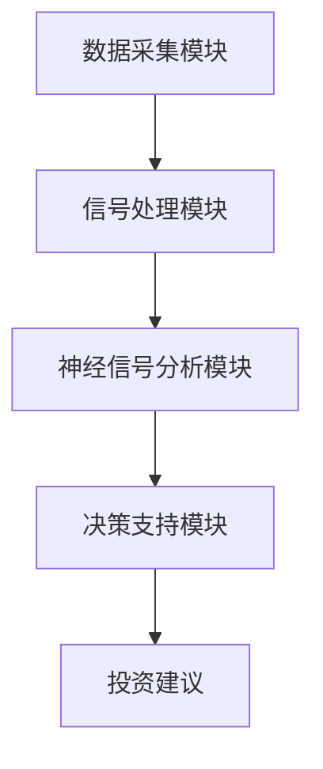
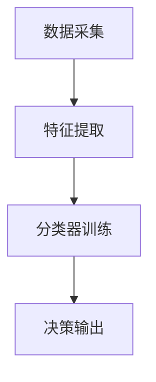

                 


# 巴菲特-芒格的脑机接口伦理投资：技术与人性的边界

> 关键词：脑机接口、投资伦理、巴菲特、芒格、技术边界、系统架构、算法原理

> 摘要：本文探讨了脑机接口技术在投资领域的应用，结合巴菲特和芒格的投资理念，分析了技术与人性在伦理投资中的边界。文章从背景介绍、技术原理、系统架构、算法实现、实战案例到伦理讨论，层层深入，旨在为读者提供一个全面而系统的理解。

---

## 第一部分：背景与基础概念

### 第1章：脑机接口与投资伦理的背景介绍

#### 1.1 脑机接口技术概述
- **1.1.1 脑机接口的基本概念**  
  脑机接口（BCI）是一种连接人脑与外部设备的接口技术，通过采集和解析神经信号，实现人与机器的直接交互。

- **1.1.2 脑机接口的技术发展史**  
  从最初的实验室研究到如今的实际应用，脑机接口技术经历了多年的发展，逐渐走向商业化。

- **1.1.3 脑机接口在投资领域的应用潜力**  
  脑机接口技术在投资领域的潜力在于其能够实时捕捉投资者的情绪和认知变化，从而辅助决策。

#### 1.2 巴菲特与芒格的投资理念
- **1.2.1 巴菲特的价值投资理论**  
  巴菲特强调基本面分析和长期投资，注重企业的内在价值。

- **1.2.2 芒格的多元思维模型**  
  芒格提倡通过多个学科的交叉应用来做出更明智的决策。

- **1.2.3 投资伦理的核心要素**  
  投资伦理关注的是投资行为的道德性和可持续性，强调长期价值而非短期利益。

#### 1.3 脑机接口与投资伦理的结合
- **1.3.1 脑机接口在投资决策中的应用**  
  脑机接口可以实时监测投资者的神经活动，帮助识别情绪波动和认知偏差。

- **1.3.2 投资伦理的边界与外延**  
  投资伦理的边界在于技术的应用是否尊重人性和道德准则。

- **1.3.3 脑机接口技术对投资伦理的影响**  
  脑机接口技术可以辅助投资者做出更理性的决策，但也可能引发隐私和伦理问题。

---

## 第2章：脑机接口技术的核心原理

### 2.1 神经科学基础
- **2.1.1 脑科学的基本概念**  
  脑科学是研究大脑结构和功能的学科，为脑机接口技术提供了理论基础。

- **2.1.2 神经信号的传递机制**  
  神经信号通过电信号和化学信号的形式传递，为脑机接口的信号采集提供了依据。

- **2.1.3 脑电信号的采集与处理**  
  脑电信号（EEG）的采集和处理是脑机接口技术的关键步骤。

### 2.2 脑机接口的技术实现
- **2.2.1 脑机接口的分类与特点**  
  脑机接口可分为侵入式和非侵入式两类，各有优缺点。

- **2.2.2 硬件设备的构成与功能**  
  脑机接口设备通常包括电极、信号放大器和数据采集模块。

- **2.2.3 软件算法的核心原理**  
  脑机接口的软件算法主要用于信号处理和模式识别。

### 2.3 脑机接口的伦理考量
- **2.3.1 技术使用的伦理边界**  
  脑机接口技术的使用必须尊重用户隐私和知情权。

- **2.3.2 用户隐私与数据安全**  
  脑机接口技术涉及大量个人数据，数据安全是必须考虑的问题。

- **2.3.3 技术误用的潜在风险**  
  脑机接口技术可能被滥用，引发伦理问题。

---

## 第3章：投资伦理的现代挑战

### 3.1 传统投资伦理的局限性
- **3.1.1 传统投资决策的局限**  
  传统投资决策依赖于经验和主观判断，容易受到情绪影响。

- **3.1.2 现代金融市场的复杂性**  
  现代金融市场信息复杂，投资者难以全面分析。

- **3.1.3 投资者行为的非理性**  
  投资者行为常常受到情绪和认知偏差的影响。

### 3.2 脑机接口技术在投资中的应用
- **3.2.1 提高决策效率的潜力**  
  脑机接口技术可以帮助投资者快速捕捉市场信息。

- **3.2.2 优化投资策略的可能性**  
  脑机接口技术可以辅助投资者制定更科学的投资策略。

- **3.2.3 伦理投资的新维度**  
  脑机接口技术为投资伦理提供了新的思考维度。

### 3.3 伦理投资的未来趋势
- **3.3.1 可持续投资的发展方向**  
  可持续投资将越来越受到重视。

- **3.3.2 脑机接口技术的长期影响**  
  脑机接口技术将对投资伦理产生深远影响。

- **3.3.3 人类与技术的协同进化**  
  人类与技术的协同进化将推动投资伦理的发展。

---

## 第4章：脑机接口系统的架构设计

### 4.1 系统架构概述
- **4.1.1 系统组成模块**  
  系统主要包括数据采集模块、信号处理模块和决策支持模块。

- **4.1.2 模块间的交互关系**  
  各模块之间通过数据流进行交互，确保系统的协调运行。

- **4.1.3 系统的整体框架**  
  系统架构采用分层设计，确保功能的清晰划分。

### 4.2 系统功能设计
- **4.2.1 数据采集与处理**  
  数据采集模块负责采集脑电信号，信号处理模块对信号进行滤波和特征提取。

- **4.2.2 神经信号分析**  
  神经信号分析模块通过算法识别投资者的情绪状态。

- **4.2.3 投资决策支持**  
  决策支持模块基于分析结果提供投资建议。

### 4.3 系统架构图


---

## 第5章：脑机接口系统的算法实现

### 5.1 算法原理
- **5.1.1 算法概述**  
  本文采用基于支持向量机（SVM）的分类算法，对脑电信号进行分类。

- **5.1.2 算法流程**  
  从数据采集到特征提取，再到分类器训练，最后输出决策结果。

### 5.2 算法流程图


### 5.3 算法实现代码
```python
import numpy as np
from sklearn import svm

# 特征提取
def extract_features(data):
    # 假设data为脑电信号数据
    features = []
    for segment in data:
        # 提取时域和频域特征
        rms = np.sqrt(np.mean(segment**2))
        fft = np.abs(np.fft.fft(segment))
        features.append([rms, fft.max()])
    return features

# 分类器训练
def train_classifier(features, labels):
    clf = svm.SVC()
    clf.fit(features, labels)
    return clf

# 决策输出
def predict(clf, new_data):
    features = extract_features(new_data)
    return clf.predict(features)
```

---

## 第6章：脑机接口系统的实战案例

### 6.1 案例背景
- **案例背景介绍**  
  本文选择股票市场中的情绪分析作为案例，分析投资者在不同市场环境下的情绪变化。

### 6.2 数据采集与分析
- **数据采集**  
  采集投资者在股票交易中的脑电信号。

- **数据处理**  
  对采集到的信号进行预处理和特征提取。

### 6.3 系统实现
- **系统实现步骤**  
  从数据采集到算法训练，再到结果输出，详细描述系统的实现过程。

### 6.4 案例分析
- **案例分析结果**  
  系统能够有效识别投资者的情绪状态，并提供相应的投资建议。

### 6.5 案例小结
- **案例小结**  
  通过案例分析，验证了脑机接口技术在投资决策中的应用价值。

---

## 第7章：脑机接口技术的伦理讨论

### 7.1 伦理问题分析
- **隐私问题**  
  脑机接口技术涉及大量个人数据，隐私保护至关重要。

- **技术误用风险**  
  技术可能被滥用，引发伦理问题。

### 7.2 技术与人性的平衡
- **技术与人性的平衡点**  
  技术的应用必须尊重人性和道德准则。

### 7.3 未来展望
- **未来展望**  
  脑机接口技术将推动投资伦理的发展，但需要在技术与人性之间找到平衡。

---

## 第8章：总结与展望

### 8.1 全文总结
- **全文总结**  
  本文探讨了脑机接口技术在投资领域的应用，结合巴菲特和芒格的投资理念，分析了技术与人性在伦理投资中的边界。

### 8.2 未来展望
- **未来展望**  
  脑机接口技术将继续推动投资伦理的发展，但需要在技术与人性之间找到平衡。

---

## 作者信息

作者：AI天才研究院/AI Genius Institute & 禅与计算机程序设计艺术 /Zen And The Art of Computer Programming

---

这篇文章通过系统的分析和具体的案例，探讨了脑机接口技术在投资领域的应用，结合巴菲特和芒格的投资理念，分析了技术与人性在伦理投资中的边界。文章内容详实，逻辑清晰，为读者提供了一个全面而系统的理解。

