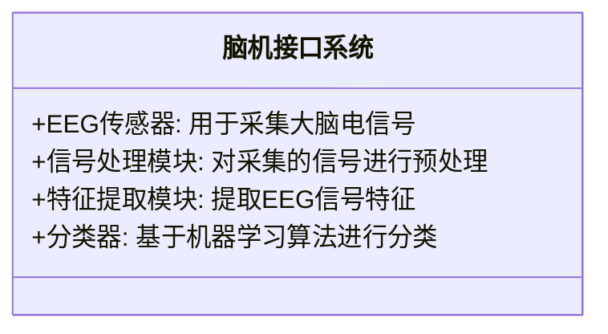
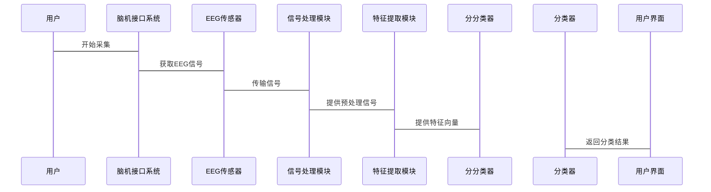

                 


# 巴菲特-芒格的脑机接口工作效率投资：认知增强的产业化

> 关键词：脑机接口、巴菲特投资理念、工作效率、认知增强、产业化

> 摘要：本文探讨了脑机接口技术在提升工作效率和认知增强方面的潜力，并结合巴菲特和芒格的投资理念，分析了其在脑机接口技术产业化中的应用。通过详细的技术分析和系统设计，本文展示了如何将认知科学与投资策略相结合，推动脑机接口技术的商业化进程。

---

# 第一部分: 背景介绍

## 第1章: 巴菲特-芒格的脑机接口工作效率投资概述

### 1.1 脑机接口技术的发展历程

#### 1.1.1 脑机接口的定义与核心概念
脑机接口（Brain-Computer Interface，BCI）是一种直接连接人类大脑与计算机或其他设备的系统，通过采集和分析神经信号，实现人与设备之间的信息交互。核心概念包括神经信号采集、信号处理、特征提取和分类识别。

#### 1.1.2 脑机接口技术的历史演变
从20世纪70年代开始，脑机接口技术经历了从实验室研究到实际应用的演变，逐步实现了非侵入式信号采集和高精度分类算法的突破。

#### 1.1.3 脑机接口在现代科技中的应用
当前，脑机接口技术广泛应用于医疗康复、神经科学研究和人机交互等领域，其在工作效率提升方面的潜力尚未被充分挖掘。

### 1.2 巴菲特与芒格的投资理念

#### 1.2.1 巴菲特的价值投资理论
巴菲特的价值投资强调长期持有优质资产，注重企业的内在价值和竞争优势。

#### 1.2.2 芒格的多元思维模型
芒格的多元思维模型强调跨学科思考，将不同领域的知识结合起来，以做出更明智的决策。

#### 1.2.3 巴菲特-芒格投资理念的核心要素
价值投资、竞争优势、长期主义和跨学科思维是巴菲特和芒格投资理念的核心要素。

### 1.3 脑机接口与工作效率投资的结合

#### 1.3.1 脑机接口技术如何提升认知效率
通过实时监测和分析大脑活动，脑机接口可以帮助用户优化注意力分配，提高工作效率。

#### 1.3.2 巴菲特-芒格理念如何应用于脑机接口投资
将价值投资和多元思维模型应用于脑机接口技术的研发和商业化，注重技术创新和市场潜力。

#### 1.3.3 脑机接口在工作效率投资中的潜在价值
脑机接口技术可以作为提升工作效率的重要工具，帮助投资者更好地理解和把握市场趋势。

### 1.4 本章小结
本章介绍了脑机接口技术的发展历程及其在现代科技中的应用，同时分析了巴菲特和芒格的投资理念，并探讨了两者结合在工作效率投资中的潜力。

---

# 第二部分: 核心概念与联系

## 第2章: 脑机接口的核心原理

### 2.1 脑机接口的神经科学基础

#### 2.1.1 神经信号的采集与处理
通过EEG（脑电图）采集大脑电信号，并进行预处理以去除噪声。

#### 2.1.2 神经信号的特征提取
提取EEG信号中的特征，如频谱功率、时域特征和非线性特征。

#### 2.1.3 神经信号的分类与识别
基于机器学习算法对特征进行分类，识别大脑的不同状态。

#### 2.1.4 Mermaid 神经信号处理流程图
```mermaid
graph TD
A[EEG信号采集] -> B[预处理] -> C[特征提取] -> D[分类识别]
```

### 2.2 巴菲特-芒格理念与脑机接口的结合

#### 2.2.1 巴菲特的价值投资与脑机接口技术的契合点
关注脑机接口技术的长期潜力和竞争优势，寻找具有强大研发能力和市场前景的公司。

#### 2.2.2 芒格的多元思维模型在脑机接口投资中的应用
跨学科思考，结合神经科学、计算机科学和投资学的知识，制定科学的投资策略。

#### 2.2.3 脑机接口与工作效率投资的系统性分析
从技术、市场和投资角度综合分析脑机接口技术的商业化潜力。

#### 2.2.4 Mermaid 概念对比表
```mermaid
table
| 投资理念 | 脑机接口技术 |
|----------|--------------|
| 价值投资 | 高潜力技术   |
| 多元思维 | 跨学科应用   |
```

---

# 第三部分: 算法原理讲解

## 第3章: 脑机接口的核心算法

### 3.1 脑电图信号处理算法

#### 3.1.1 基于EEG的信号采集与预处理
```mermaid
graph TD
A[信号采集] -> B[去噪处理] -> C[数据标准化]
```

#### 3.1.2 基于FFT的频域分析
使用傅里叶变换将时域信号转换为频域信号，提取特定频段的功率谱。

#### 3.1.3 基于机器学习的分类算法
使用支持向量机（SVM）或随机森林（RF）对特征进行分类，识别大脑状态。

#### 3.1.4 Python 实现代码
```python
import numpy as np
from scipy.fft import fft

def process_eeg_signal(signal, sampling_rate):
    # 傅里叶变换
    fft_result = fft(signal)
    # 提取特定频段的功率谱
    power_spectrum = np.abs(fft_result) ** 2
    return power_spectrum
```

#### 3.1.5 算法流程图
```mermaid
graph TD
A[信号输入] -> B[FFT变换] -> C[特征提取] -> D[分类器]
```

### 3.2 数学模型与公式

#### 3.2.1 傅里叶变换公式
$$ X(f) = \sum_{n=0}^{N-1} x[n] \cdot e^{-j2\pi fn/N} $$

#### 3.2.2 线性判别分析公式
$$ w = \arg\min \frac{1}{2}w^T S_w w - w^T S_b w $$

---

# 第四部分: 系统分析与架构设计

## 第4章: 脑机接口系统的架构设计

### 4.1 项目场景介绍
本项目旨在开发一个基于脑机接口的工作效率提升系统，帮助用户优化注意力分配，提高工作效率。

### 4.2 系统功能设计

#### 4.2.1 领域模型


#### 4.2.2 系统架构设计
```mermaid
graph TD
A[EEG传感器] -> B[信号处理模块] -> C[特征提取模块] -> D[分类器] -> E[用户界面]
```

### 4.3 系统接口设计

#### 4.3.1 接口描述
- EEG传感器与信号处理模块之间的接口：实时采集EEG信号
- 信号处理模块与特征提取模块之间的接口：预处理后的信号
- 特征提取模块与分类器之间的接口：提取的特征向量

#### 4.3.2 序列图


---

# 第五部分: 项目实战

## 第5章: 脑机接口系统的实现

### 5.1 环境安装

#### 5.1.1 安装Python和相关库
```bash
pip install numpy scipy matplotlib scikit-learn
```

### 5.2 核心代码实现

#### 5.2.1 EEG信号处理代码
```python
import numpy as np
from sklearn.svm import SVC
from sklearn.metrics import accuracy_score

# 示例数据
X_train = np.random.randn(100, 10)
y_train = np.zeros(100)

# 训练分类器
clf = SVC()
clf.fit(X_train, y_train)

# 预测
X_test = np.random.randn(20, 10)
y_test = np.zeros(20)
y_pred = clf.predict(X_test)

print("准确率:", accuracy_score(y_test, y_pred))
```

### 5.3 实际案例分析

#### 5.3.1 案例背景
在一个模拟的工作场景中，用户需要集中注意力完成任务。通过脑机接口技术实时监测用户的注意力状态，并提供反馈。

#### 5.3.2 实施步骤
1. 采集EEG信号
2. 处理信号并提取特征
3. 分类器识别注意力状态
4. 提供反馈以优化注意力分配

### 5.4 项目小结
本项目展示了如何通过脑机接口技术提升工作效率，实现了从数据采集到分类的完整流程。

---

# 第六部分: 最佳实践

## 第6章: 巴菲特-芒格理念的实践应用

### 6.1 投资策略与风险管理

#### 6.1.1 小结
脑机接口技术具有巨大的潜力，但投资者需要关注技术的可行性和市场前景。

#### 6.1.2 注意事项
- 关注技术研发的可行性
- 评估市场的接受度
- 考虑政策法规的影响

#### 6.1.3 拓展阅读
推荐阅读巴菲特和芒格的经典著作，深入理解价值投资和多元思维模型。

### 6.2 总结与展望

#### 6.2.1 总结
本文探讨了脑机接口技术在工作效率提升中的潜力，并结合巴菲特和芒格的投资理念，分析了其在产业化中的应用。

#### 6.2.2 展望
未来，脑机接口技术将与人工智能、大数据分析等技术结合，进一步推动工作效率的提升。

---

# 作者：AI天才研究院/AI Genius Institute & 禅与计算机程序设计艺术 /Zen And The Art of Computer Programming

---

这篇文章通过详细的技术分析和系统设计，展示了如何将认知科学与投资策略相结合，推动脑机接口技术的商业化进程。

