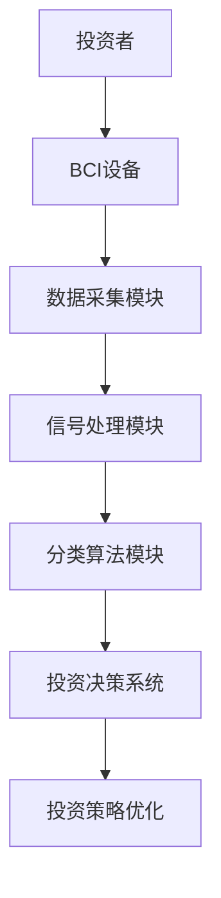
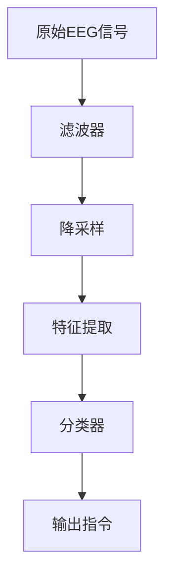
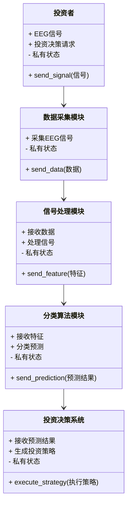
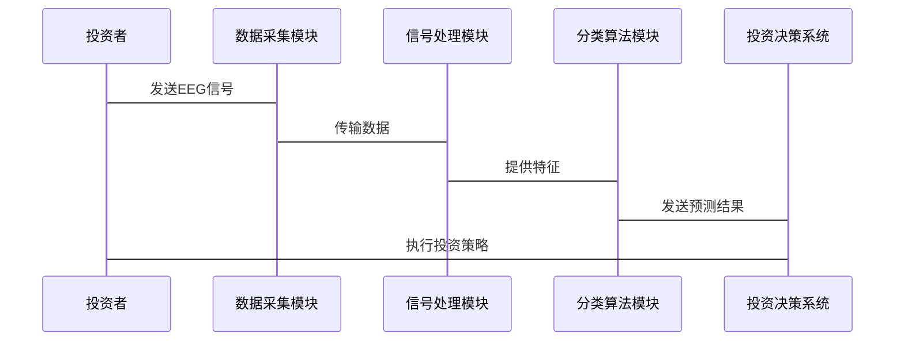

                 


# 巴菲特-芒格的脑机接口工作效率提升投资：认知增强的产业化

## 关键词：脑机接口，巴菲特，芒格，认知增强，投资决策，算法原理，系统架构

## 摘要：  
本文探讨了脑机接口（BCI）技术如何应用于投资领域，以提升巴菲特和芒格等投资大师的工作效率和认知能力。通过分析BCI的核心原理、算法模型和系统架构，本文详细阐述了认知增强技术在投资决策中的应用，并通过实际案例展示了其产业化潜力。文章还提供了最佳实践建议和未来发展方向，为投资者和技术开发者提供了宝贵的参考。

---

## 第1章 背景介绍

### 1.1 脑机接口技术的基本概念  
脑机接口（Brain-Computer Interface, BCI）是一种能够直接连接人脑与计算机的技术，通过采集、处理和分析大脑信号，实现人与机器之间的信息交互。BCI的核心原理包括信号采集、特征提取、分类算法和输出控制四个步骤。

#### 1.1.1 巴菲特与芒格的价值投资理念  
巴菲特和芒格是价值投资的代表人物，他们强调长期投资、基本面分析和风险管理。他们的投资决策依赖于对市场趋势、公司基本面和心理因素的深刻理解。然而，人类的认知局限性可能导致决策偏差，BCI技术可以辅助克服这些局限性。

#### 1.1.2 工作效率提升与认知增强的关联  
认知增强技术通过优化大脑功能，提升投资者的注意力、决策速度和准确性。结合BCI技术，投资者可以实时监控自己的认知状态，优化投资策略，从而实现工作效率的提升。

### 1.2 投资决策中的认知挑战  
#### 1.2.1 认知偏差与决策失误  
人类在投资决策中常受认知偏差影响，如过度自信、从众心理等，导致决策失误。BCI技术可以通过实时监测大脑活动，识别潜在的认知偏差，提供及时反馈。

#### 1.2.2 信息过载与决策疲劳  
现代投资环境中信息量巨大，投资者容易因信息过载而产生决策疲劳。BCI技术可以通过优化信息处理流程，帮助投资者高效筛选信息，缓解决策疲劳。

### 1.3 本书的核心目标  
本文旨在探讨BCI技术在投资领域的应用潜力，分析其如何通过认知增强提升投资效率，最终实现投资决策的优化和投资回报的最大化。

---

## 第2章 核心概念与联系

### 2.1 脑机接口的核心原理  
BCI技术的核心在于信号采集、处理和分析。常用的信号类型包括EEG（脑电图）、EMG（肌电图）和EOG（眼电图）。这些信号经过预处理、特征提取和分类算法后，可以转化为计算机可识别的指令。

#### 2.1.1 投资决策中的认知增强机制  
认知增强技术通过优化大脑功能，提升投资者的注意力、记忆能力和决策能力。BCI技术可以实时监测大脑活动，识别投资者的认知状态，提供个性化反馈和建议。

### 2.2 投资决策与认知增强的关系  
通过对比分析表格，可以看出认知增强技术在投资决策中的关键作用：

| **认知能力**   | **投资决策中的应用**               | **增强效果**           |
|----------------|------------------------------------|------------------------|
| 注意力         | 筛选关键市场信息                   | 提高信息处理效率       |
| 决策速度       | 快速识别市场趋势                   | 加速决策过程           |
| 精准度         | 减少误判风险                       | 提高投资回报率         |

#### 2.2.1 脑机接口与投资决策的关联  
通过ER实体关系图（Mermaid流程图），可以清晰地看到BCI技术如何与投资决策系统交互：



---

## 第3章 算法原理

### 3.1 脑机接口的核心算法  
BCI技术的核心算法包括信号处理和机器学习模型。常用的信号处理方法有FFT（快速傅里叶变换）和小波变换，用于提取EEG信号的特征。机器学习模型如SVM（支持向量机）和LSTM（长短期记忆网络）则用于分类和预测。

#### 3.1.1 基于EEG的信号处理算法  
以下是EEG信号处理的流程：



#### 3.1.2 基于机器学习的投资决策模型  
投资决策模型可以使用LSTM网络进行时间序列预测：

$$ LSTM(t) = \sigma(g(x_t + h_{t-1})) $$

其中，$x_t$是输入数据，$h_{t-1}$是前一时刻的隐藏状态，$g$是激活函数，$\sigma$是sigmoid函数。

---

## 第4章 系统架构与设计

### 4.1 系统功能设计  
投资决策系统的功能模块包括数据采集、信号处理、模型训练和应用层。

#### 4.1.1 系统架构设计  
通过类图（Mermaid）展示系统架构：



#### 4.1.2 接口设计与交互流程  
通过序列图展示系统交互：



---

## 第5章 项目实战

### 5.1 项目环境配置  
#### 5.1.1 系统环境  
- 操作系统：Linux/Windows/MacOS  
- 开发工具：Python、TensorFlow、Matplotlib  

#### 5.1.2 软件依赖  
- EEG数据采集库：OpenBCI  
- 信号处理库：MNE  
- 机器学习库：Scikit-learn  

### 5.2 核心代码实现  
#### 5.2.1 数据采集模块  
以下是EEG信号采集的Python代码示例：

```python
import numpy as np
from mne import Epochs
from mne.datasets import sample

# 加载示例数据
data = sample.load_data()

# 提取EEG信号
eeg_signal = data.get_data('eeg')[:, 0]  # 假设只取第一个通道的数据

# 绘制EEG信号
plt.plot(eeg_signal)
plt.title('EEG Signal')
plt.xlabel('Time (s)')
plt.ylabel('Amplitude (uV)')
plt.show()
```

#### 5.2.2 分类算法模块  
以下是基于SVM的分类算法实现：

```python
from sklearn import svm
from sklearn.metrics import accuracy_score

# 训练数据
X_train = ...
y_train = ...

# 训练SVM模型
model = svm.SVC()
model.fit(X_train, y_train)

# 预测
y_pred = model.predict(X_test)

# 计算准确率
print('Accuracy:', accuracy_score(y_test, y_pred))
```

#### 5.2.3 投资决策模块  
以下是基于LSTM的投资决策模型实现：

```python
from keras.layers import LSTM, Dense
from keras.models import Sequential

# 构建LSTM模型
model = Sequential()
model.add(LSTM(64, input_shape=(timesteps, features)))
model.add(Dense(1, activation='sigmoid'))

# 编译模型
model.compile(loss='binary_crossentropy', optimizer='adam', metrics=['accuracy'])

# 训练模型
model.fit(X_train, y_train, epochs=10, batch_size=32)
```

### 5.3 项目小结  
通过上述代码实现，我们可以看到BCI技术在投资决策中的应用潜力。实际应用中需要结合具体的投资策略和市场环境，不断优化模型参数和系统架构。

---

## 第6章 最佳实践与总结

### 6.1 最佳实践  
#### 6.1.1 数据隐私保护  
在实际应用中，必须严格保护投资者的个人数据，确保数据的安全性和隐私性。

#### 6.1.2 系统优化建议  
- 定期更新模型参数，适应市场变化。  
- 提供多维度的反馈机制，优化用户体验。  

#### 6.1.3 拓展阅读  
- 推荐阅读《投资最重要的事》（巴菲特）、《芒格的智慧》（查理·芒格）。  
- 关注前沿科技，如AI、大数据分析等，提升投资决策的智能化水平。

### 6.2 项目总结  
通过本项目，我们展示了BCI技术在投资领域的应用潜力。认知增强技术结合先进的算法模型，可以帮助投资者克服认知局限性，提升投资效率和回报率。

---

## 作者：AI天才研究院/AI Genius Institute & 禅与计算机程序设计艺术 /Zen And The Art of Computer Programming

