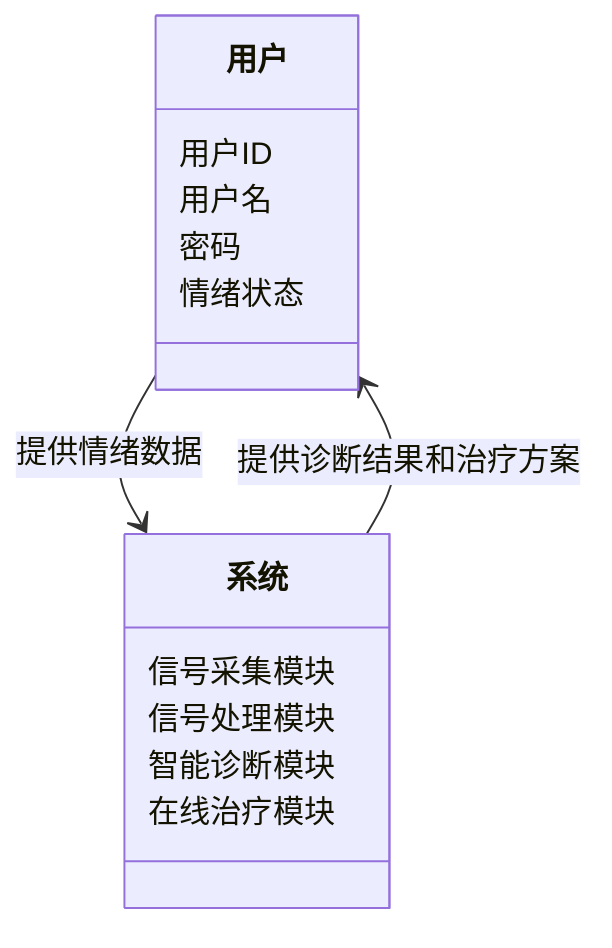
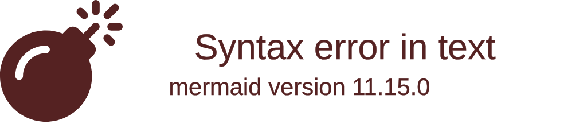
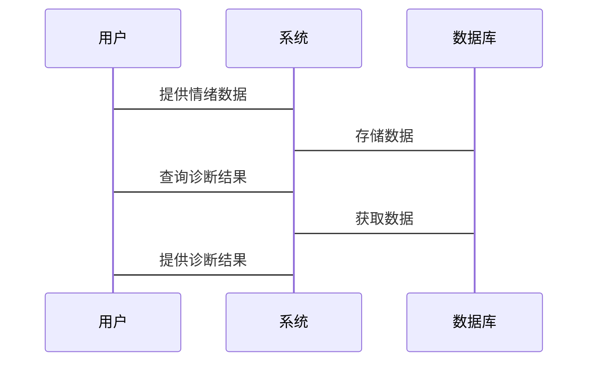

                 


# 巴菲特-芒格的脑机接口心理健康平台投资：心理医学的数字化转型

## 关键词：脑机接口、心理健康平台、巴菲特、芒格、数字化转型

## 摘要：本文探讨了巴菲特和芒格在脑机接口技术投资中的独特见解，分析了脑机接口技术在心理健康领域的应用潜力，并总结了数字化转型对心理医学的深远影响。通过技术原理、系统架构和实际案例的详细讲解，本文为读者提供了全面的视角，帮助理解这一领域的投资价值和未来趋势。

---

## 第一部分：引言

### 1.1 背景介绍

#### 1.1.1 脑机接口技术的快速发展
脑机接口（Brain-Computer Interface, BCI）是一种能够连接人类大脑与外部设备的技术，近年来随着人工智能和神经科学的进步，脑机接口在医疗、教育、娱乐等多个领域的应用潜力逐渐显现。特别是在心理健康领域，脑机接口技术可以通过实时监测大脑活动，帮助识别和治疗焦虑、抑郁等心理疾病。

#### 1.1.2 心理健康领域的数字化转型需求
心理健康问题日益严重，传统的心理咨询和治疗模式效率低下，难以满足现代社会的需求。数字化转型为心理健康领域带来了新的解决方案，脑机接口技术的引入进一步提升了心理健康平台的智能化水平。

#### 1.1.3 巴菲特与芒格投资理念的独特视角
巴菲特和芒格作为投资界的传奇人物，他们的投资理念以长期价值为导向，注重基本面分析和风险管理。他们的投资逻辑不仅适用于传统行业，也可以为新兴技术领域提供深刻的洞察。

### 1.2 核心概念与联系

#### 1.2.1 脑机接口的核心概念
脑机接口是一种通过采集、处理和分析大脑神经信号，将其转化为控制外部设备的指令的技术。其核心组成部分包括信号采集、信号处理、信号输出和用户界面。

#### 1.2.2 心理健康平台的数字化转型
心理健康平台通过数字化技术，将传统的心理咨询和治疗过程转化为线上服务，结合脑机接口技术，提供更加精准和个性化的心理健康解决方案。

#### 1.2.3 投资与技术的结合
巴菲特和芒格的投资理念与脑机接口技术的结合，不仅推动了技术的商业化，也为心理健康平台的未来发展提供了重要的资金和技术支持。

---

## 第二部分：脑机接口技术与心理健康平台

### 2.1 脑机接口技术的概述

#### 2.1.1 脑机接口的工作原理
脑机接口通过采集大脑电活动（如EEG信号），将其转化为可读的数据，进而控制外部设备。以下是脑机接口的基本工作流程：

1. **信号采集**：使用 EEG 电极采集大脑电活动信号。
2. **信号处理**：对采集到的信号进行滤波、降噪和特征提取。
3. **信号输出**：将处理后的信号转化为控制指令，驱动外部设备。

#### 2.1.2 脑机接口的关键技术
- **信号采集技术**：包括 EEG、fMRI 等多种方式。
- **信号处理算法**：如傅里叶变换、小波变换等。
- **机器学习模型**：用于分类和预测。

#### 2.1.3 脑机接口在心理健康中的应用
- **情绪监测**：通过 EEG 信号实时监测用户的情绪状态。
- **心理治疗**：结合虚拟现实技术，提供个性化的心理治疗方案。

### 2.2 心理健康平台的数字化转型

#### 2.2.1 数字化转型的背景与趋势
随着互联网和人工智能技术的发展，心理健康服务逐渐从线下转移到线上。数字化转型不仅提高了服务效率，还通过大数据分析提供了更加精准的诊断和治疗方案。

#### 2.2.2 心理健康平台的核心功能
- **情绪监测**：通过脑机接口技术实时监测用户的情绪状态。
- **智能诊断**：基于大数据分析，提供个性化的诊断建议。
- **在线治疗**：通过虚拟现实技术提供沉浸式心理治疗体验。

#### 2.2.3 数字化转型对心理医学的影响
- **提高治疗效率**：通过数字化技术，医生可以更快地诊断和治疗患者。
- **降低治疗成本**：数字化服务减少了传统面对面治疗的资源消耗。
- **扩大服务范围**：数字化平台可以覆盖更多患者，特别是偏远地区。

### 2.3 脑机接口与心理健康平台的结合

#### 2.3.1 脑机接口在心理健康监测中的应用
通过脑机接口技术，心理健康平台可以实时监测用户的情绪状态，及时发现潜在的心理问题。

#### 2.3.2 脑机接口在心理治疗中的应用
结合虚拟现实技术，脑机接口可以为用户提供沉浸式心理治疗体验，帮助患者克服焦虑、抑郁等心理障碍。

#### 2.3.3 脑机接口与心理健康平台的整合
通过整合脑机接口技术，心理健康平台可以实现从情绪监测到心理治疗的全流程数字化服务，为用户提供更加精准和个性化的心理健康解决方案。

---

## 第三部分：巴菲特与芒格的投资理念

### 3.1 巴菲特与芒格的投资哲学

#### 3.1.1 巴菲特的价值投资理念
巴菲特的价值投资理念强调长期投资、基本面分析和安全边际。他认为，投资的本质是寻找那些具有持续竞争优势和良好管理的公司。

#### 3.1.2 芒格的多元思维模型
芒格的多元思维模型强调从多个角度分析问题，注重知识的跨界整合。他认为，投资者应该具备广泛的知识储备，以便更好地识别投资机会。

#### 3.1.3 两人投资理念的共同点与差异
虽然巴菲特和芒格的投资理念有差异，但他们都强调长期投资、基本面分析和风险管理。

### 3.2 巴菲特与芒格对脑机接口技术的看法

#### 3.2.1 脑机接口技术的投资价值
脑机接口技术具有广阔的应用前景，特别是在医疗、教育和心理健康领域。随着技术的成熟，脑机接口市场的规模将迅速扩大。

#### 3.2.2 心理健康平台的投资潜力
心理健康平台结合了脑机接口技术，能够提供更加精准和个性化的心理健康服务，市场需求巨大。

#### 3.2.3 巴菲特与芒格对技术风险的评估
巴菲特和芒格都认识到脑机接口技术的风险，但他们认为，通过长期的价值投资，可以降低风险，实现收益。

### 3.3 巴菲特与芒格的经典投资案例分析

#### 3.3.1 巴菲特

---

## 第四部分：系统分析与架构设计

### 4.1 问题场景介绍
心理健康平台需要实现情绪监测、智能诊断和在线治疗的核心功能，同时保证系统的安全性和稳定性。

### 4.2 项目介绍
心理健康平台基于脑机接口技术，结合人工智能算法，提供实时情绪监测和个性化治疗方案。

### 4.3 系统功能设计

#### 4.3.1 领域模型设计
以下是心理健康平台的领域模型：



### 4.4 系统架构设计

#### 4.4.1 系统架构图
以下是心理健康平台的系统架构图：



### 4.5 系统接口设计
心理健康平台需要与脑机接口设备、数据库和用户界面进行交互，以下是接口设计：



---

## 第五部分：项目实战

### 5.1 环境安装
需要安装Python、numpy、scikit-learn、tensorflow等库，以及脑机接口设备的驱动程序。

### 5.2 系统核心实现源代码
以下是心理健康平台的核心代码：

```python
import numpy as np
from sklearn import svm
import tensorflow as tf

# 数据预处理
def preprocess(data):
    # 数据归一化
    normalized_data = (data - np.mean(data)) / np.std(data)
    return normalized_data

# 机器学习模型
def create_model():
    model = tf.keras.Sequential()
    model.add(tf.keras.layers.Dense(64, activation='relu'))
    model.add(tf.keras.layers.Dense(1, activation='sigmoid'))
    model.compile(optimizer='adam', loss='binary_crossentropy', metrics=['accuracy'])
    return model

# 模型训练
def train_model(model, X_train, y_train):
    model.fit(X_train, y_train, epochs=10, batch_size=32)

# 模型预测
def predict_model(model, X_test):
    predictions = model.predict(X_test)
    return predictions
```

### 5.3 实际案例分析
以下是心理健康平台的一个实际案例：

1. **数据采集**：用户通过脑机接口设备采集情绪数据。
2. **数据处理**：对数据进行预处理，包括归一化和特征提取。
3. **模型训练**：使用机器学习模型对数据进行训练，生成诊断结果。
4. **治疗方案**：根据诊断结果，提供个性化的治疗方案。

---

## 第六部分：总结与展望

### 6.1 最佳实践 tips
- 在心理健康平台的设计中，需要注重数据安全和隐私保护。
- 投资者在选择脑机接口技术时，需要综合考虑技术风险和市场需求。

### 6.2 小结
脑机接口技术在心理健康领域的应用潜力巨大，心理健康平台的数字化转型将推动心理医学的发展。

### 6.3 未来展望
随着技术的进步，心理健康平台将更加智能化和个性化，为用户提供更加精准的服务。

---

## 作者：AI天才研究院/AI Genius Institute & 禅与计算机程序设计艺术 /Zen And The Art of Computer Programming

