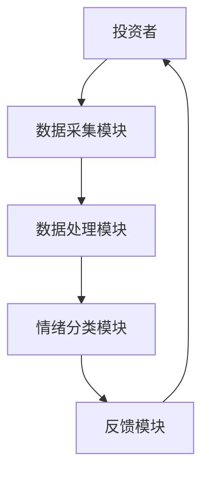

                 


```markdown
# 巴菲特-芒格的脑机接口情感调节投资：心理健康的新方法

## 关键词：巴菲特，芒格，脑机接口，情感调节，投资决策，心理健康

## 摘要：
本文探讨了巴菲特和芒格的投资理念与脑机接口技术的结合，提出了一种通过情感调节来优化投资决策的新方法。文章详细介绍了脑机接口技术的原理、情感调节的重要性以及在投资中的应用，并结合实际案例分析了系统的架构设计和项目实现。通过理论与实践的结合，本文为投资者提供了一种提升心理健康和投资决策的新思路。

---

## 第1章：背景介绍

### 1.1 巴菲特与芒格的投资哲学

#### 1.1.1 巴菲特的价值投资理论
- 巴菲特的价值投资强调长期、安全和高回报，关注企业的内在价值。
- 投资决策中，情绪波动会影响理性判断，尤其是压力和贪婪。

#### 1.1.2 芒格的多元思维模型
- 芒格强调跨学科思维，将心理学、经济学等知识融入投资决策。
- 投资中的心理偏差（如确认偏差、过度自信）会导致错误决策。

#### 1.1.3 投资与心理健康的关联
- 投资者的心理健康直接影响决策质量。
- 情绪波动可能导致非理性决策，进而影响投资回报。

### 1.2 脑机接口技术的概述

#### 1.2.1 脑机接口的基本概念
- 脑机接口（BCI）是通过计算机与大脑直接交互的技术，解读脑信号。
- 应用领域包括医疗、教育和心理健康。

#### 1.2.2 脑机接口的工作原理
- 采集脑电信号（EEG）。
- 通过算法处理信号，识别情绪状态。
- 输出反馈，调节情感。

#### 1.2.3 脑机接口与心理健康
- 脑机接口可以帮助识别和调节负面情绪。
- 提供实时反馈，帮助个体管理压力和焦虑。

### 1.3 问题背景与解决方法

#### 1.3.1 投资中的心理挑战
- 压力导致决策失误。
- 情绪波动影响理性判断。

#### 1.3.2 脑机接口的技术优势
- 实时监测情绪状态。
- 提供个性化反馈，帮助调节情绪。

#### 1.3.3 本文的研究目标
- 探讨脑机接口技术在投资中的应用。
- 提供一种结合心理学和神经科学的新投资方法。

---

## 第2章：脑机接口技术的原理与应用

### 2.1 脑机接口的核心技术

#### 2.1.1 神经科学基础
- 大脑活动与情绪的关系。
- EEG信号与情绪状态的对应关系。

#### 2.1.2 脑电图（EEG）与脑活动监测
- EEG信号的采集与处理。
- 常见的EEG频段与情绪的对应关系。

#### 2.1.3 神经网络与机器学习算法
- 使用神经网络分析EEG信号。
- 通过机器学习实现情绪分类。

#### 2.1.4 情感识别的算法实现
- 使用支持向量机（SVM）进行分类。
- 基于深度学习的模型训练。

### 2.2 脑机接口在情感调节中的应用

#### 2.2.1 情感识别的原理
- 通过EEG信号识别情绪状态。
- 使用算法分析脑电信号，判断投资者的心理状态。

#### 2.2.2 情感调节的技术实现
- 基于实时反馈的神经调节。
- 通过声音或视觉反馈调节情绪。

#### 2.2.3 情感调节的实际案例
- 使用脑机接口帮助投资者识别和管理情绪。
- 案例分析：压力状态下的情绪调节效果。

### 2.3 脑机接口与投资决策的结合

#### 2.3.1 投资决策中的情感因素
- 压力和焦虑对决策的影响。
- 情绪波动与投资回报的关系。

#### 2.3.2 脑机接口在投资决策中的应用
- 实时监测情绪状态，提醒投资者潜在的心理偏差。
- 提供个性化反馈，优化投资策略。

#### 2.3.3 脑机接口技术的未来发展方向
- 更高精度的情绪识别。
- 更多应用场景的探索。

---

## 第3章：情感调节在投资中的重要性

### 3.1 投资中的情绪管理

#### 3.1.1 压力对投资决策的影响
- 高压环境下的决策失误。
- 压力与投资回报的相关性。

#### 3.1.2 情绪波动与投资行为
- 过度自信与从众心理。
- 情绪波动引发的非理性交易。

#### 3.1.3 心理健康对投资成功的影响
- 健康的心理状态与长期投资回报的关系。
- 心理健康管理的重要性。

### 3.2 情感调节的技术实现

#### 3.2.1 情感识别的算法实现
- 基于EEG信号的情感分类。
- 通过特征提取优化分类效果。

#### 3.2.2 情感调节的反馈机制
- 声音反馈调节情绪。
- 视觉反馈提醒投资者。

#### 3.2.3 情感调节的实际效果
- 研究表明，情感调节可以降低决策失误率。
- 案例分析：压力下的情绪调节效果。

---

## 第4章：脑机接口情感调节技术的实现

### 4.1 情感识别的算法实现

#### 4.1.1 基于EEG的情感识别
- 使用EEG信号提取特征。
- 通过机器学习实现情绪分类。

#### 4.1.2 情感分类的算法选择
- 支持向量机（SVM）与随机森林（Random Forest）对比。
- 基于深度学习的模型训练。

#### 4.1.3 算法实现的代码示例
```python
import numpy as np
from sklearn.svm import SVC

# 示例数据
X = np.random.randn(100, 10)
y = np.random.randint(0, 2, 100)

# 训练SVM模型
model = SVC()
model.fit(X, y)

# 预测
print(model.predict(X[:5]))
```

### 4.2 情感调节的反馈系统

#### 4.2.1 反馈机制的设计
- 实时反馈：通过声音或视觉信号提醒投资者。
- 个性化反馈：根据个体情绪状态提供定制化建议。

#### 4.2.2 系统架构设计
- 数据采集模块：采集EEG信号。
- 数据处理模块：特征提取与情绪分类。
- 反馈模块：实时反馈投资者情绪状态。

#### 4.2.3 系统实现的代码示例
```python
import numpy as np
import pyqtgraph as pq
from pyqtgraph.Qt import QtGui

# 示例数据
data = np.random.randn(1000)

# 实时绘图
app = QtGui.QApplication([])
win = pq.GraphicsLayoutWidget()
plot = win.addPlot()
plot.plot(data, pen='g')
win.show()
app.exec())
```

### 4.3 技术实现中的挑战与解决方案

#### 4.3.1 数据采集的准确性
- 提高EEG信号的信噪比。
- 使用高精度传感器。

#### 4.3.2 算法的实时性
- 优化算法复杂度，降低计算延迟。
- 使用边缘计算技术，提升实时性。

#### 4.3.3 用户体验的优化
- 简化操作流程。
- 提供个性化的用户界面。

---

## 第5章：脑机接口技术在巴菲特和芒格投资策略中的应用

### 5.1 投资策略与心理健康的结合

#### 5.1.1 巴菲特的价值投资与心理健康
- 长期投资需要心理稳定性。
- 脑机接口技术帮助投资者保持冷静。

#### 5.1.2 芒格的多元思维模型与情感调节
- 多学科思维在投资决策中的应用。
- 情感调节技术提升决策的全面性。

### 5.2 投资决策中的情感调节

#### 5.2.1 压力管理与投资决策
- 通过脑机接口实时监测压力水平。
- 提供反馈，帮助投资者缓解压力。

#### 5.2.2 情绪控制与投资策略
- 根据情绪状态调整投资策略。
- 通过反馈系统优化投资决策。

### 5.3 投资中的实际应用案例

#### 5.3.1 投资者A的案例分析
- 情况：压力导致投资失误。
- 解决方案：使用脑机接口技术进行实时监测和反馈。
- 结果：压力缓解，投资决策更理性。

#### 5.3.2 投资者B的案例分析
- 情况：过度自信导致高风险投资。
- 解决方案：通过反馈系统提醒情绪波动。
- 结果：降低风险，投资回报提升。

---

## 第6章：项目实战与系统架构设计

### 6.1 项目实战

#### 6.1.1 环境搭建
- 安装必要的库：numpy, pyqtgraph, scikit-learn。
- 硬件设备：EEG传感器。

#### 6.1.2 核心代码实现
- 数据采集与处理。
- 情绪分类与反馈系统。

#### 6.1.3 实际案例分析
- 通过案例分析验证系统的有效性。

### 6.2 系统架构设计

#### 6.2.1 系统功能模块
- 数据采集模块：采集EEG信号。
- 数据处理模块：特征提取与情绪分类。
- 反馈模块：实时反馈情绪状态。

#### 6.2.2 系统架构图


#### 6.2.3 接口设计
- 数据采集模块接口：提供EEG信号。
- 数据处理模块接口：接收信号并返回情绪分类结果。
- 反馈模块接口：根据情绪分类结果输出反馈信号。

---

## 第7章：总结与展望

### 7.1 总结
- 巴菲特和芒格的投资理念与脑机接口技术的结合为投资决策提供了新思路。
- 情感调节技术能够有效改善投资者的心理健康，降低决策失误率。

### 7.2 展望
- 脑机接口技术在投资中的应用前景广阔。
- 未来可能的研究方向包括更高精度的情绪识别和更智能化的反馈系统。

---

## 作者：AI天才研究院/AI Genius Institute & 禅与计算机程序设计艺术 /Zen And The Art of Computer Programming
```

