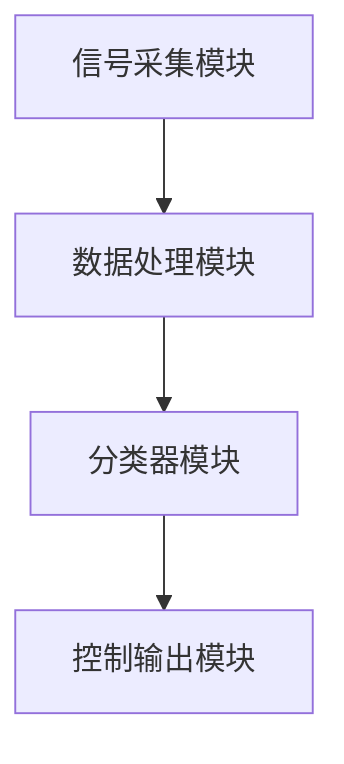
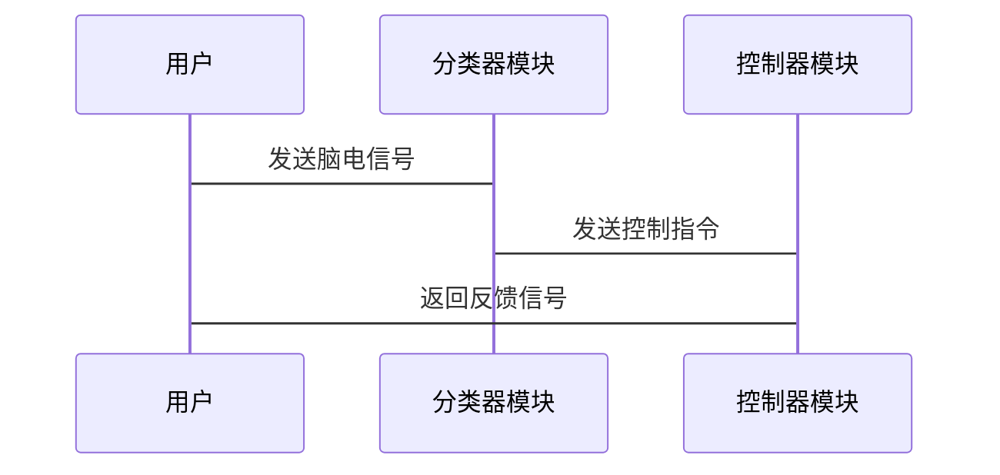

                 


# 巴菲特-芒格的脑机接口技术投资：人机交互的未来

> 关键词：巴菲特, 芒格, 脑机接口技术, 人机交互, 投资策略, 未来趋势

> 摘要：本文探讨了巴菲特和芒格的投资理念如何影响脑机接口技术的发展，分析了脑机接口技术的现状、核心算法与系统架构，并结合实际案例展示了其在人机交互中的未来应用。

---

## 第一部分: 巴菲特与芒格的投资理念

### 第1章: 巴菲特的价值投资理念

#### 1.1 价值投资的定义与核心原则
价值投资是一种以基本面分析为基础的投资策略，强调以低于公平市场价值的价格购买优质资产。巴菲特的价值投资理念强调长期持有、关注企业内在价值而非市场波动。

#### 1.2 巴菲特的投资策略与选股方法
巴菲特的选股方法包括关注企业的护城河、盈利能力、管理团队和财务状况。他倾向于投资那些具有强大竞争优势的企业。

#### 1.3 巴菲特对技术投资的偏好
尽管巴菲特早期对技术投资持谨慎态度，但他逐渐认识到人工智能等技术的潜力，并开始投资相关企业。

---

### 第2章: 芒格的多元思维模型

#### 2.1 多元思维模型的定义
多元思维模型是指通过多个学科的视角来分析问题，以避免单一思维的局限性。芒格认为，这种思维方式能够帮助投资者更好地理解复杂的商业环境。

#### 2.2 芒格思维模型的核心要素
芒格的思维模型包括心理学、经济学、物理学等多个学科的知识，帮助投资者识别潜在的风险和机会。

#### 2.3 多元思维模型在投资中的应用
芒格通过多元思维模型，能够更全面地评估企业的价值，避免因单一视角而产生的误判。

---

## 第二部分: 脑机接口技术的现状与未来

### 第3章: 脑机接口技术的定义与发展

#### 3.1 脑机接口的定义与分类
脑机接口（BCI）是一种连接人脑与外部设备的系统，通过采集和分析脑电信号，实现人与设备之间的信息交互。BCI可以分为侵入式和非侵入式两类。

#### 3.2 脑机接口技术的发展历程
从20世纪70年代的概念提出，到如今的商业化应用，BCI技术经历了实验室研究、临床试验和市场化应用三个阶段。

#### 3.3 脑机接口技术的未来趋势
随着技术的进步，BCI将朝着高精度、低延迟和广泛适用的方向发展，逐步应用于医疗、教育和娱乐等领域。

---

### 第4章: 脑机接口技术的核心应用领域

#### 4.1 医疗健康
BCI技术在医疗领域的应用包括脑控假肢、癫痫监测和神经康复。通过实时监测和反馈，BCI能够帮助患者恢复功能。

#### 4.2 教育与学习
BCI技术可以实时监测学习者的注意力水平，优化教学内容和节奏，提高学习效率。

#### 4.3 人机交互
BCI技术为用户提供更自然的交互方式，例如通过思维控制智能家居设备或虚拟现实环境。

---

## 第三部分: 巴菲特与芒格的脑机接口技术投资策略

### 第5章: 巴菲特与芒格对脑机接口技术的投资逻辑

#### 5.1 巴菲特对脑机接口技术的认可
巴菲特认识到脑机接口技术的潜力，认为其在医疗和教育领域的应用将带来巨大的商业价值。

#### 5.2 芒格对脑机接口技术的乐观态度
芒格认为，脑机接口技术将彻底改变人机交互的方式，成为未来科技发展的关键领域。

#### 5.3 巴菲特与芒格的投资策略
巴菲特和芒格结合价值投资和多元思维模型，选择那些具有强大技术优势和市场潜力的脑机接口技术企业进行投资。

---

## 第四部分: 脑机接口技术的核心算法与系统架构

### 第6章: 脑机接口技术的核心算法

#### 6.1 脑电信号处理算法
脑电信号处理算法包括信号采集、滤波、特征提取和分类。通过这些算法，系统可以准确识别用户的意图。

#### 6.2 脑机接口系统的实现流程
1. 信号采集：使用 EEG 传感器采集脑电信号。
2. 信号处理：对信号进行滤波和特征提取。
3. 分类器训练：利用机器学习算法训练分类器。
4. 控制输出：根据分类结果输出控制指令。

#### 6.3 算法实现的Python代码示例
```python
import numpy as np
from sklearn import svm

# 示例代码：脑电信号分类器
def preprocess EEG_data:
    # 数据预处理代码
    pass

def train_classifier(X, y):
    clf = svm.SVC()
    clf.fit(X, y)
    return clf

# 假设 EEG_data 是一个包含多条 EEG 数据的列表
# 每条数据对应一个标签 label
 EEG_data = [...]  # 示例数据
 X = preprocess(EEG_data)
 y = [...]          # 对应的标签

 clf = train_classifier(X, y)
```

---

### 第7章: 脑机接口系统的架构设计

#### 7.1 系统架构概述
脑机接口系统通常包括信号采集模块、数据处理模块和控制输出模块。各模块之间通过标准接口进行通信。

#### 7.2 系统架构的Mermaid图


#### 7.3 系统交互的Mermaid序列图


---

## 第五部分: 项目实战

### 第8章: 脑机接口技术的项目实现

#### 8.1 项目环境安装
需要安装Python、NumPy、Scikit-learn和相关 EEG 传感器驱动。

#### 8.2 项目核心实现代码
```python
import numpy as np
from sklearn import svm

def preprocess EEG_data:
    # 数据预处理代码
    return processed_data

def train_classifier(X, y):
    clf = svm.SVC()
    clf.fit(X, y)
    return clf

# 示例数据集
 EEG_data = [...]  # 示例 EEG 数据
 X = preprocess(EEG_data)
 y = [...]          # 对应的标签

 clf = train_classifier(X, y)
```

#### 8.3 功能解读与分析
通过预处理和分类算法，系统能够准确识别用户的意图，并通过控制模块输出相应的指令。

---

## 第六部分: 总结与展望

### 第9章: 总结与最佳实践

#### 9.1 本章总结
本文探讨了巴菲特和芒格的投资理念如何影响脑机接口技术的发展，并分析了该技术在人机交互中的未来应用。

#### 9.2 最佳实践 tips
1. 在投资脑机接口技术时，关注企业的技术优势和市场潜力。
2. 结合价值投资和多元思维模型，选择具有长期增长潜力的企业。

#### 9.3 小结
脑机接口技术将彻底改变人机交互的方式，成为未来科技发展的关键领域。

---

## 作者信息

作者：AI天才研究院 & 禅与计算机程序设计艺术

---

通过以上结构和内容，文章详细探讨了巴菲特和芒格的投资理念，以及脑机接口技术在人机交互中的应用。希望这篇文章能够为读者提供有价值的见解和启发。

