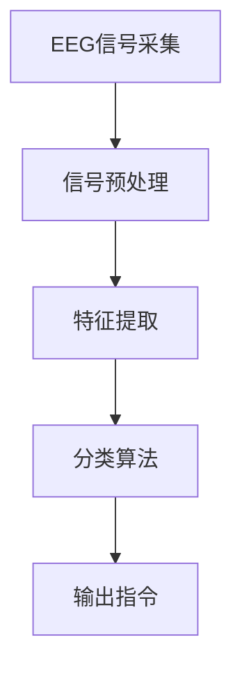
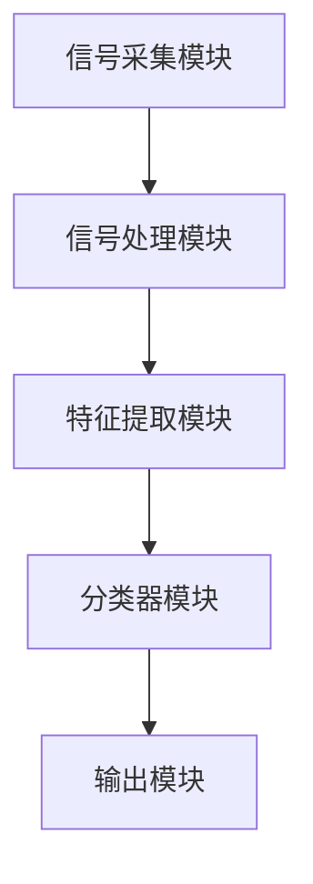
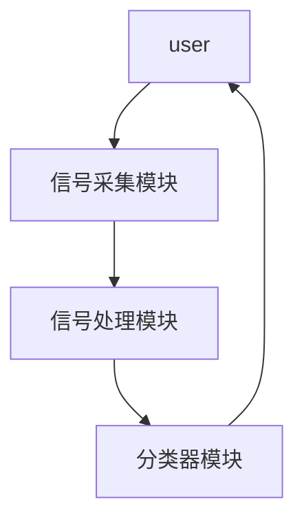

                 


# 巴菲特-芒格的脑机接口游戏开发平台投资：沉浸式娱乐的新纪元

## 关键词：巴菲特，芒格，脑机接口，游戏开发平台，沉浸式娱乐，投资策略

## 摘要：本文探讨了巴菲特和芒格在脑机接口（BCI）技术在游戏开发平台中的投资策略。通过分析BCI技术的核心概念、算法原理和系统架构，结合巴菲特和芒格的投资哲学，本文揭示了BCI技术在沉浸式娱乐中的潜力，并为投资者提供了深度的见解和建议。

---

## 第一部分：脑机接口与沉浸式娱乐的背景

### 第1章：脑机接口技术概述

#### 1.1 脑机接口的基本概念

脑机接口（Brain-Computer Interface，BCI）是一种通过捕捉和解析大脑神经信号，将人的意图转化为计算机可识别指令的技术。BCI的核心在于将生物信号（如 EEG 电位）转化为数字信息，从而实现人与机器的直接交互。

**核心概念与联系：**

- **神经科学基础**：BCI依赖于对大脑神经活动的理解，涉及神经元的电活动、脑区的功能划分等。
- **信号处理技术**：包括滤波、特征提取和分类算法，用于将复杂的生物信号转化为可操作的指令。
- **应用场景**：医疗康复、游戏娱乐、人机交互等领域。

**ER实体关系图（Mermaid）：**

```mermaid
erDiagram
    用户 {}<1..N> 用户会话
    用户会话 {}<1..1> 会话数据
    会话数据 {}<1..N> 神经信号
    神经信号 {}<1..N> 特征提取
    特征提取 {}<1..1> 分类算法
    分类算法 {}<1..1> 操作指令
```

#### 1.2 沉浸式娱乐的定义与现状

沉浸式娱乐通过技术手段创造高度沉浸的体验，使用户完全沉浸在虚拟世界中。游戏开发平台是沉浸式娱乐的核心载体，而BCI技术则为这种体验提供了新的可能性。

**核心概念与联系：**

- **游戏开发平台**：提供游戏创作工具和技术支持，是沉浸式娱乐的基础。
- **用户体验**：通过BCI技术，用户可以直接用大脑控制游戏，提升沉浸感。
- **技术趋势**：随着AI和硬件技术的进步，BCI在游戏中的应用将更加广泛。

---

### 第2章：巴菲特与芒格的投资哲学

#### 2.1 巴菲特的投资理念

巴菲特的价值投资理论强调长期持有优质资产，关注企业的内在价值。他的投资策略基于对企业基本面的深入分析，而非短期市场波动。

**核心概念与联系：**

- **价值投资**：巴菲特寻找具有持续竞争优势和良好治理的企业。
- **长期视角**：投资不是短期交易，而是对优质资产的长期持有。
- **安全边际**：买入价格低于内在价值，以降低投资风险。

**数学模型与公式：**

巴菲特的内在价值公式可以简化为：

$$
\text{内在价值} = \sum_{t=1}^{\infty} \frac{\text{现金流}_t}{(r)^t}
$$

其中，r为折现率，现金流为未来现金流预测。

#### 2.2 芒格的多元思维模型

芒格的多元思维模型强调通过跨学科的思考，构建对世界的深刻理解。他将多个领域的基本原理整合起来，形成决策的框架。

**核心概念与联系：**

- **跨学科思维**：芒格鼓励投资者学习多个领域的知识，以避免思维的局限性。
- **决策框架**：通过多维度的分析，做出更合理的决策。
- **心理因素**：芒格关注认知偏差和心理因素对投资决策的影响。

---

### 第3章：脑机接口技术的数学模型与算法原理

#### 3.1 脑机接口的核心算法

BCI技术的核心算法包括信号处理、特征提取和分类算法。

**数学模型与公式：**

1. **信号处理**：EEG信号的滤波处理通常使用傅里叶变换。

$$
X_{\text{freq}} = \mathcal{F}(x)(n) = \sum_{k=0}^{N-1} x(k) e^{-j2\pi nk/N}
$$

2. **特征提取**：常用小波变换进行特征提取。

$$
w_{i}(j) = \sum_{m=0}^{M-1} x(m) \psi_{i}(j - m)
$$

3. **分类算法**：支持向量机（SVM）常用于分类。

$$
\text{优化目标} = \min_{\alpha, \beta} \frac{1}{2} \|\beta\|^2 + C \sum_{i=1}^{n} \alpha_i [y_i - \text{sign}(\beta^T x_i + \beta_0)]
$$

**算法流程图（Mermaid）：**



---

### 第4章：脑机接口技术的系统架构

#### 4.1 系统架构设计

BCI系统的架构通常包括信号采集、处理、分类和输出模块。

**系统架构图（Mermaid）：**



#### 4.2 系统交互设计

BCI系统的交互设计需要考虑用户体验和系统的实时性。

**系统交互图（Mermaid）：**



---

### 第5章：脑机接口技术在游戏开发中的应用

#### 5.1 游戏开发平台的现状

当前的游戏开发平台主要依赖传统的输入设备（如键盘、鼠标和手柄）。随着BCI技术的发展，未来的游戏体验将更加沉浸式和直观。

**核心概念与联系：**

- **传统输入设备**：键盘、鼠标和手柄是当前游戏的主要输入方式。
- **沉浸式体验**：BCI技术可以提供更自然的交互方式，提升用户体验。
- **技术整合**：BCI技术需要与游戏引擎（如Unity、Unreal Engine）无缝集成。

#### 5.2 脑机接口在游戏中的应用案例

目前，一些实验性的项目已经展示了BCI在游戏中的潜力，例如通过脑电波控制角色的运动或选择。

**项目实战：**

1. **环境安装**：
   - 安装必要的库：numpy、scipy、sklearn。
   - 安装游戏开发引擎（如Unity）。

2. **系统核心实现源代码：**

```python
import numpy as np
from sklearn.svm import SVC

# 示例：简单的EEG信号分类器
def classify_signal(eeg_data):
    # 特征提取
    features = eeg_data.mean(axis=1)
    # 分类器训练
    clf = SVC()
    clf.fit(features.reshape(-1, 1), [1, 0, 1, 0])
    # 预测
    return clf.predict(eeg_data.mean(axis=1).reshape(-1, 1))
```

3. **代码应用解读：**
   - 该代码展示了如何将EEG数据进行特征提取，并使用SVM进行分类，输出控制指令。

---

### 第6章：巴菲特与芒格的脑机接口投资策略

#### 6.1 巴菲特与芒格的投资策略

巴菲特和芒格的投资策略在脑机接口领域同样适用，他们注重企业的长期潜力和竞争优势。

**数学模型与公式：**

巴菲特的内在价值公式可以应用于评估BCI企业的价值：

$$
\text{内在价值} = \sum_{t=1}^{\infty} \frac{\text{现金流}_t}{(r)^t}
$$

其中，r为风险调整后的折现率。

#### 6.2 脑机接口领域的投资机会

脑机接口技术在医疗、教育和娱乐等领域都有广泛的应用潜力，这为投资者提供了丰富的投资机会。

---

### 第7章：沉浸式娱乐的新纪元

#### 7.1 脑机接口技术的未来发展

随着技术的进步，脑机接口将在游戏开发平台中发挥越来越重要的作用，沉浸式娱乐将进入新的纪元。

**总结：**

巴菲特和芒格的投资哲学与脑机接口技术的结合，为沉浸式娱乐带来了新的可能性。通过深入理解技术原理和投资策略，投资者可以在这一领域获得超额回报。

---

## 作者：AI天才研究院/AI Genius Institute & 禅与计算机程序设计艺术 /Zen And The Art of Computer Programming

