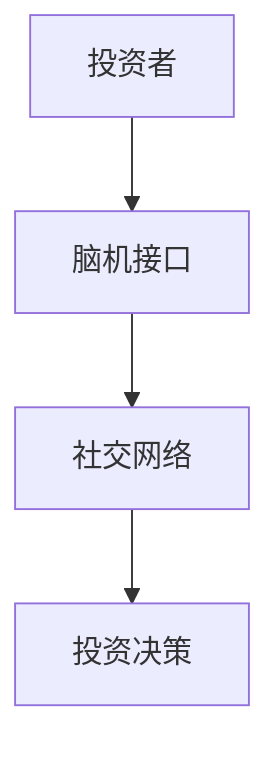
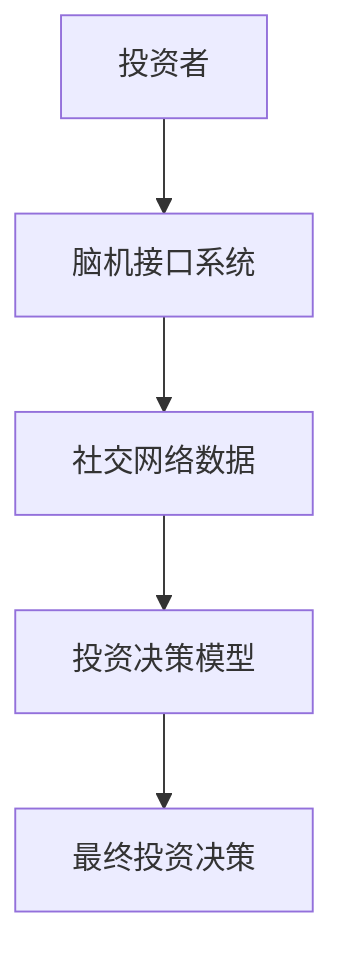
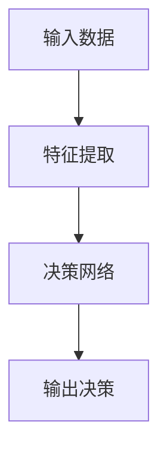
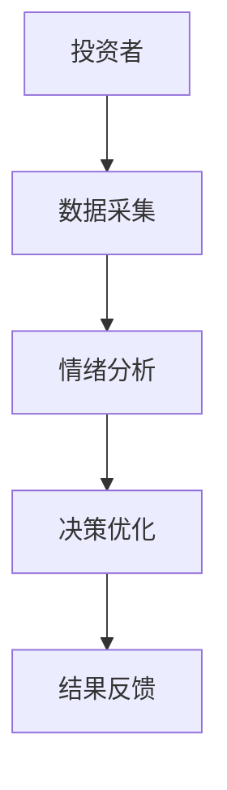

                 


# 巴菲特-芒格的脑机接口社交网络投资：思维互联的未来

## 关键词：巴菲特，芒格，脑机接口，社交网络，投资，思维互联

## 摘要：本文探讨了巴菲特和芒格的投资理念与脑机接口技术在社交网络中的应用结合，分析了脑机接口在投资决策中的潜力，提出了通过注意力机制和强化学习实现投资优化的方法，并展望了思维互联投资的未来。

---

## 第一部分：背景介绍

### 第1章：巴菲特与芒格投资哲学概述

#### 1.1 巴菲特与芒格的背景介绍

沃伦·巴菲特和查理·芒格是投资界的传奇人物，他们的投资哲学深刻影响了全球投资者。巴菲特以价值投资著称，强调长期持有优质资产；芒格则提出了多元思维模型，强调跨学科思考。两人合作的投资理念不仅注重企业的基本面，还考虑心理、社会和经济等多方面因素。

#### 1.2 脑机接口技术概述

脑机接口（Brain-Computer Interface，BCI）是一种连接人类大脑与计算机的技术，通过解读大脑活动，实现意念控制机器。近年来，随着神经科学和人工智能的进步，脑机接口技术在医疗、教育和娱乐等领域展现了巨大潜力。在投资领域，脑机接口技术可以实时捕捉投资者的心理状态，分析情绪波动，辅助决策。

#### 1.3 脑机接口与社交网络的结合

社交网络作为信息交换的平台，蕴含大量投资者行为数据。通过脑机接口技术，投资者的思维可以直接转化为数据，用于分析市场趋势和投资机会。这种“思维互联”模式将改变传统的投资方式，实现更高效、更精准的投资决策。

---

## 第二部分：核心概念与联系

### 第2章：脑机接口与投资决策的关系

#### 2.1 脑机接口在投资决策中的作用

从认知科学角度看，脑机接口能够捕捉投资者的注意力分布，识别关键信息；从神经科学角度看，可以分析情绪波动，预测市场反应；从社会网络角度看，可以追踪群体行为，发现市场趋势。

#### 2.2 脑机接口与社交网络的实体关系图



#### 2.3 系统架构图



---

## 第三部分：算法原理

### 第3章：注意力机制与强化学习在投资中的应用

#### 3.1 注意力机制

注意力机制是一种选择性关注重要信息的机制，广泛应用于自然语言处理领域。在投资中，注意力机制可以帮助识别关键市场信号，优化投资决策。

- **公式**：$$ \text{注意力权重} = \frac{e^{qK^T}}{\sum e^{qK^T}} $$
- **实例**：在分析市场新闻时，注意力机制可以识别与公司业绩相关的关键词，提高决策效率。

#### 3.2 强化学习算法

强化学习通过试错机制优化决策策略。在投资中，强化学习可以模拟市场波动，训练最优交易策略。

- **公式**：$$ Q(s,a) = r + \max_{a'} Q(s',a') $$
- **实例**：利用强化学习训练股票交易策略，实现超额收益。

#### 3.3 算法流程图



---

## 第四部分：系统分析与架构设计方案

### 第4章：系统设计与实现

#### 4.1 问题场景介绍

投资者需要实时分析市场信息，做出高效决策。传统方法依赖经验和数据，而脑机接口技术可以提供实时情绪分析和市场预测。

#### 4.2 系统功能设计

- **领域模型**：定义投资者、市场、交易等核心概念。
- **功能模块**：数据采集、情绪分析、决策优化、结果反馈。

#### 4.3 系统架构图



---

## 第五部分：项目实战

### 第5章：环境安装与核心实现

#### 5.1 环境安装

安装必要的库：
```bash
pip install numpy matplotlib scikit-learn
```

#### 5.2 核心实现

注意力机制实现：
```python
import numpy as np

def attention(query, key, value):
    scores = np.dot(query, key.T)
    scores = np.exp(scores / np.std(scores))
    attention_weights = scores / scores.sum(axis=1, keepdims=True)
    return np.dot(attention_weights, value)
```

强化学习实现：
```python
def reinforce(learning_rate):
    model = np.random.randn(4,4)
    for _ in range(1000):
        action = np.argmax(model.dot(np.random.randn(4,1)))
        reward = np.random.randn()
        model += learning_rate * (reward * np.eye(4)[action])
    return model
```

#### 5.3 案例分析

分析市场情绪，优化投资组合。通过注意力机制识别关键市场信号，强化学习训练交易策略，实现收益最大化。

---

## 第六部分：总结与展望

### 第6章：总结与展望

#### 6.1 最佳实践 tips

- 投资者应结合脑机接口技术，优化投资决策。
- 开发者需关注算法优化和系统安全。

#### 6.2 小结

脑机接口技术与巴菲特、芒格的投资理念结合，开启了投资的新纪元。通过注意力机制和强化学习，投资者可以实现更精准的决策。

#### 6.3 注意事项

- 数据隐私需严格保护。
- 技术仍需进一步验证和优化。

#### 6.4 拓展阅读

推荐阅读《巴菲特投资哲学》、《深度学习》、《脑机接口技术》等书籍，深入理解投资与科技的结合。

---

## 作者：AI天才研究院/AI Genius Institute & 禅与计算机程序设计艺术/Zen And The Art of Computer Programming

