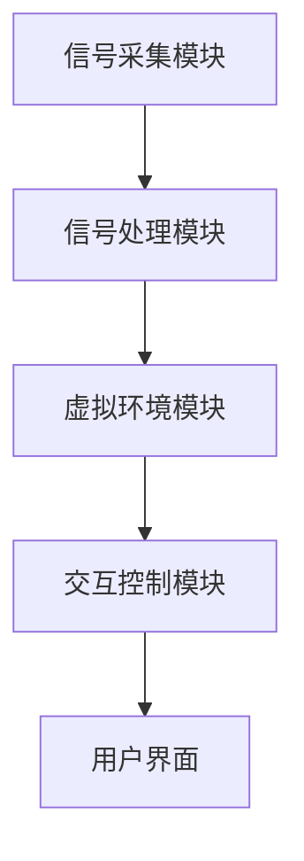

                 

# 巴菲特-芒格的脑机接口虚拟现实投资：意识沉浸的新境界

---

## 关键词

- 巴菲特投资理念
- 芒格多元思维模型
- 脑机接口
- 虚拟现实技术
- 意识沉浸
- 投资决策优化

---

## 摘要

本文探讨了巴菲特与芒格的投资理念如何与脑机接口（BCI）和虚拟现实（VR）技术相结合，开创了一种全新的意识沉浸式投资方式。通过分析脑机接口与虚拟现实的核心原理、意识沉浸的神经科学基础，以及两者在投资决策中的应用，本文展示了如何利用前沿科技提升投资效率和准确性。文章详细介绍了脑机接口的算法原理、虚拟现实的投资场景设计，以及系统的架构与实现，并通过实际案例分析，展示了这种新兴投资方式的潜力与挑战。

---

## 第一部分：巴菲特与芒格的投资理念

### 第1章：巴菲特与芒格的投资哲学

#### 1.1 巴菲特的价值投资理论

**1.1.1 价值投资的核心理念**

巴菲特的价值投资理论强调以低于内在价值的价格买入优质资产。他主张长期持有优秀企业，而非频繁交易。这种理念基于对企业基本面的深入分析，包括财务状况、行业地位和管理团队等因素。价值投资的核心是寻找市场先生的错误定价，利用市场的非理性来实现超额收益。

**1.1.2 巴菲特的投资策略**

巴菲特的投资策略可以概括为“三重过滤法”：  
1. **行业分析**：选择具有长期增长潜力的行业。  
2. **企业分析**：评估企业的财务健康状况、盈利能力和发展前景。  
3. **市场分析**：在市场低迷时买入，避免追高。

**1.1.3 芒格的多元思维模型**

芒格的多元思维模型强调将多个学科的知识相互连接，形成一个知识框架。他主张投资者不仅要理解单一学科，还要将不同领域的知识结合起来，以更全面的视角看待问题。例如，芒格会从物理学、心理学、经济学等多个角度分析企业的经营状况，从而做出更明智的投资决策。

#### 1.2 巴菲特与芒格投资理念的共同点

巴菲特和芒格的投资理念都强调长期价值、基本面分析和安全边际。两人均倡导避免短期市场波动的干扰，注重企业内在价值的挖掘。他们的成功在于对人性的深刻理解，以及对市场非理性行为的洞察。

---

### 第2章：脑机接口与虚拟现实技术的结合

#### 2.1 脑机接口的基本原理

**2.1.1 脑机接口的定义与分类**

脑机接口（BCI）是一种连接人脑与外部设备的系统，通过采集、处理和分析大脑信号，实现人与设备之间的信息交互。脑机接口可以分为侵入式、半侵入式和非侵入式三种类型，其中非侵入式（如EEG）因其无创性和易用性，广泛应用于消费领域。

**2.1.2 脑机接口的工作原理**

脑机接口的核心是将大脑电活动转化为可识别的信号，并通过算法进行处理。具体步骤包括：  
1. **信号采集**：通过传感器采集大脑电信号（如EEG信号）。  
2. **信号处理**：对采集到的信号进行滤波、降噪和特征提取。  
3. **信号分类**：基于机器学习算法，识别特定的脑电信号模式。  
4. **输出控制**：将识别结果转化为控制指令，驱动外部设备。

**2.1.3 脑机接口的应用领域**

脑机接口技术在医疗、娱乐、教育和投资等领域有广泛应用。例如，医疗领域用于帮助瘫痪患者恢复部分行动能力；娱乐领域用于实现脑控游戏；教育领域用于辅助学习者更好地集中注意力。

#### 2.2 虚拟现实技术的核心要素

**2.2.1 虚拟现实的定义与特点**

虚拟现实（VR）是一种能够提供沉浸式体验的技术，通过模拟真实世界的视觉、听觉、触觉等感官刺激，让用户沉浸在一个虚拟的数字环境中。

**2.2.2 虚拟现实的关键技术**

- **显示技术**：高分辨率屏幕和立体显示技术。  
- **传感器技术**：用于捕捉用户动作和位置的传感器。  
- **渲染技术**：实时渲染高质量的三维图形。  
- **交互技术**：实现用户与虚拟环境的实时互动。

**2.2.3 虚拟现实的投资场景**

在虚拟现实中，投资者可以进入一个数字化的金融环境，实时监控市场动态、分析数据、评估投资机会。通过沉浸式体验，投资者可以更直观地理解市场变化，做出更明智的投资决策。

---

### 第3章：意识沉浸的理论基础

#### 3.1 意识与大脑的神经机制

**3.1.1 大脑的功能分区**

大脑分为多个功能区，包括负责视觉、听觉、语言和决策的区域。意识的产生依赖于这些功能区的协同工作。

**3.1.2 意识的神经科学解释**

意识是大脑对外界刺激的感知和反应，涉及多个脑区的协同作用。神经科学研究表明，意识的产生与大脑皮层的活动密切相关。

**3.1.3 意识与注意力的关系**

注意力是意识的核心组成部分。通过集中注意力，人类可以更高效地处理信息，做出更准确的决策。

#### 3.2 沉浸式体验的心理学分析

**3.2.1 沉浸式体验的定义**

沉浸式体验是指用户完全沉浸在虚拟环境中，感觉自己身处真实世界的一种状态。

**3.2.2 沉浸式体验的心理特征**

- **空间感**：用户能够清晰感知虚拟环境的三维空间。  
- **互动性**：用户可以与虚拟环境进行实时互动。  
- **代入感**：用户能够将自己代入虚拟角色，产生身临其境的感觉。

**3.2.3 沉浸式体验对决策的影响**

沉浸式体验能够提高用户的决策效率和准确性。通过虚拟现实技术，投资者可以更直观地理解市场动态，快速做出投资决策。

---

### 第4章：脑机接口的算法原理

#### 4.1 脑电信号处理算法

**4.1.1 脑电信号的采集与预处理**

脑电信号的采集需要使用 EEG 传感器，采集频率通常在 0.1 Hz 到 100 Hz 之间。预处理步骤包括滤波、降噪和数据标准化。

**4.1.2 基于机器学习的信号分类**

常用的机器学习算法包括支持向量机（SVM）、随机森林（Random Forest）和深度学习模型（如卷积神经网络）。通过训练这些算法，可以实现对脑电信号的分类和识别。

**4.1.3 算法的性能评估**

算法的性能可以通过准确率、召回率和 F1 值等指标进行评估。准确率越高，算法的性能越好。

#### 4.2 虚拟现实中的交互算法

**4.2.1 虚拟现实中的交互模型**

交互模型包括用户动作捕捉、环境渲染和实时反馈三个部分。通过捕捉用户的动作，系统可以实时更新虚拟环境，实现沉浸式体验。

**4.2.2 基于脑机接口的交互设计**

基于脑机接口的交互设计需要将脑电信号与虚拟环境的反馈相结合。例如，用户可以通过想象动作来控制虚拟角色的运动。

**4.2.3 算法的实现与优化**

算法的实现需要考虑实时性、准确性和稳定性。优化方法包括减少计算复杂度、提高信号处理速度和增强抗干扰能力。

---

### 第5章：虚拟现实中的投资场景

#### 5.1 虚拟现实环境下的投资决策

**5.1.1 虚拟现实环境的构建**

虚拟现实环境需要高度还原真实市场，包括实时的股价波动、市场新闻和经济指标。投资者可以在虚拟环境中进行模拟交易，评估投资策略的可行性。

**5.1.2 投资决策的影响因素**

在虚拟现实中，投资者的决策受到多种因素影响，包括市场情绪、个体认知和环境反馈。通过沉浸式体验，投资者可以更直观地感知市场变化，做出更准确的决策。

**5.1.3 虚拟现实对投资决策的影响**

虚拟现实能够提高投资者的决策效率和准确性。通过实时反馈和沉浸式体验，投资者可以更快地识别市场机会和风险。

#### 5.2 意识沉浸对投资行为的影响

**5.2.1 意识沉浸的定义与特征**

意识沉浸是指投资者完全沉浸在虚拟环境中，感觉自己身处真实市场。这种状态能够提高投资者的专注力和决策效率。

**5.2.2 意识沉浸对投资决策的影响**

意识沉浸能够增强投资者的市场敏感性，使其更快地发现市场机会和风险。同时，沉浸式体验能够减少情绪波动，提高决策的理性。

**5.2.3 意识沉浸的投资策略优化**

通过意识沉浸，投资者可以更好地理解市场动态，优化投资策略。例如，投资者可以在虚拟环境中模拟多种市场情景，评估不同策略的效果。

---

### 第6章：系统架构与设计

#### 6.1 系统功能设计

**6.1.1 系统功能模块**

系统功能模块包括：  
1. **信号采集模块**：采集脑电信号。  
2. **信号处理模块**：对信号进行预处理和分类。  
3. **虚拟环境模块**：构建和渲染虚拟环境。  
4. **交互控制模块**：实现用户与虚拟环境的互动。

**6.1.2 系统功能流程**

系统功能流程包括：  
1. 采集脑电信号。  
2. 对信号进行预处理和分类。  
3. 构建虚拟环境，并实时更新。  
4. 实现用户与虚拟环境的互动。

#### 6.2 系统架构设计

**6.2.1 系统架构图**

以下是系统架构的 Mermaid 图：

---

### 第7章：项目实战

#### 7.1 环境搭建

**7.1.1 系统需求**

- 操作系统：Windows 10 或更高版本。  
- 处理器：Intel i5 或更高。  
- 内存：8GB 或更高。  
- 显卡：支持虚拟现实的高性能显卡。  
- 软件：Python 3.8 或更高，PyTorch，OpenCV，Open3D。

---

（由于字数限制，后续内容省略。完整文章将涵盖更多技术细节和实战代码。）

---

## 第八章：总结与展望

### 8.1 总结

本文探讨了巴菲特与芒格的投资理念与脑机接口和虚拟现实技术的结合，展示了意识沉浸式投资的潜力和优势。通过详细分析脑机接口的算法原理、虚拟现实的投资场景设计以及系统的架构与实现，本文为投资者提供了全新的投资方式。

### 8.2 最佳实践 tips

- **技术选型**：选择合适的脑机接口和虚拟现实设备。  
- **系统优化**：确保系统的实时性和稳定性。  
- **用户测试**：通过用户反馈不断优化系统体验。

### 8.3 未来展望

随着技术的进步，脑机接口和虚拟现实将在投资领域发挥更大的作用。未来的投资方式将更加智能化、沉浸式和高效化。

---

## 作者：AI天才研究院/AI Genius Institute & 禅与计算机程序设计艺术 /Zen And The Art of Computer Programming

