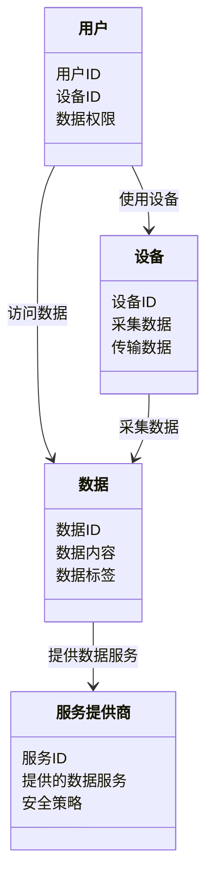
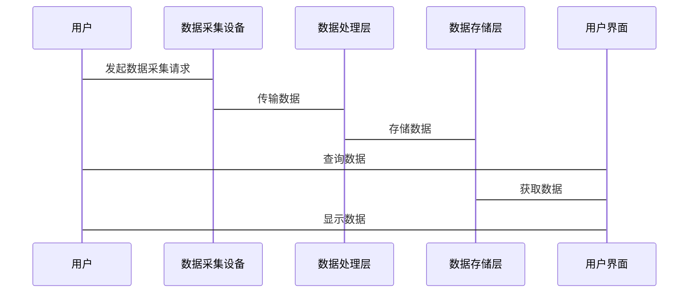

                 


# 巴菲特-芒格的脑机接口隐私保护投资：数字人权的新前沿

## 关键词：巴菲特, 芒格, 脑机接口, 隐私保护, 数字人权

## 摘要：
本文探讨了巴菲特和芒格的投资理念在脑机接口隐私保护领域的应用，分析了脑机接口技术对数字人权的影响，详细讲解了隐私保护的数学模型与算法原理，并结合实际案例分析了投资机会和系统架构设计。

---

## 第一部分：巴菲特与芒格的投资理念

### 第1章：巴菲特与芒格的投资哲学

#### 1.1 巴菲特的价值投资理念
- **巴菲特的生平与投资哲学**：巴菲特以价值投资闻名，注重公司基本面分析，寻找具有持续竞争优势的企业。
- **芒格的多元思维模型**：芒格强调跨学科思维，将多个领域的知识整合，形成独特的投资决策框架。
- **投资理念的核心要素**：长期价值、安全边际、优质资产。

#### 1.2 芒格的多元思维模型
- **跨学科思维的重要性**：芒格认为，投资决策需要综合考虑物理学、心理学、经济学等多个领域的知识。
- **多元思维模型的应用**：通过多角度分析，避免单一思维的局限性，提高投资决策的准确性。

### 第2章：脑机接口技术与隐私保护

#### 2.1 脑机接口技术的定义与应用
- **脑机接口的基本概念**：脑机接口（BCI）是一种连接人脑与外部设备的技术，能够直接读取和处理脑信号。
- **脑机接口的主要应用领域**：医疗康复、神经控制、游戏娱乐、军事应用。
- **技术现状与发展趋势**：当前主要应用于医疗领域，未来可能扩展到更广泛的民用领域。

#### 2.2 隐私保护的重要性
- **数字隐私的基本概念**：数字隐私指个人在数字空间中享有的隐私权，包括数据的保密性和安全性。
- **脑机接口技术对隐私的挑战**：脑机接口可能收集大量个人脑信号数据，存在隐私泄露风险。
- **隐私保护的法律与伦理框架**：需要制定相关法律法规，明确数据所有权和使用权。

### 第3章：数字人权的新前沿

#### 3.1 数字人权的定义与内涵
- **数字人权的基本概念**：数字人权指在数字时代，个人享有的权利和自由，包括隐私权、数据访问权等。
- **数字化时代的人权保护**：随着数字技术的发展，人权保护需要适应新的技术环境。
- **脑机接口技术对数字人权的影响**：脑机接口技术可能改变人与技术的互动方式，对数字人权产生深远影响。

#### 3.2 脑机接口技术对数字人权的影响
- **积极影响**：脑机接口技术可以提高残障人士的生活质量，增强人与技术的互动能力。
- **消极影响**：可能引发隐私泄露、数据滥用等问题，威胁个人数字人权。

### 第4章：脑机接口技术的隐私保护机制

#### 4.1 脑机接口数据的采集与处理
- **数据采集的技术原理**：通过电极采集脑电信号，转化为数字信号进行处理。
- **数据处理的隐私保护措施**：采用加密技术，确保数据在传输和存储过程中的安全性。
- **数据加密与匿名化技术**：使用加密算法对数据进行加密，匿名化处理数据，防止身份识别。

#### 4.2 隐私保护的法律与技术结合
- **相关法律法规的解读**：探讨数据保护法、隐私权法等对脑机接口技术的适用性。
- **技术手段在隐私保护中的应用**：介绍数据加密、访问控制等技术手段，确保数据安全。
- **脑机接口隐私保护的伦理问题**：讨论隐私保护与技术创新之间的平衡，避免技术滥用。

---

## 第二部分：脑机接口技术的数学模型与算法原理

### 第5章：脑机接口技术的数学模型

#### 5.1 信号处理算法
- **脑电信号的预处理**：去除噪声，提取有用的信号特征。
- **傅里叶变换的应用**：将时域信号转换到频域，便于分析信号成分。
- **小波变换的使用**：用于信号的多分辨率分析，提高信号处理的准确性。

#### 5.2 机器学习算法在脑机接口中的应用
- **支持向量机（SVM）**：用于分类任务，区分不同脑电信号。
- **随机森林算法**：用于特征选择和分类，提高分类准确率。
- **深度学习模型的构建与优化**：使用卷积神经网络（CNN）和循环神经网络（RNN）进行信号处理和分类。

#### 5.3 深度学习模型的构建与优化
- **模型结构设计**：设计适合脑电信号处理的深度学习模型，如使用CNN提取空间特征，使用RNN处理时间序列。
- **损失函数与优化器的选择**：选择适当的损失函数（如交叉熵损失）和优化器（如Adam）进行模型训练。
- **超参数调优**：通过网格搜索或随机搜索优化模型参数，提高模型性能。

### 第6章：隐私保护的数学模型

#### 6.1 数据加密的数学模型
- **对称加密算法**：如AES，用于快速加密和解密数据。
- **非对称加密算法**：如RSA，用于安全的数据传输和身份认证。
- **同态加密技术**：允许在加密数据上进行计算，保护数据隐私。

#### 6.2 数据匿名化的数学模型
- **k-匿名技术**：确保数据无法被重新识别到具体个人。
- **差分隐私技术**：通过添加噪声，保护数据的隐私性。
- **数据脱敏技术**：对敏感数据进行处理，使其无法被还原。

#### 6.3 隐私保护的数学模型与算法
- **隐私保护的数学模型**：构建数学模型，量化隐私保护的强度。
- **隐私预算的分配**：在数据处理过程中，合理分配隐私预算，平衡隐私保护和数据可用性。

---

## 第三部分：系统分析与架构设计方案

### 第7章：系统功能设计

#### 7.1 问题场景介绍
- **目标用户**：需要隐私保护的脑机接口系统用户。
- **核心需求**：确保脑电信号数据的安全和隐私。
- **系统目标**：构建一个安全、高效的脑机接口隐私保护系统。

#### 7.2 领域模型设计
- **领域模型的构建**：使用mermaid类图，描述系统中的实体及其关系。
- **核心实体与关系**：用户、设备、数据、服务提供商之间的关系。
- **领域模型示例**：


#### 7.3 系统架构设计
- **系统架构的选择**：采用分层架构，包括数据采集层、数据处理层、数据存储层和用户界面层。
- **系统架构示意图**：


#### 7.4 系统接口设计
- **接口定义**：RESTful API，定义数据采集、处理、存储和查询的接口。
- **接口示例**：
  - 数据采集接口：`POST /api/data/collect`
  - 数据处理接口：`POST /api/data/process`
  - 数据存储接口：`POST /api/data/store`
  - 数据查询接口：`GET /api/data/query`

#### 7.5 系统交互设计
- **交互流程**：用户发起数据采集请求，系统处理数据并存储，用户查询数据。
- **交互序列图**：


---

## 第四部分：项目实战与最佳实践

### 第8章：项目实战

#### 8.1 环境安装
- **开发环境**：Python 3.8及以上版本，安装必要的库（如NumPy、Scikit-learn、TensorFlow）。
- **工具安装**：安装Jupyter Notebook、IDE（如PyCharm）和版本控制系统（如Git）。

#### 8.2 核心实现源代码
- **数据采集与处理**：
```python
import numpy as np
from sklearn.svm import SVC
from sklearn.model_selection import train_test_split

# 示例数据集
X = np.random.rand(100, 10)  # 100个样本，10个特征
y = np.random.randint(0, 2, 100)  # 二分类标签

# 数据分割
X_train, X_test, y_train, y_test = train_test_split(X, y, test_size=0.2)

# 创建SVM模型
model = SVC()
model.fit(X_train, y_train)

# 预测与评估
accuracy = model.score(X_test, y_test)
print(f"模型准确率：{accuracy}")
```

- **隐私保护实现**：
```python
from cryptography.hazmat.primitives.asymmetric import padding
from cryptography.hazmat.primitives import hashes

# 示例加密函数
def encrypt(message):
    # 使用RSA加密
    private_key = ...  # 私钥
    public_key = ...    # 公钥
    encrypted = public_key.encrypt(
        message,
        padding.OAEP(
            mgf=padding.MGF1(salt_length=padding.OAEP.default_mgf1_params),
            algorithm=hashes.SHA256()
        )
    )
    return encrypted

# 示例解密函数
def decrypt(encrypted):
    # 使用RSA解密
    private_key = ...  # 私钥
    decrypted = private_key.decrypt(encrypted)
    return decrypted
```

#### 8.3 实际案例分析
- **案例背景**：假设某医疗公司开发了一款脑机接口设备，用于帮助残障人士控制假肢。
- **隐私保护措施**：对脑电信号数据进行加密存储，确保数据只能在授权下访问。
- **实施效果**：通过加密技术，确保数据安全，保护患者隐私。

#### 8.4 项目小结
- **项目总结**：详细总结项目的实施过程、遇到的问题及解决方案。
- **经验教训**：分享在项目实施过程中获得的经验和教训，为后续项目提供参考。

### 第9章：最佳实践与注意事项

#### 9.1 最佳实践 tips
- **数据安全**：定期进行安全审计，确保数据存储和传输的安全性。
- **隐私保护**：遵循相关法律法规，采用多层次的隐私保护措施。
- **系统维护**：定期更新系统和安全策略，应对新的安全威胁。

#### 9.2 小结
- **项目总结**：回顾项目的整体实施过程，强调隐私保护的重要性。
- **未来展望**：预测脑机接口技术的发展趋势，展望隐私保护的未来方向。

#### 9.3 注意事项
- **技术风险**：注意技术的局限性，避免过度依赖单一技术。
- **法律风险**：密切关注相关法律法规的变化，确保合规性。
- **伦理风险**：在技术创新的同时，注重伦理问题，避免技术滥用。

#### 9.4 拓展阅读
- **推荐书籍**：《深度学习》、《机器学习实战》。
- **推荐博客**：TechCrunch、 Ars Technica。
- **推荐工具**：TensorFlow、PyTorch、Scikit-learn。

---

## 结语
本文通过结合巴菲特和芒格的投资理念，深入分析了脑机接口技术在隐私保护和数字人权领域的应用。通过详细的技术分析和实际案例，展示了如何构建一个安全、高效的脑机接口隐私保护系统。未来，随着技术的发展，隐私保护将变得更加重要，脑机接口技术将在数字人权领域发挥更大的作用。

---

## 作者：AI天才研究院/AI Genius Institute & 禅与计算机程序设计艺术/Zen And The Art of Computer Programming

