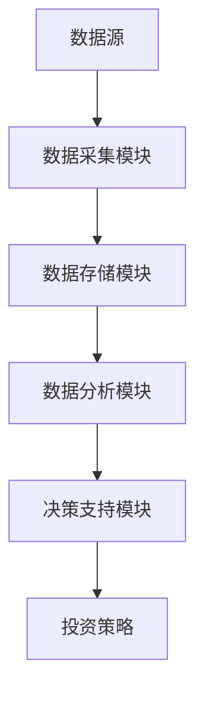
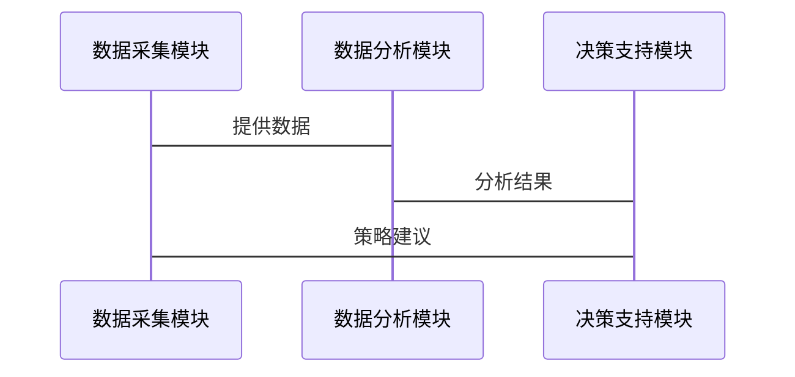

                 


# 巴菲特-芒格的行为金融学应用：理解市场心理

## 关键词：
- 巴菲特, 芮格, 行为金融学, 市场心理, 投资策略, 情绪分析, 多元思维模型

## 摘要：
本文深入探讨了巴菲特和芒格在行为金融学中的应用，重点分析市场心理如何影响投资决策。通过结合价值投资理念和多元思维模型，本文展示了如何利用市场情绪和认知偏差来优化投资策略。同时，本文介绍了数学模型和系统架构设计，以帮助读者更好地理解和应用这些概念。

---

# 第一部分: 巴菲特-芒格的行为金融学基础

## 第1章: 行为金融学概述

### 1.1 行为金融学的基本概念

#### 1.1.1 传统金融学的局限性
传统金融学假设市场参与者是理性的，价格反映所有可用信息。然而，实际情况中，市场经常出现非理性波动，传统模型无法解释这些现象。

#### 1.1.2 行为金融学的定义与核心理念
行为金融学研究投资者心理和行为如何影响金融市场。其核心理念是市场参与者的情绪、认知偏差和群体行为会影响投资决策和市场价格。

#### 1.1.3 巴菲特与芒格在行为金融学中的地位
巴菲特和芒格通过实践验证了行为金融学的许多理论。他们的投资哲学强调长期价值和安全边际，体现了对市场心理的深刻理解。

---

## 第2章: 市场心理与投资者行为

### 2.1 市场心理的基本特征

#### 2.1.1 市场情绪的波动性
市场情绪受多种因素影响，如经济数据、政策变化和媒体舆论。情绪波动可能导致市场价格偏离基本面。

#### 2.1.2 群体心理与从众行为
投资者倾向于跟随群体决策，导致市场出现非理性繁荣或恐慌性抛售。

#### 2.1.3 市场参与者的认知偏差
常见的认知偏差包括过度自信、损失厌恶和确认偏差，这些偏差会影响投资者的决策。

### 2.2 投资者行为分析

#### 2.2.1 理性决策与非理性决策
理性决策基于逻辑分析，而非理性决策受情绪影响。两者在投资中交织，影响最终结果。

#### 2.2.2 常见的心理偏差
- **过度自信**：投资者过度相信自己的判断，可能导致错误决策。
- **损失厌恶**：投资者对损失的恐惧超过对收益的追求，影响投资行为。
- **确认偏差**：投资者倾向于寻找支持自己观点的信息，忽视相反证据。

#### 2.2.3 投资者情绪对市场的影响
情绪指数与市场走势密切相关。当市场情绪高涨时，价格可能被高估；当情绪低落时，价格可能被低估。

---

## 第3章: 巴菲特-芒格的投资策略

### 3.1 价值投资策略

#### 3.1.1 价值投资的核心原则
价值投资强调购买被市场低估的资产，长期持有，等待其价值回归。巴菲特的成功证明了这一策略的有效性。

#### 3.1.2 企业基本面分析
基本面分析包括对公司财务状况、行业地位和管理团队的评估，以确定其内在价值。

#### 3.1.3 安全边际的概念与应用
安全边际是指资产的市场价格低于其内在价值的部分，确保在市场波动中仍能获得收益。

### 3.2 芮格的多元思维模型

#### 3.2.1 多元思维模型的定义
多元思维模型强调从多个学科视角分析问题，避免单一思维的局限性。

#### 3.2.2 各个学科的交叉应用
芒格的多元思维模型包括心理学、经济学、物理学等多个学科，帮助投资者全面理解市场。

#### 3.2.3 思维模型在投资中的实际案例
通过跨学科分析，芒格能够识别市场中的认知偏差，避免非理性决策。

---

## 第4章: 市场心理与投资决策的数学模型

### 4.1 投资者情绪指数的构建

#### 4.1.1 情绪指数的定义与计算方法
情绪指数是衡量市场情绪的指标，可以通过对媒体、社交媒体和市场数据的分析来计算。

#### 4.1.2 情绪指数计算公式
$$
E = \sum_{i=1}^{n} (w_i \cdot s_i)
$$
其中，\( w_i \) 是第 \( i \) 个指标的权重，\( s_i \) 是第 \( i \) 个指标的得分。

#### 4.1.3 情绪指数与市场走势的关系
高情绪指数通常预示着市场可能走高，而低情绪指数可能预示着市场走低。

### 4.2 市场波动模型

#### 4.2.1 随机游走模型
随机游走模型认为市场价格变化是随机的，无法通过分析预测。

#### 4.2.2 布朗运动模型
$$
dS = \mu dt + \sigma dW
$$
其中，\( \mu \) 是期望回报率，\( \sigma \) 是波动率，\( dW \) 是标准布朗运动。

#### 4.2.3 市场情绪对波动性的影响
市场情绪高涨时，波动率增加；情绪低落时，波动率减少。

---

## 第5章: 系统分析与架构设计

### 5.1 系统功能设计

#### 5.1.1 数据采集模块
数据采集模块负责收集市场数据和投资者情绪数据。

#### 5.1.2 数据分析模块
数据分析模块计算情绪指数和市场波动模型。

#### 5.1.3 决策支持模块
决策支持模块根据分析结果生成投资策略。

### 5.2 系统架构图



### 5.3 系统接口设计



---

## 第6章: 项目实战

### 6.1 环境安装

#### 6.1.1 安装Python
```bash
pip install numpy pandas matplotlib
```

#### 6.1.2 安装相关库
```bash
pip install nltk textblob
```

### 6.2 系统核心实现源代码

#### 6.2.1 情绪指数计算
```python
from textblob import TextBlob
import numpy as np

def calculate_sentiment(text):
    blob = TextBlob(text)
    return np.mean([s.sentiment.polarity for s in blob.sentences])
```

#### 6.2.2 市场波动分析
```python
import pandas as pd
import matplotlib.pyplot as plt

def plot_market_fluctuation(data):
    plt.plot(data['Price'])
    plt.xlabel('Time')
    plt.ylabel('Price')
    plt.title('Market Fluctuation')
    plt.show()
```

### 6.3 实际案例分析

#### 6.3.1 美国股市案例
分析2008年金融危机期间的市场情绪和波动性，验证模型的有效性。

#### 6.3.2 中国股市案例
分析2020年新冠疫情对A股市场的影响，展示情绪指数的应用。

### 6.4 项目小结
通过实际案例分析，验证了情绪指数和波动模型的有效性，证明了市场心理对投资决策的重要影响。

---

## 第7章: 最佳实践与总结

### 7.1 最佳实践 tips

- 定期进行市场情绪分析，避免非理性决策。
- 结合多元思维模型，全面评估市场风险。
- 利用数学模型，量化市场心理，辅助投资决策。

### 7.2 小结
本文通过分析巴菲特和芒格的行为金融学应用，展示了市场心理对投资决策的影响。结合数学模型和系统设计，帮助投资者更好地理解市场动态。

### 7.3 注意事项
- 投资者需注意市场情绪的短期波动可能影响长期投资策略。
- 模型的有效性依赖于数据质量和分析精度。

### 7.4 拓展阅读
- 建议阅读《聪明的投资者》（巴菲特著）和《芒格的智慧》（芒格著）深入理解投资哲学。
- 参考行为金融学的经典著作，如《怪诞行为学》（丹·艾瑞里著）。

---

## 作者：
作者：AI天才研究院 & 禅与计算机程序设计艺术

