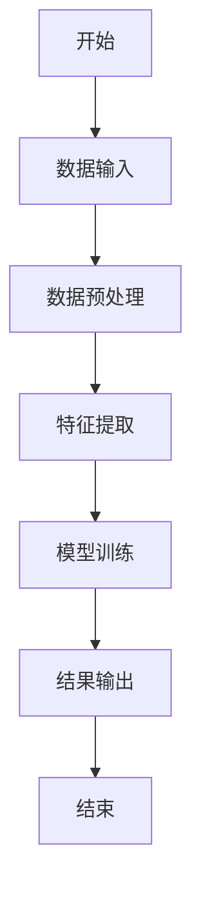
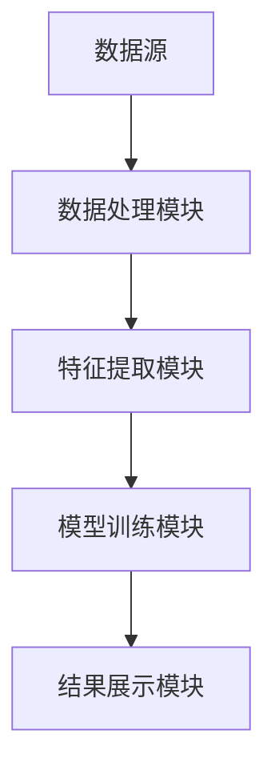

                 

# 巴菲特-芒格的质量成长理论：寻找高质量且能持续成长的公司

## 关键词：巴菲特, 芒格, 质量成长理论, 投资策略, 财务分析, 竞争优势, 长期价值

## 摘要：  
巴菲特和芒格的质量成长理论是一种结合了价值投资和成长投资的选股方法，旨在寻找那些具有高质量、强竞争优势和持续成长潜力的公司。本文通过分析质量成长理论的核心概念、算法原理、系统架构和实际案例，为投资者提供了一套科学的选股框架。文章首先介绍了质量成长理论的背景和核心理念，然后详细阐述了其在投资实践中的应用，包括财务指标分析、竞争优势评估、系统架构设计和项目实战等内容。最后，文章总结了质量成长理论的优势，并提出了相应的投资建议。

---

## 第1章：质量成长理论的背景与核心理念

### 1.1 质量成长理论的起源
质量成长理论由巴菲特和芒格共同提出，结合了两人在投资领域的丰富经验。巴菲特的价值投资理念强调买入优质资产并长期持有，而芒格的多元思维模型则强调从多个角度分析问题。两者的结合形成了质量成长理论，旨在寻找那些具有高质量、强竞争优势和持续成长潜力的公司。

### 1.2 质量成长理论的核心理念
质量成长理论的核心理念在于：  
1. **高质量**：公司具有强大的财务基础和竞争优势。  
2. **持续成长**：公司具备持续增长的潜力，能够在未来实现更高的收益和市场份额。  

### 1.3 质量成长理论与价值投资的区别
| 特征        | 价值投资         | 质量成长理论       |
|-------------|------------------|--------------------|
| 投资目标     | 买入低估资产     | 买入高质量且成长性好的资产 |
| 关注点       | 股票价格与内在价值的差距 | 公司的竞争优势、财务健康和管理层质量 |
| 投资期限     | 长期持有         | 长期持有，注重成长性 |

---

## 第2章：质量成长理论的核心概念

### 2.1 质量成长的定义与特征
质量成长是指那些具有以下特征的公司：  
1. **财务健康**：公司具有稳定的盈利能力、健康的现金流和较低的债务负担。  
2. **竞争优势**：公司具有独特的竞争优势，如品牌、技术、成本优势等。  
3. **管理层质量**：公司管理层具备优秀的能力和诚信，能够带领公司持续发展。  

### 2.2 质量成长的核心要素
| 核心要素      | 定义与特征                               |
|---------------|----------------------------------------|
| 财务健康      | 公司具备稳定的盈利能力、健康的现金流和较低的债务负担。 |
| 竞争优势      | 公司具有独特的竞争优势，如品牌、技术、成本优势等。 |
| 管理层质量    | 公司管理层具备优秀的能力和诚信，能够带领公司持续发展。 |

### 2.3 质量成长与价值投资的联系
质量成长理论与价值投资的联系在于，两者都强调买入优质资产并长期持有。然而，质量成长理论更注重公司的成长潜力和竞争优势，而不仅仅是估值的低估。

---

## 第3章：质量成长理论的算法与数学模型

### 3.1 质量成长评估的数学模型
质量成长评估的数学模型包括以下两个部分：  
1. **财务指标分析模型**：用于评估公司的财务健康状况。  
2. **竞争优势评估模型**：用于评估公司的竞争优势。  

### 3.2 质量成长评估的算法实现
以下是质量成长评估算法的流程图：

### 3.3 数学模型与公式
1. **ROE（净资产收益率）公式**：  
   $$ \text{ROE} = \frac{\text{净利润}}{\text{净资产}} $$  
   ROE用于衡量公司利用股东资产的效率。

2. **ROA（资产回报率）公式**：  
   $$ \text{ROA} = \frac{\text{净利润}}{\text{总资产}} $$  
   ROA用于衡量公司资产的使用效率。

---

## 第4章：质量成长理论的系统架构设计

### 4.1 系统功能设计
系统功能设计包括以下模块：  
1. **数据采集模块**：用于采集公司财务数据和市场数据。  
2. **数据处理模块**：用于清洗和预处理数据。  
3. **模型训练模块**：用于训练质量成长评估模型。  
4. **结果展示模块**：用于展示评估结果。  

### 4.2 系统架构图
以下是系统架构图：

### 4.3 系统接口设计
系统接口设计包括以下内容：  
1. **数据输入接口**：用于接收公司财务数据和市场数据。  
2. **模型训练接口**：用于训练质量成长评估模型。  
3. **结果输出接口**：用于展示评估结果。  

---

## 第5章：质量成长理论的项目实战

### 5.1 项目背景
本文以苹果公司为例，分析其是否符合质量成长理论的要求。苹果公司是一家全球知名的科技公司，具有强大的竞争优势和持续的成长潜力。

### 5.2 项目实施
1. **数据采集**：收集苹果公司的财务数据和市场数据。  
2. **数据处理**：清洗和预处理数据。  
3. **模型训练**：训练质量成长评估模型。  
4. **结果展示**：展示评估结果。  

### 5.3 实际案例分析
通过分析苹果公司的财务数据和竞争优势，可以得出结论：苹果公司符合质量成长理论的要求，具有高质量和持续成长潜力。

---

## 第6章：总结与最佳实践

### 6.1 总结
质量成长理论是一种科学的选股方法，能够帮助投资者识别那些具有高质量和持续成长潜力的公司。本文通过理论分析和实际案例，详细介绍了质量成长理论的核心概念、算法原理、系统架构和项目实战。

### 6.2 最佳实践
1. **投资策略**：投资者应注重公司的财务健康、竞争优势和管理层质量。  
2. **风险管理**：投资者应分散投资，避免过度集中。  
3. **持续学习**：投资者应不断学习和更新知识，以适应市场的变化。  

### 6.3 注意事项
1. 投资有风险，需谨慎决策。  
2. 本文仅为理论分析，实际投资需结合市场实际情况。  

---

## 作者：AI天才研究院 & 禅与计算机程序设计艺术

---

本文通过详细分析巴菲特和芒格的质量成长理论，为投资者提供了一套科学的选股框架。希望读者能够通过本文，更好地理解质量成长理论的核心概念和实际应用，并能够在投资实践中取得成功。

