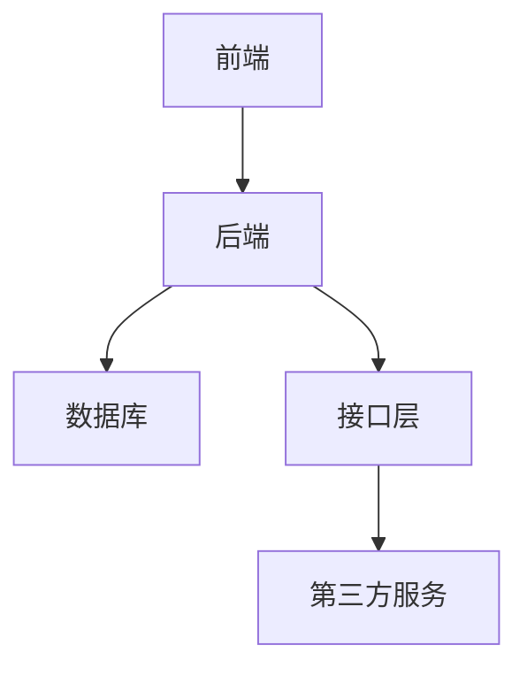
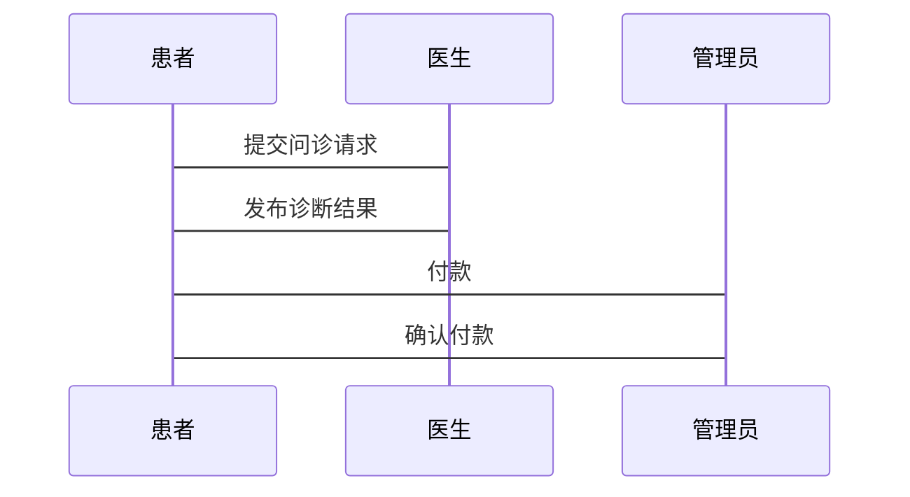

                 


# 巴菲特-芒格的远程医疗投资：医疗服务的未来模式

> 关键词：巴菲特，芒格，远程医疗，投资模式，医疗科技，系统架构，投资策略

> 摘要：本文探讨了巴菲特和芒格在远程医疗领域的投资策略，分析了远程医疗的市场潜力、商业模式和技术驱动因素。通过详细的技术分析和系统架构设计，本文揭示了远程医疗如何成为医疗服务的未来模式，并为投资者提供了实践指导和投资建议。

---

## 第一部分：引言

### 第1章：巴菲特与芒格的投资哲学

#### 1.1 投资哲学概述

##### 1.1.1 巴菲特的价值投资理念

巴菲特的价值投资理念强调长期投资、安全边际和企业内在价值。他主张寻找具有强大护城河和持续盈利能力的企业，并以合理的价格买入并长期持有。这种理念在远程医疗领域的投资中得到了体现，因为远程医疗具备高成长性和稳定的盈利能力。

##### 1.1.2 芒格的多元思维模型

芒格的多元思维模型强调通过多学科交叉来理解问题的本质。他认为，投资者需要从物理学、心理学、经济学等多个角度分析问题，以避免认知偏差和决策错误。这种思维方式在远程医疗投资中尤为重要，因为远程医疗涉及技术、政策、市场等多个复杂因素。

##### 1.1.3 两者的投资哲学对远程医疗的影响

巴菲特和芒格的投资哲学为远程医疗投资提供了理论基础。他们的长期视角和对行业趋势的洞察帮助投资者识别远程医疗领域的潜在机会，尤其是在技术进步和政策支持的双重驱动下，远程医疗成为未来医疗服务的重要模式。

---

#### 1.2 巴菲特与芒格的投资策略

##### 1.2.1 长期投资与价值发现

巴菲特和芒格倾向于长期投资，而非短期交易。他们关注企业的基本面，寻找那些具有持续增长潜力的企业。远程医疗领域的技术进步和市场需求增长为长期投资者提供了稳定的回报。

##### 1.2.2 风险控制与安全边际

芒格强调风险控制和安全边际。他认为，投资者应该以低于内在价值的价格买入资产，并预留一定的安全空间以应对市场波动。在远程医疗投资中，这要求投资者对行业风险、技术风险和政策风险进行充分评估。

##### 1.2.3 产业趋势与竞争优势

巴菲特和芒格关注产业趋势和企业的竞争优势。他们倾向于投资那些能够适应行业趋势并保持竞争优势的企业。远程医疗作为医疗行业的重要趋势，符合他们的投资逻辑。

---

### 第2章：远程医疗的兴起与发展

#### 2.1 远程医疗的定义与背景

##### 2.1.1 远程医疗的定义

远程医疗是指通过互联网技术实现患者与医生之间的远程诊疗，包括远程问诊、远程诊断、远程治疗和远程监控等。远程医疗的兴起源于技术进步和人们对便捷医疗服务的需求。

##### 2.1.2 远程医疗的历史发展

远程医疗的概念可以追溯到20世纪90年代，但真正的发展始于互联网和通信技术的进步。随着5G、AI和大数据技术的成熟，远程医疗进入快速发展阶段。

##### 2.1.3 远程医疗的现状与趋势

目前，远程医疗在全球范围内迅速普及，尤其是在新冠疫情期间，远程问诊成为重要的医疗服务模式。未来，远程医疗将继续受益于技术进步和政策支持，成为医疗服务的主要模式之一。

---

#### 2.2 远程医疗的市场分析

##### 2.2.1 全球远程医疗市场规模

根据市场研究机构的数据，全球远程医疗市场规模预计在未来几年内将以年均20%以上的速度增长，到2030年市场规模将超过千亿美元。

##### 2.2.2 远程医疗的主要驱动因素

1. **技术驱动因素**：AI、5G、物联网等技术的进步推动了远程医疗的发展。
2. **政策驱动因素**：政府政策的支持和医保体系的改革为远程医疗提供了政策保障。
3. **市场需求因素**：患者对便捷医疗服务的需求和医生资源的不足推动了远程医疗的普及。

##### 2.2.3 远程医疗的主要参与者

1. **科技公司**：如微软、谷歌、苹果等，提供技术支持。
2. **医疗企业**：如医院、诊所等，提供远程诊疗服务。
3. **互联网企业**：如腾讯、阿里、亚马逊等，提供平台和技术服务。

---

## 第二部分：远程医疗的投资机会

### 第3章：远程医疗的投资逻辑

#### 3.1 远程医疗的投资逻辑概述

##### 3.1.1 技术驱动因素

远程医疗的核心驱动力是技术进步，包括AI、5G、大数据等技术的应用。这些技术不仅提高了医疗服务的效率，还降低了成本。

##### 3.1.2 政策支持因素

政府政策的大力支持是远程医疗发展的关键因素。政策鼓励远程医疗的普及，并提供了一系列支持措施，如医保报销、税收优惠等。

##### 3.1.3 市场需求因素

随着人口老龄化和医疗资源不足的问题日益严重，远程医疗的需求不断增加。患者对便捷医疗服务的需求为远程医疗提供了广阔的市场空间。

---

#### 3.2 远程医疗的投资机会分析

##### 3.2.1 技术驱动因素

1. **AI技术**：AI在远程医疗中的应用包括智能问诊、疾病诊断和治疗方案优化。
2. **5G技术**：5G的高速率和低延迟为远程诊疗提供了技术保障。
3. **物联网技术**：物联网技术可以实现患者数据的实时监控和传输。

##### 3.2.2 政策支持因素

1. **政策鼓励**：政府出台了一系列政策鼓励远程医疗的发展。
2. **医保支持**：医保报销范围的扩大为远程医疗提供了经济支持。

##### 3.2.3 市场需求因素

1. **人口老龄化**：老年人群体对远程医疗的需求较高。
2. **医疗资源不足**：医生资源的不足推动了远程医疗的发展。

---

### 第4章：远程医疗的投资模式

#### 4.1 远程医疗的投资模式概述

##### 4.1.1 风险投资模式

风险投资模式注重短期高回报，适合初创期的远程医疗企业。

##### 4.1.2 战略投资模式

战略投资模式注重长期合作和战略协同，适合大型企业。

##### 4.1.3 股权投资模式

股权投资模式注重企业股权的长期增值，适合具有高成长性的远程医疗企业。

---

#### 4.2 巴菲特与芒格的投资模式

##### 4.2.1 巴菲特的长期股权投资模式

巴菲特倾向于长期股权投资，注重企业的内在价值和竞争优势。

##### 4.2.2 芒格的多元投资模式

芒格注重多元化的投资组合，分散风险，注重企业的长期盈利能力。

---

## 第三部分：远程医疗的系统架构与技术实现

### 第5章：远程医疗的系统架构设计

#### 5.1 系统功能设计

##### 5.1.1 系统功能概述

远程医疗系统主要包括患者端、医生端和管理端，实现远程问诊、诊断、治疗和管理功能。

##### 5.1.2 系统功能模块

1. **患者端**：患者可以在线预约、问诊、查看诊断结果。
2. **医生端**：医生可以在线问诊、诊断、开具处方。
3. **管理端**：管理员可以进行用户管理、数据管理、系统设置。

---

#### 5.2 系统架构设计

##### 5.2.1 系统架构概述

远程医疗系统采用分层架构，包括前端、后端、数据库和接口层。

##### 5.2.2 系统架构图



---

#### 5.3 接口设计与交互流程

##### 5.3.1 接口设计

远程医疗系统需要与第三方服务（如医保系统、支付平台）进行接口对接，实现数据互通。

##### 5.3.2 交互流程



---

## 第四部分：项目实战与投资策略

### 第6章：远程医疗的项目实战

#### 6.1 项目背景与目标

##### 6.1.1 项目背景

本项目旨在开发一个基于远程医疗的在线问诊平台，提供便捷的医疗服务。

##### 6.1.2 项目目标

实现患者与医生的在线问诊、诊断和治疗，构建一个高效、便捷的远程医疗系统。

---

#### 6.2 项目核心实现

##### 6.2.1 核心功能实现

1. **患者端**：实现在线预约、问诊、查看诊断结果。
2. **医生端**：实现在线问诊、诊断、开具处方。
3. **管理端**：实现用户管理、数据管理、系统设置。

##### 6.2.2 系统实现代码

以下是远程医疗系统的核心代码实现：

```python
# 患者端代码
class Patient:
    def __init__(self, name, id):
        self.name = name
        self.id = id

    def make_appointment(self, doctor):
        print(f"{self.name}正在预约{doctor.name}医生的问诊。")

# 医生端代码
class Doctor:
    def __init__(self, name, specialty):
        self.name = name
        self.specialty = specialty

    def diagnose(self, patient):
        print(f"{self.name}医生正在诊断{patient.name}的病情。")

# 管理端代码
class Administrator:
    def __init__(self, name):
        self.name = name

    def manage_users(self, users):
        print(f"{self.name}管理员正在管理{len(users)}个用户。")
```

---

#### 6.3 投资策略与风险管理

##### 6.3.1 投资策略

1. **选择优质企业**：投资具有技术优势和市场竞争力的企业。
2. **长期持有**：采用巴菲特的长期股权投资策略，注重企业的内在价值。

##### 6.3.2 风险管理

1. **分散投资**：通过多元化投资降低风险。
2. **风险控制**：定期评估投资组合，及时调整。

---

## 第五部分：结论与展望

### 第7章：远程医疗的未来趋势

#### 7.1 未来发展趋势

1. **技术融合**：AI、5G等技术的深度融合将推动远程医疗的进一步发展。
2. **政策支持**：政府将继续出台政策支持远程医疗的发展。
3. **市场扩张**：远程医疗市场将继续扩大，覆盖更多的医疗领域。

---

### 7.2 投资建议与注意事项

##### 7.2.1 投资建议

1. **关注技术创新**：投资具有技术创新能力的企业。
2. **关注政策变化**：密切关注政策变化，抓住政策机遇。

##### 7.2.2 注意事项

1. **风险控制**：注重风险控制，避免过度投资。
2. **长期视角**：保持长期投资视角，避免短期波动影响决策。

---

## 作者：AI天才研究院/AI Genius Institute & 禅与计算机程序设计艺术 /Zen And The Art of Computer Programming

