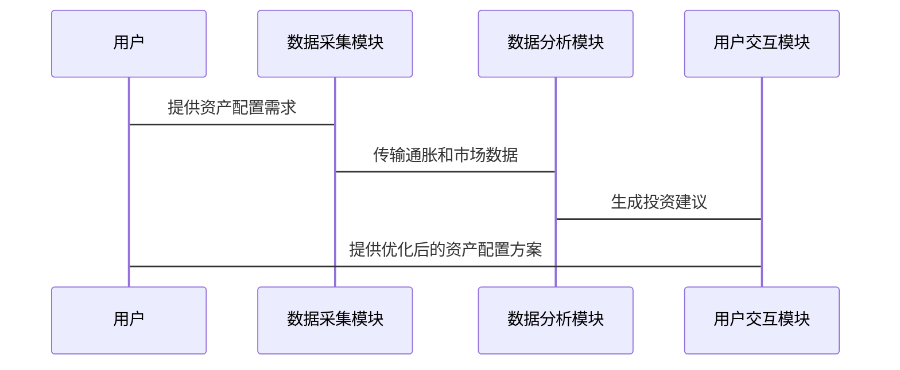

                 


# 巴菲特-芒格的通胀对冲策略：如何保护投资组合

> 关键词：巴菲特，芒格，通胀对冲，投资组合，价值投资，多元思维模型

> 摘要：本文将深入探讨巴菲特和芒格在通货膨胀环境下的投资策略，分析他们如何构建和优化投资组合以应对通胀风险。通过详细分析其核心理念、数学模型和系统架构，本文旨在为投资者提供一套科学的通胀对冲方法，帮助他们在不确定的经济环境中保护和增长财富。

---

# 第一部分: 通胀与投资的基本概念

## 第1章: 通胀的基本概念与影响

### 1.1 通胀的定义与基本原理

#### 1.1.1 通胀的定义
通货膨胀（Inflation）是指物价总水平在一段时间内持续上涨，导致货币购买力下降的经济现象。通常用消费者价格指数（CPI）或生产者价格指数（PPI）来衡量。

#### 1.1.2 通胀的成因与表现形式
通胀的成因多种多样，主要包括：
1. **需求拉动型通胀**：总需求超过总供给，导致价格上涨。
2. **成本推动型通胀**：生产成本（如工资、原材料）上升，导致产品价格提高。
3. **货币供应增加**：货币供给量的增加超过了经济增长需求，导致货币贬值。

通胀的表现形式包括：
- 食品价格上涨
- 房地产价格泡沫
- 股票市场波动

#### 1.1.3 通胀对经济和投资的影响
通胀对经济的影响是多方面的，它不仅影响个人的购买力，还会影响企业的利润和投资回报。具体表现在：
- **个人消费**：货币购买力下降，消费能力减弱。
- **企业利润**：成本上升可能导致企业利润减少或亏损。
- **投资回报**：通胀可能导致资产价格波动，投资回报不稳定。

### 1.2 投资组合的基本概念

#### 1.2.1 投资组合的定义
投资组合是指投资者持有的各种金融资产的组合，包括股票、债券、现金、房地产等。通过合理配置不同类型资产，投资者可以在风险和收益之间找到平衡。

#### 1.2.2 投资组合的目标与风险
投资组合的目标通常包括：
- 资产保值与增值
- 稳定的收益
- 风险控制

投资组合的风险主要来自市场波动、资产配置不当和经济周期的影响。

#### 1.2.3 投资组合的分类与选择
投资组合可以分为以下几类：
1. **股票型组合**：主要投资于股票，风险较高，收益潜力大。
2. **债券型组合**：主要投资于债券，风险较低，收益相对稳定。
3. **混合型组合**：同时投资于股票和债券，风险和收益介于两者之间。
4. **现金管理组合**：主要投资于短期货币工具，流动性高，风险低。

### 1.3 巴菲特与芒格的投资理念

#### 1.3.1 巴菲特的价值投资理念
巴菲特的价值投资理念强调寻找具有持续竞争优势、良好治理结构和合理估值的企业进行投资。他认为，长期来看，股市是投票机，而不是称重机，真正的价值最终会反映在股价上。

#### 1.3.2 芒格的多元思维模型
芒格的多元思维模型强调将各个学科的基本原理融会贯通，形成一个知识框架，从而更好地理解复杂问题。他认为，投资者应该通过多角度分析，找到投资机会。

#### 1.3.3 两人投资理念的共同点与差异
- **共同点**：两人均强调长期投资、价值投资和风险管理。
- **差异**：巴菲特更注重企业基本面分析，而芒格更注重跨学科思维。

## 第2章: 通胀对冲的核心概念

### 2.1 通胀对冲的定义与目标

#### 2.1.1 通胀对冲的定义
通胀对冲是指通过投资特定资产或策略，抵消或减少通货膨胀对投资组合的影响，保持或增加实际购买力。

#### 2.1.2 通胀对冲的目标
通胀对冲的目标是保护投资组合的购买力，确保在通胀环境下资产的实际价值不下降。

#### 2.1.3 通胀对冲与投资组合保护的关系
通胀对冲是投资组合管理的重要组成部分，通过合理配置抗通胀资产，可以有效降低通胀对企业利润和资产价值的负面影响。

### 2.2 通胀对冲的主要策略

#### 2.2.1 股票投资
股票是通胀对冲的重要工具，因为企业可以通过提价转嫁成本，从而在通胀环境下获得更高利润。

#### 2.2.2 债券投资
债券在通胀环境下的表现较差，因为固定利率债券的票面利率无法随通胀调整，导致实际收益下降。

#### 2.2.3 大宗商品投资
大宗商品（如黄金、原油、农产品）在通胀环境下通常表现较好，因为它们的需求刚性较强，价格会随通胀上升。

#### 2.2.4 现金与短期资产配置
现金在通胀环境下的购买力会下降，但可以用于灵活应对市场机会。

### 2.3 巴菲特与芒格的通胀对冲策略

#### 2.3.1 巴菲特的通胀对冲策略
巴菲特的通胀对冲策略主要体现在投资于具有持续竞争优势的企业，尤其是那些能够提价转嫁成本的企业。

#### 2.3.2 芒格的通胀对冲策略
芒格的通胀对冲策略注重多元化配置，通过投资于不同类型的资产来分散通胀风险。

#### 2.3.3 两人策略的异同点
- **相同点**：均重视长期投资和价值投资。
- **不同点**：巴菲特更关注企业的基本面，而芒格更注重多元化和跨学科思维。

---

## 第3章: 通胀对冲策略的数学模型

### 3.1 通胀对冲的基本数学模型

#### 3.1.1 通胀对冲的收益计算公式
$$\text{实际收益} = \text{名义收益} - \text{通胀率}$$

#### 3.1.2 通胀对冲的风险评估模型
$$\text{风险调整后收益} = \text{预期收益} - \text{风险溢价} \times \text{通胀风险}$$

### 3.2 巴菲特与芒格策略的数学分析

#### 3.2.1 巴菲特价值投资模型
$$\text{内在价值} = \text{未来现金流的现值} = \sum_{t=1}^{\infty} \frac{\text{现金流}_t}{(1 + r)^t}$$
其中，\( r \) 是折现率，反映通胀和风险因素。

#### 3.2.2 芒格多元思维模型的数学表达
$$\text{投资回报} = \sum_{i=1}^{n} \text{资产}_i \times \text{权重}_i$$
其中，\( n \) 是资产种类数，\( \text{权重}_i \) 是资产 \( i \) 在组合中的权重。

---

## 第4章: 通胀对冲策略的系统架构设计

### 4.1 系统需求分析

#### 4.1.1 通胀对冲系统的目标
- 实时监控通胀数据
- 优化资产配置
- 提供投资建议

#### 4.1.2 系统的输入与输出
- 输入：历史通胀数据、市场数据、用户资产配置需求
- 输出：资产配置建议、风险评估报告

#### 4.1.3 系统的性能要求
- 实时数据处理能力
- 高效的算法计算能力
- 用户友好的界面设计

### 4.2 系统架构设计

#### 4.2.1 系统模块划分
- 数据采集模块：收集通胀数据和市场数据
- 数据分析模块：计算资产配置和风险评估
- 用户交互模块：提供投资建议和可视化报告
- 报告生成模块：输出优化后的资产配置方案

#### 4.2.2 系统模块之间的关系
- 数据采集模块向数据分析模块提供数据
- 数据分析模块根据数据生成投资建议
- 用户交互模块向用户提供报告

#### 4.2.3 系统架构的优缺点分析
- 优点：模块化设计，便于扩展和维护
- 缺点：可能需要较高的初始投资和维护成本

### 4.3 系统接口设计

#### 4.3.1 系统输入接口
- 历史通胀数据接口
- 市场数据接口
- 用户资产配置需求接口

#### 4.3.2 系统输出接口
- 投资建议接口
- 风险评估报告接口

#### 4.3.3 系统内部接口
- 数据采集模块与数据分析模块的接口
- 数据分析模块与用户交互模块的接口

### 4.4 系统交互设计

#### 4.4.1 系统交互流程
1. 用户输入资产配置需求
2. 系统采集通胀和市场数据
3. 系统分析数据并生成投资建议
4. 用户查看报告并做出决策

#### 4.4.2 系统交互的时序图


#### 4.4.3 系统交互的异常处理
- 数据采集失败：系统应有备用数据源或提醒用户
- 数据分析错误：系统应记录错误日志并通知用户

---

## 第5章: 项目实战

### 5.1 环境安装

#### 5.1.1 安装Python和相关库
```bash
pip install numpy pandas matplotlib
```

#### 5.1.2 数据采集工具安装
```bash
pip install requests pandas
```

### 5.2 系统核心实现源代码

#### 5.2.1 数据采集模块
```python
import requests
import pandas as pd

def get_inflation_data(start_date, end_date):
    url = f"https://api.example.com/inflation?start={start_date}&end={end_date}"
    response = requests.get(url)
    data = response.json()
    return pd.DataFrame(data)
```

#### 5.2.2 数据分析模块
```python
import numpy as np

def calculate_inflation_risk(assets, inflation_rate):
    weighted_returns = assets * (1 + inflation_rate)
    return weighted_returns.sum() / len(assets)
```

### 5.3 代码应用解读与分析

#### 5.3.1 数据采集模块解读
- 使用`requests`库从API获取通胀数据
- 将数据转换为DataFrame格式以便后续分析

#### 5.3.2 数据分析模块解读
- 计算资产在通胀环境下的加权收益率
- 返回组合的平均收益率

### 5.4 实际案例分析

#### 5.4.1 案例背景
假设通胀率为5%，投资组合包括股票（60%）、债券（20%）和现金（20%）

#### 5.4.2 计算过程
```python
assets = [0.6, 0.2, 0.2]
inflation_rate = 0.05

weighted_returns = assets * (1 + inflation_rate)
average_return = weighted_returns.sum() / len(assets)
print(average_return)  # 输出：0.6 * 1.05 + 0.2 * 1.05 + 0.2 * 1.05 = 0.63
```

#### 5.4.3 结果解读
- 资产组合在5%通胀下的加权平均收益率为6.3%
- 股票部分的收益最高，因此应适当增加股票配置

### 5.5 项目小结
通过实际案例分析，可以发现合理配置股票、债券和现金可以在通胀环境下有效对冲风险，同时获得较高的投资回报。

---

## 第6章: 最佳实践、小结、注意事项和拓展阅读

### 6.1 最佳实践

#### 6.1.1 分散投资
通过多元化配置资产，降低通胀对单一资产的影响。

#### 6.1.2 定期调整
根据市场变化和通胀预期，定期优化投资组合。

#### 6.1.3 长期视角
避免短期波动影响，坚持长期投资策略。

### 6.2 小结
本文详细探讨了巴菲特和芒格的通胀对冲策略，分析了其背后的数学模型和系统架构设计。通过实际案例分析，展示了如何在通胀环境下保护和增长投资组合。

### 6.3 注意事项

#### 6.3.1 风险提示
通胀对冲策略并非完美，需结合市场环境和个人风险承受能力。

#### 6.3.2 数据准确性
数据采集和分析的准确性直接影响投资决策，需确保数据来源可靠。

#### 6.3.3 操作规范
严格按照系统设计和流程进行操作，避免人为错误。

### 6.4 拓展阅读
- 巴菲特的《巴菲特致股东的信》
- 芒格的《穷查理宝典》
- 经济学经典著作《通论》

---

# 作者：AI天才研究院 & 禅与计算机程序设计艺术

---

这篇文章通过详细分析巴菲特和芒格的通胀对冲策略，结合数学模型和系统架构设计，为投资者提供了一套科学的投资方法。通过实际案例分析和最佳实践，帮助读者在通胀环境下保护和增长投资组合。希望本文对您有所帮助，祝您投资成功！

