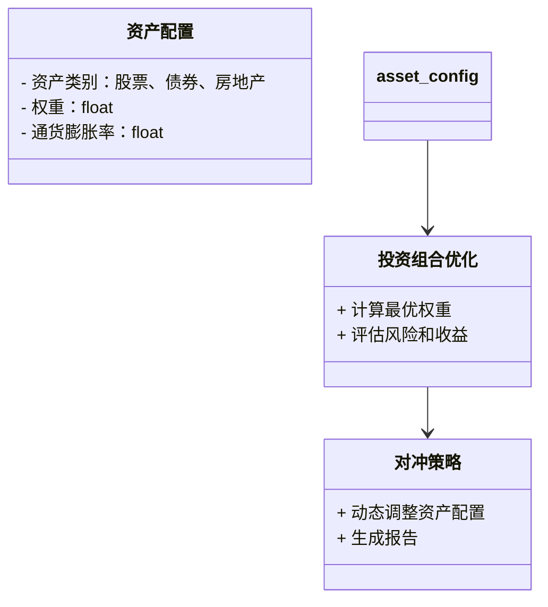

                 


# 巴菲特-芒格的通货膨胀对冲策略：保护购买力

---

## 关键词：通货膨胀、对冲策略、巴菲特、芒格、购买力、投资策略

---

## 摘要：  
通货膨胀是投资者面临的主要风险之一，它会侵蚀投资的购买力。本文将深入探讨巴菲特和芒格的通货膨胀对冲策略，分析其核心原理、数学模型、系统架构设计以及实际案例。通过结合技术分析与投资策略，我们将提供一种在通货膨胀环境下保护购买力的有效方法。

---

## 第一部分: 巴菲特-芒格的通货膨胀对冲策略背景介绍

### 第1章: 通货膨胀与购买力保护概述

#### 1.1 通货膨胀的基本概念  
通货膨胀是指物价总水平在一段时间内持续上涨，导致货币购买力下降。通货膨胀对个人和企业的财务状况有深远影响，尤其是在长期投资中，通货膨胀会导致实际收益下降。购买力保护的目标是通过投资策略抵消通货膨胀的影响，确保投资的实际价值不被侵蚀。

#### 1.2 巴菲特与芒格的投资理念  
巴菲特和芒格的投资理念以价值投资和长期视角为核心。巴菲特强调寻找具有持续竞争优势的企业，芒格则倡导多元思维模型，以避免决策偏差。两人均意识到通货膨胀对投资的影响，并开发了一系列对冲策略。

#### 1.3 通货膨胀对冲策略的重要性  
在通货膨胀环境下，传统固定收益投资（如债券）往往无法跑赢通胀，导致实际收益为负。因此，寻找能够抵御通货膨胀的资产配置至关重要。

---

### 第2章: 通货膨胀对冲策略的核心概念  

#### 2.1 货币的时间价值与购买力  
货币的时间价值是指货币在不同时间点的购买力差异。通货膨胀会加速货币购买力的下降，因此需要通过投资来抵消这一影响。

#### 2.2 资产配置与通货膨胀对冲  
资产配置是通货膨胀对冲的核心策略。通过将资金分配到不同的资产类别（如股票、房地产、黄金等），投资者可以分散风险，并在通货膨胀周期中寻找收益较高的资产。

#### 2.3 巴菲特-芒格的通货膨胀对冲模型  
巴菲特和芒格的对冲模型结合了资产配置、股息增长投资和价值投资，强调选择能够在通货膨胀中保持或增加价值的资产。

---

## 第二部分: 巴菲特-芒格通货膨胀对冲策略的核心原理

### 第3章: 通货膨胀对冲的数学模型与公式  

#### 3.1 通货膨胀调整的现值计算  
现值公式用于计算通货膨胀调整后的资产价值：  
$$ PV = \frac{FV}{(1 + r)^n} $$  
其中，$PV$ 为现值，$FV$ 为未来价值，$r$ 为通货膨胀率，$n$ 为时间期限。

#### 3.2 资产回报率与通货膨胀的关系  
资产回报率公式：  
$$ R = \frac{P_{t+1} - P_t}{P_t} $$  
其中，$R$ 为资产回报率，$P_t$ 和 $P_{t+1}$ 分别为当前和未来的价格。

#### 3.3 巴菲特-芒格模型的数学推导  
巴菲特-芒格模型通过结合资产回报率和通货膨胀率，优化投资组合以最大化实际收益。模型假设：  
1. 资产类别间的回报率独立。  
2. 通货膨胀率 $r$ 为已知或可估计的参数。  
3. 投资组合的权重通过优化算法确定。  

---

### 第4章: 系统架构与实现  

#### 4.1 问题场景介绍  
在通货膨胀环境下，投资者需要动态调整资产配置以保护购买力。本文将构建一个基于巴菲特-芒格策略的对冲系统。

#### 4.2 系统功能设计  
- 资产类别分析：识别不同资产类别在通货膨胀中的表现。  
- 模型构建：基于历史数据和数学模型，优化投资组合权重。  
- 策略执行：根据模型结果，动态调整资产配置。  

#### 4.3 领域模型设计  
使用 Mermaid 绘制领域模型类图：  


#### 4.4 系统架构设计  
使用 Mermaid 绘制系统架构图：  


---

### 第5章: 项目实战与代码实现  

#### 5.1 环境安装  
- Python 3.8+  
- NumPy 和 Pandas 库  
- Matplotlib 或 Seaborn 绘图库  

#### 5.2 核心实现代码  

```python
import numpy as np
import pandas as pd
import matplotlib.pyplot as plt

# 示例数据：不同资产类别在通货膨胀周期中的表现
assets = ['股票', '债券', '房地产']
returns = {'股票': [0.1, 0.05, 0.15],
           '债券': [0.02, 0.03, 0.04],
           '房地产': [0.08, 0.12, 0.06]}

# 计算通货膨胀调整后的回报率
def inflation_adjusted_return(returns, inflation_rate):
    adjusted_returns = {}
    for asset in returns:
        adjusted_returns[asset] = []
        for r in returns[asset]:
            adjusted = r - inflation_rate
            adjusted_returns[asset].append(adjusted)
    return adjusted_returns

# 示例通货膨胀率为2%
inflation_rate = 0.02
adjusted_returns = inflation_adjusted_return(returns, inflation_rate)

# 绘制调整后的回报率分布
data = pd.DataFrame(adjusted_returns)
data.T.plot(kind='bar', stacked=True, figsize=(10,6))
plt.title('通货膨胀调整后的资产回报率')
plt.show()
```

---

### 第6章: 最佳实践与小结  

#### 6.1 关键点总结  
- 通货膨胀对冲的核心在于资产配置和风险分散。  
- 巴菲特-芒格策略强调长期价值投资和股息增长。  
- 数学模型和系统架构是实现对冲策略的关键工具。  

#### 6.2 实际操作建议  
- 定期评估和调整投资组合。  
- 结合技术分析和基本面分析，优化投资决策。  
- 使用工具辅助计算和可视化，提高效率。  

#### 6.3 注意事项  
- 通货膨胀率波动较大，需实时监控。  
- 不同资产类别在通货膨胀周期中的表现可能不同，需灵活调整。  
- 风险管理是保护购买力的重要环节。  

#### 6.4 拓展阅读  
- 巴菲特和芒格的著作，深入理解其投资理念。  
- 学习更多数学模型和算法，优化对冲策略。  

---

## 作者：AI天才研究院 & 禅与计算机程序设计艺术  

---

通过本文的分析，我们展示了如何将巴菲特和芒格的投资理念与技术分析相结合，构建一个有效的通货膨胀对冲策略。希望本文能为投资者提供实用的工具和方法，帮助他们在通货膨胀环境下保护购买力，实现长期稳健的投资回报。

