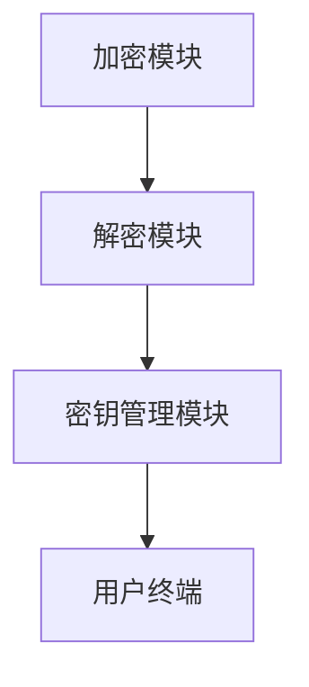
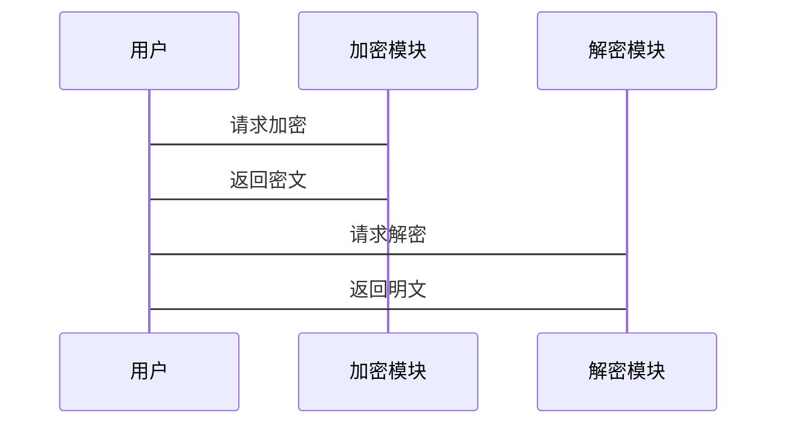

                 

# 后量子密码学的商业化之路

> 关键词：后量子密码学，量子计算，安全性，标准化，商业化，投资策略，系统架构

> 摘要：后量子密码学作为应对量子计算威胁的关键技术，其商业化进程正在加速。本文从巴菲特和芒格的投资理念出发，分析后量子密码学的技术基础、市场需求、投资策略、系统架构和商业化案例，探讨如何将这一技术成功应用于商业领域。

---

# 第1章：后量子密码学的背景与挑战

## 1.1 量子计算的崛起
- 量子计算的基本原理
- 传统密码学的脆弱性
- 后量子密码学的必要性

## 1.2 后量子密码学的核心目标
- 抵抗量子攻击
- 保障数据安全
- 支持未来通信

## 1.3 技术挑战与研究现状
- 算法选择的复杂性
- 标准化的推进困难
- 商业化中的技术障碍

---

# 第2章：后量子密码学的关键技术

## 2.1 基于格的密码学
### 2.1.1 格的数学结构
- 格的定义与基本性质
- 基于格的加密算法（如NIST候选算法）

### 2.1.2 格的数学模型
- 向量空间与基的定义
- 矩阵表示与格的构造

### 2.1.3 格的算法实现
- 基于格的加密算法实现步骤
- 算法复杂度分析

## 2.2 基于哈希的签名
### 2.2.1 哈希函数的作用
- 哈希函数的抗碰撞性和唯一性

### 2.2.2 基于哈希的签名机制
- 椭圆曲线哈希签名的实现原理

## 2.3 标准化与安全性评估
### 2.3.1 NIST的标准化流程
- 后量子密码学算法的评选过程

### 2.3.2 算法的安全性测试
- 抵抗量子攻击的能力评估

---

# 第3章：后量子密码学的市场需求与商业化路径

## 3.1 市场需求分析
### 3.1.1 量子计算威胁的现实性
- 量子计算的实际应用潜力
- 企业对后量子密码学的需求

### 3.1.2 后量子密码学的市场潜力
- 技术的商业化前景
- 各行业对后量子密码学的需求

## 3.2 后量子密码学的商业化路径
### 3.2.1 技术研发与专利布局
- 后量子密码学算法的创新
- 核心技术的专利保护

### 3.2.2 产品化与服务化
- 后量子密码学产品的开发
- 服务模式的探索

## 3.3 商业化中的挑战与应对策略
### 3.3.1 技术标准化的推动
- 建立行业标准的重要性
- 如何推动标准化进程

### 3.3.2 市场教育与客户信任
- 客户对后量子密码学的认知
- 如何建立客户信任

---

# 第4章：后量子密码学的投资策略与风险管理

## 4.1 投资后量子密码学的逻辑
### 4.1.1 巴菲特的价值投资理念
- 长期投资与企业价值

### 4.1.2 芒格的多元思维模型
- 跨学科视角下的投资分析

## 4.2 后量子密码学领域的投资机会
### 4.2.1 技术创新型企业
- 后量子密码学算法研发公司

### 4.2.2 标准化推动者
- 参与NIST标准化的企业

## 4.3 投资策略与风险管理
### 4.3.1 技术风险评估
- 后量子密码学算法的可行性

### 4.3.2 市场风险与政策风险
- 市场接受度与政策支持

### 4.3.3 投资组合管理
- 分散投资与风险控制

---

# 第5章：后量子密码学的系统架构与实现

## 5.1 系统架构设计
### 5.1.1 后量子密码学系统的组成
- 加密模块、解密模块、密钥管理模块

### 5.1.2 系统架构图

## 5.2 后量子密码学算法的实现
### 5.2.1 NIST候选算法的实现
- 基于格的加密算法实现步骤

### 5.2.2 算法的性能测试
- 加密速度与解密效率

## 5.3 系统接口设计
### 5.3.1 API设计
- 加密接口与解密接口

### 5.3.2 接口交互流程图

## 5.4 系统安全测试
### 5.4.1 量子模拟器测试
- 使用量子模拟器验证算法安全性

### 5.4.2 传统计算机构测试
- 通过传统计算机进行安全性测试

---

# 第6章：后量子密码学的商业化案例与启示

## 6.1 商业化案例分析
### 6.1.1 某公司的后量子密码学产品
- 产品功能与市场定位

### 6.1.2 标准化推动者的成功经验
- 参与NIST标准化的过程与成果

## 6.2 商业化中的关键成功因素
### 6.2.1 技术创新与专利布局
- 核心技术的保护与应用

### 6.2.2 市场推广与客户信任
- 如何建立品牌形象与客户信任

## 6.3 启示与未来展望
### 6.3.1 后量子密码学的未来发展
- 技术进步与市场扩展

### 6.3.2 投资者的机会与挑战
- 后量子密码学领域的长期投资价值

---

# 第7章：结论与展望

## 7.1 本文总结
- 后量子密码学的技术基础、市场需求与商业化路径
- 投资策略与系统实现的要点

## 7.2 未来展望
- 后量子密码学技术的进一步发展
- 标准化与商业化进程的加速

---

# 作者：AI天才研究院/AI Genius Institute & 禅与计算机程序设计艺术 /Zen And The Art of Computer Programming

